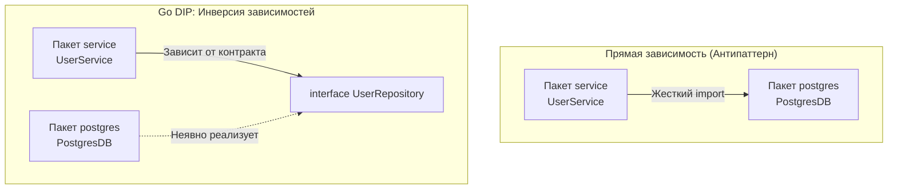

# SOLID в мире Go. Что осталось, а что изменилось

Пять фундаментальных принципов проектирования программного обеспечения — акроним **SOLID**, сформулированный Робертом Мартином («Дядюшкой Бобом») в начале 2000-х годов, — создавались во времена безоговорочного доминирования тяжеловесного объектно-ориентированного программирования (C++, Java). 

Поскольку создатели Go решительно вычеркнули из языка классы, наследование, виртуальные таблицы и полиморфизм подтипов, среди разработчиков нередко вспыхивают споры: *«Применим ли вообще SOLID в Go, или этот манифест устарел вместе с языками девяностых?»*

Это глубокое заблуждение. Принципы SOLID никогда не были связаны с конкретным синтаксисом или ключевым словом `class`. Это универсальные законы **управления связностью компонентов и снижения стоимости модификации систем**. В Go принципы SOLID не просто работают — они вшиты в саму ДНК языка и поддерживаются компилятором. Однако их практическая реализация выглядит совершенно иначе, чем в традиционном enterprise-ООП.

Давайте разберем каждый из пяти принципов сквозь призму статической структурной типизации, композиции и «механического сочувствия» к машине.

---

## S: Single Responsibility Principle (Принцип единственной ответственности)

> *Классическая формулировка:* «У класса должна быть только одна причина для изменения».

В Go нет классов, поэтому принцип SRP действует сразу на трех ортогональных уровнях: **Пакеты (Packages), Структуры (Structs) и Интерфейсы (Interfaces).**

1. **На уровне пакетов:**  
   Как мы отмечали в [[7. The Zen of Go и официальные принципы языка]], каждый пакет в Go обязан решать ровно одну четкую инженерную задачу.  
   Если вы создаете пакет `utils` или `common`, вы грубо нарушаете SRP на системном уровне. У пакета `utils` существует бесконечное множество причин для изменения: один инженер добавляет туда форматирование дат, другой — парсинг токенов JWT, третий — хэширование паролей. Это порождает постоянные конфликты при слиянии веток (Merge Conflicts) и провоцирует циклические импорты. Идиоматичный Go требует узких пакетов: `jwtutil`, `hasher`, `dateformat`.
2. **На уровне структур:**  
   Структура должна моделировать одну связную область состояния.
3. **На уровне интерфейсов:**  
   Интерфейс `UserHandler` нарушает SRP, если он пытается отвечать одновременно и за регистрацию, и за аудит, и за удаление учетных записей. Интерфейс `UserCreator` с единственным методом `Create` безупречно следует SRP.

---

## O: Open/Closed Principle (Принцип открытости-закрытости)

> *Классическая формулировка:* «Программные сущности должны быть открыты для расширения, но закрыты для модификации».

В традиционных ООП-языках (Java, C#) этот принцип достигался преимущественно через наследование классов (`extends`). Базовый класс объявлялся неизменяемым («закрытым»), но программист мог отнаследоваться от него и изменить поведение через переопределение виртуальных методов (`@Override`).

В Go наследование отсутствует, поэтому принцип OCP реализуется исключительно через **Композицию (Embedding)** и **Интерфейсы**.

### Пример OCP через интерфейсы
Представьте функцию разбора файла конфигурации:

```go
// Плохой дизайн: функция жестко привязана к конкретному диску
func ParseConfig(file *os.File) (*Config, error) { ... }
```

Если завтра бизнес потребует читать конфиг из сетевого хранилища, переменной окружения или тестового буфера в памяти, вам придется *модифицировать* саму функцию `ParseConfig`, рискуя внести баг в рабочий код.

```go
// Идиоматичный дизайн: функция закрыта для изменений, но бесконечно открыта для расширений
func ParseConfig(r io.Reader) (*Config, error) { ... }
```

Теперь функция закрыта для правок: ее исходный код неизменен. Но она открыта для любого расширения: вы можете передать в нее `os.File`, сокет `net.Conn` или `bytes.Buffer`.

> [!info] Под капотом: Mechanical Sympathy и OCP
> Почему важно проектировать функции закрытыми для модификации с точки зрения микроархитектуры CPU?
> 
> Если вы постоянно добавляете новые условия в одну процедуру (`if t == "file" ... else if t == "network" ...`), ее размер в ассемблерных инструкциях непрерывно растет. 
> 
> Раздутая функция вытесняет другой полезный код из кэша инструкций первого уровня L1i (Instruction Cache Misses). Разделяя алгоритм через интерфейс, вы сохраняете ядро вычислений компактным: цикл обработки целиком помещается в быстрый кэш L1, а адреса реализаций вызываются по мере необходимости.

---

## L: Liskov Substitution Principle (Принцип подстановки Барбары Лисков)

> *Классическая формулировка:* «Функции, использующие базовый тип, должны иметь возможность использовать подтипы базового типа, не зная об этом».

Поскольку в Go нет иерархий классов, компилятор гарантирует соответствие типов на уровне сигнатур методов. Но компилятор **не в состоянии проверить семантику поведения**.

Принцип Барбары Лисков в Go гласит: **любая структура, неявно реализующая интерфейс, обязана строго соблюдать поведенческий контракт и не ломать ожидания вызывающей стороны.**

> [!warning] Ловушка / Gotcha: Нарушение LSP через контекст и горутины
> Представьте типичный интерфейс репозитория:
> ```go
> type Repository interface {
>     Save(ctx context.Context, data []byte) error
> }
> ```
> Вызывающий код вправе рассчитывать, что метод `Save` синхронен и честно завершит работу при отмене переданного `context.Context`.
> 
> Неопытный разработчик решает «ускорить» сохранение в кастомной реализации и пишет:
> ```go
> func (r *AsyncRepo) Save(ctx context.Context, data []byte) error {
>     go func() { ... }() // Скрытый запуск горутины
>     return nil          // Мгновенный возврат успеха
> }
> ```
> **Это грубейшее нарушение принципа Лисков (LSP)!** Новая структура формально совпадает по сигнатуре, но кардинально ломает семантику: вызывающий код думает, что данные надежно записаны, и отменяет контекст или закрывает процесс, что приводит к утечкам горутин (Goroutine Leak) и безвозвратной потере данных.

---

## I: Interface Segregation Principle (Принцип разделения интерфейса)

> *Классическая формулировка:* «Клиенты не должны зависеть от методов, которые они не используют».

Для Go этот принцип является самым естественным и фундаментальным из всей пятерки SOLID (мы посвятили ему отдельную лекцию [[16. Почему маленькие интерфейсы лучше больших]]).

В языках с номинальной типизацией авторы интерфейсов вынуждены заранее проектировать компромиссные абстракции вроде `IReadOnlyCollection` и `ICollection`. 

В Go благодаря утиной структурной типизации клиентский код сам вычленяет микроинтерфейс нужной ширины:
* Нужна только запись? Принимайте `io.Writer`.
* Нужна только проверка существования? Объявите локальный интерфейс из одного метода.

Вы архитектурно защищены от навязывания лишних зависимостей.

---

## D: Dependency Inversion Principle (Принцип инверсии зависимостей)

> *Классическая формулировка:* «Модули верхних уровней не должны зависеть от модулей нижних уровней. Оба должны зависеть от абстракций».

В традиционных энтерпрайз-стеках для инверсии зависимостей привлекают тяжеловесные контейнеры инверсии контроля (Spring IoC, ASP.NET Core DI), строящие граф связей через динамическую рефлексию во время старта приложения.

В Go использование рефлексии в бизнес-архитектуре считается антипаттерном (см. [[5. Философия Go. Простота, читаемость и прагматизм]]). Инверсия зависимостей в Go реализуется **вручную, статически и явно** через функции-конструкторы (`New...`) и структурные интерфейсы.



### Идиоматичная сборка зависимостей в `main.go`

```go
// Пакет service: определяет интерфейс потребителя
type UserRepository interface {
    FindUser(id int) (*User, error)
}

type Service struct {
    repo UserRepository // Зависимость направлена на абстракцию
}

func NewService(r UserRepository) *Service {
    return &Service{repo: r}
}

// Пакет main: точка сборки графа приложения (Composition Root)
func main() {
    // 1. Создаем конкретную низкоуровневую реализацию
    db := postgres.NewDB("localhost:5432")
    
    // 2. Инжектируем реализацию в высокоуровневый сервис
    srv := service.NewService(db)
    
    // ... запуск сервера
}
```

> [!info] Под капотом: Борьба с циклическими импортами
> Компилятор Go бескомпромиссно **запрещает циклические импорты** пакетов (если пакет A импортирует B, а B импортирует A). Это архитектурное решение Кена Томпсона: дерево зависимостей обязано представлять собой строгий направленный ациклический граф (DAG). Это делает компиляцию десятков тысяч строк мгновенной, избавляя компилятор от многопроходного парсинга.
> 
> Если вы нарушите принцип DIP и свяжете бизнес-модуль напрямую с модулем базы данных, вы неизбежно спровоцируете ошибку компилятора `import cycle not allowed`. Инверсия зависимостей через интерфейсы на стороне потребителя — единственный штатный способ разрывать циклические узлы в архитектуре Go.

> [!tip] Собеседование
> **Вопрос:** В Java принято механически создавать пару `IService` и `ServiceImpl`. Следует ли придерживаться этого правила в Go?
>
> **Ответ:** 
> Категорически **нет**. Создание интерфейса без фактической потребности в полиморфизме — грубейший антипаттерн в Go. 
> 
> Если у структуры `Service` существует ровно одна реализация и вышестоящий слой не требует изоляции в тестах, тип должен экспортироваться как конкретная структура `*Service`. Интерфейсы извлекаются только тогда, когда в системе появляется второй альтернативный потребитель или возникает объективная необходимость подмены в юнит-тестах.

---

## Итог

Принципы SOLID в экосистеме Go обрели вторую жизнь, избавившись от академического нагромождения классов:
1. **S (Single Responsibility):** Пакеты и структуры сфокусированы на одной задаче.
2. **O (Open/Closed):** Поведение расширяется передачей интерфейсов и композицией, а не модификацией старого кода.
3. **L (Liskov Substitution):** Строгое соблюдение семантики контрактов (таймауты, контексты, синхронность).
4. **I (Interface Segregation):** Микроинтерфейсы из 1–2 методов, объявляемые вызывающей стороной.
5. **D (Dependency Inversion):** Явный граф зависимостей, разрывающий циклические импорты без тяжелых рантайм-фреймворков.

Мы детально изучили архитектурные механизмы Go. Но как совершить психологический переход разработчику, годами писавшему на Java, C#, PHP или Python? Как избавиться от фантомных болей по классам, исключениям и магии аннотаций? 

Об этом мы подробно поговорим в следующей статье: [[18. Как мыслить после Java, C#, PHP и Python]].
