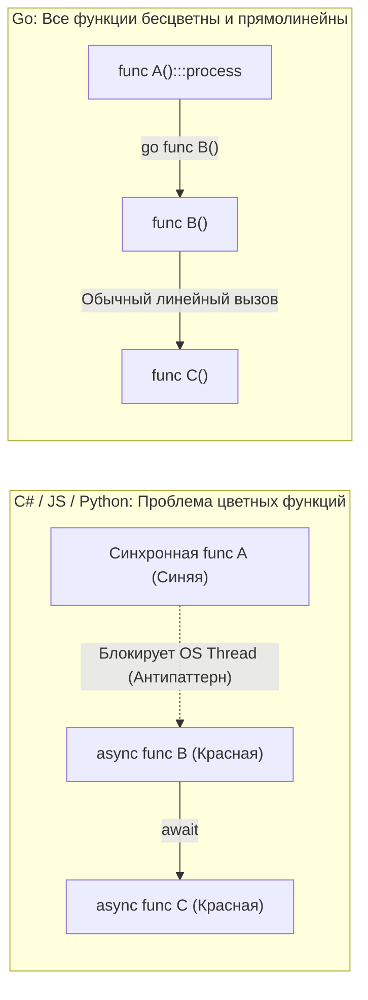

# Как мыслить после Java, C#, PHP и Python

Переход на Go с популярных объектно-ориентированных или динамических языков программирования удивительно напоминает классические пять стадий принятия неизбежного:
1. **Отрицание:** *«Где нормальные классы? Где наследование? Как вообще можно проектировать домен без абстрактных фабрик?»*
2. **Гнев:** *«Почему я обязан писать `if err != nil` после каждого сетевого чиха?! Это же шаг назад в семидесятые годы!»*
3. **Торг:** *«Может, обернуть вызовы в кастомные функции с `panic` и написать перехватчик `recover`, чтобы вернуть любимый `try/catch`?»*
4. **Депрессия:** *«Мой код на 5 000 строк выглядит прямолинейно и скучно, словно системная утилита для UNIX на C...»*
5. **Принятие:** *«Постой-ка: мой сервис стартует за 5 миллисекунд, потребляет 18 мегабайт памяти, держит 100 000 RPS и читается любым инженером команды сверху вниз без документации!»*

Чтобы сократить этот путь от фрустрации к инженерному триумфу, необходимо осознанно демонтировать четыре ментальные парадигмы, годами вбивавшиеся в голову архитектурой Spring, .NET, Laravel или Django.

---

## 1. Отказ от "Слоёной Архитектуры" в пользу Данных (Data-Oriented Thinking)

В энтерпрайз-ООП нас приучили мыслить тяжелыми слоями абстракций вокруг поведения (Encapsulation). Мы создавали `UserService`, в который инжектили `UserRepository`, который оборачивал `UserDAO`, маппивший строки SQL в промежуточный `UserEntity`, конвертируемый в `UserDTO`. Данные считались лишь вторичным «топливом», циркулирующим между объектами.

В Go необходимо совершить разворот на 180 градусов: **сначала данные, потом преобразования**.

> [!info] Под капотом: Mechanical Sympathy и Локальность Данных
> В Java или PHP практически каждый объект аллоцируется в динамической куче (Heap). Массив из 10 000 объектов — это 10 000 указателей, разбросанных по разным углам оперативной памяти. Когда процессор пытается выполнить цикл по такому массиву, он непрерывно промахивается мимо кэша L1/L2 (Cache Misses).
> 
> В Go структура `struct` — это честный, плоский блок памяти. Срез структур `[]User` аллоцирует физическую память **единым монолитным блоком**. 
> 
> Если вы начнете искусственно дробить структуры на слои ради академической абстракции или повсеместно передавать указатели `*User` вместо значений `User`, вы добровольно уничтожите аппаратное преимущество Go. Анализ утечек (Escape Analysis) отправит данные в Heap, сборщик мусора начнет захлебываться, а ядра процессора будут простаивать в ожидании шины RAM.

**Как мыслить:** Сначала спроектируйте структуры данных (раскладку байт в памяти), затем напишите чистые функции, которые эти структуры преобразуют. В Go данные и поведение строго ортогональны (как мы подробно разбирали в [[12. Composition Over Inheritance. Почему в Go нет наследования]]).

---

## 2. Проблема цветных функций (Colorless Functions)

Разработчики, приходящие из сред с `async/await` (C#, JavaScript, современный Python), привыкли к фундаментальному расколу мира на две изолированные вселенные. Известный инженер Боб Нистром (Bob Nystrom) образно назвал это **«Проблемой цветных функций» (What Color is Your Function?)**:
* Синхронные функции (синие) исполняются быстро, но не могут выполнять асинхронный ввод-вывод.
* Асинхронные функции (красные) используют ключевые слова `async` и `await`.

Коварство заключается в том, что «синяя» функция не может вызвать «красную» без блокировки потока. Стоит вам добавить один `await` глубоко внутри логики, как вы обязаны объявить функцию асинхронной и затем «перекрасить в красный цвет» всю цепочку вызовов вплоть до точки входа. Программа заражается синтаксическим шумом.

В Go **все функции абсолютно бесцветны**.



**Как мыслить:** В Go вы всегда пишете прямой, последовательный, читаемый сверху вниз код. Если нужно обратиться к базе данных или прочитать 10 МБ по HTTP, вы просто вызываете метод. Вам не нужны обертки `Task` или `Promise`.

> [!info] Под капотом: Магия netpoll
> Почему синхронный код в Go не блокирует процессор?
> 
> В рантайм Go интегрированы кооперативный планировщик (M:N Scheduler) и сетевой поллер (`netpoll`, использующий `epoll` в Linux или `kqueue` в BSD/macOS).
> 
> Когда горутина совершает вызов `http.Get()`, она **не блокирует** физический тред операционной системы (OS Thread). Рантайм Go перехватывает этот ввод-вывод, регистрирует сокет в системном мультиплексоре ядра `epoll`, переводит горутину в состояние ожидания `Gwaiting` и немедленно передает поток ОС другой готовой задаче. 
> 
> Как только ядро Linux сообщает о готовности сетевого пакета, рантайм переводит горутину обратно в статус `Grunnable`, и она мгновенно продолжает работу со следующей инструкции. Вы получаете колоссальную пропускную способность неблокирующего асинхронного IO без единой строчки коллбэков или промисов.

---

## 3. Библиотеки вместо Фреймворков (Inversion of Control вручную)

В таких экосистемах, как Spring (Java) или Nest.js/Laravel, фреймворк полностью берет управление над вашим приложением (Hollywood Principle: *«Не звоните нам, мы сами вам позвоним»*). Вы пишете классы, декорируете их аннотациями (`@Controller`, `@Autowired`, `@Transactional`), а гигантский рантайм-комбайн сканирует память через рефлексию (Reflection), динамически конструирует прокси-классы и решает, когда вызвать ваш код.

В Go действует противоположная парадигма: **вы контролируете библиотеки, а не фреймворк контролирует вас**.

Идиоматичный бэкенд-сервис на Go имеет предельно прозрачную, осязаемую функцию `main()`. В ней нет скрытой «магии»: вы собственными руками конструируете зависимости, настраиваете пулы и передаете компоненты друг другу.

```go
// Идиоматичный Inversion of Control в Go
func main() {
    // 1. Инициализируем хранилище
    db := postgres.NewConnection("localhost:5432")
    
    // 2. Явно передаем зависимости в репозитории и клиенты
    userRepo := repository.NewUserRepo(db)
    emailClient := external.NewEmailClient("smtp.service.internal")
    
    // 3. Собираем бизнес-сервис
    userService := service.NewUser(userRepo, emailClient)
    
    // 4. Монтируем маршрутизатор и запускаем сервер
    httpHandler := api.NewHandler(userService)
    
    log.Println("Сервер слушает порт :8080")
    if err := http.ListenAndServe(":8080", httpHandler); err != nil {
        log.Fatal(err)
    }
}
```

Такая прямолинейность гарантирует:
* **Мгновенный старт:** Никакого тяжелого сканирования классов при запуске.
* **Безопасность компиляции:** Любая ошибка конфигурации графа зависимостей обнаруживается компилятором, а не всплывает как `NullPointerException` посреди ночи в production.
* **Навигация:** Любой разработчик может нажать клавишу «Go to Definition» в IDE и пройти по графу зависимостей от `main` до последнего SQL-запроса без поиска скрытых конфигурационных XML или аннотаций.

---

## 4. Смерть классических паттернов проектирования

Открывая классический каталог паттернов Gang of Four (GoF), опытный программист осознает, что добрая половина этих шаблонов была изобретена исключительно для преодоления искусственных ограничений классического ООП. В Go эти задачи решаются встроенными механизмами языка:

* **Singleton (Одиночка):** В Java требует изощренных конструкций с двойной проверкой блокировки (Double-Checked Locking) и ключевым словом `volatile`. В Go достаточно одной переменной уровня пакета и вызова `sync.Once`.
* **Factory (Фабрика):** Вместо создания отдельных фабричных классов пишется элементарная функция-конструктор `NewUser()`.
* **Builder (Строитель):** В Java спасает от конструкторов с 10 параметрами. В Go эта проблема изящно и идиоматично решается паттерном **Функциональных опций (Functional Options)**.

> [!tip] Собеседование
> **Вопрос:** Как идиоматично сконфигурировать структуру со множеством опциональных параметров в Go без использования паттерна Builder?
>
> **Ответ:** 
> С помощью паттерна **Functional Options**. 
> 
> Мы создаем структуру и конструктор `NewServer(opts ...Option)`, принимающий переменное число функций конфигурации. Каждая опция представляет собой замыкание, мутирующее локальное состояние:
> ```go
> type Server struct { 
>     host string
>     port int 
> }
> 
> type Option func(*Server)
> 
> func WithPort(p int) Option { 
>     return func(s *Server) { s.port = p } 
> }
> 
> // Использование:
> srv := NewServer(WithPort(8080))
> ```
> Этот подход идеален: значения по умолчанию инициализируются внутри конструктора, новые параметры добавляются без изменения сигнатуры функции (соблюдается принцип OCP), а вызов в коде читается предельно естественно.

---

## Итог: Перестройка ментальной модели

Чтобы стать зрелым Go-инженером, необходимо принять три ключевых принципа (см. [[5. Философия Go. Простота, читаемость и прагматизм]]):

1. **Честный бойлерплейт лучше скрытой магии:** Явный линейный код с проверками `if err != nil` на порядок проще в отладке и аудите, чем сложнейшие цепочки рефлексивных перехватчиков.
2. **Конкурентность под контролем:** Функции библиотек синхронны; вызывающий код сам решает, когда и как запускать `go func()`.
3. **Композиция вместо иерархий:** Проектируйте системы из компактных структур и микроинтерфейсов, ориентируясь на физическое расположение данных в памяти.

В этой главе мы неоднократно подчеркивали неприязнь Go к скрытому поведению. Но почему создатели языка заняли столь бескомпромиссную позицию против «удобной магии»? К каким катастрофам приводит скрытая логика в масштабных кодовых базах?

Этому посвящена следующая статья: [[19. Почему в Go избегают магии и скрытого поведения]].
