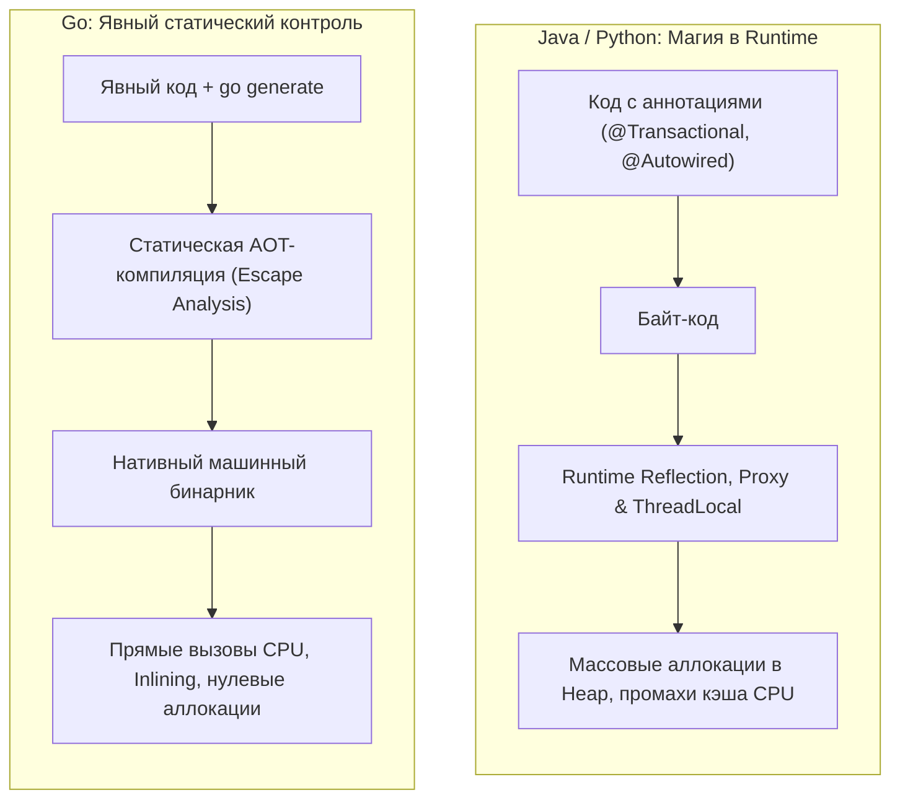

# Почему в Go избегают магии и скрытого поведения

Переход в Go из таких развитых корпоративных экосистем, как Spring (Java), .NET (C#) или Ruby on Rails / Laravel, нередко вызывает у разработчика глубокую профессиональную ломку. Годами нас приучали к тому, что сложные инженерные задачи элегантно решаются парой декоративных аннотаций: повесил `@Transactional` — и метод автоматически обернулся в распределенную транзакцию базы данных; добавил `@Autowired` — и контейнер инверсии контроля внедрил нужную зависимость; обратился к полю `user.Profile` — и ORM незаметно выполнила отложенный SQL-запрос (Lazy Loading).

В Go ничего подобного нет. Язык демонстративно принуждает разработчика писать прямолинейный код: собственными руками начинать и фиксировать транзакции, явно пробрасывать `Context` первым аргументом через десятки функций, вручную сканировать поля строк из драйвера базы данных.

Для новичка это поначалу кажется архаизмом и шагом назад в пещерный век. Но для опытного системного инженера это глубоко осознанный архитектурный компромисс. Фундаментальный постулат философии Go гласит: **«Явное лучше неявного (Explicit is better than implicit)»**.

Давайте разберем, какую колоссальную скрытую цену на уровне физического кремния и надежности рантайма мы платим за «удобную магию», и почему сознательный отказ от нее делает современные распределенные сервисы несокрушимыми.

---

## Что такое "Магия" в программировании?

В компьютерной инженерии под «магией» понимают **скрытый поток управления (Control Flow) или неявную модификацию состояния системы**, которые физически невозможно обнаружить и проследить, читая исходный код текущей функции.

В современных фреймворках магия опирается на три фундаментальных механизма:
1. **Рантайм-рефлексия (Runtime Reflection):** Анализ метаданных типов и динамический вызов методов во время исполнения программы.
2. **Скрытое локальное состояние потока (ThreadLocal Storage):** Неявная передача контекста через глобальные реестры операционной системы.
3. **Динамические перехватчики (Dynamic Proxies / Bytecode Weaving):** Модификация машинного или байт-кода на лету.

Все три механизма в сообществе Go признаны строжайшими антипаттернами при проектировании прикладной бизнес-логики.

---

## Цена рефлексии (Mechanical Sympathy)

Почти все «магические» инструменты (тяжелые ORM, DI-контейнеры, автоматические валидаторы) опираются на пакеты рефлексии. Они динамически изучают структуры данных в памяти процесса, разбирают теги и генерируют вызовы через таблицы символов.

В стандартной библиотеке Go существует мощный пакет `reflect`, но его применение на «горячем пути» (Hot Path) обработки пользовательских запросов приводит к катастрофической деградации производительности:

> [!info] Под капотом: Как рефлексия ломает оптимизации компилятора
> Компилятор Go проектировался для генерации предельно быстрого нативного кода за счет агрессивного статического анализа утечек (Escape Analysis) и встраивания тел функций (Function Inlining).
> 
> Когда код вызывает функцию `reflect.ValueOf(x)`, значение `x` немедленно упаковывается в пустой интерфейс `eface`. В этот момент компилятор Go **полностью слепнет**: он больше не может доказать время жизни переменной и границы ее использования.
> 
> Это приводит к каскадным потерям:
> 1. **Провал анализа утечек (Heap Escape):** Компилятор вынужден перестраховаться и аллоцировать переменную в куче (Heap), даже если передавалось обычное 8-байтное целое число. Растет объем мусора и частота пауз сборщика мусора (GC).
> 2. **Запрет инлайнинга:** Ни один вызов метода через интерфейс рефлексии физически не может быть встроен в точку вызова.
> 3. **Сбои конвейера CPU:** Косвенные вызовы по адресам, вычисленным на лету, намертво сбивают аппаратный предсказатель ветвлений (Branch Predictor) микропроцессора, вызывая опустошение конвейера команд.

### Решение Go: Предварительная кодогенерация
Вместо динамического парсинга структур в рантайме идиоматичный Go делает ставку на **статическую кодогенерацию на этапе сборки (Ahead-of-Time)** через директиву `go generate` (утилиты вроде `easyjson`, `sqlc` или Protobuf-компилятора). 

Инструмент генерирует типобезопасный, «скучный», но прямолинейный код, который идеально ложится в регистры процессора и кэш команд L1i.



---

## Проклятие неявного контекста: ThreadLocal vs context.Context

В Java или .NET при обработке входящего HTTP-запроса инженер может получить идентификатор пользователя или дескриптор транзакции в любой точке программы (хоть на десятом уровне вложенности в SQL-запросе), просто вызвав статический геттер контекста. Это работает благодаря абстракции `ThreadLocal` — памяти, привязанной операционной системой к конкретному физическому потоку (OS Thread).

Разработчики, приходящие в Go, регулярно просят: *«Дайте нам Goroutine-Local Storage (GLS), чтобы не таскать контекст через все функции!»*. Однако создатели языка (и лично Брэд Фитцпатрик) занимают бескомпромиссную позицию против скрытого состояния.

> [!warning] Ловушка / Gotcha: M:N Планировщик и скрытое состояние
> Почему Goroutine-Local Storage категорически отвергнут в Go?
> 
> В рантайме Go реализован планировщик типа `M:N`. Горутина (`G`) **не имеет постоянной привязки** к физическому системному потоку ОС (`M`). Когда горутина блокируется на сетевом вводе-выводе, планировщик отсоединяет ее от потока и переносит на другой тред или ядро CPU.
> 
> Если бы язык поддерживал скрытый контекст, при каждом из миллионов переключений горутин в секунду планировщик был бы вынужден копировать, проверять и синхронизировать гигантские объемы метаданных, что намертво парализовало бы производительность рантайма.
> 
> Кроме того, если горутина порождает фоновую задачу `go doWork()`, должна ли она наследовать скрытые данные родителя? Любое неявное решение в конкурентной среде ведет к гонкам данных (Data Races) и чудовищным утечкам памяти.

### Идиоматичный подход: Явная передача `context.Context`
В Go `context.Context` всегда передается **первым явным аргументом** в любую функцию, выполняющую сетевой ввод-вывод или поддерживающую отмену:

```go
func (r *Repository) GetUser(ctx context.Context, id int) (*User, error) {
    // Вся информация извлекается явно:
    reqID := ctx.Value("request_id")
    
    // контекст явно передается в нижележащий сетевой драйвер:
    row := r.db.QueryRowContext(ctx, "SELECT ... WHERE id = $1", id)
    // ...
}
```

Да, это требует дисциплины и дополнительного аргумента. Но читая такой код, инженер мгновенно видит дерево распространения таймаутов и сигналов отмены без необходимости гадать, привязана ли фоновая задача к запросу пользователя.

---

## ORM: Скрытие сетевых вызовов

Взгляните на типичный фрагмент из мира ActiveRecord (Hibernate, Ruby on Rails, Django):

```java
User user = repository.findById(1);
// Магия: невинное обращение к геттеру запускает невидимый сетевой SQL-запрос!
String companyName = user.getCompany().getName();
```

Для Go-инженера этот код представляет собой воплощение архитектурного кошмара. 

Обращение к свойству объекта выглядит в коде как элементарное чтение ячейки памяти с временной сложностью $O(1)$, занимающее считанные наносекунды. Но под капотом виртуальная машина блокирует поток на 20–50 миллисекунд, отправляет блокирующий сетевой пакет в базу данных, аллоцирует десятки промежуточных объектов и выполняет десериализацию.

Если поместить такой невинный вызов внутрь цикла по 1 000 пользователям, система мгновенно порождает классическую катастрофу **$N+1$ запросов**, обрушивая базу данных под боевой нагрузкой.

**Принцип Go:** Любая операция, способная завершиться сетевым сбоем или требующая значительного времени, **обязана быть явно оформлена как вызов функции и возвращать интерфейс `error`**. Сетевой ввод-вывод никогда не имеет права маскироваться под чтение локального поля в памяти.

```go
// Идиоматичный Go: Сетевые границы абсолютно прозрачны
user, err := repo.FindUserByID(ctx, 1)
if err != nil { ... }

// Получение компании — это явный вызов, способный вернуть ошибку
company, err := repo.FindCompanyByUserID(ctx, user.ID)
if err != nil { ... }
```

> [!tip] Собеседование
> **Вопрос:** Почему в сообществе Go с настороженностью относятся к тяжелым ORM (вроде `GORM`), отдавая предпочтение библиотекам `sqlx`, `pgx` или генератору `sqlc`?
>
> **Ответ:** 
> 1. **Накладные расходы на рефлексию:** ORM вынуждены распаковывать реляционные строки в структуры через пустые интерфейсы `interface{}`, что заставляет Escape Analysis аллоцировать все поля в куче (Heap), перегружая GC.
> 2. **Потеря контроля над SQL:** Сложные ORM генерируют громоздкие, неоптимальные SQL-запросы с непредсказуемыми JOIN-ами, которые невозможно оптимизировать индексами.
> 3. **Нарушение локальности рассуждений:** Инструменты вроде `sqlc` генерируют типобезопасный нативный Go-код напрямую из чистых `.sql`-файлов еще на этапе сборки. Разработчик видит точный SQL-запрос и получает производительность прямого сканирования строк.

---

## Принцип локальности рассуждений (Local Reasoning)

Отказ от скрытой магии в Go служит главной цели инженерной зрелости — **Локальности рассуждений (Local Reasoning)**.

Локальность рассуждений означает: читая тело функции `ProcessPayment()`, программист способен безошибочно понять все ее сайд-эффекты и ветвления логики, **не открывая 20 соседних файлов**, не изучая конфигурационные XML/YAML-манифесты и не пытаясь мысленно визуализировать скрытый граф динамического DI-контейнера:
* Начинается транзакция? Мы явно видим `tx.Begin()` и `defer tx.Rollback()`.
* Проверяются входные данные? Мы явно видим вызов метода `Validate()`, а не надеемся на магическую аннотацию `@Valid` перед входом в HTTP-контроллер.
* Произошел сбой? Мы явно видим `return err`, а не надеемся, что невидимое исключение где-то выше перехватит глобальный фильтр.

---

## Итог

Go — это язык, созданный опытными системными инженерами, которые устали тратить ночные смены на отладку хитросплетений «магических» фреймворков. В распределенных высоконагруженных системах предсказуемость и прозрачность важнее сиюминутного синтаксического комфорта:

1. **Магия скрывает сложность, но никогда не устраняет ее.** Когда магия ломается в production, ее починка стоит в сотни раз дороже написания нескольких явных строчек.
2. **Рефлексия вредит кремнию.** Она блокирует оптимизации компилятора, генерирует мусор в куче и сбивает предсказатели переходов CPU. Кодогенерация AOT всегда предпочтительнее.
3. **Локальность рассуждений — залог долговечности софта.** Явный код, прозрачно передающий `context.Context` и возвращающий ошибки, легко сопровождать, читать и масштабировать.

Отказ от скрытой магии означает, что вы работаете с прозрачной памятью и чистыми данными. И здесь Go раскрывает одну из своих самых красивых и практичных идей — концепцию «полезного нулевого значения». 

Почему в Go структуры готовы к бою сразу после аллокации? Разбираем в следующей статье: [[20. Zero Value как часть дизайна языка]].
