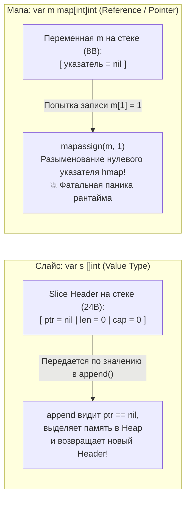

# Zero Value как часть дизайна языка

В языках программирования семейства C и раннего C++ объявление переменной без явной инициализации приводит к тому, что в ней оказывается «мусор» — случайные остаточные байты, оставшиеся в ячейках оперативной памяти от завершившихся процессов. В истории вычислительной техники это стало источником десятков тысяч критических уязвимостей, утечек конфиденциальных данных и трудноуловимых плавающих багов.

В управляемых средах вроде Java или C# числовые примитивы автоматически зануляются, однако все ссылочные типы получают значение `null`. Любая попытка обратиться к методу неинициализированного объекта немедленно вызывает катастрофический `NullPointerException` (сэр Чарльз Энтони Ричард Хоар впоследствии назвал свое изобретение null-указателей в 1965 году «ошибкой на миллиард долларов»). Инженер вынужден механически писать конструкторы для каждого чиха: `User u = new User();`.

Создатели Go предложили радикальное и элегантное инженерное решение. В рантайм языка заложен строжайший инвариант: **любая аллоцированная память гарантированно заполняется нулями, и архитектура типов обязана проектироваться так, чтобы это «нулевое значение» (Zero Value) представляло собой полностью валидное, полезное и готовое к немедленной работе состояние**.

Давайте разберем, как аппаратное обнуление функционирует на уровне кремния, почему `nil`-слайс безопасен, а запись в `nil`-мапу фатальна, и как идиоматично проектировать структуры под философию Zero Value.

---

## Mechanical Sympathy: Аппаратное обнуление памяти

Когда компилятор Go выделяет стековый фрейм для новой горутины или резервирует спан памяти в куче (Heap), рантайм обязан гарантировать, что программист не увидит мусорных данных.

Начинающим разработчикам может показаться, что принудительное обнуление гигабайт памяти в высоконагруженном сервисе — это непозволительная трата процессорных тактов, снижающая пропускную способность бэкенда. Однако авторы Go идеально синхронизировали рантайм с микроархитектурой современных CPU.

> [!info] Под капотом: Векторные инструкции и memclr
> В рантайме Go за мгновенную очистку памяти отвечает ассемблерная функция `memclrNoHeapPointers` (и ее специализированные варианты), написанная вручную под каждую целевую микроархитектуру (x86-64, ARM64).
> 
> Вместо побайтовой записи в медленном цикле Go задействует **векторные инструкции процессора (SIMD, AVX/AVX2 / AVX-512)**. Используя широкие 256-битные регистры `YMM` или 512-битные регистры `ZMM`, ядро процессора заливает нулями 32 или 64 байта памяти **за один-единственный такт конвейера**!
> 
> Более того, когда среда исполнения запрашивает у ядра операционной системы Linux новые страницы виртуальной памяти через системный вызов `mmap`, ядро возвращает ссылки на специальную глобальную статическую страницу нулей (**Zero Page**). Физические страницы памяти выделяются контроллером RAM только при первой реальной записи (Copy-On-Write). 
> 
> Таким образом, обнуление памяти в Go практически бесплатно на аппаратном уровне.

---

## "Делайте нулевое значение полезным"

Как гласит официальная пословица Go (см. [[8. Go Proverbs. Практический смысл известных цитат]]):  
**«Make the zero value useful»**.

Поскольку аппаратура и компилятор в любом случае заполняют память нулями (`0` для int, `false` для bool, пустая строка `""` со смещением len=0, пустой указатель `nil`), первоклассный инженер проектирует структуры так, чтобы эти нули означали **состояние полной боевой готовности**, исключая необходимость шаблонных конструкторов `New...()`.

### Примеры идеального Zero Value из стандартной библиотеки

1. **Мьютекс `sync.Mutex`:**  
   Вам не требуется вызывать фабричные функции `mu := NewMutex()`. Вы просто декларируете переменную на стеке или в теле структуры:
   ```go
   var mu sync.Mutex
   mu.Lock()
   // критическая секция...
   mu.Unlock()
   ```
   *Как это устроено под капотом:* Структура `sync.Mutex` содержит целочисленное поле состояния `state int32`. Когда структура создается, `state` равен `0`. Разработчики пакета `sync` спроектировали битовую маску так, что значение `0` означает «мьютекс полностью свободен». Первый же вызов `Lock()` просто выполняет атомарную инструкцию CAS (`LOCK CMPXCHG`), меняя `0` на `1`.

2. **Буфер в оперативной памяти `bytes.Buffer`:**
   ```go
   var buf bytes.Buffer
   buf.WriteString("Привет")
   ```
   Под капотом `bytes.Buffer` содержит внутренний слайс байт `buf[]byte` (или `buf []byte`). При создании переменной слайс равен `nil` (`ptr = nil, len = 0, cap = 0`). Метод `WriteString` проверяет: если внутренний слайс равен `nil`, буфер лениво (Lazy Allocation) аллоцирует массив при первой фактической операции записи. Если вы создали буфер, но в силу ветвления бизнес-логики ничего в него не записали, вы не потратили ни единого байта в куче!

---

## Ловушка: Слайсы против Мап (Slices vs Maps)

Поведение встроенных коллекций в их нулевом состоянии — классический источник неожиданных паник на собеседованиях и в production.

Сравним два базовых сценария:

**Сценарий 1: Добавление в `nil`-слайс**
```go
var s []int        // s == nil
s = append(s, 1)   // ✅ Работает безупречно! s = [1]
```

**Сценарий 2: Запись в `nil`-мапу**
```go
var m map[int]int  // m == nil
m[1] = 1           // 💥 PANIC: assignment to entry in nil map
```

Почему `append` абсолютно безопасен для неинициализированного слайса, а запись в неинициализированную мапу мгновенно роняет сервис?



> [!tip] Собеседование
> **Вопрос:** Почему запись в `nil`-мапу вызывает панику, в то время как чтение из нее безопасно, а `nil`-слайс можно свободно использовать с функцией `append`?
>
> **Ответ:** 
> 1. **Слайс — это тип-значение (Value Type):** Заголовок слайса (Slice Header) занимает 24 байта на стеке (`ptr`, `len`, `cap`). Функция `append` принимает этот заголовок по значению. Если `ptr == nil`, `append` аллоцирует новый массив в куче, заполняет поля структуры и возвращает обновленный заголовок. Инженер переприсваивает результат: `s = append(s, ...)`.
> 2. **Мапа — это указатель на структуру `hmap`:** Тип `map` представляет собой скрытый 8-байтный указатель на внутреннюю сложную структуру рантайма `hmap` (содержащую хэш-семена, массивы бакетов и счетчики). Операция `m[key] = value` компилируется в вызов `mapassign(m, key)`. Эта функция не возвращает новую мапу, а мутирует поля существующей структуры `hmap`. Если указатель `m == nil`, мутировать нечего — происходит разыменование нулевого указателя.
> 3. **Чтение из `nil`-мапы безопасно:** Выражение `v := m[key]` компилируется в вызов `mapaccess`. Внутри нее стоит явная проверка: если указатель `m == nil`, функция немедленно возвращает нулевое значение для типа элемента (число `0` для `int`), не трогая память.
> 
> **Вывод:** Для записи в мапу всегда требуется предварительная инициализация: `m := make(map[int]int)`.

---

## Как проектировать API с учетом Zero Value?

Представьте, что вы проектируете структуру конфигурации пула соединений с базой данных:

```go
// АНТИПАТТЕРН: Нулевое значение опасно
type DBConfig struct {
    Timeout int // Если 0 — что это значит? Таймаут 0 мс?
}

func DefaultConfig() DBConfig {
    return DBConfig{Timeout: 30} // Если разработчик забудет вызвать фабрику, сервис упадет
}
```

Если клиент напишет `var cfg DBConfig` и передаст ее в драйвер, база данных будет обрывать соединения с таймаутом `0` миллисекунд.

### Идиоматичный подход: Ленивая подстановка умолчаний (Lazy Defaults)

Спроектируйте методы конфигурации так, чтобы число `0` семантически означало «применить надежное значение по умолчанию»:

```go
func (c *DBConfig) getTimeout() time.Duration {
    if c.Timeout == 0 {
        return 30 * time.Second // 0 автоматически трактуется как дефолт
    }
    return time.Duration(c.Timeout)
}
```

Если же число `0` является допустимым бизнес-значением (например, «ждать ответа бесконечно»), и вам критически важно отличать «значение не задано» от «явно задан 0», в Go используют указатели: `Timeout *int`. В этом случае `nil` (нулевое значение указателя) явно указывает на отсутствие конфигурации.

---

## Ловушка: Встраивание и Zero Value

В лекции о встраивании ([[13. Embedding. Как в Go реализуется композиция]]) мы отмечали фундаментальную разницу между встраиванием по значению и по указателю. Встраивание по указателю мгновенно разрушает концепцию полезного Zero Value:

```go
type Server struct {
    *sync.Mutex // Встраивание ПО УКАЗАТЕЛЮ
    State       int
}

func main() {
    var s Server // Нулевое значение обнуляет указатель Mutex в nil
    s.Lock()     // 💥 PANIC: nil pointer dereference!
}
```

> **Золотое правило:** Встраивайте примитивы синхронизации (`sync.Mutex`, `sync.RWMutex`) и внутренние состояния **строго по значению**:
> ```go
> type Server struct {
>     sync.Mutex // Встраивание ПО ЗНАЧЕНИЮ
>     State      int
> }
> ```
> В этом случае объявленная переменная `var s Server` сразу готова к вызову `s.Lock()` прямо на стеке без единой предварительной аллокации в куче!

---

## Итог

Концепция Zero Value — это один из самых недооцененных шедевров дизайна Go:
1. **Экономия кода:** Вы избавляетесь от сотен шаблонных конструкторов и бойлерплейта инициализации.
2. **Аппаратная симпатия (Mechanical Sympathy):** Заполнение памяти нулями выполняется процессором на уровне векторных инструкций SIMD (AVX/AVX2) за единицы тактов.
3. **Безопасность кремния:** Отсутствие неинициализированного мусора ликвидирует уязвимости чтения чужой памяти.
4. **Проектирование от простоты:** Если ваша структура требует конструктора `New...()` исключительно для того, чтобы не упасть при первом же вызове метода — это признак непродуманного дизайна. Сделайте так, чтобы пустое значение `var x Struct` работало из коробки.

Этим завершается наш анализ фундаментальных архитектурных паттернов и ООП по-Goшному. Мы увидели, как язык отказывается от тяжелых классов, наследования и скрытой магии. 

Но почему создатели Go пошли на столь радикальное упрощение? Как устроен рантайм, планировщик и механизм конкурентности, ради которых создавался этот спартанский синтаксис?

Мы переходим к третьему блоку нашего исследования — эволюции языка, внутреннему устройству рантайма и правильному майндсету Go-инженера: [[21. Простота против абстракций. Почему Go не любит сложные иерархии]].
