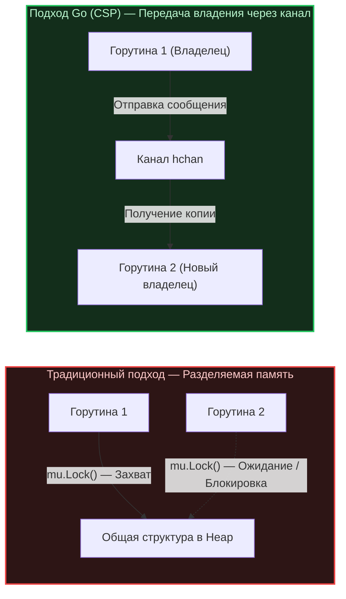

В предыдущей лекции ([[24. Concurrency Is Not Parallelism. Философия конкурентности в Go]]) мы выяснили, что горутины — это независимые легковесные единицы вычислений, которые планировщик рантайма Go распределяет по доступным ядрам процессора. 

Но как только в программе возникает несколько параллельно исполняемых задач, перед инженером встает фундаментальный вызов многопоточного программирования: **координация и синхронизация разделяемого состояния**. Что делать, если две независимые горутины одновременно пытаются обновить общий счетчик метрик или вставить запись в одну и ту же хэш-таблицу?

Разработчик с бэкграундом в Java, C# или C++ инстинктивно потянется за привычными примитивами блокировки: `Mutex`, `Monitor` или `Lock`. Ментальная модель кажется предельно ясной: объявляем структуру в общей куче, ставим замок `mu.Lock()`, и пусть потоки выстраиваются в очередь на доступ.

Однако создатели Go предложили индустрии совершенно иную парадигму, ставшую самой цитируемой пословицей языка (см. [[8. Go Proverbs. Практический смысл известных цитат]]):  
**«Do not communicate by sharing memory; instead, share memory by communicating»**  
*(«Не общайтесь через разделение памяти; вместо этого разделяйте память через общение»)*.

Давайте опустимся на уровень аппаратной архитектуры процессора и структур данных рантайма, чтобы понять, почему общая память — это скрытый архитектурный тупик, и как каналы меняют дизайн высоконагруженных систем.

---

## Проблема общей памяти (Mechanical Sympathy)

Представьте классическую архитектуру сервиса: у нас есть разделяемая структура `Cache`, содержащая стандартную хэш-таблицу `map` и примитив синхронизации `sync.Mutex`. Десятки горутин, запущенных на всех 16 или 32 ядрах процессора, непрерывно читают и обновляют этот кэш.

На уровне исходного кода вызов выглядит невинно:
```go
c.mu.Lock()
c.items[key] = val
c.mu.Unlock()
```

Но на уровне микроархитектуры современного CPU разворачивается яростная борьба за шину памяти.

### Когерентность кэшей и Cache Line Bouncing
Каждое физическое ядро современного процессора оснащено сверхбыстрыми локальными кэшами L1/L2 (время доступа — 1–4 наносекунды). Чтобы несколько ядер не работали с противоречивыми копиями одной ячейки памяти, аппаратура реализует аппаратные протоколы когерентности кэша (семейство **MESI**: *Modified, Exclusive, Shared, Invalid*).

Когда Горутина 1 (на Ядре 1) захватывает мьютекс, процессор выполняет неделимую атомарную инструкцию `CAS` (Compare-And-Swap). Ядро 1 монопольно захватывает 64-байтную кэш-линию, где лежит состояние мьютекса, помечая ее статусом **Modified** (или **Exclusive**).

В ту же наносекунду Горутина 2 (на Ядре 2) пытается выполнить тот же `CAS`:
1. Ядро 2 шлет широковещательный сигнал по межъядерной шине (Interconnect / UPI).
2. Ядро 1 вынуждено остановить исполнение конвейера, принудительно сбросить измененную кэш-линию в общий кэш L3 или RAM и инвалидировать (статус **Invalid**) свою копию.
3. Линия кэша физически «перелетает» на Ядро 2.

Этот феномен в компьютерной архитектуре называется **Cache Line Bouncing** («прыгающая кэш-линия»).

```
Ядро 1 [L1: Modified]  ──(Шина CPU: Инвалидация)──>  Ядро 2 [L1: Invalid -> Modified]
         │                                                      │
         └────────── Прыгающая кэш-линия (Cache Line Bouncing) ──┘
                    Останов конвейера, рост задержек (Latency Spikes)
```

> [!info] Под капотом: Масштабируемость мьютексов
> Мьютекс на разделяемых данных — это узкое горлышко (`Bottleneck`) и точка жесткой синхронизации. Чем больше физических ядер добавляется в сервер (32, 64, 128) и чем выше конкуренция за замок (`Lock Contention`), тем **медленнее** работает система в пересчете на такт. Ядра процессора тратят драгоценную энергию и циклы не на вычисления, а на бесконечную пересылку кэш-линий и взаимную инвалидацию L1/L2 кэшей.

---

## Парадигма CSP и Каналы

Вместо того чтобы заставлять ядра процессора толкаться локтями вокруг единого куска оперативной памяти, Go опирается на формальную математическую модель **CSP (Communicating Sequential Processes)**, разработанную британским ученым Тони Хоаром (Tony Hoare) в 1978 году.

Фундаментальный принцип CSP: **В каждый момент времени конкретным фрагментом данных монопольно владеет ровно одна горутина.**

Если другой горутине необходимы эти данные для продолжения работы, первая горутина не отдает ей указатель на общее изменяемое состояние. Она **отправляет сообщение** через типизированный канал связи.



Передавая сообщение через канал, горутина передает **право владения (Ownership)**. Нет разделяемого состояния — нет и гонок данных (`Data Races`). Необходимость в расстановке мьютексов на каждом шагу отпадает сама собой.

---

## Под капотом: Устройство Канала (hchan)

Среди начинающих разработчиков бытует заблуждение, будто каналы (`chan`) в Go реализованы с помощью некой магической безблокировочной (`lock-free`) аппаратной очереди. Это миф.

В исходном коде рантайма Go (`src/runtime/chan.go`) канал представляет собой обычную структуру `hchan`, защищенную классическим низкоуровневым спинлоком:

```go
type hchan struct {
    qcount   uint           // Текущее количество элементов в буфере
    dataqsiz uint           // Вместимость кольцевого буфера (make(chan T, dataqsiz))
    buf      unsafe.Pointer // Указатель на непрерывный кольцевой массив элементов
    sendx    uint           // Индекс записи в кольцевой буфер
    recvx    uint           // Индекс чтения из кольцевого буфера
    recvq    waitq          // Очередь ожидающих чтения горутин (список sudog)
    sendq    waitq          // Очередь ожидающих записи горутин (список sudog)
    lock     mutex          // ДА! Внутри каждого канала живет мьютекс рантайма!
}
```

### Если внутри канала есть мьютекс, почему каналы архитектурно лучше?

Секрет кроется не в отсутствии мьютекса, а в **семантике взаимодействия и бесшовной интеграции с планировщиком задач**:

1. **Оркестрация потока управления (`Control Flow`):** Мьютекс просто закрывает доступ к участку памяти. Канал управляет жизненным циклом горутин. Когда горутина пытается прочитать данные из пустого канала, рантайм Go захватывает внутренний `lock`, создает объект ожидания `sudog`, ставит его в очередь `recvq`, после чего переводит горутину в состояние сна вызовом `gopark`. Процессорное ядро не крутится в пустом цикле — оно немедленно переключается на другую полезную горутину.
2. **Инкапсуляция и защита от ошибок:** Захват и освобождение замка `hchan.lock` происходят глубоко в недрах рантайма на микросекундные промежутки. Разработчик в прикладном коде физически не может забыть снять блокировку (ошибка забытого `defer mu.Unlock()`) или случайно прочитать данные в обход контракта.
3. **Прямое копирование со стека на стек:** Если горутина-читатель уже ждет в очереди `recvq`, рантайм Go выполняет феноменальную оптимизацию: он копирует данные из стека горутины-писателя напрямую в стек ожидающей горутины-читателя, минуя промежуточный буфер `buf`!

> [!warning] Ловушка / Gotcha: Передача указателей через канал
> Самый распространенный архитектурный сбой новичков при переходе на каналы: создание структуры, передача в канал указателя `*User`, после чего отправляющая горутина **продолжает модифицировать поля этого объекта**.
> 
> Подобный код полностью дискредитирует концепцию *«Share Memory By Communicating»*, превращая канал в банальный пересыльщик адреса общей памяти, и гарантированно приводит к тяжелым гонкам данных (`Data Race`).
> 
> **Золотое правило:** Если вы передаете через канал указатель, передающая сторона обязана немедленно «забыть» о существовании этого объекта (полная передача `Ownership`). А если структура компактна — передавайте ее по значению: компилятор создаст изолированную копию на стеке, гарантируя абсолютную потокобезопасность.

---

## Mutex против Channel: Прагматичный выбор инженера

Означает ли философия Go, что использование мьютексов считается дурным тоном? Ни в коем случае! В стандартной библиотеке Go мьютексы применяются сотни раз (включая недра сетевого стека, планировщика и самих каналов).

Дзен Go требует не религиозного фанатизма, а трезвого инженерного компромисса:

```
                  ┌────────────────────────────────────────┐
                  │          Что вы хотите сделать?        │
                  └──────────────────┬─────────────────────┘
                                     │
             ┌───────────────────────┴───────────────────────┐
             ▼                                               ▼
   [Защитить локальное состояние]                 [Оркестрировать процессы]
   - In-memory кэш                                - Передача владения данными
   - Локальный счетчик структуры                  - Паттерн Producer-Consumer
   - Быстрый доступ к map (наносекунды)           - Сигнал отмены (select / ctx.Done)
             │                                               │
             ▼                                               ▼
     Используйте sync.Mutex                          Используйте chan
```

* **Выбирайте `sync.Mutex` / `sync.RWMutex`, когда:**
  1. Вы защищаете атомарное состояние отдельной структуры данных (кэш в оперативной памяти, внутренний счетчик, локальная мапа).
  2. Критическая секция предельно коротка: чтение или запись занимают десятки наносекунд и **не содержат** сетевых вызовов, обращений к диску или сложных блокировок.
  3. Изменение состояния не требует пробуждения других горутин.

* **Выбирайте `chan` (Каналы), когда:**
  1. Вы передаете поток данных между независимыми подсистемами приложения (паттерны Producer-Consumer, конвейеры обработки, пулы воркеров `Worker Pool`).
  2. Вам требуется оркестрация: дождаться сигнала готовности, ограничить пропускную способность или корректно завершить работу по сигналу закрытия (`close`).
  3. Вам необходимо мультиплексировать несколько независимых событий через оператор `select`.

> [!tip] Собеседование
> **Вопрос:** Почему архитектура на мьютексах считается жестко связанной (`Tight Coupling`), а архитектура на каналах — слабо связанной (`Loose Coupling`)?
> **Ответ:** Мьютексы связывают горутины общим пространством памяти: обе стороны обязаны точно знать внутреннюю структуру общего объекта и правила работы с его блокировками.  
> Каналы разделяют участников на независимых поставщиков и потребителей. Горутина-отправитель ничего не знает о том, кто, где и когда прочитает сообщение — она просто пишет в канал. Вы можете добавить еще 10 параллельных воркеров-читателей, объединить каналы через `select` или настроить буферизацию без модификации единой строчки кода отправителя.

---

## Оператор select: Сердце конкурентности Go

Истинная мощь каналов раскрывается в связке с оператором `select`. Это своеобразный сетевой коммутатор (`switch`) для асинхронных каналов, позволяющий горутине одновременно отслеживать множество каналов без блокировки потока операционной системы.

Именно `select` делает тривиальной реализацию таймаутов, мультиплексирования и корректного завершения (`Graceful Shutdown`):

```go
func worker(ctx context.Context, tasks <-chan Task) {
    for {
        select {
        case t, ok := <-tasks:
            if !ok {
                log.Println("Очередь задач пуста, воркер завершает работу")
                return
            }
            process(t)
        case <-ctx.Done(): // Передача сигнала отмены: share memory by communicating
            log.Println("Воркер остановлен по контексту:", ctx.Err())
            return
        }
    }
}
```

Попытка реализовать подобный неблокирующий опрос с таймаутами и отменой на сырых мьютексах и условных переменных (`Condition Variables`) в C++ или Java требует десятков строк сложного кода с постоянным риском спровоцировать взаимную блокировку (`Deadlock`). В Go это родной синтаксис ядра языка.

---

## Резюме

1. **Разделяемая изменяемая память — аппаратный тупик:** Борьба ядер за один мьютекс вызывает `Cache Line Bouncing`, сбрасывает кэши L1/L2 и парализует масштабируемость системы на многоядерных машинах.
2. **Философия CSP:** Передавайте владение объектом через типизированные каналы. Нет общей изменяемой памяти — нет состояния гонки (`Data Race`).
3. **Канал — это не магия, а продуманная структура `hchan`:** Внутри нее есть мьютекс, но рантайм берет на себя самую тяжелую задачу — перевод горутины в сон через `gopark` и пробуждение без напрасного расхода процессорных циклов.
4. **Трезвый баланс:** Используйте `sync.Mutex` для локальных наносекундных операций со структурами, а каналы (`chan`) — для сквозной оркестрации потоков данных и событий.

---

Мы подробно изучили философию, систему типов, семантику памяти и модель конкурентности Go. Вы научились мыслить горутинами, каналами и узкими интерфейсами. 

Но чтобы строить реальные промышленные системы, инженеру нужны надежные инструменты. И здесь новичка ждет еще один культурный шок: вместо того чтобы бежать на GitHub за сторонними библиотеками, опытный Go-инженер открывает стандартный инструментарий языка. О том, почему принцип «всё свое ношу с собой» заложен в ДНК Go, мы поговорим в следующей статье: [[26. Стандартная библиотека как часть философии языка]].
