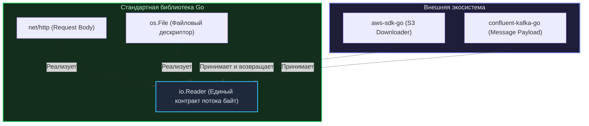

В программных средах вроде Node.js (JavaScript) или PHP стандартная библиотека традиционно предоставляет лишь скромный набор низкоуровневых утилит. Чтобы поднять элементарный веб-сервер, разработчик первым делом открывает терминал и загружает тяжелые сторонние фреймворки: `npm install express` или `composer require symfony/http-foundation`.

Приходя в Go, разработчики по привычке отправляются на GitHub на поиски «лучшего веб-фреймворка». Они натыкаются на популярные имена — Gin, Echo, Fiber, — немедленно подключают их в проект и… упускают одну из самых прекрасных инженерных идей Go.

Философия создателей языка в этом вопросе бескомпромиссна: **Стандартная библиотека Go — это не демонстрационный набор для новичков. Это промышленный, закаленный в боях production-ready инструментарий, вокруг абстракций которого выстроена вся современная экосистема облачного бэкенда.**

Давайте разберем, почему стандартная библиотека Go занимает уникальное положение в компьютерной индустрии, как она напрямую взаимодействует с ядром операционной системы и почему опытные Senior-инженеры создают микросервисы с околонулевым количеством внешних зависимостей.

---

## 1. Бэкенд-нативность «из коробки»

Язык Go создавался инженерами Google для преодоления конкретных системных вызовов серверной инфраструктуры и распределенных сетей (см. [[3. Какие проблемы существующих языков пытался решить Go]]). Этот фокус определил состав пакетов стандартной библиотеки.

В ней вы не найдете парсеров устаревшего XML-RPC, библиотек для отрисовки графических интерфейсов (GUI) или мультимедийных движков (как в Java или Python). Зато стандартная библиотека содержит исчерпывающий арсенал для построения надежного сервера:
* `net/http` — высокопроизводительный HTTP/1.1 и HTTP/2 сервер и клиент промышленного класса (с экспериментальной поддержкой HTTP/3).
* `crypto/...` — безупречные реализации всех современных криптографических стандартов (TLS 1.3, AES-GCM, RSA, ECDSA), верифицированные математиками и оптимизированные с использованием векторных инструкций ассемблера.
* `database/sql` — универсальный, потокобезопасный пул соединений для любых реляционных баз данных.
* `encoding/json` — надежный потоковый сериализатор и парсер JSON на базе рефлексии, покрывающий потребности 80% типовых микросервисов.

В других языках встроенные веб-серверы (например, модуль `http.server` в Python) созданы сугубо для локальных экспериментов и отладки. В официальной документации Python прямо подчеркивается: *«Не используйте это в продакшене»*. 

В Go сервер из пакета `net/http` без каких-либо надстроек держит гигабиты трафика и миллионы соединений в таких технологических гигантах, как Cloudflare, Uber и Netflix.

---

## 2. Интеграция с рантаймом: Mechanical Sympathy

Вы физически не можете написать стороннюю сетевую библиотеку на чистом Go, которая превзойдет стандартный пакет `net` по эффективности работы с сокетами. Дело не только в квалификации инженеров Bell Labs, а в фундаментальной архитектуре: **пакет `net` обладает привилегированным доступом к планировщику рантайма Go**.

> [!info] Под капотом: Пакет net и Network Poller
> Когда вы вызываете `conn.Read()` на блокирующемся TCP-сокете в программе на C++, поток операционной системы (`OS Thread`) переходит в сон, а процессор тратит микросекунды на системный вызов ядра.
> 
> В Go стандартный сетевой стек работает в теснейшей связке с планировщиком (модель G-M-P). При инициализации соединения вызов `conn.Read()` переводит дескриптор в неблокирующий режим (`O_NONBLOCK`) и регистрирует его в платформенном механизме ввода-вывода ядра (`epoll` в Linux или `kqueue` в macOS). 
> 
> После этого пакет `net` выполняет вызов `gopark`: текущая горутина аккуратно усыпляется, а системный поток ОС `M` немедленно берет на исполнение следующую рабочую задачу. Встроенный сетевой поллер (`Netpoll`) непрерывно отслеживает готовность дескрипторов и пробуждает горутину в ту же миллисекунду, когда пакет приходит из сетевой карты.
> 
> Сторонний код, не имеющий прямого доступа к внутренностям рантайма, повторить этот трюк не в состоянии. Стандартная библиотека гарантирует максимальную утилизацию ядер CPU без спагетти из асинхронных коллбэков.

---

## 3. Стандартизация абстракций (Ecosystem Glue)

Главная историческая заслуга стандартной библиотеки Go заключается даже не в обилии готовых алгоритмов, а в **проектировании эталонных интерфейсов**.

Опираясь на принцип неявного удовлетворения контрактов (см. [[16. Почему маленькие интерфейсы лучше больших]]), стандартная библиотека задает общий язык (lingua franca), на котором бесшовно взаимодействуют компоненты от сотен независимых разработчиков.

Канонический образец — минималистичный интерфейс `io.Reader`:
```go
type Reader interface {
    Read(p []byte) (n int, err error)
}
```



Интерфейс `io.Reader` — это прямой наследник пайплайнов Unix (`|`). Это универсальный грузовой контейнер мира Go:
* Если вы скачиваете официальный SDK для AWS (`aws-sdk-go`), чтобы залить объект в бакет S3, функция `Upload` принимает обычный `io.Reader`.
* Вы можете передать в него файл с диска (`os.File`), тело входящего веб-запроса (`r.Body` / `Request Body`), сообщение из брокера (`confluent-kafka-go` / `Message Payload`) или срез байт в памяти (`bytes.Buffer`). Никаких промежуточных адаптеров не требуется!

Точно так же интерфейс `http.Handler` стал абсолютным монополистом в веб-разработке. Любой маршрутизатор, middleware или обертка для метрик обязаны принимать и возвращать `http.Handler`, что полностью исключает фрагментацию экосистемы.

---

## 4. Паттерн «Драйверы» (Пакет database/sql)

Другой архитектурный шедевр стандартной библиотеки — пакет `database/sql`.

Этот пакет **не содержит ни строчки кода для конкретных СУБД** (ни для PostgreSQL, ни для MySQL, ни для SQLite). Что же в нем реализовано?
1. Высоконадежный, потокобезопасный пул соединений (`Connection Pool`) с контролем таймаутов, проверкой жизнеспособности коннектов и лимитами активности.
2. Семейство абстрактных драйверных интерфейсов (`driver.Conn`, `driver.Tx`).

Прикладной код разработчика всегда взаимодействует **только со стандартным пакетом `database/sql`**. А конкретная реализация СУБД (например, PostgreSQL-драйвер `github.com/lib/pq`) подключается в `main.go` через пустой импорт ради побочного эффекта инициализации:
```go
import _ "github.com/lib/pq"
```

В момент запуска программы драйвер регистрирует свою фабрику в глобальном реестре `database/sql`. Это образцовая реализация принципа инверсии зависимостей (`DIP`) из `SOLID`. Авторы языка взяли на себя самую трудную и неблагодарную работу по координации многопоточного пула, а разработчику драйвера остается лишь реализовать протокол передачи байт конкретной базы.

> [!tip] Собеседование
> **Вопрос:** Почему в Go-сообществе используют `database/sql` даже при наличии узкоспециализированных драйверов вроде `pgx`, и как между ними выбирать?
> **Ответ:** Пакет `database/sql` обеспечивает абстракцию и переносимость бизнес-логики между СУБД. Однако драйвер `pgx` (современный стандарт работы с PostgreSQL в Go) предлагает два режима:
> 1. В качестве стандартного драйвера для `database/sql` (максимальная совместимость со сторонними библиотеками и миграциями).
> 2. Через собственный нативный интерфейс (`pgxpool`), открывающий прямой доступ к уникальным возможностям Postgres: сверхбыстрой потоковой загрузке данных через `COPY`, сложным массивам и асинхронным уведомлениям `Listen/Notify`.  
> Прагматичный Senior-инженер выбирает нативный `pgx`, когда борется за пиковую производительность и использует специфичные фичи PostgreSQL, и остается на `database/sql`, если ценит универсальность и использует стандартные ORM или query-билдеры.

---

## 5. Культура «Нулевых Зависимостей»

В экосистеме JavaScript памятна драма с пакетом `left-pad` (состоявшим всего из 11 строк кода), удаление которого из реестра npm сломало сборки тысяч проектов по всему миру.

В культуре Go действует мудрое правило Кернигана и Пайка: *«Небольшое копирование лучше небольшой зависимости»*. Если вам необходимо сгенерировать псевдослучайный идентификатор, не нужно подключать сторонний пакет `go-random-string`. Достаточно открыть стандартный пакет `crypto/rand` и написать пять строк прозрачного кода.

Каждая новая строка во внешних зависимостях вашего `go.mod`:
1. Замедляет сборку проекта;
2. Открывает вектор атак на цепочку поставок (`Supply Chain`), когда взлом репозитория сторонней библиотеки компрометирует ваш сервер;
3. Потенциально усложняет переход на новые мажорные версии компилятора.

> [!warning] Ловушка / Gotcha: valyala/fasthttp
> Многие начинающие оптимизаторы, стремясь выжать максимальный RPS в бенчмарках, заменяют стандартный `net/http` на сторонний пакет `valyala/fasthttp` (который радикально снижает аллокации за счет пулов памяти).
> 
> Но это опасная ловушка! Пакет `fasthttp` принципиально **не совместим** со стандартными интерфейсами `net/http` и `context.Context`. Выбрав его, вы отрезаете проект от 99% готовых экосистемных решений: экспортеров метрик `Prometheus`, систем распределенного трейсинга OpenTelemetry и готовых мидлварей авторизации. Выбирайте `fasthttp` только для изолированных высоконагруженных прокси-шлюзов с экстремальным трафиком. В 98% прикладных микросервисов стандартный `net/http` — лучший выбор.

---

## Резюме

1. **Не торопитесь подключать фреймворки:** В Go фреймворки часто прячут естественный поток управления и усложняют отладку. В современных версиях Go (начиная с Go 1.22+ с обновленным `ServeMux`, поддерживающим шаблоны путей и методы) связка стандартного `net/http` и легковесного роутера вроде `chi` закрывает почти любые потребности.
2. **Изучайте ключевые абстракции:** Глубокое понимание `io.Reader`, `io.Writer`, типа `error` и пакета `context.Context` важнее знания всех синтаксических тонкостей.
3. **Читайте исходники стандартной библиотеки:** Пакеты Go написаны создателями языка. Это непревзойденный образец лаконичного, строгого и чистого инженерного стиля.

Возникает резонный вопрос: почему мы можем так безоговорочно доверять стандартной библиотеке Go? Откуда уверенность, что код, написанный сегодня, скомпилируется и продолжит надежно работать через десять лет, а не повторит печальную судьбу перехода с Python 2 на Python 3?

Ответ кроется в уникальном договоре о стабильности, заключенном авторами языка с мировым инженерным сообществом. Об этой фундаментальной гарантии читайте в следующей статье: [[27. Совместимость Go 1 и стабильность экосистемы]].
