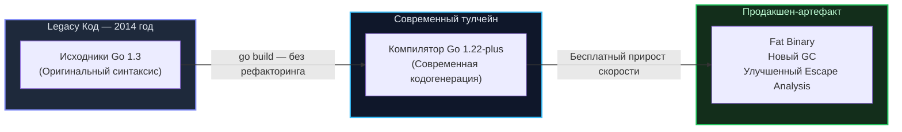

В мире промышленной разработки программного обеспечения существует хроническая боль, знакомая каждому инженеру на Python, Node.js, PHP и Java. Это миграция кодовой базы на новую мажорную версию платформы или фреймворка.

Переход индустрии с Python 2 на Python 3 растянулся более чем на десять мучительных лет и стоил мировому бизнесу сотен миллионов долларов на переписывание работающих систем. Радикальные переломы архитектуры (вспомните переход с Angular 1 на Angular 2 или несовместимости при смене мажорных версий Spring или Symfony) нередко парализуют продуктовые команды на недели из-за каскада ломающих изменений (`Breaking Changes`).

Когда разработчики приходят в Go, они сталкиваются с удивительным феноменом: проект, написанный восемь лет назад и заброшенный автором, можно склонировать с GitHub, набрать `go build` — и он скомпилируется с первого раза без единой ошибки и предупреждения.

В основе этой надежности лежит официальный архитектурный манифест — **«Go 1 Compatibility Promise» (Гарантия совместимости Go 1)**. Это не рекламный слоган, а строгий инженерный общественный договор, на котором держится доверие корпоративного мира к языку.

---

## Суть контракта совместимости

В 2012 году, выпуская в свет релиз Go 1.0, отцы-основатели языка — Кен Томпсон, Роб Пайк и Расс Кокс — зафиксировали фундаментальное обязательство перед индустрией:

> **Любая корректная программа, написанная в соответствии со спецификацией Go 1, обязана компилироваться и безупречно функционировать на протяжении всего жизненного цикла серии Go 1.x.**

Для системного архитектора и бэкенд-инженера этот манифест означает три ключевые гарантии:
1. **Синтаксическая неприкосновенность:** Ключевые слова языка не меняют своего значения, а синтаксические конструкции не удаляются.
2. **Вечный API стандартной библиотеки:** Если функция `http.Get()` из пакета `net/http` присутствовала в релизе 1.0, она останется доступна с абсолютно идентичной сигнатурой и в версии 1.30. Устаревшие методы могут сопровождаться аннотацией `// Deprecated:`, но компилятор никогда не откажется их собирать.
3. **Бесплатный прирост скорости (Free Performance Boost):** Вы можете взять исходники 2014 года, написанные под версию Go 1.3, и скомпилировать их современным тулчейном Go 1.22 или Go 1.24. Без правки единого символа исходного текста программа получит:
   * Неблокирующий масштабируемый Garbage Collector (`GC`);
   * Оптимизированный планировщик горутин `G-M-P`;
   * Улучшенный анализ побега памяти (`Escape Analysis`);
   * Использование современных векторных инструкций процессора.



---

## Под капотом: Как Go управляет изменениями (GODEBUG)

Но компьютерная индустрия развивается стремительно. Компилятору жизненно необходимо внедрять новые оптимизации и исправлять исторические недочеты дизайна. Как команде Go удается двигать язык вперед, не нарушая железной гарантии совместимости?

В современном Go (начиная с релиза Go 1.21) поведение тулчейна жестко синхронизировано с манифестом `go.mod`. Если в вашем файле `go.mod` зафиксирована директива `go 1.20`, а компиляцию вы проводите в окружении Go 1.23, компилятор **автоматически эмулирует стандарты версии 1.20** для данного проекта.

> [!info] Под капотом: Переменная среды GODEBUG
> Механизм гранулярной совместимости опирается на внутренние селекторы рантайма `GODEBUG`. 
> 
> Ярчайший пример — реформа переменной цикла в Go 1.22. Исторически переменная в цикле `for` разделялась между всеми итерациями, что порождало постоянные ловушки в горутинах и замыканиях. В Go 1.22 семантику исправили: переменная цикла теперь создается заново на каждом шаге итерации. Формально это `Breaking Change`! 
> 
> Однако если в вашем файле `go.mod` указана версия `1.21` или более ранняя, компилятор Go 1.22 автоматически активирует флаг `GODEBUG=loopvar=1`, транслируя цикл по прежним правилам. Ваш старый код продолжит работать без сюрпризов. Новая семантика вступит в силу только тогда, когда вы осознанно поднимете версию в `go.mod` до `go 1.22`.

Этот продуманный механизм обеспечивает плавную эволюцию: язык движется вперед, оставляя управление моментом перехода в руках инженера.

---

## Исключения: Что НЕ покрывается гарантией?

Обещание совместимости — это не индульгенция на написание неряшливого кода. Договор имеет строгие технические границы, выход за которые аннулирует гарантии.

### 1. Пакет unsafe
Пакет `unsafe` создан для прямого вмешательства в оперативную память в обход системы типов через адресную арифметику указателей. 

Внутреннее устройство структур рантайма — заголовков слайсов (`slice`), интерфейсов (`iface`) или хэш-таблиц (`hmap`) — не является публичным контрактом. Если программист вручную вычислил смещение байтов (`byte offsets`) внутри полей структуры `hmap`, его код неизбежно сломается при первой же оптимизации рантайма.

### 2. Баги и Недокументированное поведение
Если поведение программы опиралось на очевидную ошибку в реализации стандартной библиотеки (например, некорректную проверку цепочки сертификатов в пакете `crypto/tls`), устранение бага разработчиками Go не считается нарушением контракта. Безопасность и соответствие спецификациям протоколов всегда приоритетнее сохранения нештатного поведения.

### 3. Порядок итерации Map (Mechanical Sympathy in Action)

История порядка обхода мапы — хрестоматийный пример бескомпромиссности создателей Go в защите абстракций.

В самых первых версиях рантайма обход элементов хэш-таблицы происходил строго детерминированно — в порядке их физического размещения в бакетах памяти. Разработчики быстро привыкли к этому и начали неявно закладывать этот порядок в тесты и логику сериализации.

Однако спецификация языка однозначно утверждала: *«Порядок итерации по map не определен»*.

Чтобы инженеры не создавали хрупких архитектур, опирающихся на скрытые детали реализации, авторы Go пошли на радикальный шаг: они встроили в обход мапы **принудительную рандомизацию**. Теперь при каждом запуске цикла:
```go
for k, v := range myMap
```
рантайм генерирует случайный `seed` и начинает обход бакетов с псевдослучайного смещения.

> [!warning] Ловушка / Gotcha: Искусственный хаос
> Рандомизация обхода мап — это намеренный, спроектированный хаос. Создатели языка предпочли, чтобы скрытый дефект проявил себя сразу в локальных тестах разработчика, а не обрушил продакшен спустя годы при плановой смене алгоритма хэширования. Если бизнес-логика требует упорядоченного обхода, вы обязаны явно собрать ключи в слайс и вызвать стандартную сортировку.

---

## Стабильность как стратегическое преимущество

Консервативная политика Go приносит бизнесу огромные дивиденды:
* **Защита от «гниения» кода (Code Longevity / Bit Rot):** В микросервисных экосистемах десятки вспомогательных утилит могут надежно решать свои задачи годами. Инженерам не приходится тратить спринты на бесконечные правки зависимостей ради того, чтобы проект просто собрался.
* **Снижение когнитивного износа:** Знания о стандартной библиотеке и паттернах Go, приобретенные сегодня, сохранят свою актуальность и через десять лет.
* **Монолитное единство экосистемы:** Сообщество Go избавлено от разрушительных расколов (как в мире Python 2 и 3). Практически вся индустрия синхронно работает на актуальных версиях компилятора, не опасаясь поломок.

> [!tip] Собеседование
> **Вопрос:** В чем фундаментальное архитектурное отличие между обновлением мажорной версии языка на виртуальной машине (например, Java) и обновлением версии Go?
> **Ответ:** В мире Java обновление среды выполнения (`JRE`) на физическом сервере или базовом контейнере затрагивает все приложения, разделяющие данную виртуальную машину, требуя регрессионного тестирования всей инфраструктуры.  
> В Go бинарный файл полностью самодостаточен: он статически слинкован и несет в себе собственный изолированный рантайм. Вы можете обновить компилятор на машине разработчика или в CI-пайплайне, собрать бинарник и отправить его на сервер. Операционная система и окружение даже не заметят смены версии компилятора.

---

## Резюме

1. **Манифест Go 1 Compatibility Promise** гарантирует, что корректный код на Go продолжит компилироваться и работать на протяжении всего существования ветки Go 1.x.
2. **Бесплатный прирост скорости:** Старые программы автоматически ускоряются при сборке новыми компиляторами за счет совершенствования кодогенерации, GC и рантайма.
3. **Механизм GODEBUG:** Позволяет языку исправлять исторические недочеты (как в случае с переменной цикла в Go 1.22), сохраняя обратную совместимость для старых модулей через `go.mod`.
4. **Стабильность — осознанный выбор:** Отказ от постоянной ломки синтаксиса защищает бизнес от колоссальных потерь на рефакторинг.

Однако этот бескомпромиссный консерватизм имел и драматичную обратную сторону. Более десяти лет сообщество умоляло создателей добавить в язык обобщенное программирование (Generics). Создатели непреклонно отказывали, заявляя, что не добавят дженерики, пока не найдут решение, которое не замедлит компиляцию и не разрушит чистоту рантайма.

Как в итоге разрешилась эта великая дилемма в релизе Go 1.18? Читайте в следующей статье: [[28. Generics. Почему Go так долго жил без них]].
