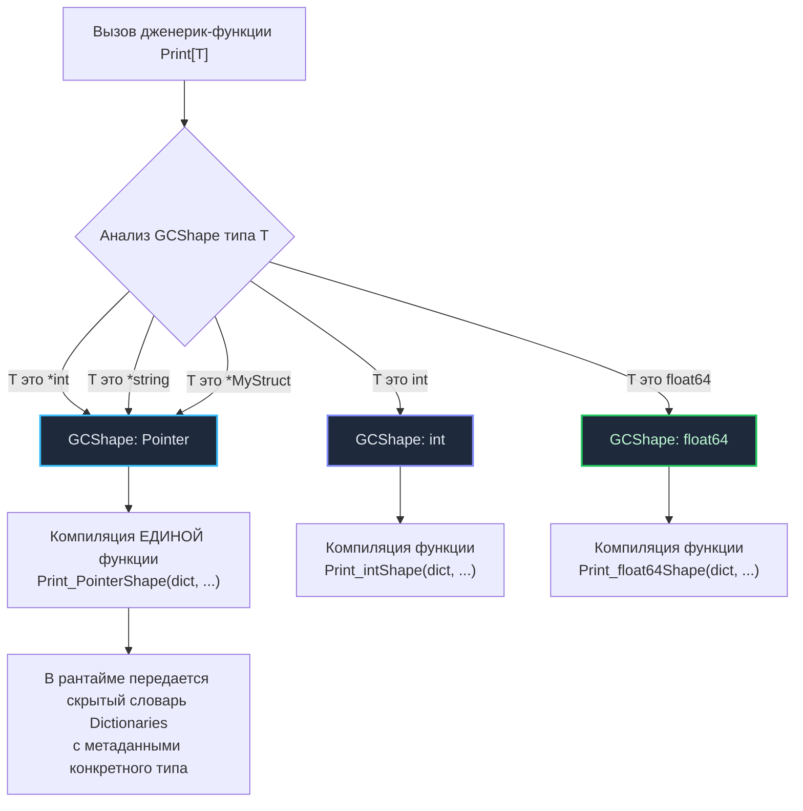

## Слон в комнате: Почему мы ждали 10 лет?

На протяжении целого десятилетия отсутствие обобщенного программирования (Generics) служило главным поводом для снисходительной критики Go со стороны инженеров на Java, C# и C++. На конференциях и форумах лейтмотивом звучал вопрос: *«Как в XXI веке можно всерьез писать бэкенд на языке без дженериков?»*. А в ответ от сообщества новички часто слышали резкое: *«Вам не нужны дженерики, используйте интерфейсы»*.

Но истина заключалась в том, что отцы-основатели языка — Роб Пайк, Кен Томпсон, Роберт Гризмер и Расс Кокс — никогда не выступали *принципиальными противниками* дженериков. Они были категорически против **неудачных, компромиссных реализаций** обобщенного программирования. 

Любая наивная попытка внедрить обобщения ломала базовые инженерные принципы Go (см. [[5. Философия Go. Простота, читаемость и прагматизм]]):
* Компиляция проекта обязана оставаться практически мгновенной;
* Исходный код должен читаться сверху вниз без расшифровки многоярусных метапрограммных нагромождений;
* Рантайм и исполняемый файл не должны раздуваться скрытыми накладными расходами.

Появление параметрического полиморфизма в релизе Go 1.18 в 2022 году стало самым масштабным и фундаментальным изменением в истории платформы. Чтобы оценить красоту инженерного решения, созданного командой Go, необходимо взглянуть на дилемму, с которой десятилетиями сталкивались авторы других компиляторов.

---

## Треугольник компромиссов Расса Кокса

Расс Кокс (Russ Cox), ведущий архитектор Go, в своей ставшей классической статье *«The Generic Dilemma»* наглядно доказал, что создание системы дженериков — это классический инженерный трилемма-треугольник. Разработчики компилятора могут гарантировать **только два из трех** фундаментальных свойств:

```
                  [1. Быстрая компиляция]
                            ▲
                           / \
                          /   \
                         /     \
   (Java: Стирание)    /       \   (Ранний Go / C)
                       /         \
                      /           \
                     /             \
[2. Простота кода / Дженерики] ◄─────► [3. Быстрое исполнение / CPU]
            (C++ / Rust: Мономорфизация)
```

1. **Быстрая скорость компиляции проекта;**
2. **Максимальная производительность машинного кода (Mechanical Sympathy);**
3. **Удобство программиста (отсутствие бойлерплейта и ручной кодогенерации).**

Посмотрим, какую жертву принесли другие популярные языки программирования.

### Подход C++ и Rust: Мономорфизация (Monomorphization)
* **Выбрано:** Быстрое исполнение + Удобство написания.  
* **Принесено в жертву:** Скорость компиляции.

В C++ (Templates) и Rust компилятор берет обобщенную функцию и клонирует ее машинный код для *каждого* конкретного типа, встреченного в программе. Если вы вызвали `Sort[int]` и `Sort[string]`, в результирующий бинарник запишутся две абсолютно независимые функции со своими машинными инструкциями.

* **Плюс:** Бескомпромиссная аппаратная производительность. Никаких динамических проверок в рантайме, прямой доступ к памяти, идеальная работа предсказателя переходов CPU.
* **Минус:** Катастрофическое замедление компиляции. Шаблоны парсятся и разворачиваются заново в каждом модуле, порождая чудовищное раздувание исполняемого файла (`Code Bloat`). Для создателей Go, бежавших от 45-минутных сборок в C++, такой путь был абсолютно исключен.

### Подход Java: Стирание типов (Type Erasure)
* **Выбрано:** Быстрая компиляция + Удобство написания.  
* **Принесено в жертву:** Производительность и память.

В Java дженерики существуют только в воображении компилятора. На этапе сборки типы `List<Integer>` и `List<String>` безжалостно стираются и превращаются в обычный список указателей на базовые объекты — `List<Object>`. Компилятор лишь автоматически расставляет невидимые приведения типов (`type casting`).

* **Плюс:** Компиляция остается быстрой, а бинарный байткод не разрастается, так как функция всегда представлена в единственном экземпляре.
* **Минус:** Тотальное разрушение механического сочувствия (`Mechanical Sympathy`). Примитивный тип `int` не может быть объектом. Чтобы поместить число в список, виртуальная машина обязана упаковать его в кучу (`Boxing`), создав ссылочный объект `Integer`. В итоге память дробится на миллионы мелких осколков, процессорные кэши L1/L2 захлебываются от промахов (Cache Misses) при хождении по ссылкам, а сборщик мусора тратит драгоценные миллисекунды на очистку оберток. Для высоконагруженного системного языка такой подход неприемлем.

### Подход C и раннего Go: Отказ от встроенных дженериков
* **Выбрано:** Быстрая компиляция + Быстрое исполнение.  
* **Принесено в жертву:** Удобство программиста.

Вплоть до версии Go 1.18 язык стоял на этой позиции. Если разработчику требовалась универсальная структура данных, у него было два пути:
1. Использовать пустой интерфейс `interface{}` (`any`), расплачиваясь потерей статической типизации и накладными расходами на распаковку в рантайме;
2. Написать генератор кода через `go generate`, вручную размножая файлы под нужные типы данных перед компиляцией.

---

## Как это реализовали в Go (GCShape Stenciling)

Команда Go потратила годы исследований, чтобы разрешить дилемму Расса Кокса и найти элегантный компромисс. Результатом стал оригинальный гибридный алгоритм — **GCShape Stenciling** (штамповка по форме для сборщика мусора) в сочетании со словарями типов (`Dictionaries`).

Вместо слепой генерации машинного кода под абсолютно каждый тип (как в C++) или тотального стирания всех типов в указатели (как в Java), компилятор Go классифицирует типы по их физическому представлению в оперативной памяти — по **GCShape**.

> [!info] Под капотом: Что такое GCShape?
> **GCShape** — это внутренняя абстракция компилятора Go, описывающая размер типа в байтах и битовую карту расположения в нем указателей, значимую для Garbage Collector.
> 
> Все указатели в Go (`*int`, `*string`, `*MyStruct`, каналы, мапы) на 64-битной архитектуре имеют строго одинаковый размер — 8 байт — и одинаково сканируются сборщиком мусора. Следовательно, все они разделяют **один и тот же GCShape**.  
> Базовые типы `int` и `float64` также имеют размер 8 байт, но не содержат адресов в памяти — компилятор присваивает им разные GCShape, оптимизируя регистровую передачу аргументов.

### Как работает компиляция дженериков:
1. **Штамповка (Stenciling):** Для каждого уникального `GCShape` компилятор генерирует *ровно один* экземпляр машинного кода функции.
2. **Словари типов (Dictionaries):** Поскольку один скомпилированный машинный блок обслуживает целое семейство типов (например, все указатели), функции необходимо точно знать, какой тип передан в нее в конкретном вызове (чтобы корректно вызвать метод или скопировать значение). Для этого компилятор неявно передает скрытым аргументом **указатель на словарь типа** (подобно таблице `itab` в интерфейсах).



**Что выиграл инженер?**
* **Нет раздувания бинарников (Code Bloat):** Сотни различных указательных типов делят один и тот же машинный код;
* **Никакого Boxing для примитивов:** Число `int` передается прямо в регистрах процессора и занимает 8 байт на стеке, `byte` занимает ровно 1 байт, не создавая мусора в куче;
* **Быстрая компиляция:** Время сборки проектов увеличилось всего на 10–15%, оставаясь в комфортных рамках мгновенного цикла обратной связи.

---

## Синтаксис и ограничения

Для поддержки обобщений Go ввел лаконичный синтаксис: параметры типов (`Type Parameters`) заключаются в квадратные скобки `[]`, а правила их применения задаются через ограничения (`Constraints`).

```go
// T - параметр типа. 
// any - это официальный алиас для интерфейса interface{}
func Reverse[T any](s []T) {
    for i, j := 0, len(s)-1; i < j; i, j = i+1, j-1 {
        s[i], s[j] = s[j], s[i]
    }
}
```

### Констрейнты (Ограничения)

В отличие от C++, где компилятор выявляет несоответствие типов только в момент генерации конкретного тела шаблона (вываливая километровые простыни непонятных ошибок линковки), в Go дженерик-функция обязана строго декларировать контракт ограничений через интерфейс:

```go
// Ограничение: T обязано быть типом, поддерживающим операции упорядочивания (<, >, <=, >=)
type Ordered interface {
    ~int | ~int8 | ~int16 | ~int32 | ~int64 |
    ~uint | ~uint8 | ~uint16 | ~uint32 | ~uint64 | ~uintptr |
    ~float32 | ~float64 |
    ~string
}

// Компилятор заранее проверяет, что к переменным типа T допустимо применить оператор <
func Min[T Ordered](a, b T) T {
    if a < b {
        return a
    }
    return b
}
```

*Специальный символ тильды `~` указывает компилятору: ограничению удовлетворяет не только встроенный тип `int`, но и любой пользовательский производный тип с базовым типом int (например, `type MyInt int`).*

---

## Когда НЕ нужно использовать дженерики

После выхода версии 1.18 многие программисты, соскучившись по энтерпрайз-шаблонам, принялись внедрять параметры типов во все структуры и функции подряд, грубо нарушая идиоматичный дух языка (см. [[6. Idiomatic Go. Что значит писать по-goшному]]).

> [!tip] Собеседование: Интерфейс или Дженерик?
> **Вопрос:** Как на архитектурном уровне определить, когда следует использовать интерфейсы, а когда — дженерики?
> **Ответ:** 
> * Если ваша цель — абстрагироваться от **поведения** (что объект умеет делать, какие методы вызывает бизнес-логика) — используйте **классические интерфейсы**.
> * Если ваша цель — абстрагироваться от **типа хранимых данных** (алгоритмы над коллекциями, контейнеры памяти) — используйте **дженерики**.

### Антипаттерн: Дженерик ради вызова метода

```go
// ПЛОХО: Использование дженерика там, где интерфейс решает задачу проще и быстрее
type Stringer interface {
    String() string
}

// Зачем здесь параметр типа T? Функция усложняется, а выигрыша в скорости нет
func PrintToString[T Stringer](item T) {
    fmt.Println(item.String())
}

// ХОРОШО: Чистый, идиоматичный интерфейс. Функция компилируется один раз
func PrintToString(item Stringer) {
    fmt.Println(item.String())
}
```

### Когда дженерики жизненно необходимы:
1. **Пользовательские структуры данных и контейнеры:** `Set[T]`, `Tree[T]`, потокобезопасная мапа `SyncMap[K, V]`.
2. **Функциональные утилиты для срезов и мап:** `Filter()`, `Map()`, `Reduce()`, извлечение ключей `Keys()`, значений `Values()`.
3. **Оркестрация конкурентных каналов:** `FanIn[T]`, `MergeChannels[T]`.

> [!warning] Ловушка / Gotcha
> Обобщенные параметры типов не могут добавляться к отдельным методам структур, если сам тип структуры не является обобщенным. 
> 
> Иными словами, в Go невозможно реализовать классический функциональный паттерн `Monad` с методом вида `Map<U>(f func(T) U) Monad<U>` непосредственно внутри структуры. Преобразование типов в Go оформляется как отдельная пакетная функция. Это осознанное ограничение архитекторов языка, предотвращающее появление запутанных иерархий типов и экспоненциальный рост времени сборки.

---

## Итог

1. Go обходился без обобщений десять лет, потому что создатели искали математически безупречное решение, не жертвующее скоростью компиляции и чистотой рантайма.
2. В Go нет медленного затирания типов `Type Erasure` (как в Java) и нет бездумного раздувания бинарников `Monomorphization` (как в C++). Вместо этого применен алгоритм **GCShape Stenciling**, группирующий типы по физической структуре в памяти и использующий словари метаданных.
3. Дженерики идеальны для контейнеров и структур данных (слайсы, очереди, деревья, множества).
4. Обычные маленькие интерфейсы остаются фундаментальным инструментом проектирования бизнес-логики и контрактов (как мы разбирали в лекции [[14. Интерфейсы в Go как альтернатива классическому ООП]]).

---

Многие разработчики, только пришедшие в Go, по инерции продолжают писать код на диалекте своего предыдущего языка, наступая на одни и те же архитектурные грабли. 

В следующей лекции мы соберем воедино все типичные ошибки и разберем главные антипаттерны бывших приверженцев классического ООП: [[29. Частые антипаттерны разработчиков, пришедших из ООП]].
