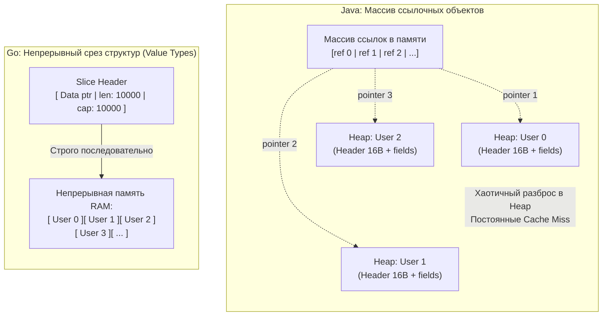
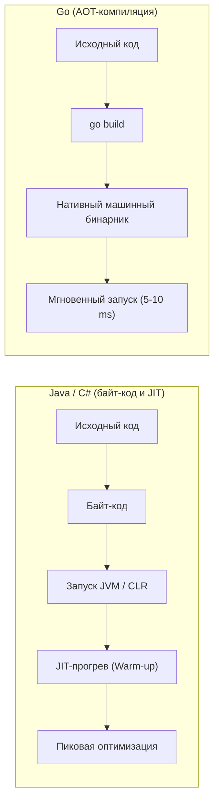

# Почему Go не похож на Java, C++ и C#

Когда опытный инженер, годами проектировавший системы на C++, Java или C#, впервые открывает проект на Go, его первой реакцией почти неизбежно становится когнитивный диссонанс. Рука машинально тянется к привычным инструментам: где ключевое слово class? Куда спрятали иерархию исключений и блок `try/catch`? Где конструкторы, шаблоны, перегрузка операторов и фабрики фабрик?

Нередко программист решает «исправить» язык: начинает выстраивать глубокие деревья интерфейсов, эмулирует наследование через структуры со встроенными указателями и оборачивает каждый вызов в `recover()`, отчаянно пытаясь восстановить знакомый с университетской скамьи уют Java или C#. 

Результат получается плачевным: код обрастает тоннами бойлерплейта, производительность падает, сборщик мусора задыхается, а коллеги хватаются за голову. Go часто поспешно клеймят «примитивным C с мусорщиком», упуская из виду главное: **Go спроектирован так не из-за лени авторов, а в результате глубокого переосмысления того, как современное железо взаимодействует с программным кодом**.

Бьярне Страуструп создавал C++ в Bell Labs буквально в соседнем крыле от Кена Томпсона и Роба Пайка. Джеймс Гослинг придумывал Java, решая проблемы переносимости кода девяностых годов. Создатели Go прекрасно знали достоинства и родовые травмы этих систем. Go появился как трезвый, прагматичный компромисс между бескомпромиссной аппаратной эффективностью C/C++ и безопасностью высокоуровневых enterprise-языков.

Давайте разберем фундаментальные инженерные различия, которые делают Go совершенно иной вычислительной экосистемой.

---

## 1. Представление данных: Mechanical Sympathy и кэш-линии

Главный концептуальный водораздел между Go и классическими объектно-ориентированными платформами (Java и традиционный C# до появления современных `struct` в .NET) лежит в плоскости управления памятью: **как именно байты располагаются в физических ячейках RAM**.

В классической Java практически любая сущность, сложнее примитивных чисел, является ссылочным объектом. Представьте, что вы создаете массив из 10 000 учетных записей `User`:

```java
// Java
User[] users = new User[10_000];
for (int i = 0; i < users.length; i++) {
    users[i] = new User("User" + i, i);
}
```

Что произошло в памяти компьютера?
Вы выделили непрерывный массив... из 10 000 **указателей** (ссылок)! А сами 10 000 объектов `User` аллоцированы в куче (Heap). Они создавались в разные моменты времени и физически разбросаны по адресному пространству памяти как крупа по столу.

Для современного микропроцессора такой массив — сущий кошмар. Когда процессор выполняет цикл по этому массиву, он вынужден прыгать по случайным адресам памяти:
1. Загрузить адрес из массива ссылок.
2. Обратиться по этому адресу в кучу — **Cache Miss** (промах кэша L1/L2). Конвейер ядра CPU замирает на 100–200 тактов в ожидании данных из медленной RAM.
3. Прочитать поля `User`, затем повторить операцию для следующего элемента.

В Go структуры (`struct`) по умолчанию являются **типами-значениями (Value Types)**. Когда вы создаете массив или срез `[]User` из 10 000 пользователей:

```go
// Go
users := make([]User, 10_000)
```

Среда выполнения аллоцирует **один непрерывный блок памяти**. Все 10 000 структур `User` уложены в памяти строго вплотную друг к другу, без единого указателя и без фрагментации.



> [!info] Под капотом: Аппаратный Prefetcher
> Современные CPU оснащены механизмом Prefetcher. Он непрерывно анализирует паттерны чтения памяти. Если он видит, что вы читаете непрерывный блок памяти (как в Go), он автоматически и упреждающе вытягивает следующие кэш-линии (порциями по 64 байта) из оперативной памяти прямо в быстрый кэш первого уровня L1 еще до того, как ваш код их запросит.
>
> Простой линейный обход `[]User` в Go будет в десятки раз быстрее, чем обход массива ссылок в Java, исключительно благодаря Mechanical Sympathy к архитектуре процессорного кэша.

---

## 2. Escape Analysis вместо поколенческого Garbage Collector

Java и C# используют сложный поколенческий сборщик мусора (Generational GC с делением памяти на пространства `Eden`, `Survivor` и `Old`). Почему? Потому что в этих языках большинство объектов аллоцируется в куче (Heap), живут считанные микросекунды и быстро становятся мусором. Чтобы эффективно чистить эти гигантские объемы, нужна тяжелая эвристика.

Go использует принципиально иной подход — **Escape Analysis (Анализ утечек)**.

На этапе компиляции Go определяет, переживет ли переменная функцию, в которой была создана. Если переменная не «утекает» (например, вы не возвращаете указатель на нее и не отправляете в канал), компилятор аллоцирует её **на стеке горутины**, а не в куче.

Очистка стека происходит мгновенно при возврате из функции: указатель стека просто сдвигается обратно. Это абсолютно бесплатно с точки зрения CPU и не создает никакой нагрузки на GC.

В результате в кучу (Heap) в Go попадают только действительно долгоживущие объекты. По этой причине сборщику мусора Go не нужны поколения и уплотнение памяти. В Go реализован высокоэффективный **Concurrent Mark-and-Sweep GC**, работающий параллельно с горутинами. Его ключевая цель — не максимальная пакетная пропускная способность, как у G1 в Java, а **минимальные предсказуемые задержки** (Low Latency / Stop-The-World < 1 мс).

```
Аллокация в Java (Heap-first):
[ new Object() ] ─────────► [ Куча: Eden ] ──► [ Survivor ] ──► [ Old ] ──► [ Тяжелый GC ]

Аллокация в Go (Stack-first via Escape Analysis):
[ Создание структуры ] ───► [ Escape Analysis? ]
                                   │
                 ┌─────────────────┴─────────────────┐
                 ▼ (Не утекает)                      ▼ (Утекает наружу)
           [ Стек горутины ]                   [ Куча (Heap) ]
           (0 ns, сдвиг RSP,                   (Параллельный Concurrent
            мгновенный возврат)                 Mark-and-Sweep, STW < 1 ms)
```

> [!warning] Ловушка / Gotcha: Миф о том, что указатели быстрее
> Приходя из C/C++, разработчики часто пишут функции вида `func process(u *User)` и повсеместно передают указатель, чтобы «сэкономить на копировании» структуры.
>
> В Go это часто дает **обратный эффект**. Передача указателя может заставить компилятор аллоцировать `User` в куче (Escape Analysis решит, что указатель может уйти за пределы области видимости). Нагрузка на GC возрастет. Зачастую передать по значению (скопировать 30-50 байт структуры в регистрах или на стеке) намного быстрее, чем напрягать Heap и GC.

---

## 3. Компиляция: AOT против JIT

Подход к трансляции и исполнению кода определяет поведение серверных сервисов:

* **Java и C#** компилируются в промежуточный байт-код. При запуске программы виртуальная машина (JVM / CLR) использует **JIT-компилятор (Just-In-Time)**, который собирает статистику работы (profiling) и оптимизирует машинный код на лету. Это дает феноменальную пиковую производительность на длинной дистанции, но требует ощутимого времени на «прогрев» (Warm-up) и потребляет сотни мегабайт RAM под саму виртуальную машину.
* **Go (и C++)** используют чистую **AOT-компиляцию (Ahead-Of-Time)**. Исходный код сразу транслируется в нативные инструкции целевого процессора.



**Следствия для бэкенда и облачной инфраструктуры:**
Go-приложения стартуют за единицы миллисекунд и практически не требуют оперативной памяти на старте. Это делает Go идеальным выбором для Kubernetes, микросервисов и бессерверных сред (Serverless, AWS Lambda), где контейнеры могут динамически масштабироваться, убиваться и подниматься сотни раз в минуту. Сервису не нужно ждать десятки секунд, пока JVM «прогреется» под синтетическим трафиком.

Однако в долгоживущих числодробилках хорошо прогретая Java (благодаря JIT-оптимизациям рантайма вроде агрессивной перестановки циклов) может в отдельных сценариях обойти Go по скорости. Go осознанно жертвует предельной экстремальной оптимизацией ради моментального старта, низкого потребления ресурсов и железной предсказуемости.

---

## 4. Отсутствие VTable и "Чистые" структуры

В классических C++ и Java любой класс, имеющий хотя бы один виртуальный метод, несет в себе скрытые накладные расходы:
* Объект неявно содержит указатель `vptr` на таблицу виртуальных функций `vtable`.
* В Java каждый экземпляр содержит служебный заголовок (**Object Header**) размером 12–16 байт (для блокировок, синхронизации и метаданных сборщика мусора). Пустой объект в Java физически занимает 16 байт памяти.

В Go **данные принципиально отделены от поведения**.

Структура `struct` в Go — это просто честный блок памяти. У неё нет никаких скрытых служебных полей, указателей на классы или заголовков. Пустая структура `struct{}` занимает **ровно 0 байт памяти**!

```go
var empty struct{}
fmt.Println(unsafe.Sizeof(empty)) // Выведет: 0
```

Полиморфизм в Go возникает **только тогда**, когда вы явно присваиваете структуру переменной типа `interface`. Только в этот момент рантайм Go создает под капотом легковесную структуру `iface`, содержащую ровно два указателя:
1. `data`: указатель на сами данные (или копию структуры).
2. `tab`: указатель на `itab` (служебную таблицу, связывающую конкретный тип с интерфейсом и содержащую адреса скомпилированных методов).

Это означает, что программист платит за полиморфизм и динамическую диспетчеризацию только тогда, когда явно запрашивает интерфейс, а не для каждой структуры по умолчанию.

```
Структура iface (16 байт на x86-64):
┌───────────────────────────────┐
│ tab  *itab                    │ ────► [*itab: тип интерфейса + конкретный тип + таблица методов]
├───────────────────────────────┤
│ data unsafe.Pointer           │ ────► [Непосредственные данные структуры User]
└───────────────────────────────┘
```

> [!tip] Собеседование
> **Вопрос:** В чем разница между реализацией интерфейсов в Java/C# и Go?
>
> **Ответ:** В Java интерфейсы реализуются **явно** (explicit) через ключевое слово `implements`. Класс жестко привязан к интерфейсу на этапе компиляции.
>
> В Go реализована **структурная типизация (Duck Typing)** — интерфейсы реализуются **неявно** (implicit). Если у структуры объявлены все методы, требуемые интерфейсом, она автоматически удовлетворяет ему без явных директив. Это развязывает зависимости: вызывающий пакет может сам объявить компактный интерфейс с 1–2 методами под свои нужды и принимать структуры из сторонних библиотек, чьи авторы даже не подозревали о существовании этого интерфейса.

---

## 5. Философия "Явное лучше неявного"

В C++ программист может перегрузить оператор сложения: безобидное `a + b` способно под капотом отправлять HTTP-запрос или блокировать поток.
В C# есть механизм `Property`, где банальное чтение `user.Name` способно запустить скрытый сетевой вызов или тяжелый SQL-запрос.
В Java повсеместно применяются аннотации (`@Transactional`, `@Autowired`), где тяжелая рефлексия и динамические прокси-обертки модифицируют поведение программы прямо в рантайме.

**В Go скрытая магия запрещена самим дизайном языка:**
* **Нет перегрузки операторов:** знак `+` всегда означает арифметическое сложение или конкатенацию. Никаких скрытых сайд-эффектов.
* **Нет неявных свойств (properties):** чтение поля структуры — это всегда прямое чтение ячейки памяти. Если за получением значения стоит логика, пишется явный метод вроде `GetName()`.
* **Нет исключений (Exceptions), нарушающих Control Flow:** В Java исключение может внезапно вылететь из любой строки и пробить десятки уровней стека. В Go ошибки — это обычные значения, возвращаемые последним аргументом, которые программист обрабатывает явно по месту возникновения (подробный разбор архитектуры ошибок ждет нас в статье [[9. Errors Are Values. Почему в Go нет исключений]]).
* **Ограниченное применение рефлексии:** Пакет `reflect` используется точечно (например, в сериализации `encoding/json`), а в прикладной бизнес-логике считается антипаттерном.

---

## Итог: смена парадигмы

Когда вы пишете на Go, необходимо отбросить мышление категориями «иерархия классов», «фабрики» и «сокрытие состояния за слоями абстракций».

Вместо этого инженер на Go мыслит категориями реальной физической машины:
* **Как данные расположены в памяти?** (Непрерывный срез или указатели? Будет ли работать Prefetcher кэш-линий?)
* **Куда пойдет аллокация?** (Стек или куча? Отработает ли Escape Analysis?)
* **Кто владеет данными и как они передаются между горутинами?** (Копирование по значению или канал?)

В Java и C# язык и виртуальная машина прячут от вас аппаратную архитектуру за толстыми слоями виртуализации. В Go язык предоставляет мощные высокоуровневые инструменты (горутины, каналы, интерфейсы), но намеренно оставляет вас лицом к лицу с аппаратурой, позволяя выжимать из современного процессора максимум возможного.

Эта прагматичность и прозрачность пронизывают каждую строчку стандартной библиотеки. В следующей лекции мы детально исследуем саму идеологию языка: [[5. Философия Go. Простота, читаемость и прагматизм]].
