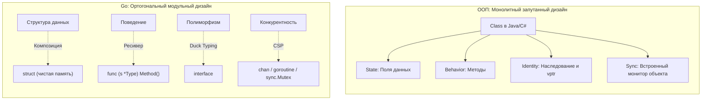

# The Zen of Go и официальные принципы языка

Если язык программирования — это прецизионный станок, то его философия — это фундаментальная инструкция по технике безопасности и руководство по расчету нагрузок. 

Многие инженеры знакомы со знаменитым манифестом Тима Петерса «The Zen of Python» — лаконичным набором из 19 афоризмов, определивших дух языка Python. В сообществе Go долгое время не было единого канонического документа, пока в 2020 году Дэйв Чейни (Dave Cheney), один из ключевых контрибьюторов и мыслителей экосистемы Go, не сформулировал доклад и манифест **«The Zen of Go»**. Он кристаллизовал три десятилетия опыта Кена Томпсона, Роба Пайка, Расса Кокса и сотен инженеров Bell Labs и Google в стройную систему ориентиров.

В этой статье мы подробно разберем ключевые постулаты «Дзена Go» и официальные архитектурные принципы языка сквозь призму системного программирования и рантайма.

---

## 1. Ортогональность (Orthogonality)

В геометрии два вектора ортогональны, если угол между ними равен 90 градусам: движение вдоль одного вектора никак не меняет координату по другому. В компьютерных науках **ортогональность означает независимость концепций**. Архитектурные возможности языка не должны спутываться в неделимый клубок — они обязаны свободно комбинироваться друг с другом без взаимных скрытых ограничений.

В классических объектно-ориентированных языках (Java, C++) класс является монолитным «швейцарским ножом». Класс одновременно берет на себя:
1. **Состояние данных:** набор полей в памяти.
2. **Поведение:** методы экземпляра.
3. **Инкапсуляцию:** модификаторы доступа `public`, `private`, `protected`.
4. **Иерархию и полиморфизм:** наследование, абстрактные классы и таблицы виртуальных функций.
5. **Синхронизацию:** например, в Java абсолютно каждый объект `Object` несет в своем заголовке скрытый монитор для поддержки директивы `synchronized`!

В Go все эти механизмы принципиально **ортогональны и изолированы**:
* **Данные:** чистые структуры (`struct`). Это просто байты в памяти, без скрытых заголовков.
* **Поведение:** методы, являющиеся обычными функциями со специальным аргументом-ресивером.
* **Инкапсуляция:** реализована исключительно на уровне пакетов (Packages) через регистр первой буквы идентификатора, а не внутри структур.
* **Полиморфизм:** структурные интерфейсы (`interface`), которые реализуются неявно.
* **Конкурентность:** независимые горутины и каналы (`goroutine` / `chan`), либо низкоуровневые мьютексы (`sync.Mutex`), когда требуется синхронизация разделяемой памяти.



> [!info] Под капотом: Отсутствие скрытых расходов
> Ортогональность Go дает прямое преимущество на уровне физического кремния (Mechanical Sympathy). 
> 
> Если вам нужна простая структура данных для передачи сообщения по сети (DTO), вы платите ровно за объем полезных полей. В ней нет скрытых указателей `vptr` для виртуальных таблиц методов и нет раздутых заголовков объектов (`Object Headers`), резервирующих по 12–16 байт на каждый экземпляр в куче JVM. 
> 
> Данные в Go упакованы плотно, что позволяет процессору загружать их в кэш-линии L1/L2 без расхода драгоценной пропускной способности шины памяти на служебный мусор.

---

## 2. Каждый пакет решает ровно одну задачу (Single Purpose Package)

В традиционных языках пакеты и пространства имен (Namespaces) нередко служат лишь формальными «папками на диске», куда сваливают сотни разнородных файлов. В проектах на Java или C# повсеместно встречаются пакеты вроде `com.company.utils` или `app.common`.

В Go **директория — это и есть неделимый пакет (Package)**. Пакет представляет собой базовую атомарную единицу компиляции, и он обязан решать ровно одну четкую инженерную задачу.

* **Антипаттерн:** пакет `utils`. Что именно делает этот пакет? Форматирует даты? Валидирует email? Делает HTTP-запросы? Пакеты-«помойки» нарушают закон локальности рассуждений и неизбежно провоцируют циклические зависимости (import cycles), которые компилятор Go принципиально запрещает компилировать.
* **Идиоматичный подход:** пакеты со строгой семантикой. Например, `httputil`, `jsonparser`, `postgres`.

Пакет в Go является границей инкапсуляции. Любой идентификатор с заглавной буквы экспортируется наружу, со строчной — остается приватной деталью реализации. Это вынуждает проектировщика относиться к каждому пакету как к независимому микромодулю со строгим публичным API (глубже эта тема раскрыта в статье [[22. Пакеты и структура проекта как часть философии Go]]).

---

## 3. Прежде чем запустить горутину, знай, как она остановится

Если бы из всех заповедей «The Zen of Go» для бэкенд-разработки требовалось выбрать одно фундаментальное правило, это было бы правило контроля жизненного цикла конкурентных задач.

Запустить горутину обманчиво просто: достаточно написать `go doWork()`. Из-за этой синтаксической легкости начинающие инженеры порождают горутины бесконтрольно. Но в рантайме Go **нет механизма внешнего принудительного уничтожения горутины** (в отличие от `pthread_cancel` или прерывания потоков в ОС). Горутина может завершиться только самостоятельно — вернув управление из своей корневой функции.

> [!warning] Ловушка / Gotcha: Утечка горутин (Goroutine Leak)
> Если горутина уснула на чтении из канала, в который больше никто никогда не запишет данные, или зависла на сетевом вызове без выставленного таймаута — она остается в памяти навсегда.
> 
> Утечка горутин значительно опаснее обычной утечки памяти. Зависшая горутина удерживает свой непрерывный стек (от 2 КБ до гигабайт при глубокой рекурсии). Хуже того: она держит в живых все объекты кучи, на которые ссылаются ее локальные переменные. Garbage Collector считает горутину активным корнем трассировки (GC Root) и **не имеет права удалить эту память**. Утечка всего нескольких тысяч фоновых воркеров способна вызвать Out Of Memory (OOM) и уронить весь под сервиса в Kubernetes.

### Идиоматичный контроль через `context.Context`
Жизненный цикл любой асинхронной задачи должен быть явно привязан к отмене по контексту или закрытию канала встроенной функцией `close`:

```go
func Worker(ctx context.Context, ch <-chan Task) {
    for {
        select {
        case task, ok := <-ch:
            if !ok {
                // Канал закрыт продюсером — корректно выходим
                return
            }
            process(task)
        case <-ctx.Done():
            // Вызывающий код отменил операцию или сработал таймаут
            return 
        }
    }
}
```

---

## 4. Оставь конкурентность вызывающему (Leave concurrency to the caller)

Хороший, долговечный API в Go по умолчанию всегда **синхронен**.

Представьте, что вы создаете клиент для хранилища данных Redis. Ваша функция получения значения по ключу `Get(key string)` должна выполнить сетевой ввод-вывод и вернуть значение либо ошибку. Она **не должна** самовольно создавать фоновые горутины, возвращать каналы с будущим результатом или прятать пул потоков под капотом.

Если пользователю вашей библиотеки потребуется выполнить 100 запросов к Redis параллельно, он решит эту задачу сам с помощью высокоуровневых инструментов: пакета `errgroup`, семафоров на каналах или ограниченного пула горутин. Предоставляя синхронный API, вы оставляете вызывающей стороне полный контроль над планированием CPU, аллокациями памяти и политикой обработки ошибок.

---

## 5. Избегай состояния на уровне пакета (Avoid package level state)

Глобальные переменные в любом языке программирования усложняют понимание кода, но в Go с его нативной многопоточностью они становятся источником критических аварий:

```go
// Антипаттерн: глобальное состояние пакета
var db *sql.DB

func InitDB() {
    db, _ = sql.Open("postgres", "...")
}

func GetUser() {
    db.Query(...) // Скрытая неявная зависимость от глобальной переменной
}
```

Почему этот подход категорически отвергается «Дзеном Go»:
1. **Крах параллельного тестирования:** Вы не сможете безопасно запустить параллельные тесты через команду `go test -race -parallel`, потому что независимые тесты будут одновременно мутировать одно и то же глобальное соединение `db`.
2. **Гонки данных (Data Races):** Любая несогласованная модификация глобального объекта из параллельных горутин приводит к неопределенному поведению и падению процесса. Попытка защитить переменную с помощью `sync.Mutex` мгновенно превращает ее в узкое место (Bottleneck), где сотни потоков будут простаивать в борьбе за блокировку.

**Идиоматичное решение:** Явное внедрение зависимостей (Dependency Injection) через поля структуры.

```go
type UserRepository struct {
    db *sql.DB // Явная, изолированная зависимость
}

func NewUserRepository(db *sql.DB) *UserRepository {
    return &UserRepository{db: db}
}
```

Каждый экземпляр `UserRepository` изолирован, не имеет побочных эффектов и тривиально покрывается параллельными модульными тестами.

---

## 6. Хороший API сложно использовать неправильно

В старых языках сигнатуры функций часто пестрят загадочными логическими флагами:

```go
// Плохой дизайн: что означает boolean-флаг при вызове?
func SaveUser(u *User, isNew bool)

// Вызов в коде:
SaveUser(user, true) // Читатель обязан открывать документацию, чтобы понять true
```

Идиоматичный Go требует, чтобы публичные контракты были самодокументируемыми и защищали программиста на уровне синтаксиса компилятора.

Вместо неоднозначных флагов типа `bool` создаются две выразительные функции с понятным контрактом:
* `CreateUser(u)`
* `UpdateUser(u)`

Если операция может завершиться неудачей, сигнатура обязана явно возвращать пару `(Result, error)`. Разработчик не может «забыть» о возможной аварии: компилятор потребует либо принять переменную ошибки, либо осознанно отбросить её через пустой идентификатор `_`.

> [!tip] Собеседование
> **Вопрос:** В чем разница между `Simple` (простым) и `Familiar` (привычным) кодом в контексте философии Go?
>
> **Ответ:** 
> Понятие *Familiar* субъективно и зависит от привычек разработчика. Для инженера с десятилетним опытом в Spring Framework использование магии аннотаций, динамических прокси и автоматического внедрения зависимостей кажется предельно «привычным» (familiar). Однако этот механизм не является «простым» (simple) — он крайне сложен, скрыт и подвержен трудноуловимым ошибкам рантайма.
> 
> В Go выбор всегда делается в пользу *Simple*: прозрачная ручная инициализация структур `a := NewA(b, c)`. Этот код может показаться непривычным новичкам из enterprise-стека и потребовать нескольких дополнительных строк, но он является простым (simple), поскольку поток выполнения линейно прослеживается компилятором, человеком и профилировщиком.

---

## Итог

Манифест «The Zen of Go» подводит единый фундамент под культуру разработки:
* **Ортогональность:** фичи языка комбинируются, а не переплетаются.
* **Управляемость конкурентности:** каждая горутина имеет строгий контракт завершения.
* **Локальность состояния:** отсутствие глобальных переменных гарантирует безопасность параллельного исполнения.
* **Синхронные контракты:** управление ресурсами делегируется вызывающей стороне.

Для повседневного закрепления этих архитектурных ориентиров Роб Пайк сформулировал знаменитые афоризмы, ставшие фольклором современной индустрии. Мы детально разберем их смысл и инженерную подоплеку в следующей лекции: [[8. Go Proverbs. Практический смысл известных цитат]].
