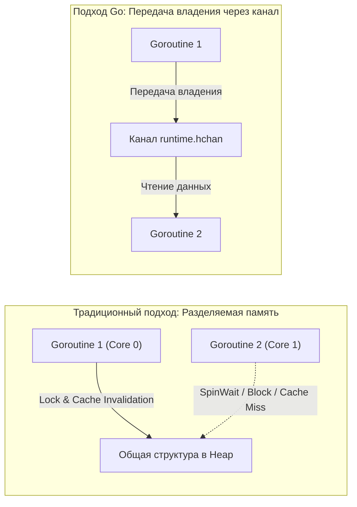

# Go Proverbs. Практический смысл известных цитат

В 2015 году на конференции Gopherfest один из отцов-основателей языка Роб Пайк (Rob Pike) представил доклад, состоящий из 19 лаконичных афоризмов, которые сообщество с благоговением назвало **«Go Proverbs» (Пословицы Go)**. Проиллюстрированные художницей Рене Френч (автором культового синего суслика-маскота), эти фразы мгновенно разошлись по презентациям, статьям и футболкам инженеров по всему миру.

Однако для зрелого системного инженера пословицы Go — это вовсе не легкомысленный фольклор. Каждое из этих утверждений представляет собой квинтэссенцию полувекового опыта Bell Labs и Google, оплаченного годами борьбы с авариями распределенных систем. За каждым афоризмом стоит суровая физика кремния: протоколы когерентности кэшей CPU, предсказатели переходов, конвейеры инструкций и архитектура планировщика рантайма.

Давайте разберем ключевые пословицы через призму низкоуровневого устройства языка и «механического сочувствия» (Mechanical Sympathy).

---

## 1. Don't communicate by sharing memory, share memory by communicating
*(Не общайтесь, разделяя память; разделяйте память, общаясь)*

Это краеугольный камень, определяющий подход Go к конкурентному программированию.

В классических средах (C++, Java, C#) потоки общаются друг с другом через общие ячейки оперативной памяти. Чтобы защитить общие данные от одновременной записи (Data Races), инженеры вынуждены расставлять защитные барьеры: мьютексы (`Mutex`), семафоры или мониторы (`Monitor`).

### Проблема общей памяти на уровне физического кремния
Когда несколько ядер процессора (CPU Cores) в высоконагруженном сервисе пытаются одновременно захватить один и тот же мьютекс, в шине межъядерного взаимодействия разыгрывается шторм:
* **Cache Line Bouncing:** Ячейка памяти мьютекса лежит внутри 64-байтной кэш-линии. Как только Ядро 0 модифицирует мьютекс через инструкцию `LOCK CMPXCHG`, аппаратный протокол когерентности кэшей (MESI/MOESI) отправляет сигнал инвалидации всем остальным ядрам CPU.
* Ядра 1, 2 и 3 мгновенно теряют свои копии кэш-линии L1/L2. Конвейеры процессоров замирают на десятки наносекунд в ожидании пересылки обновленной строки через медленный общий L3-кэш или шину UPI/Infinity Fabric. Возникают паразитные эффекты ложного разделения ресурсов (False Sharing).

### Решение Go: Передача владения через каналы
Вместо того чтобы горутины толпились вокруг одной мутабельной структуры в памяти, одна горутина **передает исключительное право владения данными** другой горутине через типизированный канал (`chan`).



> [!info] Под капотом: Очереди каналов
> Канал в Go — это не магическая конструкция языка, а структура `hchan` внутри рантайма. Она состоит из кольцевого буфера (ring buffer), защищенного локальным спинлоком, и двух списков ожидания (wait queues) для читателей и писателей (`sudog`).
>
> Когда горутина пытается прочитать данные из пустого канала, рантайм вызывает внутреннюю функцию `gopark`. Горутина переводится в статус `waiting` и засыпает. Освободившийся тред операционной системы (тред `M`) мгновенно забирает другую готовую горутину из очереди планировщика `P`. Процессор ни секунды не крутится в пустом цикле, а передача владения происходит абсолютно прозрачно в User Space без тяжелых системных вызовов ядра ОС.

(Подробно механику и сценарии применения каналов мы разберем в статье [[25. Share Memory By Communicating. Почему каналы важнее Mutex]]).

---

## 2. Concurrency is not parallelism
*(Конкурентность — это не параллелизм)*

Эту фразу начинающие разработчики путают чаще всего, считая их синонимами:

* **Параллелизм (Parallelism)** — это свойство **аппаратного обеспечения (Hardware)**. Это физическое одновременное исполнение нескольких вычислений в один и тот же такт времени на разных вычислительных ядрах процессора.
* **Конкурентность (Concurrency)** — это свойство **архитектуры программы (Software Design)**. Это декомпозиция сложной системы на независимые, ортогональные процессы, которые *могут* исполняться параллельно, но не обязаны.

Роб Пайк иллюстрировал это знаменитой метафорой: представьте команду сусликов-работников, которые сжигают старые книги в мусоросжигательной печи. Конкурентное проектирование — это организация работы: один суслик складывает книги в тележку, второй везет тележку к печи, третий загружает печь лопатой. Вы можете выполнять эту работу силами одного-единственного суслика (одно ядро CPU), который попеременно меняет роли. 

Если же у вас появится 4 суслика (4 ядра CPU) — ваша конкурентная программа **автоматически превратится в параллельную** без переписывания единой строчки кода!

Go спроектирован именно для создания ясных *конкурентных* структур. Код сервиса на горутинах будет идеально работать и в миниатюрном облачном инстансе с 1 виртуальным ядром (планировщик будет быстро мультиплексировать горутины по квантам времени в 10 мс), и на сервере с 128 ядрами AMD EPYC, раскрывая чистый параллелизм.

(Философский фундамент этой модели мы раскроем в статье [[24. Concurrency Is Not Parallelism. Философия конкурентности в Go]]).

---

## 3. A little copying is better than a little dependency
*(Небольшое копирование лучше небольшой зависимости)*

В марте 2016 года мир веб-разработки потрясла катастрофа: автор удалил из реестра npm крошечный пакет `left-pad`, состоявший из 11 строк тривиального кода для дополнения строк пробелами. В результате обрушились сборки миллионов проектов по всей планете, включая сборку ядра React и Babel.

Экосистема Go изначально строилась с глубоким недоверием к микрозависимостям. В Go компилятор собирает единый автономный статический бинарник. Каждый внешний модуль в директиве `import`:
1. Раздувает дерево зависимостей в файле `go.mod`.
2. Увеличивает вероятность конфликта транзитивных версий.
3. Открывает вектор атак на цепочку поставок (Supply Chain Attacks).
4. Замедляет компиляцию и усложняет аудит безопасности.

> [!tip] Собеседование
> **Вопрос:** В распределенной архитектуре Микросервис А публикует события с данными пользователя `UserDTO`. Микросервису Б нужно слушать эти события из очереди Kafka. Стоит ли вынести `UserDTO` в общий разделяемый репозиторий `shared-models` и подключить его зависимостью в оба сервиса?
>
> **Ответ:** 
> Согласно пословицам Go — **категорически нет**. 
> 
> Создание библиотеки `shared-models` немедленно создает жесткое зацепление (Tight Coupling) независимых сервисов: любое изменение типа в сервисе А потребует синхронного обновления версий во всех потребителях, приводя к «версионному аду» (Dependency Hell). 
> 
> Идиоматичный подход Go — **скопировать** компактную структуру `UserDTO` в кодовую базу сервиса Б, оставив в ней только те поля, которые действительно требуются сервису Б. Пусть каждый сервис сохраняет автономность. «A little copying is better than a little dependency».

---

## 4. Make the zero value useful
*(Делайте нулевое значение полезным)*

Когда рантайм Go выделяет память под новую переменную или структуру, он гарантированно заполняет все байты нулями. В зависимости от типа поля принимают дефолтные значения: числовой `0`, логический `false`, пустой указатель `nil`, пустая строка `""`.

Выдающийся API в Go проектируется так, чтобы структура в своем нулевом состоянии **была полностью валидна и готова к немедленной работе** без необходимости вызова инициализирующих конструкторов вида `New...()`.

Эталонный пример из стандартной библиотеки Go — `sync.WaitGroup`:

```go
func processItems(items []string) {
    var wg sync.WaitGroup // Выделяется на стеке, поля обнулены

    for _, item := range items {
        wg.Add(1) // Сразу работает, никакого NewWaitGroup()!
        go func(val string) {
            defer wg.Done()
            doWork(val)
        }(item)
    }

    wg.Wait()
}
```

> [!info] Под капотом: Быстрая инициализация памяти
> Когда ядро ОС выделяет страницу физической памяти для пользовательского процесса, оно обязано очистить ее нулями из соображений безопасности (иначе процесс мог бы прочитать остаточные секретные данные предыдущего владельца страницы памяти).
> 
> Внутри рантайма Go за мгновенное обнуление стековой памяти отвечает функция `memclrNoHeapPointers`, написанная вручную на чистом ассемблере с использованием векторных инструкций SIMD (AVX2/AVX-512). Она заливает нулями сотни байт за единицы тактов CPU. Поскольку аппаратура и рантайм все равно бесплатно обнуляют память, дизайн структур обязан извлекать из этого максимальную выгоду (см. [[20. Zero Value как часть дизайна языка]]).

---

## 5. Clear is better than clever
*(Понятное лучше заумного)*

Среди начинающих программистов нередко живет желание блеснуть эрудицией: свернуть алгоритм в нечитаемый однострочник с побитовыми фокусами или построить динамический маппинг структур через рантайм-рефлексию пакетов `reflect` и `unsafe`.

В сообществе Go «умный» (clever) код является прямым признаком плохого тона. На код-ревью заумный однострочник гарантированно попросят развернуть в понятный цикл `for` с явным условием `if`.

**Почему «clever» код вреден для продакшена:**
1. **Он слепит Escape Analysis:** Компилятор не может статически доказать границы жизни переменных при манипуляциях через `reflect` или `unsafe` и перестраховывается, выбрасывая данные со стека в кучу (Heap), перегружая GC.
2. **Он блокирует инлайнинг (Function Inlining):** Динамические вызовы через интерфейсы и рефлексию невозможно встроить по месту вызова, лишая компилятор возможности оптимизировать машинный код.
3. **Он убивает сопровождаемость:** Программу читают на порядок чаще, чем пишут. Код, написанный в приступе «гениальности» во вторник, невозможно осознать в субботу в 3 часа ночи во время инцидента на проде.

Пишите предсказуемый, надежный и прямолинейный код.

---

## 6. Errors are values
*(Ошибки — это значения)*

В языках с механизмами исключений (`try/catch/throw`) появление ошибки трактуется как чрезвычайная ситуация планетарного масштаба. Рантайм прерывает нормальный поток команд (Control Flow) и запускает мучительную для CPU процедуру раскрутки стека (Stack Unwinding) в поисках подходящей секции `catch`.

В Go ошибка (интерфейс `error`) — это самое обыкновенное значение. Оно ничем не отличается от типа `int` или `string`. Вы можете сохранить ошибку в поле структуры, вернуть из функции, положить в массив, передать через канал или отложить ее обработку:

```go
type Processor struct {
    err error // Ошибка сохраняется как внутреннее состояние
}

func (p *Processor) DoStep1() {
    if p.err != nil {
        return // Если ошибка уже возникла на предыдущем шаге, выходим
    }
    _, p.err = performAction1()
}

func (p *Processor) DoStep2() {
    if p.err != nil {
        return
    }
    _, p.err = performAction2()
}

// Использование:
p := &Processor{}
p.DoStep1()
p.DoStep2()
if p.err != nil {
    log.Println("Конвейер остановился из-за ошибки:", p.err)
}
```

Такой паттерн позволяет собирать цепочки вычислений без загромождения кода бесконечными ветвлениями, сохраняя при этом стопроцентную прозрачность выполнения инструкций для конвейера CPU.

---

## Итог

Go Proverbs — это фундаментальный мост между философскими идеалами простоты и суровыми реалиями эксплуатации высоконагруженного бэкенда:
* Защищаете данные? Передавайте владение через каналы, избегая гонок за кэш-линии.
* Строите модули? Копируйте микроструктуры, избегая хрупких общих зависимостей.
* Оптимизируете сервисы? Опирайтесь на Zero Values и откажитесь от рефлексии в пользу читаемости.

Пословица «Errors are values» знаменует один из самых смелых архитектурных выборов создателей Go. Почему Роб Пайк и Кен Томпсон отказались от исключений и как идиоматично работать с конструкцией `if err != nil` без боли? Мы детально исследуем это в следующей лекции: [[9. Errors Are Values. Почему в Go нет исключений]].
