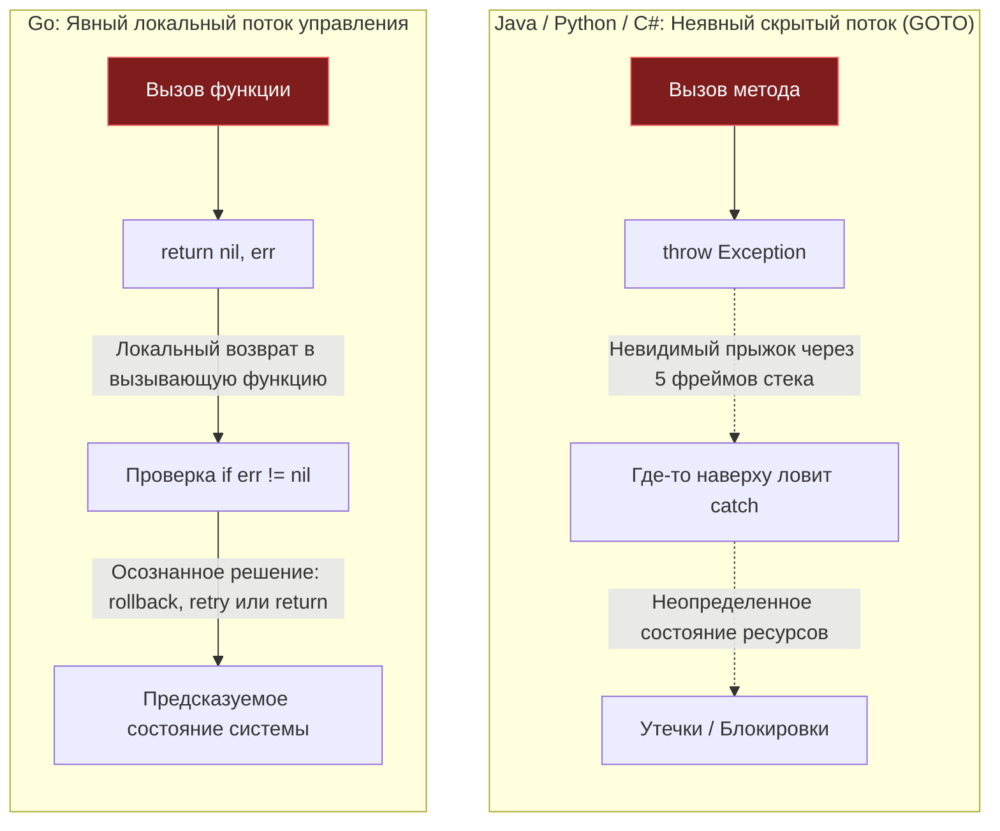

# Errors Are Values. Почему в Go нет исключений

Для разработчика, приходящего в Go из мира Java, C#, Python или современного C++, ничто не вызывает столь сильного отторжения в первые недели, как работа с ошибками. Полное отсутствие синтаксических конструкций `try/catch/finally` и бесконечная череда проверок `if err != nil` поначалу кажутся не просто архаизмом, а шагом назад на полвека — прямиком в семидесятые годы к языку C.

Новички часто пытаются обмануть систему: городят самодельные макросы, пишут глобальные перехватчики аварийных паник через `recover`, чтобы эмулировать `catch`, плодят фабричные функции `Must()`, или пытаются встроить в Go функциональные монады. 

Однако с годами эксплуатации высоконагруженных систем приходит кристальное понимание: **отказ от исключений — это одно из самых глубоких, дальновидных и удачных архитектурных решений авторов Go**. 

Чтобы осознать его гениальность, нам нужно опуститься на уровень регистров микропроцессора и конвейера команд, а затем посмотреть на дизайн надежного распределенного бэкенда.

---

## Цена исключений: Mechanical Sympathy

В классических объектно-ориентированных средах исключение (Exception) — это фундаментальный механизм нелинейного изменения потока управления (Control Flow). Когда вы вызываете конструкцию вроде `throw new UserNotFoundException()`, вы не просто возвращаете статус завершения. Вы запускаете тяжелейший системный механизм раскрутки.

> [!info] Под капотом: Что делает процессор при Exception?
> Когда генерируется исключение (например, в C++ или Java), среда исполнения вынуждена остановить нормальное выполнение инструкций и запустить процедуру **Раскрутки стека (Stack Unwinding)**:
> 1. Рантайм читает специальные метаданные (например, секцию `.eh_frame` в бинарниках ELF), чтобы восстановить топологию стека вызовов.
> 2. Процессор начинает отматывать кадры стека назад, выполняя динамическую проверку типов в рантайме (RTTI) в поисках подходящего обработчика `catch` для конкретного класса исключения.
> 3. На каждом шаге рантайм обязан корректно вызвать деструкторы локальных объектов (в C++) или выполнить цепочки блоков `finally` (в Java/C#).
> 
> **С точки зрения физического кремния это катастрофа.** Конвейер команд (Pipeline) сбрасывается. Аппаратный предсказатель ветвлений (Branch Predictor) оказывается ослеплен, так как адреса перехода генерируются динамически. Кэш инструкций L1i (Instruction Cache) вымывается, потому что код обработки аварийных ситуаций лежит «холодным» в совершенно других областях виртуальной памяти.
>
> Использование исключений для управления нормальной бизнес-логикой (например, при ответе «неверный пароль» или «запись не найдена») в высоконагруженных микросервисах способно снизить общую пропускную способность сервиса в 5–10 раз.

В Go ошибка — это **обычное типизированное значение (Value)**. 

Возврат ошибки `return nil, err` на уровне инструкций ничем не отличается от возврата пары чисел `return 0, 1`. Начиная с Go 1.17, благодаря переходу на register-based ABIInternal, значения передаются напрямую через регистры центрального процессора (`RAX`, `RBX` и др.) без единого обращения к оперативной памяти!

Сама проверка `if err != nil` компилируется в одну элементарную инструкцию сравнения (`TESTQ`) и условный переход `JNZ` (Jump if Not Zero). Предсказатель ветвлений процессора мгновенно обучается тому, что ошибки случаются редко: конвейер ядра продолжает непрерывно исполнять основной счастливый путь (happy path) без единого такта простоя.

---

## Неявный поток управления vs Явный

Исключения создают в программе невидимый, неявный канал передачи сигналов, превращая код в эквивалент хаотичного оператора `GOTO`.

Взгляните на типичный код метода на Java:

```java
public void processTransaction(Transaction tx) {
    db.save(tx);
    billing.charge(tx);
    email.sendReceipt(tx);
}
```

Глядя на этот фрагмент, невозможно предсказать поведение системы:
* Что произойдет, если метод `billing.charge()` завершится ошибкой `NetworkException`?
* Откатит ли `db.save(tx)` изменения в базе?
* Перехватит ли ошибку вызывающий код, или приложение упадет?
* Кто вызовет закрытие сокета?

Чтобы ответить на эти вопросы, инженер обязан погрузиться в реализацию каждого вызываемого метода на всю глубину стека вызовов, изучая, какие исключения они декларируют или неявно выбрасывают в рантайме.

В Go поток управления **кристально прозрачен и линеен**:

```go
func (s *Service) ProcessTransaction(tx *Transaction) error {
    if err := s.db.Save(tx); err != nil {
        return fmt.Errorf("failed to save tx: %w", err)
    }
    
    if err := s.billing.Charge(tx); err != nil {
        // Явный, видимый глазами откат состояния
        s.db.Rollback(tx)
        return fmt.Errorf("billing failed: %w", err)
    }
    
    // Отправка чека по email может завершиться ошибкой, 
    // но мы явно решаем залогировать ее и не прерывать успешную транзакцию
    if err := s.email.SendReceipt(tx); err != nil {
        log.Printf("non-critical error sending receipt: %v", err)
    }
    
    return nil
}
```

Читая этот код сверху вниз, разработчик видит все возможные точки отказа и осознанные инженерные решения прямо в точке вызова. Код документирует сам себя.



---

## "Ошибки" против "Багов"

Один из важнейших концептуальных водоразделов философии Go — разграничение понятий **Ошибки (Errors)** и **Бага (Bugs)**.

В распределенной системе большинство сбоев — это **нормальное, ожидаемое состояние внешней среды**:
* Пользователь ввел неверный пароль — это штатная ситуация.
* Сетевой запрос завершился по таймауту — в распределенной сети это неизбежно.
* Файл на диске временно недоступен — это штатный сценарий.

Все эти ситуации являются элементами бизнес-логики. Они моделируются обычным интерфейсом `error`, возвращаются как значения и обрабатываются на месте.

Но что происходит, если:
* Инженер пытается прочитать 10-й элемент массива из 3 элементов?
* Разыменовывается указатель, равный `nil`?
* Происходит целочисленное деление на ноль?

Это не ожидаемые события бизнес-логики. Это **грубые ошибки программиста (баги)**. В такой ситуации память процесса может быть скомпрометирована, и продолжать выполнение опасно. 

Именно для таких аварийных инцидентов в Go существует механизм `panic`. Паника немедленно завершает текущую горутину и печатает подробный стек вызовов. Подробнее об этом мы поговорим в статье [[11. Panic и Recover. Когда они нужны, а когда вредны]].

> [!tip] Собеседование
> **Вопрос:** В Go вообще нет аналога try/catch? Зачем тогда нужны panic и recover?
>
> **Ответ:** 
> Аналог в виде пары `panic` и `recover` существует, но его предназначение строго ограничено: **восстановление после непредвиденных системных сбоев на верхнем уровне архитектуры**. 
> 
> Например, HTTP-сервер стандартной библиотеки оборачивает обработку каждого входящего запроса в `recover()`, чтобы случайный панический сбой в одном хэндлере не обрушил весь веб-сервер целиком.
> 
> Использовать `panic` вместо `throw` и `recover` вместо `catch` для передачи сигналов прикладной бизнес-логики — грубейший антипаттерн, нарушающий все идиомы Go. Ошибки бизнес-логики обязаны передаваться как обычные значения.

---

## "Errors are values" означает, что их можно программировать

В 2015 году Роб Пайк опубликовал классическую статью *«Errors are values»*, смысл которой многие истолковали превратно. Начинающим gopher-ам показалось, будто автор призывает слепо копировать `if err != nil` после каждого чиха.

Смысл пословицы глубже: **поскольку ошибка является обычным интерфейсным значением языка, вы вольны применять к ней любые алгоритмические абстракции и структуры данных**.

Вместо монотонного повторения проверок:

```go
_, err = w.Write(p0)
if err != nil {
    return err
}
_, err = w.Write(p1)
if err != nil {
    return err
}
// ... и так 10 раз подряд
```

Идиоматичный подход (широко применяемый, например, в стандартном пакете `bufio`) заключается в том, чтобы **инкапсулировать состояние ошибки прямо внутри структуры-обертки**:

```go
type errWriter struct {
    w   io.Writer
    err error // Ошибка накапливается во внутреннем состоянии
}

// Write не возвращает ошибку каждый раз — он сохраняет её внутри
func (ew *errWriter) Write(buf []byte) {
    if ew.err != nil {
        return // Если ошибка уже зафиксирована, последующие вызовы превращаются в no-op
    }
    _, ew.err = ew.w.Write(buf)
}

// Теперь прикладная логика форматирования выглядит элегантно:
func WriteResponse(w io.Writer) error {
    ew := &errWriter{w: w}
    
    ew.Write([]byte("Header\n"))
    ew.Write([]byte("Body\n"))
    ew.Write([]byte("Footer\n"))
    
    // Проверяем ошибку ровно один раз в самом конце цепочки!
    return ew.err
}
```

Код остается абсолютно безопасным, полностью линейным и избавлен от визуального шума.

> [!warning] Ловушка / Gotcha: `err` — это интерфейс, а не строка
> Разработчики, пришедшие из скриптовых языков, нередко проверяют ошибки путем анализа текстовой строки: `if strings.Contains(err.Error(), "not found")`.
>
> Это **катастрофический антипаттерн**. Стоит автору сторонней библиотеки изменить формулировку текста ошибки в минорном обновлении — и ваша бизнес-логика тихо перестанет работать. 
> 
> В Go `error` — это структурный интерфейс. Сравнение и разбор цепочек ошибок должны производиться строго через типизированные механизмы стандартной библиотеки: функции `errors.Is` (для проверки конкретного сигнального значения или обернутых ошибок) и `errors.As` (для безопасного извлечения конкретного кастомного типа ошибки).

---

## Итог

Архитектурный выбор Go в пользу ошибок-значений — это осознанная ставка на предсказуемость, безопасность и аппаратную эффективность:
1. **Mechanical Sympathy:** Простые условные переходы не разрушают конвейер инструкций CPU и не требуют дорогой раскрутки стека (Stack Unwinding).
2. **Линейная читаемость:** Поток управления читается сверху вниз без скрытых аварийных прыжков.
3. **Алгоритмическая гибкость:** Ошибки можно накапливать, оборачивать, фильтровать и программировать как любые другие данные.

В следующей лекции мы разберем практический инструментарий работы с цепочками ошибок: оборачивание через `%w`, функции `errors.Is`/`errors.As` и архитектурные паттерны: [[10. Обработка ошибок в Go. if err != nil как часть дизайна]].
