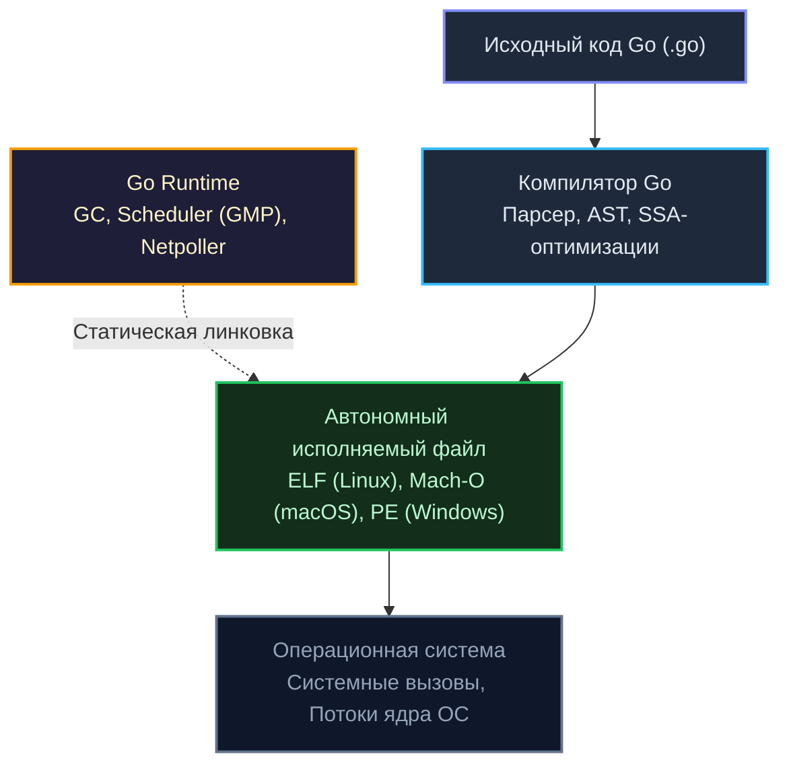

Добро пожаловать в фундаментальный учебник по основам, синтаксису и семантике языка Go. 

Если вы пришли сюда из мира Java, C#, PHP, Python или современного C++, ваше первое впечатление от языка может оказаться обманчивым. Синтаксис Go на первый взгляд кажется почти аскетичным, лишенным привычного блеска: здесь нет классов, нет иерархий наследования с ключевым словом `extends`, нет операторов перегрузки, нет исключений `try/catch`. Кому-то язык даже может показаться шагом назад — словно его создали в 1980-х годах в лабораториях Bell Labs.

Однако за этой кристальной простотой скрывается глубочайший инженерный расчет. Язык Go проектировался не для академических упражнений в теории типов, а для преодоления суровых практических вызовов Google: мучительно долгих циклов сборки гигантских монорепозиториев, нечитаемых спагетти-абстракций, непредсказуемых накладных расходов виртуальных машин и сложности координации тысяч сетевых соединений.

В этом разделе мы заложим несокрушимый фундамент владения языком. Поскольку вы уже обладаете опытом в программировании, мы не станем тратить время на банальные объяснения того, «что такое переменная или цикл». Наша цель принципиально иная: разобрать, **как именно конструкции Go реализованы под капотом**, как они ложатся на кремний современных процессоров и почему создатели языка остановились именно на таких архитектурных решениях.

---

## Архитектура Go-программы: Что мы вообще пишем?

Ключевое отличие Go от языков с виртуальными машинами (Java, C#) или динамических интерпретаторов (Python, PHP, Ruby) заключается в модели компиляции: программа на Go компилируется в **полностью автономный, статически слинкованный машинный код** со встроенным рантаймом.



> [!info] Под капотом: Что такое Go Runtime?
> В отличие от сред Java Virtual Machine (JVM) или .NET Common Language Runtime (CLR), рантайм Go — это не массивная виртуальная машина, которую необходимо предварительно инсталлировать на сервер. 
> 
> Рантайм Go — это специализированный системный библиотечный код (написанный на самом Go и ассемблере), который компилятор бесшовно «вшивает» непосредственно в результирующий бинарный файл.
> 
> Вшитый рантайм берет на себя управление тремя критическими аспектами работы программы:
> 1. **Memory Allocation & Garbage Collection:** Сверхбыстрое распределение памяти (через потокобезопасные кэши потоков `mcache`) и конкурентная сборка мусора с микросекундными паузами Stop-the-World.
> 2. **Goroutine Scheduling:** Многопоточный кооперативно-вытесняющий планировщик (модель `G-M-P`), распределяющий миллионы легковесных горутин по небольшому числу системных потоков ОС.
> 3. **Netpoll:** Неблокирующий сетевой мультиплексор ввода-вывода поверх системных механизмов ядра (`epoll` в Linux, `kqueue` в macOS, `IOCP` в Windows).

На выходе получается единый самодостаточный бинарник («Fat Binary»), которому для запуска в проде не требуются ни установленные интерпретаторы, ни зависимости фреймворков.

---

## 4 столпа парадигмы Go

Чтобы писать на Go идиоматично, а не транслировать ментальные паттерны Java или C++ на синтаксис Go, необходимо прочувствовать четыре несущие опоры языка.

### 1. Ортогональность и Минимализм
В грамматике Go насчитывается всего **25 ключевых слов**. Язык намеренно очищен от скрытой синтаксической магии. Принцип ортогональности означает, что немногие базовые примитивы языка независимы друг от друга, но образуют выразительную систему при комбинировании.

К примеру, в Go нет концепции «класса». Вместо этого существуют структуры `struct` (чистые данные) и методы с получателями `receiver` (поведение). Они спроектированы раздельно, но в совокупности дают идеальный инструмент инкапсуляции без монструозных иерархий.

### 2. Value Semantics и Механическая Симпатия (Mechanical Sympathy)
В объектных языках вроде Java или PHP практически любая пользовательская сущность является неявной ссылкой на объект в куче. В Go разработчик обладает абсолютным аппаратным контролем над размещением данных в памяти: вы сами решаете, где будет жить значение — передаваться по значению (на быстром стеке) или по указателю (в куче).

Это фундаментально важно для производительности. Современные кремниевые кристаллы исполняют инструкции за доли наносекунды, но доступ к основной оперативной памяти (RAM) занимает сотни тактов. Go проектировался так, чтобы данные могли лежать в памяти непрерывными цепочками (Continuous Memory). 

Это позволяет аппаратному блоку предварительной выборки процессора (**Hardware Prefetcher**) заблаговременно подтягивать ячейки памяти в кэши L1/L2. А компилятор Go с помощью механизма **Escape Analysis** строго оценивает время жизни переменной, сохраняя максимум структур на быстром стеке горутины и разгружая сборщик мусора (`Garbage Collector`).

### 3. Композиция вместо Наследования
В Go **полностью отсутствует наследование** — в спецификации нет ключевого слова `extends`. Вместо возведения многослойных и хрупких иерархий (вроде `Vehicle -> Car -> ElectricCar -> Tesla`), Go использует прямое встраивание структур (`Embedding`).

Полиморфизм достигается за счет интерфейсов, которые удовлетворяются типами **неявно** (`Duck Typing`). Вам никогда не потребуется писать директиву `implements Interface`. Если ваша структура реализует методы, описанные интерфейсом, она автоматически считается совместимой с ним.

> [!warning] Ловушка / Gotcha
> Типичная ошибка инженеров с опытом в ООП — попытка воспроизвести в Go привычные паттерны абстрактных фабрик, глубоких базовых структур и заранее спроектированных монструозных интерфейсов.
> 
> Идиоматичный код на Go растет «снизу вверх»: сначала пишется прямая, конкретная реализация задачи. И лишь тогда, когда в системе действительно возникает потребность в полиморфизме или изоляции для тестов, объявляется компактный интерфейс (чаще всего состоящий из 1–2 методов). Эту механику мы глубоко исследуем в лекциях [[23. Интерфейсы. Полиморфизм по-goшному]] и [[25. Встраивание. Embedding вместо наследования]].

### 4. Ошибки — это значения (Errors are values)
Первое время отсутствие механизма исключений (`throw/catch`) вызывает у новичков культурный шок. В Go ошибка — это не катастрофа и не прерывание нормального потока выполнения. Ошибка — это обычное значение, удовлетворяющее интерфейсу `error`. 

Функция, способная завершиться неудачей, возвращает значение ошибки последним аргументом, а вызывающий код явно проверяет контракт:
```go
if err != nil {
    return fmt.Errorf("не удалось выполнить операцию: %w", err)
}
```

Такой подход требует дисциплины, но делает поток управления (`Control Flow`) абсолютно прозрачным и линейным. Подробнее об этом мы поговорим в лекции [[12. Обработка ошибок через error]].

> [!tip] Собеседование
> **Вопрос:** Почему создатели Go сознательно отказались от механизма исключений (`Exceptions`)?
> **Ответ:** Исключения маскируют реальный поток управления программой (`Control Flow`). Читая метод с блоком `try/catch`, невозможно сказать по тексту, какая именно инструкция выбросит исключение и на каком уровне стека вызовов оно будет перехвачено. В высоконагруженных сетевых сервисах скрытые пути исполнения приводят к утечкам файловых дескрипторов, зависшим соединениям и трудноуловимым гонкам данных. Явный возврат ошибок в Go гарантирует, что каждый сценарий сбоя виден в коде непосредственно в месте его возникновения.

---

## Структура данного раздела

В рамках этого подробного практического руководства мы пройдем путь от первой компиляции простейшей программы до тонкостей низкоуровневой синхронизации:

1. **Базис и синтаксический фундамент:** Установка инструментария, структура проекта, переменные, типизация, представление памяти и указатели;
2. **Встроенные структуры данных:** Глубокий анализ срезов (`slice`) и хэш-таблиц (`map`), их устройство в памяти и механизмы динамического расширения;
3. **ООП по-Goшному:** Структуры, методы с различными типами получателей (`Value Receiver` vs `Pointer Receiver`), интерфейсы и их внутренние структуры рантайма (`iface` и `eface`);
4. **Основы конкурентности:** Природа горутин, их отличие от потоков ядра ОС, устройство каналов, мультиплексор `select` и примитивы пакета `sync`. Фундаментальные основы асинхронности мы детально разберем в лекциях [[34. Горутины. Легковесная конкурентность в Go]] и [[36. Каналы. Передача данных между горутинами]].

Go славится обманчиво низким порогом входа. Освоить базовый синтаксис можно за пару вечеров. Но для того чтобы проектировать высокопроизводительные сетевые сервисы, которые эффективно используют кэш-линии процессора и не расходуют память гигабайтами под нагрузкой, необходимо глубоко понимать законы рантайма.

Начнем наше погружение с настройки рабочего окружения, понимания переменных `GOROOT`/`GOPATH` и сборки первого бинарника в статье: [[2. Установка Go, GOPATH, GOROOT и первая программа]].
