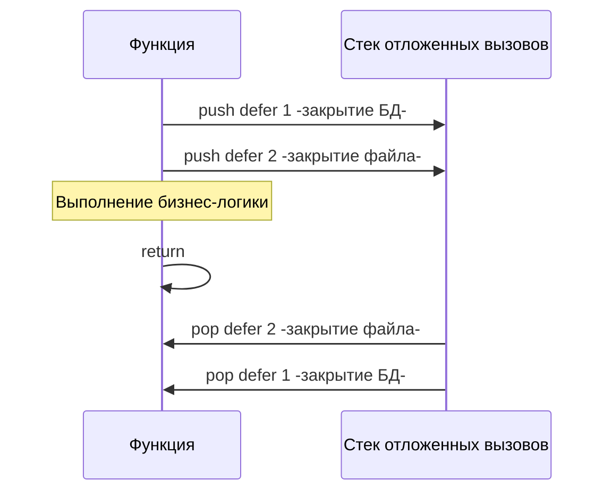

В системном программировании любые внешние ресурсы — открытые файлы, сетевые сокеты, блокировки мьютексов или дескрипторы базы данных — это беспроцентные кредиты, взятые у операционной системы. И операционная система всегда требует возврата своих долгов.

В языках с ручным управлением памятью (C/C++) разработчику приходится маниакально отслеживать каждую точку выхода из функции, чтобы вовремя освободить ресурсы. Паттерн RAII (Resource Acquisition Is Initialization) из C++ решает это автоматическим вызовом деструкторов при выходе объекта из области видимости, а в Java/C# программисты возводят многоэтажные конструкции `try-finally`.

В Go деструкторов нет: сборщик мусора (GC) освобождает исключительно оперативную память, но понятия не имеет о дескрипторах ОС. Конструкции `finally` в языке тоже нет. Вместо этого авторы Go предложили элегантный дуэт, глубоко интегрированный в жизненный цикл функций: **именованные возвращаемые значения (Named Return Values)** и **отложенные вызовы (`defer`)**.

Понимание механики их взаимодействия на уровне стека — неизменная классика технических собеседований и залог написания надежных отказоустойчивых сервисов.

---

## 1. Именованные возвращаемые значения

В сигнатуре функции Go можно объявить не просто типы результатов, но и дать им полноценные имена:

```go
package main

import (
    "fmt"
    "os"
    "time"
)

// Классический возврат
func divide(a, b int) (int, error) {
    return a / b, nil
}

// Именованный возврат
func divideNamed(a, b int) (result int, err error) {
    if b == 0 {
        err = fmt.Errorf("деление на ноль")
        return // Так называемый "Naked return"
    }
    result = a / b
    return // Вернет текущие значения result и err
}
```

### Как это работает под капотом?

Когда компилятор встречает именованные результаты, он выделяет под них память прямо во фрейме стека (Stack Frame) текущей функции в момент ее пролога. Они ведут себя в точности как **обычные локальные переменные**, автоматически инициализируясь своими нулевыми значениями (Zero Values: нули, пустые строки, `nil`).

### Naked Return: Удобство или зло?

Инструкция `return` без параметров называется **Naked Return** («голый» возврат). Компилятор неявно подставляет текущие значения именованных переменных в инструкцию возврата.

> [!warning] Ловушка / Gotcha: Читаемость кода
> В инженерном сообществе Go «голый» возврат (Naked return) справедливо считается **антипаттерном** для любых функций длиннее 5–10 строк.
> Читая протяженный листинг, вы натыкаетесь на сиротливый `return` и вынуждены мучительно прокручивать экран на 50 строк вверх, выискивая, где и в какой ветке переменная `result` в последний раз мутировала. 
> Идиоматичный подход рекомендует: объявлять имена в сигнатуре ради документации API в коде и подсказках IDE, но в теле функции всегда возвращать значения явно: `return result, err`.

Подлинная архитектурная сила именованных переменных раскрывается тогда, когда они объединяются с механизмом `defer`.

---

## 2. Анатомия defer

Ключевое слово `defer` регистрирует вызов функции, который гарантированно выполнится в момент **возврата из объемлющей функции** (либо в случае возникновения паники). Это канонический способ управления системными ресурсами:

```go
func processFile(filename string) error {
    f, err := os.Open(filename)
    if err != nil {
        return err
    }
    // Выполнится прямо перед выходом из processFile
    defer f.Close() 
    
    // ... чтение файла ...
    return nil
}
```

Логика ресурса собрана в одном месте: сразу за открытием следует отложенное закрытие. Вам больше не нужно дублировать `f.Close()` перед каждым из десяти условий `return err`.

### Порядок вызова: LIFO

Если в функции объявлено несколько операторов `defer`, рантайм помещает их в стек вызовов и исполняет строго в порядке **LIFO** (Last In, First Out — последним пришел, первым ушел):



Этот порядок естественно отражает иерархию зависимостей: файл, открытый внутри транзакции базы данных, обязан закрыться до того, как завершится сама транзакция.

### Оценка аргументов в момент объявления

Здесь кроется классический подводный камень, на котором спотыкаются многие начинающие разработчики. Аргументы отложенной функции вычисляются **непосредственно в точке вызова `defer`**, а вовсе не тогда, когда функция фактически исполняется:

```go
func main() {
    start := time.Now()
    // ОШИБКА: time.Since-start- вычислится прямо сейчас!
    // defer всегда напечатает 0 миллисекунд.
    defer fmt.Println("Время выполнения:", time.Since(start)) 

    time.Sleep(2 * time.Second)
}
```

**Решение:** Обернуть вызов в анонимную функцию (замыкание). Тело замыкания выполнится на выходе из `main`, поэтому вызов `time.Since` зафиксирует реальное прошедшее время:

```go
defer func() {
    fmt.Println("Время выполнения:", time.Since(start))
}()
```

---

## 3. Взаимодействие defer и именованных возвратов

А теперь рассмотрим эталонную задачу с собеседований уровня Middle+: *«Что вернет следующая функция?»*

```go
func magic() (result int) {
    defer func() {
        result *= 10
    }()
    return 5
}
```

Правильный ответ: **50**.

Чтобы понять физику происходящего, важно осознать: оператор `return` в Go **не является неделимой инструкцией процессора**. На машинном уровне компилятор расщепляет `return 5` на три последовательных действия:
1. **Присвоение результата**: Возвращаемое значение записывается в выделенный стек-слот: `result = 5`.
2. **Исполнение цепочки defer**: Вызываются все отложенные функции в порядке LIFO. Замыкание обращается к переменной `result` и мутирует ее: `result = result * 10` (получаем `50`).
3. **Аппаратный возврат**: Выполняется машинная инструкция `RET`, возвращающая вызывающей функции итоговое значение `result`.

### Практическое применение: Перехват паник и обогащение ошибок

Благодаря этой особенности `defer` может легально перехватывать аварийные ситуации и преобразовывать их в штатные ошибки:

```go
func doWork() (err error) {
    defer func() {
        if r := recover(); r != nil {
            // Перехватываем панику и превращаем её в ошибку!
            err = fmt.Errorf("паника поймана: %v", r)
        }
    }()
    // ... потенциально опасный код ...
    return nil
}
```

*(Подробный разбор механики паник и восстановления мы проведем в лекции [[13. Panic, Recover и stack trace]])*.

---

## 4. Mechanical Sympathy: Defer под капотом

Исторически `defer` имел репутацию «тяжеловесной» конструкции. До релиза Go 1.13 каждый оператор `defer` приводил к динамическому выделению структуры `_defer` в куче (или на стеке) и включению ее в связный список горутины (поле `_defer` в низкоуровневой структуре `g`). Это требовало дорогостоящих переключений контекста функций рантайма `runtime.deferproc` и `runtime.deferreturn`, добавляя накладные расходы около 35–50 наносекунд на вызов.

В **Go 1.14** команда рантайма реализовала фундаментальную оптимизацию: **Open-coded defers (инлайнинг отложенных вызовов)**.

Если число операторов `defer` в функции не превышает 8, и они не спрятаны внутри циклов, компилятор вообще не обращается к структурам рантайма! На этапе SSA-генерации компилятор отслеживает состояние отложенных функций с помощью битовой маски в регистре CPU и напрямую «вклеивает» код очистки перед каждой ассемблерной инструкцией `RET`. 

Накладные расходы на `defer` снизились с ~50 наносекунд до **~1 наносекунды**. Сегодня отложенный вызов в Go практически бесплатен.

> [!warning] Ловушка / Gotcha: Defer в цикле
> Оптимизация open-coded defers автоматически отключается, если `defer` расположен внутри цикла. Но главная опасность даже не в скорости, а в утечке ресурсов: `defer` привязан к завершению **всей функции**, а не отдельной итерации цикла!
> 
> ```go
> func processFiles(files []string) {
>     for _, filename := range files {
>         f, _ := os.Open(filename)
>         defer f.Close() // КРИТИЧЕСКАЯ ОШИБКА
>     }
> }
> ```
> Если в слайсе `files` содержится 10 000 элементов, операционная система заблокирует программу ошибкой `too many open files` из-за исчерпания лимита дескрипторов процесса (`ulimit`), так как ни один `f.Close()` не вызовется до полного завершения работы функции `processFiles`.
> 
> **Решение:** Оберните тело цикла в анонимную функцию, чтобы локализовать область видимости `defer`:
> ```go
> for _, filename := range files {
>     func() {
>         f, _ := os.Open(filename)
>         defer f.Close() // Выполнится на каждой итерации
>         // ...
>     }()
> }
> ```

---

## Итог

1. **Именованные возвращаемые значения** размещаются во фрейме стека в момент входа в функцию и инициализируются значениями по умолчанию (Zero Values).
2. **Naked Return** ухудшает читаемость при росте функции — предпочитайте явное указание возвращаемых переменных.
3. **`defer`** планирует выполнение вызова в момент завершения функции, строго соблюдая стек **LIFO**.
4. **Аргументы** отложенной функции вычисляются немедленно в момент вызова оператора `defer`.
5. Отложенные функции имеют прямой доступ к именованным возвращаемым значениям и могут мутировать их перед финальным возвратом.
6. Благодаря технике **Open-coded defers** (Go 1.14+), стоимость `defer` снизилась до ~1 нс, сделав его надежным и дешевым стандартом очистки ресурсов.
7. Не помещайте `defer` внутрь циклов без замыканий, чтобы не исчерпать лимиты файловых дескрипторов `ulimit`.

Мы изучили, как `defer` управляет жизненным циклом ресурсов и возвращает значения. В экосистеме Go ошибки не нарушают нормальный поток инструкций через скрытые исключения, а являются полноправными значениями. В следующей главе — [[12. Обработка ошибок через error]] — мы исследуем философию «Errors are values», оборачивание ошибок через `%w` и реализацию интерфейса `error`.
