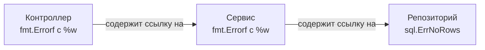

Когда разработчики, привыкшие к Java, C# или Python, впервые открывают проект на Go, их первая эмоциональная реакция предсказуема: «Почему я должен писать `if err != nil` каждые три строчки? Верните мне привычный `try-catch`!».

Создатели Go отказались от механизма исключений (Exceptions) совершенно осознанно. Исключения разрушают линейность и предсказуемость исполнения программы (Control Flow). Вызывая функцию в Java или C++, вы никогда не можете быть уверены, вернет ли она управление в следующую строчку или невидимый механизм раскрутки стека (Stack Unwinding) катапультирует выполнение на пять уровней вверх в случайный блок `catch`. В распределенных сетевых сервисах такая скрытая «невидимая магия» оборачивается утечками ресурсов, незакрытыми соединениями и трудноуловимыми багами.

В Go провозглашен ясный инженерный принцип: **ошибка — это просто значение (Error is a value)**. Ошибка не прерывает работу приложения сама по себе, не требует дорогостоящих таблиц раскрутки стека и передается через регистры процессора как самые обычные данные. Язык обязывает программиста рассуждать об ошибках честно и хладнокровно прямо в месте их возникновения.

В этой главе мы разберем внутреннее устройство ошибок в памяти, паттерны их упаковки и распутывания, а также исследуем знаменитую ловушку Typed Nil, на которой проверяют глубину понимания рантайма на технических собеседованиях.

---

## 1. Интерфейс error под капотом

В стандартной библиотеке Go нет монолитного класса исключений с десятками служебных полей. Тип `error` — это встроенный в язык интерфейс, состоящий из единственного метода:

```go
type error interface {
    Error() string
}
```

Любая структура данных или пользовательский тип, имеющий метод `Error() string`, автоматически удовлетворяет этому контракту благодаря утиной типизации (Structural Duck Typing) и может возвращаться в качестве ошибки.

> [!info] Под капотом: Размер интерфейса
> Поскольку `error` — это интерфейс, на физическом уровне в рантайме он представлен структурой `iface`, занимающей ровно **16 байт** на 64-битной архитектуре:
> 1. **8 байт** — указатель на `itab` (структуру интерфейсной таблицы, содержащую метаинформацию о типе и адреса методов).
> 2. **8 байт** — указатель на данные ошибки (в куче или на стеке).
> 
> Когда функция возвращает значение `error`, рантайм передает эти 16 байт напрямую через аппаратные регистры процессора (как мы разбирали в лекции про функции и Register ABI), не тратя ни одного лишнего такта на обращение к медленной оперативной памяти.

---

## 2. Создание ошибок и фокус с указателем

Простейший способ сконструировать ошибку в коде — обратиться к стандартным пакетам `errors` или `fmt`:

```go
err1 := errors.New("file not found")
err2 := fmt.Errorf("user %d not found", userID)
```

Давайте заглянем в исходный код пакета `errors` из состава Go toolchain:

```go
package errors

// New возвращает ошибку, форматированную как заданный текст.
func New(text string) error {
    return &errorString{text} // Обратите внимание на амперсанд!
}

type errorString struct {
    s string
}

func (e *errorString) Error() string {
    return e.s
}
```

> [!tip] Собеседование
> **Вопрос:** Почему конструктор `errors.New` возвращает именно **указатель** `&errorString`, а не прямое значение `errorString`?
> **Ответ:** Ради строгого и надежного сравнения (Sentinel Errors).
> В языке Go два интерфейса признаются равными (`==`), если идентичны их конкретные типы и совпадают хранящиеся значения. Если бы функция возвращала саму структуру по значению, то проверка `errors.New("EOF") == errors.New("EOF")` вернула бы `true`, поскольку текстовые строки `"EOF"` равны.
> Возвращая указатель `&errorString`, создатели гарантируют сравнение уникальных адресов памяти. Каждый вызов `errors.New` аллоцирует новую структуру в памяти с уникальным адресом. В результате две ошибки с одинаковым текстом, объявленные в разных пакетах, никогда не окажутся ложно равными друг другу.

---

## 3. Классификация ошибок в Go

В профессиональной бэкенд-разработке ошибки принято разделять на три четкие категории.

### Категория 1: Сигнальные ошибки (Sentinel Errors)

Сигнальные ошибки — это глобальные неизменяемые переменные уровня пакета, обозначающие ожидаемые штатные исходы: например, достижение конца потока данных (`io.EOF`) или отсутствие искомой записи в реляционной базе данных (`sql.ErrNoRows`).

```go
var ErrUserNotFound = errors.New("user not found")

func getUser() error {
    return ErrUserNotFound
}

// Проверка:
if err == ErrUserNotFound {
    // Пользователь не найден, создаем нового...
}
```

### Категория 2: Пользовательские типы ошибок (Custom Error Types)

Когда текстового сообщения недостаточно и вызывающей стороне требуются детальные структурированные данные (HTTP-код ответа, идентификатор запроса, число повторных попыток), мы создаем собственную структуру:

```go
type HTTPError struct {
    StatusCode int
    URL        string
    Msg        string
}

func (e *HTTPError) Error() string {
    return fmt.Sprintf("HTTP %d: %s at %s", e.StatusCode, e.Msg, e.URL)
}
```

### Категория 3: Обернутые ошибки (Wrapped Errors)

В реальных сервисах вызов проходит через цепочку архитектурных слоев: Транспорт (HTTP-контроллер) -> Бизнес-логика (Сервис) -> Слой данных (Репозиторий). Если база данных разорвала сетевой сокет (`connection refused`), а промежуточные слои просто передавали ошибку наверх, то на уровне логов мы получим «голую» техническую строку `connection refused` без малейшего понимания, какой пользовательский запрос ее вызвал.

Исторически инженеры форматировали ошибки вручную: `fmt.Errorf("db fetch: %v", err)`. Но спецификатор `%v` безвозвратно уничтожал исходную ошибку, превращая ее в плоский текст.

Начиная с **Go 1.13**, в стандартную библиотеку был добавлен механизм оборачивания (Wrapping) с помощью специального глагола `%w`:

```go
// Используем %w (wrap) вместо %v (value)
return fmt.Errorf("не удалось загрузить пользователя %d: %w", userID, err)
```

Спецификатор `%w` формирует в памяти связный список (цепочку ошибок), сохраняя исходную «корневую» ошибку и добавляя к ней контекст каждого пройденного слоя:



#### Распаковка: errors.Is и errors.As

Поскольку ошибка оказывается «упакованной» внутрь цепочки контекстов, простое сравнение `if err == sql.ErrNoRows` перестает работать. На замену пришли две функции пакета `errors`:

**1. `errors.Is`** — заменяет оператор `==`. Функция рекурсивно обходит цепочку, вызывая метод `Unwrap()`, и проверяет, совпадает ли какая-либо из вложенных ошибок с целевой сигнальной ошибкой:

```go
if errors.Is(err, sql.ErrNoRows) {
    // Сработает, даже если sql.ErrNoRows была обернута через %w десять раз!
}
```

**2. `errors.As`** — заменяет приведение типа (Type Assertion). Функция ищет в цепочке ошибку заданного конкретного типа и извлекает ее:

```go
var httpErr *HTTPError // Создаем пустой указатель на целевую структуру
if errors.As(err, &httpErr) {
    // Если в цепочке нашелся *HTTPError, переменная httpErr будет заполнена
    fmt.Println(httpErr.StatusCode)
}
```

---

## 4. Главная ловушка: Typed Nil (Неявный Nil интерфейс)

Это, пожалуй, самый коварный и знаменитый баг в Go, связанный с интерфейсами. Его безошибочное понимание — верный признак зрелого инженера.

Взгляните на следующий листинг:

```go
package main

import "fmt"

type MyError struct {
    Msg string
}

func (e *MyError) Error() string { return e.Msg }

func doWork() error {
    // Внимание! Мы объявляем переменную конкретного типа указателя
    var err *MyError = nil 
    
    // ...какая-то успешная логика...
    
    return err // Возвращаем nil?
}

func main() {
    err := doWork()
    if err != nil {
        fmt.Println("ПРОИЗОШЛА ОШИБКА!", err)
    } else {
        fmt.Println("УСПЕХ!")
    }
}
```

**Результат работы программы:**
```text
ПРОИЗОШЛА ОШИБКА! <nil>
```

Произошло нечто парадоксальное: функция `doWork` вернула `nil`, но условие `err != nil` вычислилось в `true`!

### Mechanical Sympathy: Разбор полета

Вспомним структуру интерфейса `iface` из начала статьи: он представляет собой пару указателей `(itab, data)` или логически `(Type, Data)`.
Интерфейс считается равным `nil` **строго тогда**, когда оба его указателя пусты: `(nil, nil)`.

Что делает компилятор в строке `return err` функции `doWork`?
Функция возвращает интерфейс `error`. Переменная `err` имеет тип `*MyError` со значением `nil`. Компилятор производит упаковку конкретного типа в интерфейс:
- В поле данных (`data`) записывается значение `nil`.
- Но в поле таблицы типа (`itab`) записывается реальный указатель на тип `*MyError`!

В вызывающую функцию `main` возвращается интерфейс вида `(*MyError, nil)`.
При выполнении проверки `if err != nil` процессор сравнивает `(*MyError, nil)` с эталонным `(nil, nil)`. Поскольку указатель на тип не пуст, результат сравнения — `true`! Ветка проверки срабатывает, и программа радостно сообщает об «ошибке», а любая попытка прочитать ее поля вызовет `panic: nil pointer dereference`.

> [!tip] Собеседование
> **Как защитить кодовую базу от ловушки Typed Nil?**
> 1. **Никогда** не объявляйте локальные переменные для ошибок конкретными типами указателей (`var err *MyError`), если функция декларирует возврат интерфейса `error`.
> 2. Всегда объявляйте переменную как интерфейс: `var err error = nil`.
> 3. При успешном завершении функции возвращайте явный нетипизированный литерал `nil`: `return nil`, а не имя переменной, в которой случайно может оказаться типизированный нулевой указатель.

Детальное погружение во внутренности интерфейсов, таблицы виртуальных методов `itab` и структуры `iface`/`eface` мы проведем в главе [[24. Интерфейсы под капотом. iface и eface]].

---

## Итог

1. **Ошибки — это обычные значения**. Они не ломают конвейер инструкций CPU, передаются в регистрах общего назначения и обрабатываются строго по месту возникновения.
2. Под капотом `error` — это 16-байтный интерфейс `iface` с одним методом `Error() string`.
3. Функция `errors.New` возвращает указатель на структуру, обеспечивая корректное сравнение сигнальных ошибок (Sentinel Errors) по адресам в памяти.
4. Оборачивание ошибок через `%w` формирует цепочку контекста, которую можно безопасно инспектировать с помощью `errors.Is` и `errors.As`.
5. **Typed Nil** — опасная ловушка: интерфейс, содержащий типизированный указатель `nil`, сам не равен `nil`. Возвращайте литерал `nil` при успехе.

Штатные ошибки — естественная часть жизни любого надежного бэкенда. Но что происходит, когда в системе случается непредвиденная катастрофа: повреждение памяти, выход за границы массива или разыменование нулевого указателя? 

Для таких исключительных аварийных ситуаций в рантайме Go существует механизм паник. В следующей лекции — [[13. Panic, Recover и stack trace]] — мы изучим, как работает механизм раскрутки стека при панике, как печатается трассировка и как защитить сервис от аварийного падения с помощью `recover`.
