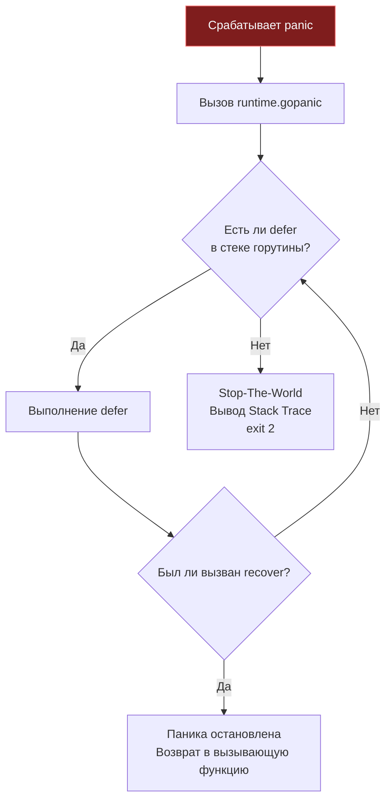

В предыдущей статье мы выяснили, что в Go любые штатные сбои (сетевой таймаут, временная недоступность базы данных, невалидный JSON) обрабатываются через возврат значений `error`. Но что делать, если происходит катастрофический сбой, несовместимый с дальнейшей жизнью процесса? Что предпринять, если программа пытается обратиться к отрицательному индексу массива или разыменовать нулевой указатель?

В языках вроде Java или Python это порождает обычное исключение (Exception), которое принято перехватывать всеобъемлющим `try-catch`. В Go для таких чрезвычайных происшествий существует обособленный и гораздо более бескомпромиссный инструмент — **паника (`panic`)**.

Философия Go в этом вопросе наследует знаменитый постулат Джо Армстронга из Erlang: «Let it crash» (Позволь процессу упасть). Если в коде обнаружена грубая логическая ошибка инженера (например, выход за границы среза), это означает, что внутренние инварианты программы нарушены, а память может быть скомпрометирована. В распределенных архитектурах мгновенно уронить упавший процесс несравнимо безопаснее, чем позволить ему продолжать работу в зомби-состоянии, размазывая поврежденные данные по базе и отправляя клиентам искаженные ответы.

В этой главе мы разберем механику работы `panic` и `recover` под капотом рантайма, выясним, почему паника в дочерней горутине фатальна для всего процесса, и научимся до байта читать системный Stack Trace.

---

## 1. Анатомия паники (runtime.gopanic)

Паника в Go может быть инициирована двумя путями:
1. **Явно:** непосредственным вызовом встроенной функции `panic("описание")`.
2. **Неявно (на уровне аппаратуры или ядра ОС):** например, процессор генерирует аппаратное прерывание `SIGSEGV` при попытке чтения по нулевому адресу (nil pointer). Рантайм Go перехватывает этот сигнал ядра на альтернативном сигнальном стеке и трансформирует его во внутренний вызов паники.

> [!info] Под капотом: Что делает panic
> Когда вызывается паника, управление передается в системную функцию рантайма `runtime.gopanic`. 
> Текущая горутина (структура `g`) хранит связный список всех зарегистрированных отложенных вызовов (поле `_defer`). 
> Функция `gopanic` начинает процедуру раскрутки стека (Stack Unwinding):
> 1. Извлекает последний добавленный в список `_defer` и исполняет его.
> 2. Если внутри этого блока `defer` не был вызван спасительный `recover()`, рантайм переходит к следующему элементу `_defer` (строго по принципу LIFO, как мы разбирали в лекции [[11. Именованные возвращаемые значения и defer]]).
> 3. Если цепочка отложенных вызовов исчерпана, а паника так и не была погашена, `gopanic` инициирует глобальную остановку всего мира (Stop-The-World), форматирует и сбрасывает подробный Stack Trace в поток `stderr` и аварийно завершает процесс с кодом `exit(2)`.



---

## 2. Recover: Ловец падений

Встроенная функция `recover()` служит аварийным предохранителем: она способна остановить процедуру раскрутки стека при панике и вернуть значение, которое было передано в `panic`.

**Фундаментальное правило:** вызов `recover()` имеет практический смысл **только напрямую внутри отложенной функции (defer)**. Вызов `recover()` в обычной линейной ветке программы всегда возвращает `nil` и не производит абсолютно никакого эффекта.

### Идиоматичный перехват и конвертация в error

Во внутренних библиотеках со сложными рекурсивными алгоритмами (например, парсинг AST-деревьев, компиляторы или парсеры форматов данных) панику иногда используют как инструмент быстрого прерывания глубокой рекурсии при обнаружении битого токена. Однако наружу, клиентам публичного API, библиотека обязана возвращать цивилизованную ошибку:

```go
package main

import "fmt"

func ParseData() (err error) {
    defer func() {
        if r := recover(); r != nil {
            // Перехватили панику и превратили её в обычную ошибку!
            err = fmt.Errorf("ошибка парсинга: %v", r)
        }
    }()
    
    // ... глубокая логика парсинга, которая может вызвать panic ...
    return nil
}
```

> [!warning] Ловушка / Gotcha: Тонкости вызова recover
> Функция `recover()` обязана вызываться **непосредственно** в первом теле отложенной функции `defer`. 
> 
> ```go
> // ТАК РАБОТАТЬ НЕ БУДЕТ:
> defer func() {
>     catchPanic() // recover спрятан внутри другой функции
> }()
> 
> func catchPanic() {
>     recover() // Вернет nil, паника не остановится!
> }
> ```
> Под капотом низкоуровневая функция `runtime.gorecover` проверяет аппаратный счетчик инструкций (PC) вызывающего фрейма. Если вызов совершен из дочерней подфункции, а не напрямую из тела отложенного замыкания, рантайм намеренно блокирует перехват. Это архитектурный барьер, предотвращающий случайный или несанкционированный перехват чужих паник глубоко во вложенных библиотеках.

---

## 3. Границы горутин: Смертельная ловушка

Это один из самых критичных вопросов архитектуры параллельных вычислений в Go: **функция `recover()` способна перехватить панику исключительно в рамках той горутины, в которой паника произошла!**

Если вы порождаете новую горутину, и внутри нее случается `panic`, никакой родительский `defer recover()` в функции `main` или вызывающей горутине спасти процесс не сможет. Паника не умеет пересекать границы горутин: рантайм аварийно прикончит весь процесс операционной системы вместе с сотнями тысяч других работающих горутин.

```go
package main

import (
    "fmt"
    "time"
)

func main() {
    // Этот defer НИКАК не поможет от паники в другой горутине!
    defer func() {
        if r := recover(); r != nil {
            fmt.Println("Поймали:", r)
        }
    }()

    go func() {
        // Эта паника убьет всё приложение
        panic("boom!") 
    }()

    time.Sleep(1 * time.Second)
}
```

### Как с этим бороться в бэкенде?

В высоконагруженных сервисах любая фоновая горутина (потребитель очереди Kafka, фоновый сборщик метрик, асинхронный обработчик задач) **обязана** содержать собственный локальный барьер `defer recover()`:

```go
go func() {
    defer func() {
        if r := recover(); r != nil {
            log.Printf("Паника в фоновом воркере поймана: %v", r)
            // Возвращаем горутину в пул или аккуратно завершаем
        }
    }()
    
    // Выполнение бизнес-логики...
}()
```

*(Глубокое погружение в параллелизм и жизненный цикл горутин мы совершим в главе [[34. Горутины. Легковесная конкурентность в Go]]).*

> [!info] Под капотом: net/http и паники
> Разрабатывая сетевые сервисы на базе пакета `net/http`, инженеры часто удивляются: паника внутри HTTP-обработчика не роняет веб-сервер. Клиент получает статус `HTTP 500 Internal Server Error`, а сервер невозмутимо обслуживает следующие соединения. 
> Секрет прост: стандартная библиотека оборачивает вызов **каждого** HTTP-хендлера в собственный изолированный `defer recover()`. Но помните: если внутри обработчика вы напишете `go func()`, то порожденная горутина окажется за пределами этой защиты!

---

## 4. Как формируется Stack Trace

Когда паника не перехвачена, рантайм генерирует трассировку стека (Stack Trace) и завершает работу. Для бэкенд-инженера чтение этого вывода — такой же базовый навык, как чтение кардиограммы для врача.

Как рантайм находит имена файлов и строчки кода? Скомпилированный бинарный файл Go включает в себя специальные отладочные таблицы метаданных (структуры `pclntab`, похожие по назначению на DWARF), связывающие машинные инструкции (Program Counters, PC) с исходными файлами.

Системная функция `runtime.traceback` считывает регистры стека `RSP` и `RBP` текущей горутины, раскручивая стековые фреймы от точки падения вплоть до корня исполнения (`main` или `goexit`):

```text
panic: runtime error: index out of range [5] with length 3

goroutine 1 [running]:
main.process(0xc0000100a0, 0x3, 0x3)
        /app/main.go:15 +0x45
main.main()
        /app/main.go:10 +0x34
```

**Анатомия записи стека:**
1. **Причина:** `index out of range...` (в данном примере `[5] with length 3`) — подробная диагностика рантайма.
2. **Горутина:** идентификатор горутины (тут `goroutine 1`) и её текущее состояние (`running`).
3. **Функция:** `main.process` — точка вызова, где произошел сбой.
4. **Аргументы (в шестнадцатеричном виде):** `(0xc0000100a0, 0x3, 0x3)`. Это физические значения регистров или ячеек стека. В данном случае это три поля заголовка среза `SliceHeader`: указатель на базовый массив памяти, длина `0x3` и емкость `0x3`.
5. **Файл и строка:** `/app/main.go:15`.
6. **Смещение инструкции:** `+0x45` — смещение в байтах машинного кода от начала скомпилированной функции `main.process` до конкретной ассемблерной команды, на которой процессор зафиксировал ошибку.

### Переменная окружения GOTRACEBACK

По умолчанию Go выводит стек только той горутины, которая упала. В сложных многопоточных сервисах этого бывает недостаточно: важно знать, что в момент трагедии делали соседние горутины. Поведением трассировки управляет флаг `GOTRACEBACK`:

- `GOTRACEBACK=single` (значение по умолчанию): печатает стек исключительно для упавшей горутины.
- `GOTRACEBACK=all`: выводит дамп стеков всех существующих пользовательских горутин.
- `GOTRACEBACK=system`: распечатывает стек всех горутин, включая скрытые системные воркеры рантайма (фоновые сборщики мусора, диспетчер netpoller).
- `GOTRACEBACK=crash`: выводит полный системный дамп и инициирует создание дампа ядра операционной системы (core dump) для последующего исследования в отладчиках `dlv` (Delve) или `gdb`.

---

## 5. Идиоматика: Когда паниковать можно?

Если бесконтрольная паника разрушительна, зачем вообще оставлять `panic` в языке? 
В идиоматичной разработке на Go существует ровно два сценария, когда использование `panic` (и функций семейства `Must`) абсолютно оправдано:

1. **Фаза инициализации сервиса (Startup / func init):**
   Если на этапе старта бинарника сервис не может прочитать файл конфигурации, скомпилировать статическое регулярное выражение (`regexp.MustCompile`) или установить первичное соединение с базой данных, запуск обязан прерваться немедленно. Это концепция **Fast Fail**: лучше мгновенно упасть на старте и сообщить дежурному инженеру о неверной конфигурации, чем запустить неработоспособный под в Kubernetes.
2. **Недостижимые ветви и нарушение инвариантов:**
   Если согласно логике конечного автомата выполнение попало в секцию `default` конструкции `switch`, которая теоретически невозможна, это свидетельствует о дефекте архитектуры. Здесь инструкция `panic("unreachable state")` документирует нерушимость инварианта.

---

## Итог

1. **`panic`** — это аварийный стоп-кран рантайма при фатальных повреждениях логики программы, а не замена для `throw Exception`.
2. Функция **`recover()`** действует исключительно при прямом вызове из тела `defer`, перехватывая падение и возвращая управление вызывающему коду.
3. **Изоляция горутин**: `recover` бессилен против паник в дочерних горутинах. Независимые воркеры обязаны иметь собственные обработчики `defer recover()`.
4. Рантайм строит **Stack Trace**, связывая регистры `RSP`/`RBP` и Program Counters с таблицами `pclntab`.
5. Переменная окружения `GOTRACEBACK` позволяет регулировать детальность дампа стеков вплоть до создания полноценного `core dump`.
6. Соблюдайте золотое правило: бизнес-ошибки возвращаются как значения `error` (см. [[12. Обработка ошибок через error]]), а паника резервируется под фатальные инварианты и проверку окружения на старте.

Мы подробно изучили управление потоком команд и поведение системы в нештатных ситуациях. Теперь настало время перейти к самому низкоуровневому инструменту эффективного программирования. В следующей лекции — [[14. Указатели в Go]] — мы разберем непосредственную работу с оперативной памятью, исследуем указатели и узнаем, как механизм Escape Analysis решает судьбу переменных: останутся ли они на молниеносном стеке или отправятся в кучу под надзор сборщика мусора.
