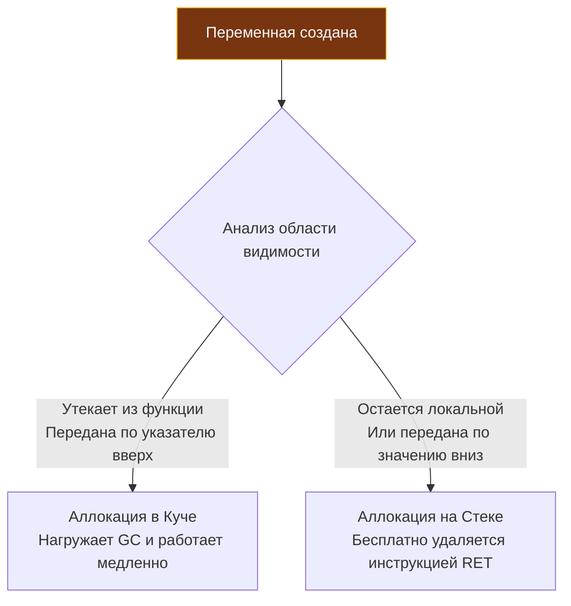

Если вы начинали свой путь в C или C++, слово «указатель» наверняка пробуждает в памяти тревожные ассоциации: адресная арифметика, коварные утечки памяти (memory leaks), висячие указатели (dangling pointers) и внезапный крах процесса с ошибкой `Segmentation fault`. Если же ваш инженерный бэкграунд сформирован в мире Java, C# или PHP, вы привыкли к неявным «ссылкам», когда виртуальная машина прячет от программиста физическую топологию данных в оперативной памяти.

Создатели Go нашли идеальный инженерный компромисс. Указатели в Go возвращают разработчику полный контроль над раскладкой памяти и эффективностью кэшей CPU (как в C++), оставаясь при этом **безопасными**. В языке Go на уровне спецификации запрещена адресная арифметика: вы не можете прибавить `1` к указателю, чтобы шагнуть на соседний байт в памяти (если только осознанно не воспользуетесь низкоуровневым пакетом `unsafe`).

В этой главе мы разберем физику указателей в регистрах CPU, выясним, почему возврат адреса локальной переменной в Go не приводит к катастрофе (погрузившись в алгоритм Escape Analysis), и развеем опасный миф о том, что передача структур по указателю «всегда быстрее».

---

## Физика указателя

Любая переменная в программе — это поименованная область физической или виртуальной памяти. Указатель — это обычная переменная, которая хранит **числовой адрес** этой области памяти в адресном пространстве процесса.

На современных 64-битных микропроцессорных архитектурах (amd64, arm64) любой указатель всегда занимает ровно **8 байт** (64 бита), вне зависимости от того, на что именно он ссылается — на крошечный байт `int8` или на массив структур размером в десятки мегабайт.

В синтаксисе Go используются два классических оператора:
- `&` (амперсанд) — операция взятия адреса: *«В какой ячейке памяти лежит эта переменная?»*
- `*` (звездочка) — операция разыменования: *«Прочитай или запиши данные по адресу, хранящемуся в указателе»*.

```go
package main

import "fmt"

func main() {
    var x int = 42
    var p *int = &x // p теперь хранит адрес x (например, 0xc0000100a8)
    
    *p = 100 // Разыменовываем p и меняем значение по этому адресу
    fmt.Println(x) // Выведет 100
}
```

> [!info] Под капотом: Mechanical Sympathy
> Когда процессор выполняет ассемблерную инструкцию записи по указателю `*p = 100`, он загружает 8 байт адреса из регистра общего назначения CPU (например, RAX) и передает его по шине адреса в контроллер памяти. Контроллер обращается к кэш-линии L1/L2 кэша данных и модифицирует биты. Если нужной линии нет в кэше ядра, возникает аппаратный **Cache Miss**: конвейер процессора замирает на сотни тактов, ожидая доставку данных из медленной динамической памяти (RAM).

---

## Escape Analysis: Сердце управления памятью Go

Понимание работы алгоритма Escape Analysis (анализа побега памяти) — водораздел между Junior, Middle и Senior инженерами.

Взгляните на код функции-конструктора, который в C/C++ посчитали бы фатальной ошибкой новичка:

```go
type User struct {
    Name string
}

func NewUser(name string) *User {
    u := User{Name: name}
    // Возвращаем указатель на ЛОКАЛЬНУЮ переменную
    return &u 
}
```

В C и C++ локальная переменная `u` создается во фрейме стека (Stack Frame) функции `NewUser`. В момент выхода из функции стек сбрасывается машинной инструкцией `RET`. Возвращенный указатель превращается в классический висячий указатель (Dangling Pointer). Попытка прочитать данные по нему приведет к чтению мусора либо мгновенному `Segmentation fault`.

В языке Go этот код **абсолютно надежен, безопасен и каноничен**. 

Почему? Потому что компилятор Go на этапе сборки проводит статический **Escape Analysis**. Компилятор строит граф потоков данных и рассуждает так: *«Указатель на структуру `u` возвращается наружу и переживает время жизни функции `NewUser`. Если оставить ее на стеке, память будет перезаписана. Следовательно, эта переменная сбегает (escapes)!»*.

Компилятор автоматически переносит аллокацию переменной `u` со стека в управляемую динамическую память — **Кучу (Heap)**.



> [!tip] Собеседование
> **Вопрос:** Как на практике выяснить, куда компилятор поместит конкретную переменную — на быстрый стек или в кучу?
> **Ответ:** Собрать бинарник с флагом трассировки решений оптимизатора: `go build -gcflags="-m" main.go`. Компилятор выведет детальные отчеты вроде `moved to heap: u` или `&u escapes to heap`.

---

## Миф: "Передавать по указателю всегда быстрее"

Самое распространенное заблуждение инженеров, пришедших из других языков, звучит так: *«Указатель весит 8 байт, а структура — 80 байт. Значит, передача по указателю всегда эффективнее, ведь мы копируем меньше памяти!»*.

В Go следование этому правилу способно катастрофически обрушить пропускную способность сервиса. Причина кроется в сочувствии к железу (Mechanical Sympathy):

1. **Давление на Garbage Collector (GC Pressure):** Аллокация на стеке выполняется бесплатно смещением регистра указателя стека `RSP`, а очищается мгновенно инструкцией `RET`. Перемещение объекта в Кучу (Heap) обязывает сборщик мусора (GC) отслеживать его жизненный цикл. Больше объектов в куче — чаще срабатывают фазы сканирования GC, выше паузы Stop-The-World и бесполезная утилизация CPU.
2. **Промахи мимо процессорного кэша (Cache Misses):** Данные на стеке или в плоских массивах лежат непрерывно. Аппаратный блок упреждающей выборки CPU (Hardware Prefetcher) заранее подгружает их в быстрый L1/L2 кэш. Обращение по указателю в кучу — это случайное блуждание по памяти (Pointer Chasing), гарантирующее промахи кэша.

**Инженерные ориентиры для бэкенда:**
- Передавайте переменную по указателю, только если функция обязана **мутировать** (изменить) оригинальное состояние вызывающей стороны.
- Передавайте структуры по значению (копированием), если их размер не превышает 64–128 байт (1–2 кэш-линии процессора). Скопировать 64 байта через регистры CPU занимает доли наносекунды — это в сотни раз быстрее, чем выделять память в куче и нагружать сборщик мусора.
- Применяйте указатели для действительно массивных структур данных (буферы, тяжелые конфигурации в килобайты памяти), где накладные расходы на копирование байтов превышают стоимость работы GC.

---

## Вызов методов на nil-указателе

В Go нулевое значение (Zero Value) неинициализированного указателя — это `nil`. Прямая попытка разыменовать пустой указатель (`*p`) немедленно завершится аварийной остановкой `panic: nil pointer dereference`.

Однако что произойдет, если вызвать метод структуры через `nil`-указатель?

```go
type User struct {
    Name string
}

func (u *User) Greet() {
    if u == nil {
        fmt.Println("Я безымянный призрак")
        return
    }
    fmt.Println("Привет, " + u.Name)
}

func main() {
    var u *User = nil
    u.Greet() // Упадет ли здесь паника?
}
```

Код отработает абсолютно корректно и напечатает: `"Я безымянный призрак"`. Никакой паники не возникнет!

> [!info] Под капотом
> В рантайме Go метод структуры — это синтаксический сахар над обычной изолированной функцией, в которую получатель (`receiver`) передается первым неявным аргументом. 
> Вызов `u.Greet()` компилятор преобразует в прямой вызов `User.Greet(u)`. 
> Передача адреса `nil` в функцию абсолютно законна. Паника вспыхнет лишь тогда, когда внутри метода процессор попытается разыменовать этот указатель, чтобы прочитать поле структуры (например, обратиться к `u.Name`), ведь это эквивалентно чтению по недопустимому физическому адресу `0x0`.

---

## Пакет unsafe: Обход системы типов

Хотя спецификация Go блокирует арифметику указателей, для низкоуровневого системного кода (написание аллокаторов, системных вызовов `syscall`, высокоскоростной сериализации в `encoding/json`) в стандартной библиотеке предусмотрен специальный шлюз — пакет `unsafe`.

Тип `unsafe.Pointer` позволяет обойти систему типов и преобразовать указатель любого типа в указатель любого другого типа. А целочисленный тип `uintptr` дает возможность выполнять математические операции над адресами памяти:

```go
package main

import (
    "fmt"
    "unsafe"
)

func main() {
    arr := [2]int{10, 20}
    
    // Получаем адрес первого элемента массива
    ptr := unsafe.Pointer(&arr[0])
    
    // Прибавляем к адресу 8 байт (размер int на 64-bit), чтобы перейти ко второму элементу.
    // Для математики приводим к uintptr, затем обратно в unsafe.Pointer и в *int
    nextPtr := (*int)(unsafe.Pointer(uintptr(ptr) + unsafe.Sizeof(arr[0])))
    
    fmt.Println(*nextPtr) // Выведет 20
}
```

> [!warning] Ловушка / Gotcha: Опасность uintptr
> Числовой тип `uintptr` — это обычное целое число, которое абсолютно непрозрачно для Garbage Collector. 
> Если сборщик мусора Go во время выполнения программы решит переместить стек горутины на новый участок памяти (что штатно происходит при динамическом росте стека), все настоящие указатели будут корректно скорректированы рантаймом. Но ваше значение `uintptr` останется прежним и превратится в мину замедленного действия, указывая на мертвую память. Это приводит к фантомным повреждениям данных в продакшене, которые невозможно воспроизвести в тестах.

---

## Итог

1. **Размер указателя:** Всегда 8 байт на 64-битных платформах (amd64, arm64). Указатель содержит виртуальный адрес памяти.
2. **Escape Analysis:** Компилятор самостоятельно определяет время жизни переменной. Возврат указателя на локальную переменную безопасен: она автоматически эвакуируется (escape) в кучу.
3. **Mechanical Sympathy:** Передача небольших объектов по значению эффективнее, чем по указателю: она использует регистры CPU, локализует кэш L1/L2 и освобождает Garbage Collector от лишней работы.
4. **Методы на nil:** Вызов метода на `nil`-указателе безопасен, пока код метода не пытается разыменовать поля объекта по адресу `0x0`.
5. **Пакет `unsafe`:** Предоставляет низкоуровневый доступ к памяти через `unsafe.Pointer` и `uintptr`, требуя максимальной осторожности из-за перемещения стеков рантаймом.

Освоив механику указателей и управление памятью, мы переходим к изучению того, как процессор размещает и обрабатывает однотипные коллекции данных. В следующей лекции — [[15. Массивы и их особенности]] — мы исследуем статические массивы в Go, узнаем, почему они копируются целиком, и поймем, как на их основе возводится главная динамическая структура языка — срез (slice).
