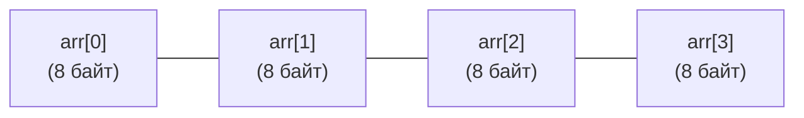

В динамических языках программирования (Python, PHP, JavaScript) словом «массив» привыкли называть гибкую, эластичную ленту, куда можно динамически добавлять разношерстные данные и менять ее длину по щелчку пальцев. В мире C и C++ массив — это просто указатель, указывающий на первый элемент непрерывного блока памяти, который компилятор беззастенчиво разыменовывает по правилам адресной арифметики.

В языке Go массив — это совершенно иная сущность: монолитная, строгая и статически зафиксированная по размеру конструкция. В реальном продакшен-коде на Go вы редко будете объявлять массивы напрямую, почти всегда отдавая предпочтение их динамической обертке — срезам (slices).

Однако без кристального понимания анатомии массива невозможно понять внутреннее устройство срезов, природу утечек памяти и основы оптимизации кода под архитектуру кэшей современных процессоров. Массив — это кремниевый фундамент коллекций. Давайте разберем, как он устроен на уровне физической памяти.

---

## Длина — это часть типа

Фундаментальное правило системы типов Go звучит так: **размер массива жестко зашит в его тип на этапе компиляции**.

Типы `[3]int` и `[5]int` для компилятора Go являются **двумя абсолютно разными, несовместимыми типами**, точно так же, как несовместимы `int` и `string`. Вы не можете присвоить массив одной длины массиву другой длины или передать `[3]int` в аргумент функции, ожидающей `[5]int`:

```go
package main

func main() {
    var a [3]int
    var b [5]int

    // a = b // Ошибка компиляции! Cannot use 'b' (type [5]int) as type [3]int
    _ = a
    _ = b
}
```

Благодаря такой строгости компилятор на этапе сборки вычисляет точный размер структуры в байтах и резервирует под нее память во фрейме стека без единой динамической аллокации.

### Синтаксис инициализации

Go предоставляет несколько лаконичных способов создания массивов:

```go
// Массив инициализирован нулевыми значениями (Zero Values)
var zeros [5]int 

// Инициализация с явным заданием значений
primes := [4]int{2, 3, 5, 7}

// Компилятор сам посчитает длину благодаря оператору [...]
magic := [...]string{"Go", "Rust", "C++"} // Тип будет выведен как [3]string

// Инициализация по индексам (остальные элементы будут заполнены нулями 0)
sparse := [10]int{0: 42, 9: 100} 
```

---

## Mechanical Sympathy: Идеальная структура для CPU

С точки зрения кремния и архитектуры микропроцессоров массив в Go — это совершенная структура данных. В оперативной памяти он размещается единым непрерывным блоком байт, где элементы уложены строго друг за другом без каких-либо служебных заголовков, смещений или скрытых указателей.

Если вы объявляете массив `var arr [4]int64`, компилятор выделит в памяти ровно 32 байта (4 элемента по 8 байт):



> [!info] Под капотом: CPU Prefetcher
> Почему непрерывность данных в памяти так критична для высокой производительности?
> В современных процессорах трудится аппаратный блок упреждающей выборки (Hardware Prefetcher). Когда процессор считывает элемент `arr[0]`, контроллер памяти загружает из RAM в L1-кэш не один элемент, а всю **кэш-линию** (обычно ровно **64 байта**). 
> Prefetcher мгновенно распознает линейный шаблон доступа к памяти и в фоновом режиме подтягивает следующие кэш-линии из памяти еще до того, как конвейер CPU запросит следующий элемент. Итерация по непрерывному массиву — это самая быстрая операция, на которую способно железо. В отличие от связных списков или деревьев, здесь практически отсутствуют промахи кэша (Cache Misses).

---

## Массивы передаются по значению

В классическом C имя массива автоматически распадается (decays) до обычного указателя на его нулевой элемент. Поэтому в C вы всегда передаете в функцию легковесный 8-байтный адрес.

**В Go массивы обладают семантикой значений (Value Semantics).**
При присваивании массива новой переменной или при передаче его в функцию компилятор производит **полную побитовую копию всего массива**:

```go
func modify(arr [3]int) {
    arr[0] = 999 // Меняем КОПИЮ
}

func main() {
    original := [3]int{1, 2, 3}
    modify(original)
    fmt.Println(original[0]) // Выведет 1, оригинал не изменился!
}
```

> [!warning] Ловушка / Gotcha: Скрытое копирование
> Если вы объявите массив `var data[1000000]int` (занимающий около **8 Мегабайт** памяти) и передадите его в функцию по значению, рантайм будет вынужден скопировать все 8 МБ на стек вызываемой функции.
> Это приведет к бессмысленной трате сотен тысяч тактов CPU на копирование через инструкции SIMD и может мгновенно переполнить дефолтный 2-килобайтный стек горутины, вызвав тяжелую операцию расширения стека (Stack Growth) с перемещением фрейма в новый участок памяти.

Если передача массива необходима без копирования, передают явный указатель на массив `*[3]int`. Язык Go избавляет от необходимости писать громоздкое разыменование `(*arr)[0]` — синтаксис индексатора автоматически работает по указателю:

```go
// Передача указателя на массив
func modifyPtr(arr *[3]int) {
    arr[0] = 999 
    // В Go не нужно писать (*arr)[0], синтаксис позволяет обращаться к индексу напрямую
}
```

---

## Где массивы реально используются?

Если в 99% случаев в Go-коде применяются срезы, зачем массивы вообще сохранены в языке?

1. **Криптография и безопасность:**
   В криптографических алгоритмах размер хэша строго фиксирован математически. Функция `sha256.Sum256` из стандартной библиотеки возвращает именно фиксированный массив `[32]byte`, а не динамический слайс. Популярная библиотека работы с UUID (`github.com/google/uuid`) хранит идентификатор внутри структуры как массив `[16]byte`. Это дает железную гарантию компилятора, что размер хэша не изменится и не будет случайно урезан в рантайме.
2. **Нулевые аллокации (Zero Allocation):**
   Поскольку длина массива известна на этапе компиляции, компилятор размещает локальный массив прямо на быстром стеке горутины. Временный буфер чтения сетевых пакетов вида `[4096]byte` на стеке не создает ни малейшей нагрузки на сборщик мусора (Garbage Collector).
3. **Фундамент для слайсов:**
   Срез (slice) не может существовать сам по себе. Под капотом любого среза **всегда** располагается непрерывный базовый массив.

> [!tip] Собеседование
> **Вопрос:** Вы написали `a := [3]int{1, 2, 3}` и `b := [3]int{1, 2, 3}`. Можно ли сравнить их через оператор `a == b`? А если это срезы (slices)?
> **Ответ:** Массивы можно напрямую сравнивать оператором `==` (если их элементы поддерживают сравнение). Компилятор выполнит побитовое сравнение значений.
> Срезы сравнивать через оператор `==` **запрещено** спецификацией языка (допускается только сравнение с `nil`). Поскольку срез является трехсловной ссылочной структурой, неявно сравнивать указатели или глубоко сравнивать элементы компилятор отказывается во избежание двусмысленности.

---

## Итог

1. **Длина — часть типа:** Тип `[3]int` несовместим с `[5]int`. Размер массива неизменяем после компиляции.
2. **Идеальная топология памяти:** Массив представляет собой монолитный блок в оперативной памяти, оптимизированный под работу аппаратного предвыборщика CPU (Hardware Prefetcher).
3. **Value Semantics:** Передача массива означает побитовое копирование всех его элементов. Избегайте передачи больших массивов без указателей.
4. **Сравнение:** Массивы сравниваемы через `==`, в отличие от срезов.
5. **Применение:** Криптографические хэши (`[32]byte`), стековые буферы для исключения аллокаций и базовый фундамент для слайсов.

Массив — это крепкий, но статичный фундамент. Чтобы дать программистам динамическую гибкость без потери производительности непрерывной памяти, создатели Go надстроили над массивами изящную структуру — слайс (slice). 

В следующей лекции мы переходим к главной рабочей лошадке языка Go: [[16. Slice. Главная структура данных в Go]].
