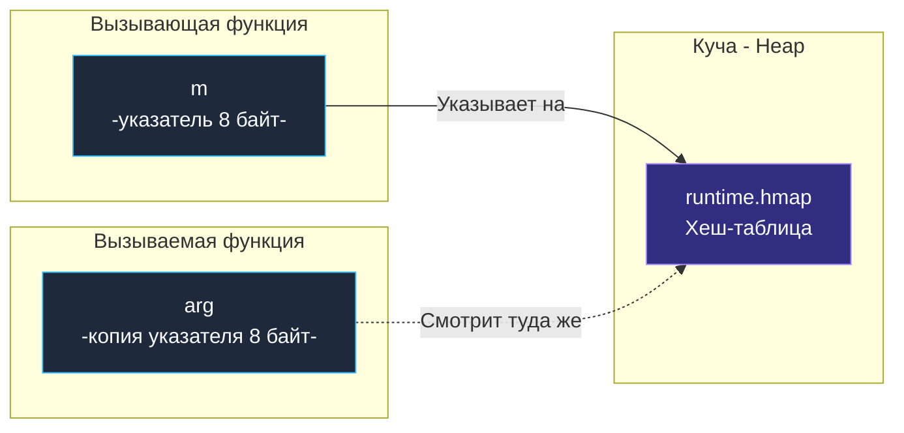

В стандартной библиотеке C++ тип `std::map` реализован как красно-черное дерево с логарифмической сложностью поиска $O(\log N)$. Если разработчику требуется классическая ассоциативная таблица, ему приходится явно подключать `std::unordered_map`.

Создатели Go подошли к вопросу с чисто практической точки зрения Bell Labs: ассоциативный массив на бэкенде в 99% случаев используется для сверхбыстрого кэширования, индексации и поиска за константное время. Поэтому встроенный в язык тип `map` всегда и везде представляет собой высокоэффективную **хеш-таблицу (Hash Table)**, обеспечивающую среднюю сложность поиска, вставки и удаления за $O(1)$.

В этой главе мы изучим синтаксис и коварные ловушки (gotchas) при работе с хеш-таблицами, выясним, почему итерация по мапе заставляет нервничать разработчиков из мира PHP, как мапы физически передаются в функции и почему рантайм Go беспощадно уничтожает процесс при обнаружении конкурентной записи.

---

## Инициализация: Главная ловушка с nil

Как и срезы, хеш-таблицу в Go можно инициализировать несколькими способами. И здесь заложена одна из самых частых причин аварийных остановок Go-сервисов в продакшене:

```go
package main

// 1. Nil-мапа (не аллоцирована)
var m1 map[string]int 

// 2. Пустая мапа (аллоцирована)
m2 := map[string]int{} 

// 3. Мапа с преаллокацией (Лучшая инженерная практика!)
m3 := make(map[string]int, 100) 
```

> [!warning] Ловушка / Gotcha: Чтение vs Запись в nil-мапу
> В отличие от срезов, где функция `append` спокойно принимает `nil`-срез и самостоятельно выделяет под него память, **попытка записи в `nil`-мапу приводит к мгновенной фатальной панике (`panic: assignment to entry in nil map`)**:
> ```go
> var cache map[string]string
> cache["user_1"] = "data" // ПАНИКА! Программа падает.
> ```
> При этом **чтение** из `nil`-мапы абсолютно законно и безопасно! Оно никогда не паникует, а просто возвращает нулевое значение (Zero Value) соответствующего типа. Выражение `val := cache["user_1"]` спокойно вернет пустую строку `""`.
> 
> *Инженерное правило:* если ваша структура данных содержит мапу, всегда инициализируйте ее в фабричном конструкторе (`New...()`) через `make`.

### Преаллокация и Mechanical Sympathy

Инициализация через конструкцию `make(map[K]V, capacity)` — это признак зрелого кода. Если вам заранее известно, что в таблицу будет загружено 10 000 записей пользователей, укажите это число немедленно. 

Рантайм Go заблаговременно выделит необходимое число корзин (бакетов, buckets) в куче. Если преаллокацию проигнорировать, по мере наполнения таблицы рантайм будет вынужден многократно запускать тяжелую процедуру **эвакуации (rehashing)**: запрашивать новые массивы памяти, пересчитывать хэши и разносить ключи по новым бакетам, создавая паразитные паузы и нагружая процессор.

---

## Базовые операции и идиома Comma Ok

Чтение несуществующего ключа в Go намеренно спроектировано без паник: оно возвращает стандартное нулевое значение (`Zero Value`):

```go
m := make(map[string]int)
m["alice"] = 25

age := m["bob"] 
fmt.Println(age) // Выведет 0. Но 0 может быть и реальным возрастом новорожденного!
```

Как достоверно отличить реальный ноль от полного отсутствия ключа в словаре? Для этого в Go принята классическая идиома **«Comma Ok»**:

```go
if age, exists := m["bob"]; exists {
    fmt.Printf("Боб найден, ему %d лет\n", age)
} else {
    fmt.Println("Боба нет в базе")
}
```

Для удаления элементов используется встроенная функция `delete`:

```go
delete(m, "alice")
delete(m, "charlie") // Безопасно! Удаление несуществующего ключа ничего не делает.
```

---

## Требования к ключам: Что такое Comparable?

В Go нельзя использовать произвольный тип данных в роли ключа мапы. Ключ обязан удовлетворять системному требованию **сравнимости (comparable)**. Это означает, что для типа на этапе компиляции должны быть строго определены операторы проверки равенства `==` и `!=`.

- **Разрешено использовать:** базовые типы `int`, `float64`, `string`, `bool`, указатели, интерфейсы, массивы фиксированной длины и **структуры**, если все их поля являются сравнимыми.
- **Запрещено использовать:** срезы (slices), хеш-таблицы (maps) и функции (functions).

> [!tip] Собеседование
> **Вопрос 1:** Можно ли использовать структуру в качестве ключа мапы?
> **Ответ:** Да, если ни одно из полей структуры не является слайсом, мапой или функцией. Процессор производит сравнение таких структур побитово, поле за полем.
> 
> **Вопрос 2:** Что произойдет, если использовать `float64` в качестве ключа мапы?
> **Ответ:** Формально компилятор это разрешит. Однако спецификация вещественных чисел IEEE-754 таит в себе ловушки: ошибки округления и существование значения `NaN` (Not a Number), которое по стандарту не равно самому себе (`NaN != NaN`). Записав значение по ключу `math.NaN()`, вы никогда не сможете извлечь его обратно прямым поиском. Использование чисел с плавающей точкой в роли ключей — классический инженерный выстрел в ногу.

---

## Итерация по мапе: Намеренный хаос

В ряде языков (например, в PHP или в упорядоченных коллекциях C# `Dictionary`) разработчики привыкают к тому, что ассоциативный массив помнит хронологию вставки ключей.

В Go итерация по хеш-таблице с помощью `for range` **принципиально не гарантирует никакого порядка**. Более того, порядок обхода элементов будет **разным** при каждом новом запуске цикла!

```go
m := map[int]string{1: "A", 2: "B", 3: "C"}
for k, v := range m {
    fmt.Printf("%d:%s ", k, v)
}
// Запуск 1: 2:B 1:A 3:C
// Запуск 2: 3:C 2:B 1:A
```

> [!info] Под капотом: Почему рантайм перемешивает ключи?
> На заре разработки (до релиза Go 1.0) порядок обхода зависел от физического расположения элементов по бакетам. Программисты подмечали этот порядок и неявно строили на нем бизнес-логику. Но как только объем данных возрастал и происходил внутренний *rehash*, порядок внезапно рушился, ломая продакшен.
> 
> Создатели языка применили гениальное воспитательное решение: в рантайм была внедрена **намеренная рандомизация**. При каждом старте цикла `for range` генератор случайных чисел рантайма выбирает случайный номер стартового бакета и случайное смещение внутри него. 
> Философия проста: если спецификация языка не обещает порядка, рантайм обязан гарантировать, что вы не сможете опереться на случайную закономерность.

Если вашей задаче требуется детерминированный порядок вывода, алгоритм прост: извлеките ключи в отдельный срез, отсортируйте его с помощью `sort.Strings` или `slices.Sort` и обойдите срез.

---

## Мапа передается по ссылке? (Снова иллюзия)

Вспомним фундаментальный закон из лекции [[10. Функции. Аргументы, return, multiple return values]]: **в языке Go абсолютно всё передается строго по значению**. Почему же модификация мапы внутри функции немедленно отражается на вызывающем коде?

Потому что тип `map[K]V` на машинном уровне — это синтаксический сахар над обычным указателем. Физически переменная мапы представляет собой 8-байтный указатель на структуру `runtime.hmap`, размещенную в куче (Heap):



Когда вы передаете мапу в функцию, процессор копирует эти 8 байт адреса. И оригинальная переменная, и аргумент функции указывают на один и тот же адрес заголовка `runtime.hmap`.

> [!warning] Ловушка / Gotcha
> Никогда не объявляйте параметры функций как указатели на мапу: `func process(m *map[string]int)`. Это бессмысленная двойная косвенность (указатель на указатель), которая лишь запутывает архитектуру, добавляет лишнее разыменование в памяти и снижает производительность. Мапа уже сама по себе является легковесным указателем.

---

## Потокобезопасность (Thread Safety)

Встроенные мапы Go **категорически не являются потокобезопасными**.

Если одна горутина выполняет чтение из мапы, а другая в этот же миллисекундный отрезок производит запись (или обе горутины пишут одновременно), рантайм мгновенно завершит процесс фатальной аппаратной ошибкой:
```text
fatal error: concurrent map read and map write
```

Эту ошибку **невозможно перехватить** через `recover()`. Она намеренно обходит механизм паник и вызывает жесткий аварийный `abort` на уровне ядра операционной системы. 

Почему так жестоко? Потому что конкурентная запись без синхронизации способна повредить внутренние указатели бакетов в `hmap`, что привело бы к незаметному разрушению памяти процесса. Рантайм детектирует гонку по битовому флагу `hashWriting`, проверяемому перед каждой операцией с бакетами.

Если требуется параллельный доступ к словарю из разных потоков, применяют два стандартных подхода:
1. Защита стандартной мапы с помощью мьютекса `sync.RWMutex`.
2. Использование специализированной структуры `sync.Map` из стандартной библиотеки (эффективной в ситуациях, когда ключи записываются один раз, а читаются миллионы раз).

*(Подробный разбор многопоточных структур данных мы проведем в главе [[40. sync.WaitGroup, Mutex, RWMutex]]).*

---

## Итог

1. **`map`** — встроенная хэш-таблица с амортизированной сложностью $O(1)$ для поиска, вставки и удаления.
2. **Семантика nil:** Чтение из `nil`-мапы возвращает нулевые значения (`Zero Value`). Запись в `nil`-мапу вызывает немедленную панику. Инициализируйте мапы через `make`.
3. **Преаллокация:** Указание размера в `make(map, size)` (или `make(map[K]V, capacity)`) исключает дорогостоящие операции повторного хэширования (rehashing).
4. **Comma Ok:** Единственный надежный способ отличить присутствие нулевого значения от отсутствия ключа: `val, ok := m[key]`.
5. **Сравнимость ключей:** Ключом может быть любой тип, для которого компилятор поддерживает операторы `==` и `!=` (тип `comparable`).
6. **Рандомизация обхода:** Порядок итерации намеренно случаен при каждом вызове `range`, чтобы предотвратить скрытые зависимости от порядка корзин.
7. **Потокобезопасность:** Доступ без мьютексов при параллельной записи вызывает неустранимый фатальный крах `fatal error: concurrent map read and map write`.

Мы рассмотрели синтаксис и правила безопасной работы с мапами. Но как устроена хэш-таблица на самом низком уровне? Как Go разрешает коллизии хэшей? Почему размер бакета равен строго 8 слотам и как происходит постепенная эвакуация данных без остановки всей программы?

Ответы на эти вопросы мы узнаем в следующей лекции: [[19. Map под капотом. hmap, buckets и рост]].
