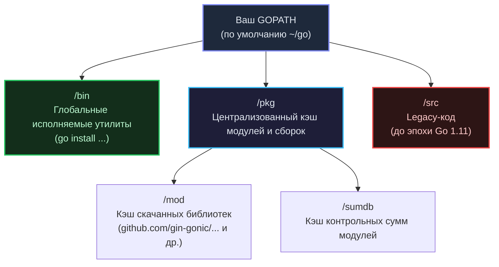

Установка среды Go на современную операционную систему предельно тривиальна: достаточно скачать официальный дистрибутив или воспользоваться пакетным менеджером платформы (`brew install go` на macOS или `apt install golang` в Linux). Любой опытный инженер за минуту пропишет путь к исполняемым файлам в переменную окружения `PATH`.

Однако за этой кажущейся простотой скрывается особая организация рабочего пространства и файловой системы. Понимание взаимодействия компилятора с путями на диске — это не просто теоретический экскурс, а базовое требование для прохождения архитектурных собеседований, настройки CI/CD-пайплайнов и сборки легковесных Docker-образов.

---

## Две главные переменные: GOROOT и GOPATH

Когда тулчейн (toolchain) Go приступает к сборке проекта, ему требуется однозначно разрешить два вопроса:
1. Где физически расположены бинарники самого языка, компилятор и стандартная библиотека?
2. Где находятся исходники ваших собственных проектов и кэш сторонних модулей?

За эти зоны ответственности исторически отвечают две системные переменные окружения — `GOROOT` и `GOPATH`.

### GOROOT: Дом для самого Go
Переменная `GOROOT` указывает на системный каталог, куда распакован дистрибутив языка Go (по умолчанию это `/usr/local/go` в Linux/macOS или `C:\Program Files\Go` в Windows). 

Внутри этого каталога находится неизменяемый фундамент платформы:
- `bin/` — исполняемые бинарники компилятора (`go`), форматировщика исходников (`gofmt`) и вспомогательных утилит;
- `src/` — полные исходные тексты **стандартной библиотеки** (пакеты `fmt`, `net/http`, `os`, `runtime` и многие другие);
- `pkg/` — предкомпилированные пакетные файлы стандартной библиотеки, ускоряющие процесс компоновки.

> [!info] Под капотом
> В современных версиях языка (начиная с релиза Go 1.10) вам **практически никогда не требуется экспортировать GOROOT вручную**. Исполняемый файл `go` вычисляет свой базовый путь автоматически относительно точки запуска на диске. Ручное переопределение переменной `GOROOT` требуется исключительно при локальной сборке нестандартной версии компилятора из ветки `master` или при переключении между несколькими версиями с помощью специализированных менеджеров вроде `gvm`.

---

### GOPATH: Историческое наследие и современность

Переменная `GOPATH` определяет единое рабочее пространство (**Workspace**) разработчика.

Язык Go создавался внутри поискового гиганта Google, где весь исходный код компании исторически хранится в едином колоссальном монорепозитории. Ранние версии Go (вплоть до версии 1.10) унаследовали эту монолитную философию: инструмент ожидал, что абсолютно все ваши проекты, утилиты и скачанные сторонние библиотеки будут собраны под одной корневой директорией (по умолчанию `~/go`).

Классический `GOPATH` строго делился на три подкаталога:
1. `src/` — исходники **всех** ваших проектов и внешних репозиториев (например, `~/go/src/github.com/user/project`);
2. `pkg/` — скомпилированные промежуточные объектные файлы (`.a`);
3. `bin/` — готовые исполняемые бинарники ваших программ и инструментов.

**Фатальная проблема старого подхода:** Единое дерево исходников делало невозможным сосуществование двух разных версий одной и той же библиотеки на одном компьютере. Если проекту `A` требовалась версия `v1.0.0`, а проекту `B` — `v2.0.0`, возникал неразрешимый версионный конфликт в папке `~/go/src/`.

#### Эпоха Go Modules (Наше время)

Начиная с релиза Go 1.11 (и окончательно закрепившись в статусе безальтернативного стандарта в Go 1.13), язык перешел на современную децентрализованную систему версионирования — **Go Modules**.

Теперь разработчик **не обязан** держать свои исходные коды внутри каталога `GOPATH/src`. Вы можете создать каталог проекта в любой точке файловой системы и инициализировать изолированный модуль командой `go mod init`. (Все тонкости работы модульной системы мы детально исследуем в лекции [[28. Модули и go.mod]]).

> [!tip] Собеседование
> **Вопрос:** Используется ли переменная GOPATH в современном Go в эпоху Go Modules?
> **Ответ:** Да, используется повсеместно, но ее архитектурная роль кардинально изменилась. `GOPATH` больше не диктует местоположение ваших репозиториев, однако выступает централизованным кэшем окружения:
> 1. `GOPATH/pkg/mod` — глобальное хранилище скачанных сторонних зависимостей. Это неизменяемый (read-only) кэш: конкретная версия внешней библиотеки скачивается из сети ровно один раз и переиспользуется всеми проектами на машине.
> 2. `GOPATH/bin` — каталог, куда устанавливаются бинарные утилиты при вызове команды `go install` (линтеры, генераторы моков, protobuf-плагины). Этот каталог настоятельно рекомендуется добавить в системную переменную `$PATH`.



---

## Первая программа

Создадим отдельную директорию в любом удобном каталоге файловой системы (вне устаревшего пути `GOPATH/src`), например `~/projects/hello-go`.

Создадим файл `main.go`:

```go
package main

import (
	"fmt"
	"runtime"
)

func main() {
	fmt.Println("Hello, System!")
	fmt.Printf("OS: %s<br>Arch: %s\n", runtime.GOOS, runtime.GOARCH)
}
```

### Разбор структуры

1. `package main` — фундаментальная декларация пакета. Она сообщает компилятору, что данный файл предназначен для сборки исполняемого бинарного файла, а не разделяемой библиотеки. Компилятор Go сгенерирует точку входа только при наличии пакета `main` и функции `main()`.
2. `import` — блок явного подключения зависимостей. Компилятор Go бескомпромиссен: **если модуль импортирован, но ни разу не вызван в тексте файла, сборка завершится с ошибкой**. Это исключает попадание мертвого кода в исполняемый файл.
3. `func main()` — системная точка входа (`Entry point`). В Go функция `main()` не принимает параметров (аргументы командной строки считываются через срез `os.Args`) и не возвращает код завершения (код выхода операционной системе передается через вызов `os.Exit()`).

> [!warning] Ловушка / Gotcha
> Вызов пользовательской функции `main()` выполняется **далеко не первым**.  
> До того как процессор передаст управление первой строчке вашей функции `main()`, рантайм Go инициализирует структуры планировщика, поднимает сборщик мусора, а затем последовательно вызывает функции инициализации `init()` во всех импортированных пакетах и в самом пакете `main`. Данный механизм нередко используют драйверы баз данных для неявной саморегистрации, однако злоупотребление логикой в `init()` ведет к трудноуловимым сайд-эффектам.

---

## Компиляция и Mechanical Sympathy

Тулчейн Go предлагает две базовые команды для работы с кодом:
* `go run` — компилирует программу во временный каталог операционной системы и немедленно передает управление на исполнение;
* `go build` — генерирует готовый бинарный артефакт в текущей рабочей директории.

Выполним прямую компиляцию:

```bash
go build -o app main.go
./app
```

**Что мы получили на диске?**  
В отличие от виртуальных сред Java или платформы .NET, на выходе создается нативный бинарный исполняемый файл платформы: формат **ELF** в Linux, **Mach-O** в macOS или **PE** в Windows.

Исследуем полученный файл с помощью стандартной Unix-утилиты (в окружении Linux):
```bash
file ./app
# Вывод: app: ELF 64-bit LSB executable, x86-64, version 1 (SYSV), statically linked, Go BuildID=..., not stripped
```

Обратите внимание на ключевую характеристику: **statically linked** (или *dynamically linked* при определенных флагах).

### Влияние CGO_ENABLED

В Go встроен мощный мост взаимодействия с библиотеками на языке Си — инструмент `cgo`. По умолчанию он активен (`CGO_ENABLED=1`). Если программа или ее внутренние зависимости (например, сетевой пакет `net` или `os/user`) задействуют возможности Си, результирующий бинарник будет **динамически слинкован** с системной библиотекой `libc` вашей текущей операционной системы (например, `glibc` в Ubuntu).

Чем это грозит серверному инженеру?  
Если вы соберете бинарник на машине под управлением Ubuntu (где используется `glibc`) и скопируете его в ультралегкий контейнер Docker на базе Alpine Linux (где используется альтернативная библиотека `musl libc`), **программа откажется запускаться с загадочной ошибкой `file not found`**. Ядро Linux просто не сможет обнаружить динамический загрузчик `ld-linux.so`, зашитый в заголовок ELF-файла.

Чтобы гарантировать создание истинно автономного, на 100% статически слинкованного артефакта (который запускается даже в пустом Docker-образе `scratch`, где нет ничего, кроме системных вызовов ядра), собирайте проект с отключенным cgo:

```bash
CGO_ENABLED=0 go build -o app main.go
```

При флаге `CGO_ENABLED=0` компилятор Go подменяет системные вызовы Си (например, резолвер DNS) собственными реализациями на чистом Go (`pure Go`). Бинарник становится полностью самодостаточным: он взаимодействует с ядром операционной системы напрямую через системные вызовы (`syscalls`), игнорируя внешние динамические библиотеки.

---

## Итог

1. **GOROOT** — каталог с компилятором и стандартной библиотекой языка. В 99% случаев определяется автоматически.
2. **GOPATH** — в эпоху Go Modules служит глобальным кэшем модулей (`GOPATH/pkg/mod`) и каталогом для установленных утилит командной строки (`GOPATH/bin`).
3. Исполняемое приложение всегда берет начало с директивы `package main` и точки входа `func main()`.
4. Использование переменной `CGO_ENABLED=0` при вызове `go build` создает полностью статически слинкованный бинарник, идеальный для микроконтейнеров `scratch`.

В следующей лекции [[3. go run, go build, go test и базовый toolchain]] мы детально исследуем встроенный инструментарий платформы: разберем флаги компилятора, детектор гонок данных (`race detector`) и запуск тестов без внешних систем сборки вроде Make или CMake.
