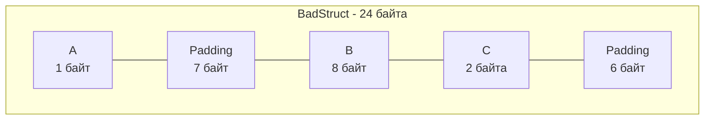

В классических объектно-ориентированных языках (Java, C#, PHP) главным строительным кирпичиком прикладной архитектуры является «Класс» (Class). Класс смешивает воедино состояние (поля данных), поведение (методы), сокрытие реализации и сложную невидимую машинерию (таблицы виртуальных методов vtable для реализации полиморфизма и наследования).

В языке Go классов нет вовсе. Создатели языка вернулись к традициям Bell Labs: данные и поведение должны быть строго и ортогонально разделены. Для описания данных в Go используется **структура (`struct`)** — прозрачный, легковесный и предсказуемый составной тип данных, представляющий собой строго непрерывный блок оперативной памяти.

В этой главе мы препарируем анатомию структур, выясним, почему порядок объявления полей кардинально влияет на объем потребляемой памяти (Memory Padding), и исследуем уникальную «нулевую структуру» `struct{}`, ставшую стандартом в высокопроизводительных микросервисах.

---

## Синтаксис и Zero Value

Структура объединяет несколько поименованных полей различных типов под общим типом:

```go
package main

import "time"

type User struct {
    ID        int64
    Email     string
    IsActive  bool
    CreatedAt time.Time
}
```

Как и любая переменная в Go, структура гарантированно и безопасно инициализируется рантаймом. При объявлении `var u User` рантайм выделяет непрерывный кусок памяти и заполняет каждое поле его нулевым значением (Zero Value):
- `ID` получает `0`
- `Email` получает пустую строку `""`
- `IsActive` получает `false`
- `CreatedAt` получает нулевое значение времени `time.Time{}` (0001-01-01).

Никаких неинициализированных указателей и коварных `NullReferenceException` при чтении `u.ID` не может возникнуть в принципе.

### Анонимные структуры

Если структура необходима лишь один раз (например, при парсинге локального фрагмента JSON, конфигурации или в табличных тестах Table-Driven Tests), объявлять для нее глобальный `type` не обязательно. Язык позволяет объявить анонимную структуру по месту:

```go
config := struct {
    Host string
    Port int
}{
    Host: "localhost",
    Port: 8080,
}
```

---

## Mechanical Sympathy: Выравнивание памяти (Padding)

Это фундаментальный раздел низкоуровневой оптимизации. Непонимание этого механизма приводит к тому, что структуры в оперативной памяти раздуваются в 1.5–2 раза по сравнению с реальным объемом полезных данных.

Процессор не считывает оперативную память по отдельным байтам: шина данных обращается к памяти «машинными словами» (Words). На 64-битной микроархитектуре слово составляет **8 байт**. Чтобы процессор мог загрузить значение в регистр за один такт CPU, компилятор обязан размещать переменные по физическим адресам, кратным их размеру. Это требование называется **выравниванием памяти (Memory Alignment)**.

Например, 64-битное целое число `int64` (8 байт) обязано начинаться с адреса, кратного 8. Если разместить его со смещением, процессору потребуется совершить два цикла чтения из памяти и склеить половинки битовыми сдвигами в регистрах ALU, что обрушит скорость вычислений.

Чтобы гарантировать выравнивание, компилятор Go вставляет между полями невидимые пустые байты — **Padding**.

Рассмотрим хрестоматийный пример неоптимальной структуры:

```go
type BadStruct struct {
    A int8   // 1 байт
    B int64  // 8 байт
    C int16  // 2 байта
}
```

Сколько памяти должна занимать `BadStruct`? Теоретический расчет: $1 + 8 + 2 = 11$ байт.
Однако если мы запросим физический размер через `unsafe.Sizeof(BadStruct{})`, мы получим **24 байта**! Куда бесследно исчезли еще 13 байт?

1. Поле `A` занимает 1 байт.
2. Полю `B` (8 байт) требуется адрес, кратный 8. Компилятор вставляет **7 пустых байт** отступа (Padding) сразу после `A`.
3. Поле `B` занимает следующие 8 байт.
4. Поле `C` занимает 2 байта (смещение 16 кратно 2).
5. Итоговый размер структуры обязан быть кратен ее самому крупному полю (8 байт), чтобы при создании непрерывного массива таких структур следующий элемент начинался с правильного адреса. Сумма $1 + 7 + 8 + 2 = 18$ байт. Ближайшее кратное восьми число — 24. Компилятор дописывает еще **6 пустых байт** в хвост структуры!



### Как это починить?

Золотое правило проектирования структур в Go: **сортируйте поля по убыванию их размера (от самых больших к самым маленьким)**.

```go
type GoodStruct struct {
    B int64  // 8 байт
    C int16  // 2 байта
    A int8   // 1 байт
}
```

Проведем повторный расчет:
1. `B` занимает 8 байт (адреса 0–7).
2. `C` (2 байта) ложится сразу следом (адреса 8–9, смещение 8 кратно 2, выравнивание соблюдено без отступа).
3. `A` (1 байт) ложится на байт 10.
4. Текущий размер — 11 байт. Дополняем структуру до кратности 8 байтам: получаем **16 байт** (всего 5 байт отступа в хвосте).

Мы сократили объем структуры на 8 байт (с 24 до 16 байт — экономия 33% памяти), просто поменяв порядок строк в исходном коде! В кэше из миллиона таких объектов вы мгновенно экономите 8 Мегабайт RAM и резко увеличиваете плотность размещения данных в кэш-линиях L1/L2.

> [!tip] Собеседование
> **Как автоматизировать поиск невыровненных структур в большом проекте?**
> Ручной подсчет байтов контрпродуктивен. В экосистеме Go существует специализированный статический анализатор. При запуске `golangci-lint` с активированным линтером `fieldalignment` (ранее известным как `maligned`), линтер автоматически находит структуры с неоптимальным порядком полей и подсказывает точную перестановку, сообщая, сколько байт памяти будет сэкономлено.

---

## Пустая структура struct{} и zerobase

Один из самых выразительных идиоматичных приемов Go — применение пустой структуры `struct{}`:

```go
package main

import (
    "fmt"
    "unsafe"
)

func main() {
    var empty struct{}
    fmt.Println(unsafe.Sizeof(empty)) // Выведет 0!
}
```

Структура без полей занимает **строго 0 байт**.
В главе [[16. Slice. Главная структура данных в Go]] мы уже упоминали системную переменную рантайма `zerobase`. Все указатели на динамически созданные структуры нулевого размера ссылаются на этот единственный статический адрес `zerobase`. Вы можете создать миллиард пустых структур — они не потратят ни одного байта оперативной памяти.

### Практическое применение

**1. Реализация множества (Set) через Map**
В Go нет отдельного типа `Set` (коллекции уникальных значений). Его эмулируют с помощью хэш-таблицы, где значениями служат пустые структуры:

```go
// Идеальный In-Memory Set. Значения не занимают память!
visitedURLs := make(map[string]struct{})

visitedURLs["https://google.com"] = struct{}{}

if _, exists := visitedURLs["https://google.com"]; exists {
    // URL уже посещен
}
```
Если бы вместо этого использовалась `map[string]bool`, каждое значение отнимало бы 1 байт на флаг `true`.

**2. Каналы сигналов (Signal Channels)**
Когда горутине требуется передать событие (сигнал пробуждения или завершения), а передаваемые данные не имеют значения, объявляют канал пустых структур:

```go
done := make(chan struct{})
// Отправка 0 байт данных. Идеальный сигнал!
done <- struct{}{} 
```

---

## Теги структур (Struct Tags)

Поскольку поля структуры в памяти — это сырые типизированные байты, внешние сериализаторы (JSON, Protobuf, XML) или ORM-драйверы баз данных не знают, как проецировать эти поля на внешние протоколы.

Для этой задачи в Go введены **Теги структур (Struct Tags)** — строковые метаданные, указываемые после типа поля в обратных апострофах:

```go
type User struct {
    ID       int64  `json:"id" db:"user_id"`
    Password string `json:"-"` // Тире означает: игнорировать поле при JSON-сериализации
}
```

> [!info] Под капотом: Теги и Рефлексия
> Теги **не влияют на компиляцию** кода и не содержат исполняемой логики. Компилятор просто вшивает эти строковые литералы в секцию метаданных типа бинарника (в низкоуровневую структуру `_type`).
> Для чтения тегов библиотеки сериализации (например, `encoding/json`) используют механизм рефлексии (пакет `reflect`). В рантайме парсер считывает строку тега, разбивает ее через `strings.Split` и определяет правила мапинга. Поскольку рефлексия создает ощутимый оверхед, в высоконагруженных шлюзах применяют библиотеки с предварительной кодогенерацией (например, `easyjson`), которые компилируют методы сериализации в прямой нативный код без рефлексии.

---

## Передача структуры по значению

Вспомним лекцию [[14. Указатели в Go]]: в языке Go господствует семантика передачи по значению (Pass by value). 
Если структура занимает 128 байт, передача ее в функцию по значению приведет к честному побитовому копированию всех 128 байт:

```go
func process(u User) {
    u.IsActive = true // Мутирует КОПИЮ! Оригинал не изменится.
}
```

**Когда оправдано использование указателя `*User`?**
1. Когда логика функции обязана **мутировать** оригинальное состояние структуры вызывающей стороны.
2. Когда структура имеет большой вес (сотни байт и выше), и ее постоянное копирование создает избыточную нагрузку на шину памяти. Однако помните про *Escape Analysis*: возврат указателя из функции перенесет структуру в Кучу (Heap), создавая нагрузку на Garbage Collector. Для небольших структур (до 64–128 байт) передача копией зачастую работает быстрее благодаря идеальной локальности процессорного кэша (Cache Locality).

---

## Итог

1. **`struct`** — составной тип данных, представляющий собой непрерывный монолитный блок в оперативной памяти. Никакой скрытой магии vtable.
2. **Padding (Выравнивание памяти)**: Процессор считывает память 8-байтными словами. Компилятор добавляет пустые байты между полями. Сортируйте поля от больших к меньшим, экономя до 30–50% памяти.
3. **`struct{}`**: Пустая структура весит строго 0 байт и указывает на `zerobase`. Идеальна для реализации множеств (`map[T]struct{}`) и сигналов в каналах (`chan struct{}`).
4. **Теги структур**: Метаданные типов, считываемые пакетом `reflect` во время выполнения для сериализации данных.

Структуры формируют анатомию данных вашей системы. Но как вдохнуть в эти данные жизнь? Как связать функции с конкретными структурами, не скатываясь в громоздкие классы?

В следующей главе — [[22. Методы. Value Receiver и Pointer Receiver]] — мы исследуем методы в Go, поймем механику работы получателей (receivers) и выясним, как компилятор трансформирует вызовы методов в обычные плоские функции.
