В классических объектно-ориентированных языках (Java, C#, C++) методы неразрывно привязаны к классам. Когда вы вызываете конструкцию `user.setName("Bob")`, компилятор неявно передает внутрь метода скрытый указатель `this` или `self`, указывающий на текущий экземпляр объекта в куче.

Язык Go отвергает неявную магию. В Go нет классов, а метод — это просто **обычная плоская функция**, у которой есть специально выделенный первый аргумент, называемый **Receiver (Получатель)**. 

В этой главе мы разберем анатомию методов на уровне абстрактного синтаксического дерева (AST) компилятора, выясним, почему значения внутри мап принципиально неадресуемы, и сформулируем строгие инженерные правила выбора между передачей ресивера по значению (`Value Receiver`) и по указателю (`Pointer Receiver`).

---

## Анатомия метода: Под капотом

С точки зрения синтаксиса метод в Go отличается от обычной функции лишь тем, что перед именем функции в круглых скобках декларируется тип получателя (Receiver):

```go
package main

import "fmt"

type User struct {
    Name string
}

// Метод с Value Receiver
func (u User) PrintName() {
    fmt.Println(u.Name)
}
```

Но как этот вызов воспринимает компилятор? 
На этапе парсинга и построения AST (Abstract Syntax Tree) компилятор Go трансформирует метод в совершенно тривиальную функцию пакета, куда `Receiver` подставляется в качестве **первого позиционного аргумента**:

```mermaid
flowchart LR
    classDef process  fill:#1e293b,stroke:#38bdf8,stroke-width:1px,color:#f8fafc
    classDef success  fill:#064e3b,stroke:#34d399,stroke-width:1px,color:#f8fafc
    classDef error    fill:#7f1d1d,stroke:#f87171,stroke-width:1px,color:#f8fafc
    classDef warning  fill:#78350f,stroke:#fbbf24,stroke-width:1px,color:#f8fafc
    classDef entry    fill:#1e3a5f,stroke:#38bdf8,stroke-width:2px,color:#f8fafc
    classDef aux      fill:#334155,stroke:#64748b,stroke-width:1px,color:#f8fafc
    classDef system   fill:#312e81,stroke:#a78bfa,stroke-width:1px,color:#f8fafc
    classDef data     fill:#132d29,stroke:#2dd4bf,stroke-width:1px,color:#f8fafc
    classDef network  fill:#881337,stroke:#fb7185,stroke-width:1px,color:#f8fafc
    classDef accent   fill:#1e1b4b,stroke:#818cf8,stroke-width:1px,color:#f8fafc
    Source["Вызов метода в коде<br>user.PrintName"]:::entry --> Compiler["Трансформация компилятором"]
    Compiler --> Func["Обычная функция<br>PrintName-user-"]
    Func --> ABI["Передача аргумента user<br>через регистры CPU"]
```



Внутри бинарного файла нет никакой скрытой связи между структурой `User` и функцией `PrintName`. Нет никаких скрытых таблиц виртуальных методов (`vtable`), пока дело не доходит до интерфейсов. Вызов метода — это прямой ассемблерный переход `CALL` на адрес функции в памяти, который компилятор легко может заинлайнить (Inline) в точку вызова.

> [!info] Под капотом: Название переменной
> В отличие от языков с зашитыми ключевыми словами `this` или `self`, имя переменной ресивера в Go выбирает сам разработчик. 
> Идиоматичный стандарт Go требует максимальной лаконичности: имя ресивера состоит из одной-двух строчных букв названия типа (для типа `User` ресивер именуется `u`, для `Server` — `s`). Использование имен `this`, `self` или `me` в сообществе считается дурным тоном, выдающим программиста, который переносит привычки Java или Python в чистый Go.

---

## Value Receiver vs Pointer Receiver

Поскольку ресивер — это обычный аргумент функции, на него в полной мере распространяется фундаментальное правило языка из лекции [[10. Функции. Аргументы, return, multiple return values]]: **в Go всё передается строго по значению**.

Отсюда вытекает фундаментальная развилка:

### 1. Value Receiver (Ресивер по значению)
```go
func (u User) Rename(newName string) {
    u.Name = newName // Меняет КОПИЮ!
}
```
При вызове метода рантайм создает **полную побитовую копию** структуры `User`. Любые присвоения и мутации полей внутри функции затронут лишь временную копию и бесследно исчезнут при выходе из фрейма функции.
- **Mechanical Sympathy:** Если структура весит **1 КБ**, каждый вызов метода будет копировать 1 КБ памяти через стековый фрейм, впустую сжигая такты CPU. Однако для компактных неизменяемых структур (до 64 байт) передача через регистры процессора работает быстрее всего: объект гарантированно остается на стеке и не «убегает» в кучу (Heap), освобождая Garbage Collector от лишней работы.

### 2. Pointer Receiver (Ресивер по указателю)
```go
func (u *User) Rename(newName string) {
    u.Name = newName // Меняет ОРИГИНАЛ
}
```
При вызове метода копируется только 8-байтный адрес указателя. Метод работает напрямую с оригинальной памятью в куче или на стеке вызывающей стороны. Этот подход обязателен, если метод должен изменить состояние структуры или если объект слишком массивен для копирования.

---

## Синтаксический сахар: Автоматическое разыменование

Чтобы избавить инженера от необходимости писать громоздкие конструкции вроде `(&u).Rename()` или `(*u).PrintName()`, создатели Go встроили в компилятор автоматическое согласование типов:

```go
func main() {
    // 1. Переменная-значение
    userValue := User{Name: "Alice"}
    userValue.Rename("Bob") // Компилятор неявно преобразует в (&userValue).Rename("Bob")
    
    // 2. Переменная-указатель
    userPtr := &User{Name: "Charlie"}
    userPtr.PrintName() // Компилятор неявно преобразует в (*userPtr).PrintName()
}
```

Компилятор Go автоматически берет адрес переменной (`&`), если для метода требуется указатель, либо разыменовывает указатель (`*`), если метод ожидает значение. 

Но у этого удобного синтаксического сахара есть жесткая граница, на которой проверяют кандидатов на собеседованиях.

---

## Ловушка: Неадресуемые значения (Unaddressable Values)

Компилятор способен автоматически взять адрес переменной (`&`) **строго тогда, когда значение является адресуемым (Addressable)** в оперативной памяти.

Попробуем вызвать мутирующий метод на структуре, хранящейся в хэш-таблице:

```go
type Counter struct {
    count int
}

func (c *Counter) Inc() { c.count++ }

func main() {
    m := map[string]Counter{
        "visits": {count: 0},
    }
    
    // ОШИБКА КОМПИЛЯЦИИ! 
    // Cannot call pointer method on m["visits"]
    m["visits"].Inc() 
}
```

Почему компилятор наотрез отказывается собирать этот код?
Вспомним лекцию [[19. Map под капотом. hmap, buckets и рост]]: мапа в Go — это динамическая хэш-таблица. В процессе добавления новых записей мапа выполняет эвакуацию корзин и переносит бакеты на совершенно новые адреса памяти.
Если бы язык разрешил взять указатель `&m["visits"]`, то при последующем росте мапы этот указатель превратился бы в висячую ссылку (dangling pointer), указывающую на освобожденную память.

Поэтому значения в мапе объявлены **неадресуемыми**. Компилятор физически не может применить сахар `(&m["visits"]).Inc()`.

> [!tip] Собеседование
> **Как решить проблему вызова методов для структур в мапе?**
> Существует два идиоматичных решения:
> 1. Хранить в мапе явные указатели: `map[string]*Counter`. Тогда выражение `m["visits"]` сразу вернет указатель, и метод `Inc()` отработает штатно.
> 2. Извлечь копию, мутировать ее и перезаписать обратно в мапу:
> ```go
> tmp := m["visits"]
> tmp.Inc()
> m["visits"] = tmp
> ```

---

## Ловушка 2: Вызов метода у nil-указателя

В Java или C# попытка вызвать метод по ссылке `null` гарантированно приведет к аварии `NullPointerException`. В Go, как мы выяснили в главе [[14. Указатели в Go]], вызов метода на `nil`-указателе абсолютно легален!

Поскольку метод — это обычная функция, первый аргумент которой принимает адрес `nil`, вызов успешно передает управление в тело метода:

```go
func (u *User) IsAdmin() bool {
    // В Go это нормальная практика - защищаться от nil внутри метода
    if u == nil {
        return false
    }
    return u.Role == "admin"
}

func main() {
    var u *User = nil
    fmt.Println(u.IsAdmin()) // Паники нет! Выведет false.
}
```

Программа напечатает `false` без малейших признаков паники. Паника вспыхнет только тогда, когда внутри метода код попытается физически разыменовать нулевой адрес (например, обратиться к полю `u.Role` при отсутствии защитной проверки `if u == nil`).

---

## Идиоматика: Правила выбора Receiver'а

При проектировании методов руководствуйтесь четырьмя правилами стандартной библиотеки Go:

1. **Правило мутации:** Если метод модифицирует поля структуры — используйте `Pointer Receiver`.
2. **Правило размера:** Если структура содержит объемные поля или массивы — используйте `Pointer Receiver`, предотвращая дорогостоящее $O(N)$ копирование.
3. **Правило синхронизации:** Если структура включает `sync.Mutex` или другие примитивы синхронизации, вы **обязаны** использовать `Pointer Receiver`. Побитовое копирование мьютекса разрушает механизм взаимного исключения (горутины начнут захватывать разные копии замка!).
4. **Правило консистентности (Главное):** **НИКОГДА не смешивайте Value и Pointer ресиверы для одного типа данных.** Если хотя бы один метод типа (например, `SetName`) требует `Pointer Receiver`, то **ВСЕ** остальные методы (включая тривиальные геттеры вроде `GetName`) также обязаны объявляться с `Pointer Receiver`.

> [!warning] Ловушка / Gotcha: Почему нельзя смешивать?
> Смешивание ресиверов разрушает полиморфизм интерфейсов. В Go таблица методов (Method Set) для типа `T` включает только методы с `Value Receiver`, тогда как таблица методов для типа `*T` включает методы и с `Value`, и с `Pointer` ресиверами. 
> Разделив методы, вы обнаружите, что значение структуры `T` внезапно перестало удовлетворять интерфейсу, заставляя разработчиков писать костыли при передаче объектов в функции.

---

## Итог

1. **Метод — это плоская функция.** Ресивер передается как обычный первый аргумент. Накладных расходов на виртуальные таблицы нет.
2. **Value Receiver** оперирует изолированной побитовой копией. Подходит для маленьких неизменяемых структур и снижает давление на Garbage Collector.
3. **Pointer Receiver** работает с оригиналом через 8-байтный указатель. Обязателен при мутации полей, тяжелых структурах и наличии `sync.Mutex`.
4. **Адресуемость:** Компилятор автоматически берет адрес или разыменовывает объект при вызове методов, но значения в мапах неадресуемы.
5. **Методы на nil:** Вызовы методов на `nil`-указателях безопасны и широко применяются для защитных проверок внутри методов.
6. **Консистентность:** Выбирайте либо указатели для всех методов типа, либо значения для всех методов. Не смешивайте.

Мы связали воедино данные и поведение, освоив структуры и методы. Это фундамент инкапсуляции. Но главная выразительная сила Go раскрывается тогда, когда разные конкретные типы начинают взаимодействовать через обобщенные контракты.

В следующей лекции мы переходим к сердцу полиморфизма в Go — интерфейсам. В главе [[23. Интерфейсы. Полиморфизм по-goшному]] мы изучим статическую утиную типизацию (Duck Typing), выясним, почему в Go отсутствует ключевое слово `implements`, и разберем, как маленькие интерфейсы делают архитектуру сервисов гибкой и масштабируемой.
