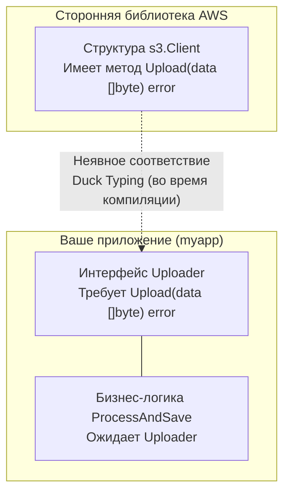
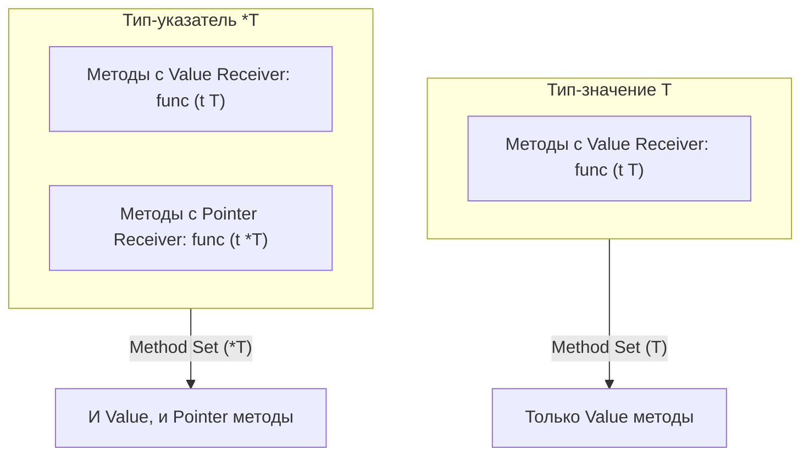

В физическом мире электрической вилке настольной лампы совершенно безразлично, откуда поступает ток — от гигантской гидроэлектростанции на Енисее, дизельного генератора в подвале или солнечной панели на крыше. Лампу интересует лишь физический разъем: два штырька стандартного диаметра на фиксированном расстоянии и переменное напряжение 220 вольт. Ни генератор, ни электростанция не подписывали нотариальных актов о том, что они спроектированы специально для вашей лампы. Они просто предоставляют розетку с нужными параметрами.

В классических объектно-ориентированных языках (Java, C#, C++) программистов десятилетиями приучали к номинативной типизации. Чтобы класс считался реализацией контракта, он обязан торжественно присягнуть ему в коде через ключевое слово `implements`. Если класс `PostgreSQLStorage` написан сторонним автором без волшебного слова `implements IStorage`, вы не сможете передать его в функцию, требующую `IStorage`, не написав громоздкий класс-обертку (Adapter). Архитектура оказывается скованной искусственными иерархиями еще до написания первой строчки бизнес-логики.

Go возвращает нас к здравому смыслу реального мира. Интерфейсы в Go реализуются **неявно** через **статическую утиную типизацию (Compile-Time Duck Typing)**: если нечто ходит как утка и крякает как утка — для компилятора Go это и есть утка.

В этой главе мы разберем, как неявные интерфейсы переворачивают архитектуру сервисов с ног на голову, почему микро-интерфейсы из одного метода правят миром стандартной библиотеки, разберем легендарную ловушку **Method Sets** (на которой спотыкается большинство кандидатов на собеседованиях) и научимся безопасно работать с контейнерами любого типа `any`.

---

## Утиная типизация: Разворот зависимостей

Представьте, что вы используете стороннюю библиотеку для работы с AWS S3. Библиотека предоставляет структуру `s3.Client` с десятком методов, включая `Upload(data[]byte)`.

В Java, если бы вы хотели подменить этот клиент на заглушку (Mock) для тестов, вам пришлось бы молиться, чтобы авторы библиотеки предусмотрели интерфейс `IClient`. Если они этого не сделали, вам придется писать класс-адаптер (Adapter/Wrapper).

В Go вы независимы от сторонних библиотек. Вы объявляете интерфейс в **своем** коде — ровно там, где он потребляется:

```go
package myapp

// Мы определяем контракт ТАМ, ГДЕ ОН ИСПОЛЬЗУЕТСЯ (Consumer-Driven)
type Uploader interface {
    Upload(data[]byte) error
}

// Бизнес-логика зависит от абстрактного поведения, а не от конкретного пакета s3.Client
func ProcessAndSave(u Uploader, data[]byte) error {
    // ... обработка и валидация данных ...
    return u.Upload(data)
}
```

Теперь в функцию `ProcessAndSave` можно передать как реальный боевой `s3.Client` (поскольку у него физически присутствует метод `Upload(data []byte) error`), так и легковесный тестовый `MockUploader`. Авторы AWS SDK не подозревают о существовании пакета `myapp` и интерфейса `Uploader`, но их тип безупречно удовлетворяет нашему контракту.



> [!tip] Собеседование: Преимущество неявных интерфейсов
> **Вопрос:** В чем фундаментальное архитектурное преимущество неявных (implicit) интерфейсов Go перед явными (explicit `implements`) в Java или C#?  
> **Ответ:** Они обеспечивают абсолютную **инверсию зависимостей (Dependency Inversion)** без необходимости менять чужой исходный код. Интерфейсы в Go принадлежат вызывающей стороне (*consumer*), а не исполнителю (*producer*). Пакеты не связаны зависимостями на уровне типов: реализация может быть написана за пять лет до появления интерфейса, и компилятор все равно соединит их вместе без единого адаптера.

---

## Маленькие интерфейсы: Идиома Go

Благодаря утиной типизации, в Go естественным образом соблюдается **Interface Segregation Principle (Принцип разделения интерфейсов)** из SOLID: клиенты не должны зависеть от методов, которые они не используют.

Если взглянуть на ядро стандартной библиотеки Go, самые мощные и универсальные абстракции насчитывают ровно один метод:

- `io.Reader`: метод `Read(p []byte) (n int, err error)`
- `io.Writer`: метод `Write(p []byte) (n int, err error)`
- `fmt.Stringer`: метод `String() string`
- `error`: метод `Error() string`

Интерфейс из одного метода легко удовлетворить, тривиально протестировать и просто скомпоновать. Go поощряет **композицию интерфейсов (встраивание)** вместо раздувания монолитных типов:

```go
// Композиция интерфейсов (Встраивание)
// Вместо создания одного гигантского FileInterface, мы собираем контракт из атомарных кубиков:
type ReadWriter interface {
    io.Reader
    io.Writer
}
```

Любой тип, умеющий и читать, и писать, автоматически удовлетворяет интерфейсу `ReadWriter`.

### Главная архитектурная поговорка Go
> *"Accept interfaces, return structs" (Принимайте интерфейсы, возвращайте структуры).*

Если функция принимает аргументы — требуйте минимальный интерфейс, достаточный для работы (например, `io.Reader` вместо конкретного файла). Это позволит вызывающему коду передать туда и файл с диска, и буфер в оперативной памяти (`bytes.Buffer`), и сетевое TCP-соединение (`net.Conn`).

Но если функция возвращает результат — возвращайте конкретную структуру (например, `*os.File` или `*db.Connection`). Не ограничивайте пользователя искусственным интерфейсом. Конкретная структура оставляет вызывающему коду свободу выбора: использовать все ее поля и методы напрямую либо самостоятельно ограничить ее узким интерфейсом.

---

## Ловушка Method Sets: Значения против Указателей

Это один из самых частых вопросов с подвохом на технических собеседованиях. Он напрямую вытекает из семантики значений и указателей, разобранной в главе [[22. Методы. Value Receiver и Pointer Receiver]].

Взгляните на следующий код:

```go
package main

import "fmt"

type Worker interface {
    DoWork()
}

type Job struct {
    Name string
}

// ВНИМАНИЕ: Pointer Receiver!
func (j *Job) DoWork() {
    fmt.Println("Working on", j.Name)
}

func start(w Worker) {
    w.DoWork()
}

func main() {
    j := Job{Name: "Task 1"}
    
    // ОШИБКА КОМПИЛЯЦИИ!
    // Cannot use 'j' (type Job) as type Worker in argument to start:
    // Job does not implement Worker (DoWork method has pointer receiver)
    start(j) 
}
```

Почему компилятор отказывается компилировать вызов `start(j)`? Ведь у структуры `Job` очевидно объявлен метод `DoWork()`!

Ответ кроется в строгих правилах рантайма Go относительно **множества методов (Method Sets)**:

1. Множество методов типа-значения (`T`) содержит **только** методы с Value Receiver (`func (t T) ...`).
2. Множество методов типа-указателя (`*T`) содержит методы **и с Value, и с Pointer** Receiver (`func (t T)` и `func (t *T)`).



> [!info] Под капотом: Почему рантайм так строг?
> Вспомним синтаксический сахар при вызове методов: для переменной `j` компилятор позволяет написать `j.DoWork()`, автоматически подставляя взятие адреса `(&j).DoWork()`. Почему он отказывается сделать то же самое при передаче в интерфейс `start(j)`?
> 
> Дело в физике передачи данных. При передаче значения `j` в интерфейс `Worker` создается **копия** структуры. Если бы компилятор разрешил вызвать метод с Pointer Receiver на копии, метод изменил бы поля временного объекта, упакованного в интерфейс, а оригинальная переменная `j` осталась бы неизменной. Это привело бы к скрытым и трудноуловимым багам.
> 
> Более того, значение внутри интерфейса может быть в принципе **неадресуемым** в памяти (unaddressable). Поэтому компилятор защищает инженера от логических ошибок: если метод требует мутации оригинала через указатель, в интерфейс **обязан** передаваться указатель.

**Исправление кода:** передайте в функцию адрес переменной:

```go
start(&j) // Все работает! Тип *Job полноценно реализует контракт Worker.
```

---

## Пустой интерфейс и any

До появления параметрического полиморфизма (дженериков) в Go 1.18, пустой интерфейс `interface{}` служил единственным инструментом для создания обобщенного кода, способного принимать значения **любого типа**.

Интерфейс без методов (`interface{}`) декларирует контракт: *«Я принимаю любой тип, у которого есть как минимум 0 методов»*. Очевидно, что этому требованию удовлетворяет абсолютно любое значение в рантайме Go: `int`, `string`, срез, мапа, канал или сложная структура.

Начиная с Go 1.18, в язык был введен псевдоним типа (type alias) `any`:

```go
type any = interface{}
```

Он полностью эквивалентен пустому интерфейсу, но делает код чище и приятнее для чтения:

```go
func PrintAnything(value any) {
    fmt.Println(value)
}
```

### Распаковка интерфейса: Type Assertion

Интерфейс скрывает внутренний конкретный тип за непроницаемой абстракцией. Если вы поместили структуру `User` в переменную типа `any`, вы больше не можете напрямую обратиться к полю `value.Name` — для компилятора это просто непрозрачный контейнер интерфейса.

Чтобы добраться до исходного типа и его полей, применяется операция **утверждения типа (Type Assertion)**:

```go
var i any = "Hello, System!"

// Безопасное извлечение с проверкой флага ok (comma-ok идиома)
if str, ok := i.(string); ok {
    fmt.Printf("Это строка длиной %d байт\n", len(str))
} else {
    fmt.Println("Значение внутри интерфейса не является строкой")
}
```

> [!warning] Ловушка / Gotcha: Фатальная паника при непроверенном Assertion
> Если выполнить одиночное утверждение `str := i.(string)` без проверки `ok`, и тип внутри интерфейса окажется иным (например, `int`), программа завершится немедленной **паникой** (`panic: interface conversion`).
> 
> В надежном коде всегда используйте безопасную двухпараметрическую форму `value, ok := i.(Type)`.

### Type Switch (Рефлексия на минималках)

Если интерфейс может содержать несколько разных типов (что часто бывает при парсинге неизвестного JSON или обработке событий), элегантнее всего использовать Type Switch.

```go
func handleEvent(event any) {
    switch v := event.(type) {
    case string:
        fmt.Println("Строковое событие:", v)
    case int, int64:
        fmt.Println("Числовое событие:", v)
    default:
        // В блоке default 'v' сохраняет тип any
        fmt.Printf("Неизвестный тип: %T\n", v)
    }
}
```

Это гораздо эффективнее и читабельнее, чем городить цепочку `if-else` с постоянными проверками `reflect.TypeOf()`. Конструкция `switch event.(type)` выполняется рантаймом Go эффективно: вместо вызова медленной рефлексии компилятор сравнивает дескрипторы типов (метаданные) напрямую в таблице типов.

---

## Итог

1. **Duck Typing:** Интерфейсы в Go удовлетворяются неявно. Это ликвидирует паразитные зависимости между пакетами и позволяет формулировать абстракции на стороне потребителя.
2. **Accept interfaces, return structs:** Классическая поговорка Go. Принимайте минимально возможный интерфейс, но возвращайте конкретную структуру с максимумом возможностей.
3. **Method Sets:** Метод с Pointer Receiver (`*T`) не входит в набор методов значения (`T`). Передача значения в интерфейс, требующий pointer-метод, вызывает ошибку компиляции.
4. **`any` (`interface{}`):** Универсальный контейнер для любого типа данных в Go.
5. **Type Assertion и Type Switch:** Безопасное извлечение конкретного типа через идиому `val, ok := i.(Type)` или мультиплексирование через `switch v := i.(type)`.

Мы рассмотрели интерфейсы на уровне синтаксиса и архитектурных принципов. Но как компилятор и рантайм реализуют эту магию на уровне машинного кода? Сколько байт в оперативной памяти занимает интерфейсная переменная? Почему вызов интерфейсного метода сопровождается динамической диспетчеризацией, и как процессор защищается от промахов предсказателя переходов?

В следующей лекции мы спустимся в самые недра исходников Go (`runtime/iface.go`). В главе [[24. Интерфейсы под капотом. iface и eface]] мы детально анатомируем структуры `iface` и `eface`, разберем таблицы методов `itab` и выясним, почему безобидное на вид присваивание переменной интерфейсу может неожиданно спровоцировать выделение памяти в куче (Heap Allocation).