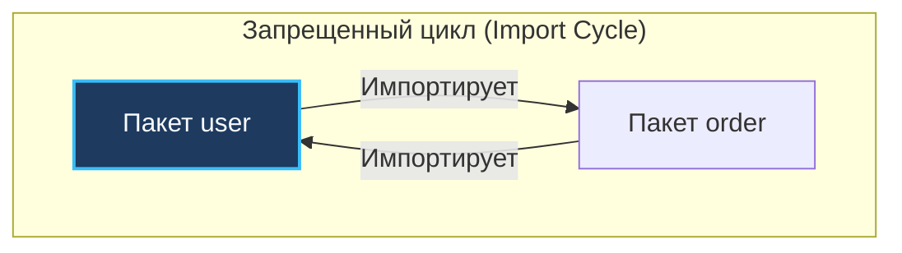
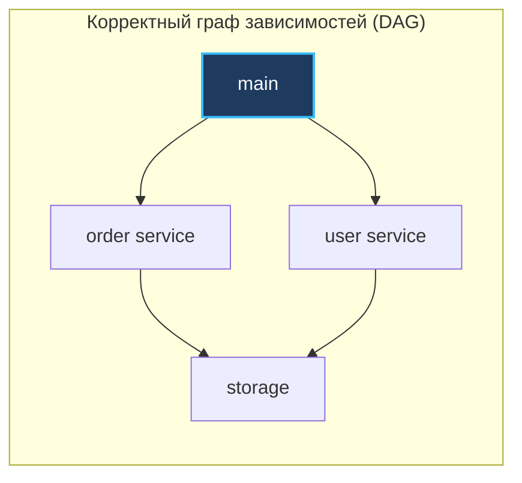
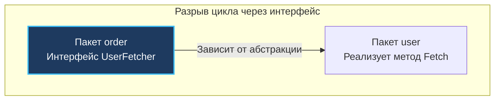

В телефонных станциях Bell Labs пятидесятых годов прошлого века инженеры столкнулись с суровой инженерной реальностью: если электронные лампы и реле соединять запутанным клубком проводов от каждого элемента к каждому, станция превращается в кошмар для обслуживания. Малейший сбой в одном реле приводил к веерному отключению всего здания. Спасением стала строгая модульность: съемные функциональные блоки с четкими разъемами на передней панели и жестким запретом на обратные паразитные петли в проводке.

В программировании разработчики десятилетиями повторяют ту же ошибку. Если вы пришли в Go из мира Java (Spring) или C# (.NET), вас годами учили строить глубокие многоярусные каталоги пространств имен вроде `src/main/java/com/company/project/models`. Если ваш бэкграунд — Python (Django) или Ruby on Rails, фреймворки жестко предписывали, в какую папку положить контроллеры, а в какую — представления.

Go встречает инженера спартанской простотой: в языке нет пространств имен (namespaces), нет классов и нет официального монолитного фреймворка, диктующего раскладку файлов. Главной, единственной и неделимой единицей модульности и инкапсуляции в Go является **пакет (package)**.

Небрежность в проектировании связей между пакетами на старте проекта быстро приводит к главному кошмару Go-разработчика: ошибке компилятора `import cycle not allowed`. В этой главе мы разберем философию пакетов Go, исследуем механизм изоляции приватного кода через каталог `internal`, научимся проектировать зависимости по законам ненаправленных ациклических графов (DAG) и разберем архитектурные приемы разрыва кольцевых зависимостей.

---

## Иллюзия вложенности пакетов

Вспомним базовое правило, с которым мы познакомились в главе [[4. Структура Go-программы. package, import, func main]]: **одна директория на диске = ровно один пакет**.

И здесь кроется фундаментальная особенность, которая нередко сбивает с толку разработчиков из других языков: **в Go не существует понятия подпакетов (sub-packages)**.

Для компилятора пакет `net` и пакет `net/http` — это **два абсолютно разных, автономных и изолированных пакета**. Тот факт, что директория `http` физически лежит внутри папки `net`, не дает пакету `net/http` ни малейших привилегий:
- `net/http` не имеет доступа к неэкспортируемым (приватным) переменным и функциям пакета `net`.
- Пакет `net` не видит ничего закрытого внутри `net/http`.

Иерархия каталогов в Go существует исключительно ради удобства человека и читаемости путей импорта в файловой системе. Компилятор же воспринимает все пакеты проекта как абсолютно плоский список независимых модулей.

---

## Магия директории internal

Если все пакеты плоские и равноправные, как разработчику библиотеки или микросервиса защитить свою внутреннюю кухню от любопытных глаз пользователей или соседних команд?

Представьте: вы создаете библиотеку для взаимодействия с базой данных. Внутри у вас есть пакет `parser`, преобразующий сырые SQL-запросы в синтаксические деревья. Вы хотите свободно рефакторить этот парсер каждую пятницу, не опасаясь сломать клиентский код. Если пакет `parser` будет публичным, пользователи библиотеки неизбежно начнут импортировать его напрямую, привязавшись к внутренним структурам.

Создатели Go предусмотрели элегантный механизм защиты, зашитый непосредственно в компилятор — каталог с именем **`internal`**.

Если вы помещаете пакет внутрь директории `internal`, компилятор Go разрешает его импорт **только тем пакетам, которые расположены в дереве каталогов выше или на том же уровне, что и родитель этой папки `internal`**.

Рассмотрим классическую раскладку проекта:

```text
myproject/
├── main.go
├── auth/
│   ├── auth.go
│   └── internal/
│       └── crypto/    <- Этот пакет!
│           └── hash.go
└── billing/
    └── billing.go
```

> [!info] Под капотом: Компилятор и internal
> В дереве выше пакет `crypto` физически расположен по пути `myproject/auth/internal/crypto`. 
> Компилятор Go анализирует этот путь и устанавливает границу видимости на уровень выше папки `internal`, то есть на `myproject/auth`:
> - Пакет `myproject/auth` **сможет** импортировать `crypto`.
> - Пакет `myproject/main` **не сможет** импортировать `crypto` (ошибка компиляции `use of internal package not allowed`).
> - Пакет `myproject/billing` **не сможет** импортировать `crypto`.
> - Любой сторонний проект на GitHub, скачавший вашу библиотеку, **не сможет** импортировать `crypto`.

Использование `internal/` — это признанный стандарт индустрии для продакшен-сервисов (Standard Go Project Layout). Поместив доменную бизнес-логику внутрь корневого каталога `internal/`, вы гарантируете, что ни один внешний микросервис или скрипт в монорепозитории не сможет случайно нарушить границы вашей системы.

---

## Антипаттерны: Пакеты-помойки

Самая распространенная болезнь при переносе привычек из MVC-фреймворков (Spring, Django, Rails) — группировка кода по техническим слоям вместо предметной области.

**Плохо (Technical Grouping / Слоистые свалки):**
- `package models` (свалка разнородных структур данных со всего проекта)
- `package controllers` (свалка разрозненных HTTP-обработчиков)
- `package utils` или `helpers` (пакеты без смыслового фокуса — инженерное мусорное ведро)

Почему пакет `models` в Go считается антипаттерном?
1. **Провокация циклов:** структура `Order` ссылается на `User`, а методу пользователя нужны его заказы. Вынося всё в один пакет `models`, разработчик вынужден стягивать туда логику валидации, раздувая зависимости.
2. **Бессмысленность имен:** имя пакета всегда пишется перед типом: `models.User`, `models.Order`. Префикс `models` не несет никакой смысловой ценности для читателя кода.

**Хорошо (Domain-Driven Grouping):**
В Go принято организовывать код вокруг предметных областей (бизнес-доменов). Пакет решает одну целостную задачу и отвечает на вопрос *«Что он делает?»*, а не *«Что в нем лежит?»*:
- `package user` (содержит структуру `User` и операции с ней: `user.FindByID`)
- `package order` (содержит структуру `Order` и расчет скидок)
- `package payment` (интеграция со шлюзами оплаты)

> [!tip] Собеседование: Почему пакеты utils и common токсичны?
> **Вопрос:** Почему создание пакетов `util`, `common`, `base` считается плохой инженерной практикой в Go?  
> **Ответ:** Название пакета обязано сообщать о назначении компонента, а не о его разнородности. Пакет `util` неизбежно превращается в свалку разношерстных функций («утятницу»), которая со временем начинает импортировать половину проекта и провоцирует циклические зависимости. Вместо создания гигантского `util` правильнее создавать маленькие, узконаправленные пакеты: `strutil`, `math`, `envparser`.

---

## Главный враг: Import Cycles (Циклические зависимости)

В языках C и C++ кольцевые зависимости заголовочных файлов предотвращаются директивами препроцессора вроде `#pragma once` или `#ifndef`.

В языке Go **циклические зависимости (когда пакет A импортирует B, а пакет B прямо или косвенно импортирует A) категорически запрещены на уровне компилятора**. Попытка собрать такой проект приводит к жесткой ошибке компиляции:



### Mechanical Sympathy: Зачем Go запрещает циклы?

Запрет на циклы — это не прихоть авторов языка, а важнейший компромисс ради феноменальной скорости компиляции Go.

Граф зависимостей любой валидной программы на Go обязан быть **направленным ациклическим графом (Directed Acyclic Graph, DAG)**. 

Когда компилятор Go компилирует пакет, он читает только объектные файлы (`.a`) его непосредственных зависимостей, в которых уже записана вся метаинформация об экспортируемых типах. Компилятору не нужно заново перепарсивать исходные тексты транзитивных зависимостей! Благодаря ацикличности компилятор строит топологическую сортировку и распараллеливает независимые пакеты по всем ядрам CPU. В циклическом графе топологический порядок не существует: невозможно определить, какой пакет собирать первым.



### Как разорвать цикл?

Если вы столкнулись с ошибкой `import cycle not allowed` между пакетами `user` и `order`, это верный сигнал архитектурного просчета. В инженерной практике существует три надежных способа разрыва кольца:

#### 1. Вынос общей сущности в нижний пакет
Если и `user`, и `order` зависят от общей структуры `Transaction`, вынесите её в отдельный фундаментальный пакет `billing`. Оба пакета станут импортировать `billing`, образовав корректную V-образную топологию без обратных ребер.

#### 2. Объединение пакетов
Если два пакета знают слишком много об интимных деталях друг друга (высокая зацепленность, High Coupling), возможно, искусственное разделение было ошибкой. В Go совершенно нормально иметь один пакет на предметную область, разделенный на логические файлы `user.go` и `order.go`. Внутри одного каталога импорты не требуются.

#### 3. Разрыв через интерфейсы (Инверсия зависимостей)
Это самый элегантный и каноничный для Go способ, использующий статическую утиную типизацию (рассмотренную в [[23. Интерфейсы. Полиморфизм по-goшному]]).

Допустим, при оформлении заказа пакету `order` требуется проверить статус пользователя, но мы не хотим импортировать пакет `user`:



Внутри пакета `order` объявляется локальный интерфейс:

```go
package order

// Пакет order больше ничего не знает о пакете user!
type UserFetcher interface {
    Fetch(id int) (name string, err error)
}

func Process(u UserFetcher) {
    name, _ := u.Fetch(1)
    // ...
}
```

А соединение зависимостей (Composition Root) происходит на самом верхнем уровне — в пакете `main`:

```go
package main

import (
    "myproject/order"
    "myproject/user"
)

func main() {
    u := user.NewService() // У него физически есть метод Fetch
    order.Process(u)       // Duck typing делает свою магию
}
```

Цикл полностью разорван.

---

## Эффект побочного действия (Blank Import)

Иногда пакет необходимо импортировать исключительно ради его побочного эффекта (Side Effect) — выполнения глобальных переменных и функций `init()`, без прямого вызова функций пакета в коде.

Поскольку компилятор Go строго запрещает неиспользуемые импорты, для таких случаев предусмотрен пустой импорт с идентификатором подчеркивания:

```go
import (
    "database/sql"
    _ "github.com/lib/pq" // Импорт драйвера PostgreSQL для sql.Register
)
```

> [!warning] Ловушка / Gotcha: Злоупотребление функцией init()
> Злоупотребление функцией `init()` и слепыми импортами — известный источник трудноуловимых багов. Когда вы пишете `_ "pkg"`, рантайм выполняет функцию `init()` этого пакета неявно еще до передачи управления в `main()`. В случае с драйвером БД этот `init` регистрирует драйвер в глобальной мапе пакета `database/sql`. Если `init()` упадет в панику или начнет ходить в сеть, приложение завершится крахом без возможности перехвата ошибки. 
> В прикладном коде избегайте неявной инициализации: создавайте прозрачные фабричные функции `New()` или явные методы конфигурации `Setup()`.

---

## Итог

1. **Директория — это пакет:** В Go нет подпакетов и скрытых привилегий у вложенных папок. Пакет `net` и `net/http` независимы.
2. **Директория `internal/`:** Аппаратный замок компилятора. Код внутри `internal/` виден только непосредственному родительскому модулю.
3. **Группируйте по доменам:** Избегайте мусорных пакетов вроде `models` или `utils`. Структуры и операции над ними должны жить рядом.
4. **DAG импортов:** Запрет циклов импорта обеспечивает молниеносную скорость сборки за счет параллельной компиляции независимых узлов графа.
5. **Разрыв циклов:** Кольцевые зависимости устраняются выносом общих типов в нижний пакет, объединением файлов или инверсией зависимостей через локальные интерфейсы.
6. **Слепой импорт (`_`):** Служит для регистрации плагинов и драйверов через вызов их функций `init()`.

Мы выстроили границы между пакетами и поняли, как собирать сложную систему из автономных блоков. Но как внутри одного пакета провести четкую черту между публичным интерфейсом и скрытыми служебными деталями? В следующей лекции мы детально изучим механизм управления видимостью. В главе [[27. Видимость имен. export и unexport]] мы выясним, почему регистр первой буквы идентификатора стал главным переключателем инкапсуляции в Go, и разберем тонкости работы рефлексии с приватными полями структур.