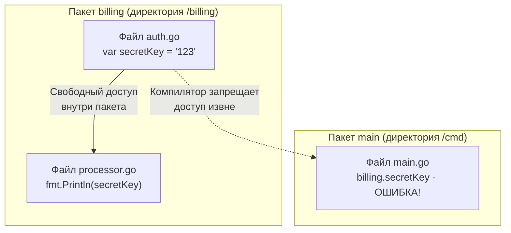

В языке C для сокрытия глобальных переменных и функций от линковщика использовалось перегруженное ключевое слово `static`. Создатели C++ и Java развили эту идею до предела, окружив код целым частоколом модификаторов доступа: `public`, `protected`, `private`, а в Java — еще и неявным package-private. Эти ключевые слова создают визуальный шум, загромождают интерфейсы и порождают бесконечные километры шаблонных геттеров и сеттеров, в которых теряется суть бизнес-логики.

Кен Томпсон и Роб Пайк при проектировании Go руководствовались принципом предельной лаконичности. Зачем заставлять программиста печатать длинные служебные слова и усложнять грамматику парсера, если каждый идентификатор в тексте программы уже несет в себе очевидный визуальный маркер — регистр своей первой буквы?

В Go видимость любого идентификатора (типа, константы, переменной, функции или поля структуры) определяется исключительно **регистром его первого символа**. 

В этой главе мы разберем механику экспорта символов, поймем, почему инкапсуляция в Go привязана к пакету, а не к «классу», изучим архитектурный прием «запечатанных интерфейсов» (Sealed Interfaces) и выясним, почему сериализаторы JSON наотрез отказываются замечать поля со строчной буквы.

---

## Экспортируемое и Неэкспортируемое (Exported vs Unexported)

В терминологии Go намеренно не используются термины «публичный» (public) и «приватный» (private). Канонический вокабуляр стандарта языка оперирует понятиями: **Экспортируемый (Exported)** и **Неэкспортируемый (Unexported)**.

Правило, зашитое непосредственно в лексический анализатор (Lexer) компилятора:
- Если имя начинается с **Заглавной буквы** (Unicode Upper Case) — идентификатор является **экспортируемым** и доступен для использования из любого внешнего пакета. Примеры: `User`, `Format`, `URL`.
- Если имя начинается со **строчной буквы** (Unicode Lower Case) — идентификатор является **неэкспортируемым** и доступен исключительно внутри своего пакета. Примеры: `password`, `parseToken`, `cache`.

> [!info] Под капотом: Как компилятор это понимает?
> В фазе лексического разбора компилятора функция `scanner.Scan()` проверяет начальную руну идентификатора с помощью стандартного алгоритма `unicode.IsUpper(ch)`. 
> На этапе формирования объектных файлов архива (`.a`) компилятор применяет механизм **Name Mangling** (модификацию имен). Экспортируемые символы записываются в таблицу символов бинарника под своими чистыми именами (например, `User`), а неэкспортируемые принудительно дополняются префиксом полного пути пакета. Линковщик аппаратно пресекает любую попытку внешнего файла обратиться к неэкспортированному символу еще на этапе сборки.

---

## Границы видимости: Пакет, а не файл

Распространенная ошибка инженеров, привыкших к C++ или Java — попытка инкапсулировать состояние внутри одного файла или внутри конкретной структуры (по аналогии с классом).

В Go **фундаментальной границей видимости является весь пакет**, то есть совокупность всех файлов в одной директории на диске. 

Если переменная, функция или структура названа со строчной буквы, она свободно и без ограничений доступна из **любого файла** внутри этой же директории:



Вам не требуется искусственно экспортировать внутренние вспомогательные функции, чтобы разнести реализацию одного пакета по тематическим файлам (`auth.go`, `processor.go`). Все файлы пакета видят внутренние детали друг друга как свои собственные.

---

## Инкапсуляция полей структуры

Само имя структуры и имена ее полей экспортируются **совершенно независимо**. Это позволяет создавать надежно защищенные типы данных с сокрытием критических внутренних полей:

```go
package user

// Структура User экспортируется (доступна извне)
type User struct {
    ID       string // Экспортируемое поле
    Email    string // Экспортируемое поле
    password string // Неэкспортируемое поле (инкапсулировано!)
}

// Метод доступен извне и может работать с неэкспортируемым полем
func (u *User) CheckPassword(input string) bool {
    return u.password == hash(input)
}
```

Любой внешний пакет может создать переменную `user.User`, прочитать или изменить поля `ID` и `Email`, но компилятор Go категорически запретит внешнему коду даже попытку чтения или мутации поля `password`.

### Паттерн "Конструктор" (Factory Function)

Поскольку сторонний пакет не имеет прямого доступа к полю `password`, попытка инициализировать такую структуру через стандартный литерал приведет к ошибке компиляции:

```go
package main

import "myproject/user"

func main() {
    // ОШИБКА КОМПИЛЯЦИИ: unknown field 'password' in struct literal
    u := user.User{
        ID:       "1",
        password: "qwerty", 
    }
}
```

Для корректной инициализации закрытых структур в Go принят идиоматичный паттерн фабричных функций. Экспортируемая функция обычно именуется префиксом `New...` и возвращает указатель на готовую, корректно проинициализированную структуру:

```go
// Внутри пакета user
func New(id, email, plainPassword string) *User {
    return &User{
        ID:       id,
        Email:    email,
        password: hash(plainPassword), // Мы контролируем инициализацию!
    }
}
```

> [!warning] Ловушка / Gotcha: Сериализация и JSON
> Неэкспортируемые поля (с маленькой буквы) **полностью игнорируются стандартными пакетами сериализации**, такими как `encoding/json` или `encoding/xml`.
> 
> В главе [[21. Struct. Пользовательские типы данных]] мы обсуждали, что JSON-парсер использует рефлексию (пакет `reflect`). Рантайм Go жестко пресекает любые попытки рефлексии читать или записывать неэкспортируемые поля структуры (метод `CanSet()` возвращает `false`). 
> Если вы хотите гарантировать, что поле ни при каких обстоятельствах не утечет в сериализованный JSON-ответ API, самый надежный и бескомпромиссный способ (надежнее сервисного тега `` `json:"-"` ``) — сделать его неэкспортируемым (`password`).

---

## Неэкспортируемые типы в публичном API

Любопытная особенность языка Go: функция может экспортироваться наружу, но при этом возвращать значение типа, который сам по себе является **неэкспортируемым**:

```go
package db

// Неэкспортируемый тип
type connection struct {
    dsn string
}

// Экспортируемая функция возвращает НЕЭКСПОРТИРУЕМЫЙ тип!
func Connect() *connection {
    return &connection{dsn: "postgres://..."}
}
```

Имеет ли право вызывающий код воспользоваться такой функцией? Безусловно!  
Но как сохранить результат, если явное указание типа запрещено компилятором? На помощь приходит вывод типа через оператор `:=` (из главы [[5. Переменные, константы и вывод типа]]):

```go
package main

import (
    "fmt"
    "myproject/db"
)

func main() {
    // var c *db.connection = db.Connect() // ОШИБКА: тип db.connection не найден
    
    c := db.Connect() // РАБОТАЕТ! Компилятор сам выводит тип.
    fmt.Println(c)
}
```

Однако в прикладном коде такой прием признан антипаттерном. Вы лишаете вызывающую сторону возможности объявлять переменные этого типа или передавать их в качестве параметров своих функций. Идиоматичное решение — возвращать абстрактный интерфейс, следуя правилу *"Accept interfaces, return structs"* из главы [[23. Интерфейсы. Полиморфизм по-goшному]].

---

## Sealed Interfaces (Запечатанные интерфейсы)

В ядре стандартной библиотеки Go встречается высокоуровневый архитектурный паттерн: запечатанные интерфейсы (Sealed Interfaces).

Представьте: вы создаете публичный API и предоставляете интерфейс `Event`. Вы хотите, чтобы внешние клиенты могли получать события и обрабатывать их, но вам критически важно **запретить** внешним пакетам создавать собственные реализации этого интерфейса.

Как запечатать интерфейс от сторонней имплементации?  
Включите в тело интерфейса **неэкспортируемый метод**:

```go
package events

// Публичный интерфейс
type Event interface {
    Name() string
    Payload()[]byte
    
    // Неэкспортируемый метод (маркер запечатывания)
    internal() 
}

// Экспортируемая структура, реализующая интерфейс внутри нашей библиотеки
type SystemEvent struct {}
func (s SystemEvent) Name() string { return "sys" }
func (s SystemEvent) Payload()[]byte { return nil }
func (s SystemEvent) internal() {} // Реализовали скрытый метод
```

Если разработчик пакета `main` попытается создать свой `CustomEvent`, он физически не сможет реализовать метод `internal()`, поскольку символ `internal` не экспортирован за пределы пакета `events`. Компилятор отклонит любую стороннюю реализацию.

Именно так устроен интерфейс `testing.TB` в стандартном пакете `testing`, предотвращающий создание поддельных раннеров тестов.

---

## Обход защиты: Пакет unsafe

Существует ли способ прочитать неэкспортированное поле структуры из стороннего пакета?  
Да. Go предоставляет системным программистам низкоуровневый инструментарий в пакете `unsafe`:

```go
// Где-то в пакете secret
type Vault struct {
    PublicCode  int64
    privateCode int64
}

// В пакете main
v := secret.NewVault()

// Получаем указатель на структуру, конвертируем в uintptr, сдвигаем на 8 байт 
// (размер PublicCode) и кастуем обратно в указатель на int64.
ptr := (*int64)(unsafe.Pointer(uintptr(unsafe.Pointer(v)) + 8))

fmt.Println("Взломанный код:", *ptr) 
```

Зная внутреннее выравнивание полей в памяти (Memory Padding из главы о структурах), можно вычислить смещение байтов и прочитать закрытые данные. Разумеется, использование `unsafe` для обхода инкапсуляции в бизнес-логике является абсолютным табу: код моментально сломается при малейшем изменении структуры или смене архитектуры процессора.

---

## Итог

1. **Регистр решает всё:** В Go нет `public/private`. Первая буква в верхнем регистре — символ экспортируется наружу, в нижнем — инкапсулируется внутри своего пакета.
2. **Граница видимости — пакет:** Все файлы в пределах одного каталога разделяют общее пространство неэкспортируемых символов.
3. **Инкапсуляция полей:** Экспорт полей структуры регулируется отдельно от самой структуры. Инициализируйте такие структуры через функции-конструкторы `New()`.
4. **JSON и рефлексия:** Сериализаторы и пакет `reflect` принципиально игнорируют неэкспортируемые поля (`CanSet() == false`).
5. **Sealed Interfaces:** Добавление неэкспортируемого метода в публичный контракт превращает интерфейс в запечатанный, блокируя сторонние реализации.

Мы разобрались с внутренней анатомией пакетов и защитой их содержимого. Но в современной индустрии редкое приложение обходится собственным кодом. Как подключить драйвер PostgreSQL или клиент Redis с GitHub? Как Go фиксирует версии зависимостей, чтобы сборка оставалась стабильной спустя годы? И почему устаревший `GOPATH` уступил место модулям?

В следующей лекции мы детально изучим современный менеджер зависимостей Go. В главе [[28. Модули и go.mod]] мы разберем устройство файлов `go.mod` и `go.sum`, исследуем элегантный алгоритм MVS (Minimal Version Selection) и научимся управлять вендорингом в корпоративных монорепозиториях.