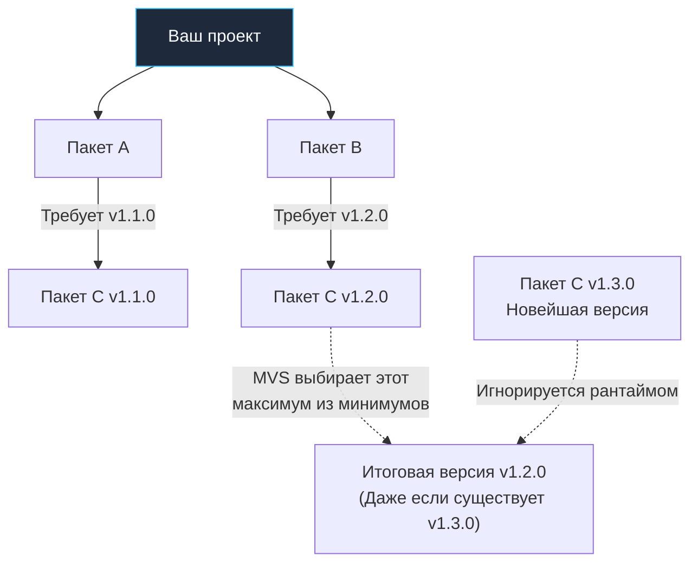

В радиоэлектронике и точном приборостроении существует незыблемое правило спецификации: если для сборки лампового усилителя требуется резистор сопротивлением 100 Ом с допуском 5%, инженер заносит в технологическую карту именно этот компонент. Ни одному сборщику на конвейере не придет в голову самовольно впаять «самый новейший» резистор из свежего каталога только потому, что его выпустили вчера. Самодеятельность разрушает воспроизводимость: прибор, работавший в понедельник, во вторник начинает шуметь или перегреваться.

В программировании управление зависимостями долгие годы оставалось источником хаоса. В главе [[2. Установка Go, GOPATH, GOROOT и первая программа]] мы упоминали, что ранний Go привязывал весь код разработчика к монолитной глобальной директории `GOPATH/src`. В версии Go 1.11 (благодаря фундаментальным исследованиям Расса Кокса) на смену устаревшему подходу пришла современная система модулей (**Go Modules**).

Если вы знакомы с package managers других языков — JavaScript (`npm`/`yarn`), PHP (`Composer`) или Python (`pip`), концепция модулей покажется вам знакомой. Однако под капотом Go Modules работают по совершенно иным, математически строгим принципам: здесь нет централизованного хранилища пакетов (вроде `npmjs.com`), нет классического громоздкого lock-файла, а алгоритм разрешения версий подчинен бескомпромиссному требованию: **100% воспроизводимость сборок (Reproducible Builds)** сквозь десятилетия.

В этой главе мы изучим анатомию файла `go.mod`, разберем уникальный алгоритм MVS (Minimal Version Selection), поймем физику криптографической базы сумм `go.sum` и научимся безопасно работать с закрытыми репозиториями в корпоративной инфраструктуре.

---

## 1. Анатомия модуля и go.mod

Любой современный проект на Go начинается с инициализации модуля:

```bash
go mod init github.com/mycompany/myproject
```

Эта команда создает в текущей директории управляющий манифест `go.mod`. Папка, в которой лежит этот файл, становится **корнем модуля (Module root)**. Все подпакеты во всех вложенных каталогах автоматически объединяются в единое пространство имен этого модуля.

Заглянем внутрь типичного файла `go.mod`:

```go
// Имя вашего модуля. Это префикс для импорта всех ваших внутренних пакетов.
module github.com/mycompany/myproject

// Минимально требуемая версия языка (и тулчейна)
go 1.21

// Прямые зависимости проекта
require (
    github.com/gin-gonic/gin v1.9.1
    github.com/google/uuid v1.4.0
)

// Транзитивные зависимости (добавленные косвенно)
require (
    golang.org/x/crypto v0.14.0 // indirect
    golang.org/x/sys v0.13.0 // indirect
)
```

### Директива module: Децентрализация

В отличие от экосистем вроде `npm` или `Maven`, где имя пакета — это абстрактный строковый идентификатор (`lodash` или `com.google.guava`), в Go имя модуля представляет собой **полноценный канонический URL репозитория** (без указания протокола `https://`).

Это ключевое архитектурное решение делает Go полностью децентрализованным. Когда вы выполняете команду:

```bash
go get github.com/google/uuid
```

Тулчейн Go не обращается к закрытому монопольному реестру: он буквально разбирает URL на части, идет по домену `github.com`, находит организацию `google` и запрашивает Git-репозиторий `uuid`.

### Директива replace: Локальная разработка

Если вы обнаружили баг в сторонней библиотеке, форкнули ее репозиторий или разрабатываете два взаимосвязанных модуля параллельно на одном ноутбуке, вам не нужно публиковать промежуточные коммиты в публичный Git. Используйте директиву `replace`:

```go
replace github.com/google/uuid => ../my-local-uuid-fork
```

Компилятор подменит сетевой модуль локальным кодом из указанной папки. 

> [!important]
> Директива `replace` учитывается компилятором **только в главном go.mod** собираемого приложения. Если зависимость второго уровня содержит у себя `replace`, компилятор Go просто проигнорирует ее, гарантируя безопасность сборки.

---

## 2. Алгоритм MVS (Minimal Version Selection)

Это один из самых фундаментальных концептуальных вопросов на собеседованиях Senior-уровня по инфраструктуре Go.

Представьте классическую проблему **«Алмазной зависимости» (Diamond Dependency Problem)**:

Ваш проект зависит от библиотеки `A` и библиотеки `B`.
- Библиотека `A` требует вспомогательную библиотеку `C` версии `v1.1.0`.
- Библиотека `B` требует библиотеку `C` версии `v1.2.0`.
- В публичном репозитории автор библиотеки `C` уже успел выпустить свежую версию `v1.3.0`.



**Как поступают менеджеры зависимостей большинства языков (npm, Cargo, Composer)?**  
Они используют сложные SAT-солверы и стремятся выбрать самую свежую версию (*latest*), удовлетворяющую условиям — то есть версию `v1.3.0`. Если автор библиотеки `C` случайно сломал обратную совместимость в `v1.3.0`, ваша сборка внезапно упадет, хотя никто явно не запрашивал эту версию.

**Как работает Go (алгоритм MVS)?**  
Go принципиально выбирает **минимально возможную версию, удовлетворяющую всем декларированным требованиям**.  
В нашем случае компилятор берет максимум из минимально запрошенных версий: сравнивает `v1.1.0` и `v1.2.0`. Побеждает версия `v1.2.0`. Более новая версия `v1.3.0` будет полностью проигнорирована.

> [!info] Под капотом: Философия MVS
> MVS исходит из аксиомы: «Авторы библиотек тестировали свой код именно на тех версиях, которые они указали в `require`». 
> Благодаря MVS добавление новой зависимости в проект гарантированно не приведет к неявному обновлению старых библиотек. Сборка вашего сервиса будет воспроизводиться байт-в-байт спустя хоть пять лет, пока вы сами явно не скомандуете тулчейну обновить зависимости через флаг `go get -u`.

---

## 3. Файл go.sum: Защита от Supply Chain Attacks

Когда вы добавляете зависимость, рядом с `go.mod` автоматически создается файл `go.sum`.  
Распространенное заблуждение новичков: считать `go.sum` аналогом `package-lock.json` или `yarn.lock`. **Это в корне неверно.**  
Точные версии уже зафиксированы в `go.mod` благодаря строгости алгоритма MVS.

Файл `go.sum` — это база криптографических контрольных сумм для защиты от атак на цепочку поставок (**Supply Chain Attacks**).

```text
github.com/google/uuid v1.4.0 h1:1p6...
github.com/google/uuid v1.4.0/go.mod h1:TIy...
```

Каждая запись содержит криптографический хэш дерева исходных файлов (хэш-алгоритм `h1` на основе **SHA-256**), а также отдельный хэш самого файла `go.mod`.

### Зачем нужен go.sum?
Представьте вектор атаки: злоумышленник скомпрометировал учетную запись разработчика популярной библиотеки `uuid` на GitHub, удалил релизный тег `v1.4.0` и пересоздал его с внедренным вредоносным кодом, не меняя номер версии.

Если на вашем сервере CI/CD нет кэша зависимостей, тулчейн скачает архив с GitHub. Но перед тем как передать код компилятору, он рассчитает контрольную сумму скачанных файлов и сравнит ее со значением, зафиксированным в `go.sum`. Хеши не совпадут! Компилятор немедленно прервет сборку с фатальной ошибкой безопасности: `SECURITY ERROR`.

Кроме того, по умолчанию Go сверяет хэши с глобальным публичным журналом прозрачности Google — **`sum.golang.org`** (Checksum Database), гарантируя, что полученные вами исходники идентичны коду, который скачивают миллионы других инженеров по всему миру.

> [!warning] Ловушка / Gotcha: Конфликты в go.sum
> При слиянии веток Git (git merge) в файле `go.sum` регулярно возникают конфликты строк. Никогда не пытайтесь редактировать или склеивать `go.sum` вручную!  
> Единственно верный порядок действий:
> 1. Разрешите конфликт в основном файле `go.mod`.
> 2. Запустите в терминале команду `go mod tidy`.  
> Тулчейн Go самостоятельно пересчитает хэши, докачает недостающие модули и сгенерирует кристально чистый, валидный `go.sum`.

---

## 4. Как работает go get и go mod tidy

В повседневной разработке вся работа с зависимостями сводится к двум главным командам тулчейна:

- **`go get github.com/pkg/errors`** — загружает модуль, прописывает его в `go.mod` и регистрирует хэш в `go.sum`.
  - `go get package@v1.2.3` — загрузить строго фиксированную версию.
  - `go get -u package` — принудительно обновить пакет и его зависимости до новейших минорных или патч-релизов.

- **`go mod tidy`** — генеральная уборка зависимостей. Команда анализирует весь проект, находит все реальные вызовы `import` в коде. Если в коде появился новый импорт, библиотека будет автоматически докачана. Если вы удалили зависимость из кода, `tidy` аккуратно вычистит ее из `go.mod` и `go.sum`. Запуск `go mod tidy` перед коммитом — обязательное правило гигиены в Go.

### Физическое размещение зависимостей

В отличие от Node.js, где каждый проект раздувает каталог `node_modules` на гигабайты дублирующихся файлов, Go хранит зависимости централизованно.

Все скачанные пакеты размещаются в общем глобальном кэше операционной системы: **`GOPATH/pkg/mod`**.  
Если десять разных проектов на вашем компьютере используют библиотеку `uuid v1.4.0`, она физически скачивается на диск ровно один раз.

Чтобы разработчик или редактор кода случайно не внесли изменения в файлы кэша (что нарушило бы контрольную сумму для всех остальных проектов), файловая система помечает скачанные архивы атрибутом **Read-Only** (`chmod 444`).

---

## 5. Корпоративная среда и переменная GOPRIVATE

При переходе к корпоративной разработке инженеры часто сталкиваются с классической проблемой: корпоративный репозиторий расположен во внутреннем контуре, например `gitlab.company.local/core/auth`.  
Попытка выполнить:

```bash
go get gitlab.company.local/core/auth
```

завершается ошибками `404 Not Found` или `403 Forbidden` от прокси-сервера `proxy.golang.org`.

### Причина проблемы
По умолчанию тулчейн Go не обращается к Git напрямую. Для ускорения загрузки и защиты от исчезновения репозиториев Go направляет запросы через публичный кэширующий прокси-сервер Google (`proxy.golang.org`), после чего проверяет хэш в `sum.golang.org`. Разумеется, серверы Google не имеют доступа во внутреннюю закрытую сеть вашей компании за VPN.

### Решение: переменная GOPRIVATE
Вы обязаны сообщить тулчейну, какие доменные имена принадлежат приватной инфраструктуре компании:

```bash
# Указываем маску корпоративных приватных репозиториев
export GOPRIVATE="gitlab.company.local/*"
```

При обращении к путям, подпадающим под шаблон `GOPRIVATE`, тулчейн Go:
1. Полностью игнорирует публичные прокси `proxy.golang.org`.
2. Подключается к репозиторию напрямую через `git clone` (используя ваши корпоративные SSH-ключи или учетные данные из файла `.netrc`).
3. **Отключает верификацию хэшей** через публичную базу `sum.golang.org` (поскольку закрытый корпоративный код не должен утекать в публичные реестры).

> [!tip] Собеседование: Зачем нужна команда go mod vendor?
> **Вопрос:** Что выполняет команда `go mod vendor` и в каких сценариях она применяется сегодня?  
> **Ответ:** Команда `go mod vendor` копирует исходный код всех зависимостей из глобального кэша `GOPATH/pkg/mod` непосредственно в каталог **`vendor/`** в корне вашего проекта.  
> Это незаменимо в изолированных контурах с повышенными требованиями безопасности (Air-Gapped окружения в банках, критической инфраструктуре), где сборочные серверы (CI/CD Runners) физически лишены доступа в интернет и не могут выполнить `go get`. Наличие каталога `vendor/` позволяет собрать проект автономно.

---

## Итог

1. **`go.mod`** — единый манифест модуля, объявляющий его каноническое имя (URL) и перечень необходимых зависимостей.
2. **Алгоритм MVS:** Принцип минимального выбора версий обеспечивает строгую воспроизводимость сборок (Reproducible Builds), игнорируя непрошеные обновления.
3. **`go.sum`** — криптографическая база контрольных сумм (SHA-256) для предотвращения подмены кода и атак на цепочку поставок (Supply Chain Attacks).
4. **Команда `go mod tidy`** — стандартный инструмент поддержания манифеста в идеальной чистоте и разрешения конфликтов при слиянии веток.
5. **`GOPRIVATE`** — обязательная переменная для корпоративной разработки, направляющая тулчейн в обход публичных серверов Google напрямую во внутренний Git.

Мы полностью освоили организацию кода и управление зависимостями. Теперь наше приложение готово к активному общению с внешним миром: чтению файлов с жесткого диска, получению байтов из сетевых сокетов и записи логов.

В следующей лекции мы погрузимся в сердце системного программирования на Go. В главе [[29. Работа с файлами и IO]] мы исследуем фундаментальные интерфейсы `io.Reader` и `io.Writer`, разберем, как Go оборачивает системные вызовы операционной системы, и выясним, почему пакет буферизованного ввода-вывода `bufio` спасает сервисы от катастрофических просадок производительности.