В начале 1970-х годов в стенах Bell Labs Кен Томпсон и Деннис Ритчи сформулировали один из самых элегантных принципов в истории вычислительной техники: *«Всё есть файл, а файл — это непрерывный поток байтов»*. Операционной системе Unix было безразлично, что скрывается за файловым дескриптором — сектор на магнитном барабане, ленточный накопитель, печатающий телетайп или сетевой порт. Программа просто читала байты из потока и писала байты в поток.

Спустя сорок лет те же авторы перенесли этот фундамент в язык Go. Если вы пришли из сред скриптовой разработки (PHP, Python, Ruby), привычный опыт работы с файлами сводится к вызовам вроде `file_get_contents()` или `File.ReadAllText()`, которые загружают всё содержимое файла в оперативную память одним куском. В скриптах утилит это простительно, но для высоконагруженного бэкенда, одновременно обслуживающего десятки тысяч запросов, подобная наивность оборачивается мгновенным исчерпанием памяти (OOM) и деградацией производительности.

В Go ввод-вывод (I/O) спроектирован по канонам Unix: любые источники и приёмники информации трактуются как потоки данных произвольной длины, обрабатываемые небольшими порциями.

В этой главе мы разберем анатомию двух главных интерфейсов стандартной библиотеки — `io.Reader` и `io.Writer`, исследуем аппаратную стоимость системных вызовов к ядру Linux, поймем, как буферизация в `bufio` спасает процессор от простоев, и выясним, почему дисковый ввод-вывод в Go блокирует системные потоки ОС.

---

## Философия IO в Go: Всё есть поток

Фундаментом подсистемы ввода-вывода в Go являются всего два микро-интерфейса из стандартного пакета `io`:

```go
type Reader interface {
    Read(p []byte) (n int, err error)
}

type Writer interface {
    Write(p []byte) (n int, err error)
}
```

> [!info] Под капотом: Аллокационная дисциплина
> Обратите внимание на сигнатуру `Read(p []byte)`. Метод не возвращает вновь выделенный слайс `[]byte`, а принимает уже готовый буфер от вызывающей стороны! 
> Это осознанное решение авторов языка: вызывающий код может выделить один-единственный буфер размером 32 КБ и переиспользовать его миллионы раз в цикле чтения. Рантайм Go не порождает ни одного байта мусора в куче, избавляя Garbage Collector от лишней нагрузки. В главе [[16. Slice. Главная структура данных в Go]] мы подробно разбирали, как емкость и длина слайса позволяют работать с памятью с нулевыми накладными расходами.

---

## Работа с файлами: Пакет os

Для прямого взаимодействия с файловой системой операционной системы используется стандартный пакет `os`.

### Открытие и закрытие дескрипторов

Каждый открытый файл в ОС Linux представляет собой запись в таблице файловых дескрипторов процесса (**FD — File Descriptors**). Лимит открытых дескрипторов строго ограничен ядром (`ulimit -n`), поэтому любой открытый файл обязан быть закрыт:

```go
file, err := os.Open("data.txt")
if err != nil {
    log.Fatalf("не удалось открыть файл: %v", err)
}
defer file.Close() // Идиоматичный способ гарантированно закрыть файл
```

> [!warning] Ловушка / Gotcha: Ошибки при закрытии файлов на запись
> На вызове `defer file.Close()` для файлов, открытых на **запись**, регулярно спотыкаются даже опытные инженеры. 
> Современные ОС кэшируют операции записи в оперативной памяти (Page Cache). Вызов `Close()` неявно инициирует сброс накопленных грязных страниц ядра на физический диск (внутренний аналог `fsync`). Если в этот момент на накопителе закончится свободное место или откажет контроллер, `Close()` вернет ошибку. Конструкция `defer file.Close()` эту ошибку молча проглотит, и сервис потеряет данные.
> 
> В надежных хранилищах данных закрытие файла проверяют явно:
> ```go
> defer func() {
>     if cerr := file.Close(); cerr != nil && err == nil {
>         err = cerr // Перезаписываем ошибку функции, только если её ещё нет
>     }
> }()
> ```

### Чтение и запись файлов целиком

Начиная с Go 1.16, устаревший пакет `io/ioutil` был официально объявлен deprecated, а его функции перенесены в пакеты `os` и `io`:

```go
// Чтение файла целиком в память (Осторожно с большими файлами!)
data, err := os.ReadFile("config.json")
if err != nil {
    log.Fatal(err)
}

// Запись слайса байтов в файл (создает файл или обрезает существующий)
err = os.WriteFile("out.bin", data, 0644) // 0644 - права доступа (rw-r--r--)
if err != nil {
    log.Fatal(err)
}
```

> [!warning] Ловушка / Gotcha: Память и os.ReadFile
> Функция `os.ReadFile` единовременно загружает весь файл в срез байтов `[]byte`. Если ваш микросервис попытается прочитать лог-файл размером 5 ГБ, приложение мгновенно превысит лимиты памяти контейнера (OOM) и будет аварийно уничтожено системным механизмом **OOM Killer**. Для файлов произвольного объема применяйте исключительно потоковое чтение.

---

## Mechanical Sympathy: Цена системного вызова

Что физически происходит в процессоре и ядре Linux, когда программа на Go выполняет вызов `file.Read(buf)`?

Это не просто чтение ячейки памяти — это дорогостоящий переход через границу безопасности операционной системы:

1. Метод `Read()` Go-рантайма подготавливает аргументы и выполняет низкоуровневую инструкцию процессора `SYSCALL` (на архитектуре `x86_64`).
2. Процессор переключает уровень привилегий из пространства пользователя в пространство ядра (**Ring 3 -> Ring 0**), подменяя стек выполнения на защищенный стек ядра.
3. Ядро ОС анализирует запрос и обращается к **Page Cache** (кэшу страниц оперативной памяти).
4. Если запрашиваемый блок отсутствует в кэше (Page Cache Miss), ядро дает команду контроллеру диска инициировать аппаратную передачу данных через **DMA (Direct Memory Access)**, временно переводя поток ОС в состояние ожидания.
5. После считывания данные копируются ядром из памяти ядра в ваш буфер `buf` в User Space.
6. Выполняется инструкция возврата `SYSRET`, и процессор возвращается в **Ring 3** к выполнению Go-кода.

```mermaid
flowchart LR
    classDef process  fill:#1e293b,stroke:#38bdf8,stroke-width:1px,color:#f8fafc
    classDef success  fill:#064e3b,stroke:#34d399,stroke-width:1px,color:#f8fafc
    classDef error    fill:#7f1d1d,stroke:#f87171,stroke-width:1px,color:#f8fafc
    classDef warning  fill:#78350f,stroke:#fbbf24,stroke-width:1px,color:#f8fafc
    classDef entry    fill:#1e3a5f,stroke:#38bdf8,stroke-width:2px,color:#f8fafc
    classDef aux      fill:#334155,stroke:#64748b,stroke-width:1px,color:#f8fafc
    classDef system   fill:#312e81,stroke:#a78bfa,stroke-width:1px,color:#f8fafc
    classDef data     fill:#132d29,stroke:#2dd4bf,stroke-width:1px,color:#f8fafc
    classDef network  fill:#881337,stroke:#fb7185,stroke-width:1px,color:#f8fafc
    classDef accent   fill:#1e1b4b,stroke:#818cf8,stroke-width:1px,color:#f8fafc
    A["Go App<br/>(User Space / Ring 3):::entry"] -->|"syscall read"| B["Ядро Linux<br/>(Kernel Space / Ring 0)"]
    B -->|"Cache Miss"| C["Диск SSD / HDD<br/>(Аппаратный уровень)"]
    C -->|"DMA transfer"| D["Page Cache<br/>(RAM)"]
    D -->|"Копирование в User Space"| A
```



Системный вызов обходится процессору в тысячи тактов: сбивается конвейер инструкций, инвалидируются строки таблиц трансляции адресов (TLB). Делать системный вызов на каждый прочитанный или записанный байт — верный способ превратить высокопроизводительный сервер в медлительную улитку.

---

## Буферизация: Пакет bufio

Как минимизировать накладные расходы на системные вызовы? Объединять мелкие операции в крупные пакеты с помощью буферизации в пользовательском пространстве (**User Space Buffering**).

Пакет `bufio` оборачивает любой `io.Reader` или `io.Writer` в буферизованный адаптер.

### Буферизованная запись: bufio.Writer

Вместо отправки системного вызова `write` на каждую мелкую строчку в 10 байт, `bufio.Writer` накапливает байты в собственном внутреннем срезе (по умолчанию 4 КБ). Когда буфер заполняется, выполняется ровно один системный вызов, сбрасывающий все 4 КБ в ядро:

```go
file, err := os.Create("big_log.txt")
if err != nil {
    log.Fatal(err)
}
defer file.Close()

// Оборачиваем файл в буферизированный Writer (дефолтный буфер 4 КБ)
bufWriter := bufio.NewWriter(file)

for i := 0; i < 1000000; i++ {
    // Запись идет в оперативную память. Syscall не происходит!
    _, err := bufWriter.WriteString("log entry line that is not too long\n")
    if err != nil {
        log.Fatal(err)
    }
}

// Обязательно сбрасываем остатки буфера на диск!
if err := bufWriter.Flush(); err != nil {
    log.Fatal(err)
}
```

### Буферизованное чтение: bufio.Scanner

Для построчной обработки текстовых файлов незаменим `bufio.Scanner`. Он берет на себя всю черновую работу по поддержанию буфера и разделению потока байтов по символам перевода строки `\n`:

```go
file, err := os.Open("huge_log.txt")
if err != nil {
    log.Fatal(err)
}
defer file.Close()

scanner := bufio.NewScanner(file)
// По умолчанию Scanner читает строки. Можно переключить на слова:
// scanner.Split(bufio.ScanWords)

for scanner.Scan() {
    line := scanner.Text() // Текущая строка без символа \n
    // Обрабатываем полученную строку...
    _ = line
}

if err := scanner.Err(); err != nil {
    log.Fatal(err)
}
```

> [!tip] Собеседование: Ограничение размера строки в bufio.Scanner
> **Вопрос:** Что произойдет, если длина строки в обрабатываемом файле превысит емкость внутреннего буфера `bufio.Scanner` (по умолчанию 64 КБ)?  
> **Ответ:** Сканер прекратит чтение и зафиксирует ошибку `bufio.ErrTooLong`. Чтобы обрабатывать сверхдлинные строки (например, гигантские JSON-логи), необходимо явно расширить емкость через метод `scanner.Buffer(buf, maxCapacity)` либо использовать потоковый метод `bufio.Reader.ReadString('\n')`, который считывает данные до разделителя с динамической переаллокацией памяти.

---

## Идиоматичная композиция: io.Copy

Частая инженерная задача — перекачать данные из одного источника в другой (например, передать файл с диска в сетевой HTTP-ответ или распаковать архив в файл).

Наивный подход: вручную аллоцировать промежуточный буфер `buf := make([]byte, 32*1024)` и гонять данные в цикле `Read`-`Write`.  
Идиоматичный подход в Go — доверить эту задачу функции `io.Copy`:

```go
// Копирует поток из srcReader в dstWriter, используя внутренний буфер 32 КБ
written, err := io.Copy(dstWriter, srcReader)
```

> [!info] Под капотом: Zero-Copy магия
> `io.Copy` устроен намного умнее простого цикла. Перед началом работы он проверяет: реализует ли источник интерфейс `io.WriterTo`, а приёмник — интерфейс `io.ReaderFrom`. 
> Если вы копируете данные из сетевого сокета в локальный `os.File`, стандартная библиотека задействует системный вызов Linux `sendfile` (**Zero-copy**). При этом сетевые пакеты передаются из одного дескриптора в другой на уровне ядра, вообще не поднимаясь в память User Space!

---

## Блокирующее IO и Планировщик Go

В Go сетевой ввод-вывод работает асинхронно и эффективно масштабируется благодаря сетевому поллеру (**netpoller**), интегрированному с системными механизмами `epoll` (Linux) и `kqueue` (macOS/BSD). 

Однако **файловый ввод-вывод в ядре Linux принципиально блокирующий** (механизм `epoll` не поддерживает обычные дисковые файлы).

Когда горутина выполняет дисковый системный вызов `file.Read()`, рантайм Go не может усыпить горутину в `netpoller`. Поток операционной системы (**M**) физически засыпает в ядре в ожидании ответа диска. Планировщик Go вынужден отвязать логический процессор (**P**) и выделить новый поток **M** для обслуживания остальных горутин (подробнее в главе [[35. Scheduler Go. G, M, P и work stealing]]).

Если тысяча горутин одновременно ринутся читать тяжелые файлы с диска, рантайм Go попытается создать тысячу системных потоков ОС!

Это чревато двумя серьезными проблемами:
1. Исчерпанием лимита потоков ОС (фатальная ошибка `fork/exec: resource temporarily unavailable`).
2. Катастрофической деградацией производительности из-за переключения контекстов сотен потоков в ядре.

**Как это решается в Production-системах:**
1. Ограничение конкурентности файлового IO с помощью семафоров (каналов или `sync.Mutex`) или пула воркеров с ограниченным числом потоков.
2. Применение асинхронного движка `io_uring` (доступного в современных ядрах Linux 5.1+).
3. Использование абстракций вроде библиотеки `afero` для кэширования и мемоизации файловых операций.

---

## Пакет io: Утилиты для потоков

В пакете `io` собрана коллекция элегантных утилит, позволяющих компоновать потоки как детали детского конструктора:

1. **`io.ReadAll(reader)`** — вычитывает весь поток байтов до достижения признака конца файла `io.EOF`. Применяйте только тогда, когда объем данных гарантированно ограничен (например, тело небольшого HTTP-запроса).
2. **`io.LimitReader(reader, n)`** — оборачивает ридер защитным лимитом, возвращая максимум `n` байт. Идеальная защита от атак на исчерпание памяти (OOM) при обработке внешних запросов.
3. **`io.TeeReader(reader, writer)`** — потоковый «тройник» (аналог Unix-утилиты `tee`). Все байты, считываемые из `reader`, одновременно дублируются в `writer`. Удобно для одновременного подсчета хэша или логирования полезной нагрузки.
4. **`io.MultiWriter(w1, w2)`** — объединяет несколько приёмников в один поток. Каждый байт, отправленный в `MultiWriter`, параллельно записывается во все дочерние потоки (например, на экран консоли и в файл журнала).

---

## Итог

1. **Интерфейсы `io.Reader` и `io.Writer`** — ядро потокового ввода-вывода в Go, позволяющее стыковать любые источники и приемники байтов.
2. **Системные вызовы дороги:** Используйте буферизацию в `bufio` (`bufio.Writer`, `bufio.Scanner`), чтобы минимизировать аппаратные переходы из User Space в Kernel Space.
3. **Файловый IO блокирует потоки ОС:** В отличие от сетевых сокетов, файлы не работают с `netpoller`. Всегда ограничивайте конкурентность горутин при работе с диском.
4. **Потоковая передача против OOM:** Избегайте чтения неизвестных объемов через `os.ReadFile` и `io.ReadAll`. Используйте потоковые методы `io.Copy` и `bufio.Scanner`.
5. **Не забывайте про `Flush()`:** Данные в `bufio.Writer` остаются в оперативной памяти до тех пор, пока буфер не заполнится или вы явно не вызовете `Flush()`.

Потоки байтов освоены. Но в реальном бэкенде байты почти всегда структурированы. Самый вездесущий формат современного веба — это JSON. 

В следующей лекции мы разберем, как Go работает со структурированными данными. В главе [[30. Работа с JSON]] мы выясним, почему пакет `encoding/json` требует внимания к аллокациям памяти, как теги структур управляют сериализацией и почему стриминговый `json.Decoder` побеждает `json.Unmarshal` на больших объемах данных.
