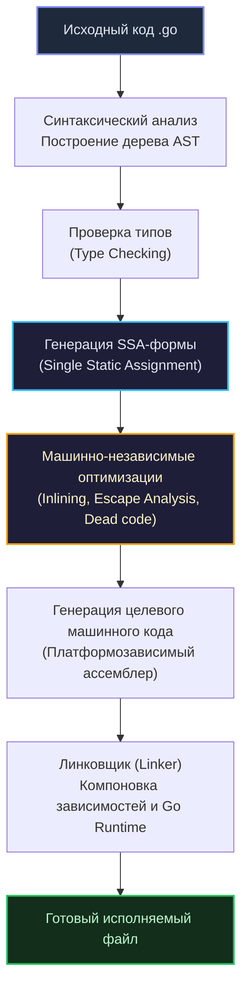

При переходе в Go из развитых экосистем C++ или Java первое, что вызывает искреннее восхищение и культурный шок, — это полное отсутствие громоздких внешних систем сборки. Вам больше не нужны CMake, Makefiles, Maven или Gradle для повседневной разработки (хотя классический Makefile порой используют в репозиториях как удобный фасад для запуска проектных команд).

Создатели языка заложили всю инженерную оснастку непосредственно в ядро платформы — в единственный системный бинарник `go`. Он одновременно выступает компилятором, пакетным менеджером, встроенным тест-раннером, профилировщиком и линтером. Это прямое продолжение традиций Bell Labs и книги *«Software Tools»*: инструмент должен быть компактным, мощным и делать свою работу без лишней суеты.

Давайте заглянем под капот ключевых команд тулчейна и проследим, как они трансформируют текст исходников в машинный код.

---

## 1. go build: Рабочая лошадка и кросс-компиляция

Команда `go build` транслирует исходный код пакетов вместе со всеми внешними зависимостями и встроенным рантаймом в монолитный исполняемый файл. При сборке компилятор автоматически игнорирует тестовые файлы, оканчивающиеся на `_test.go`.

Одной из главных суперсил Go является **встроенная кросс-компиляция**. Вам не придется настраивать многоярусные цепочки кросс-тулчейнов (`cross-toolchains`) и компилировать промежуточные заголовочные файлы под чужие библиотеки. Компилятор Go из коробки знает машинные инструкции и соглашения о вызовах большинства существующих микроархитектур (x86, ARM, MIPS, RISC-V) и операционных систем (Linux, Windows, macOS, FreeBSD).

Чтобы скомпилировать бинарник под Linux ARM64, находясь на рабочей машине с macOS или Windows на процессоре x86-64, достаточно передать две переменные окружения:

```bash
GOOS=linux GOARCH=arm64 go build -o app main.go
```
*(Важное условие: эта магия работает безупречно, пока выключен cgo. При установленном флаге `CGO_ENABLED=1` для сборки C-кода потребуется внешний платформенный кросс-компилятор вроде `aarch64-linux-gnu-gcc`).*

### Под капотом компилятора

Легендарная скорость сборки Go обусловлена отказом от C-препроцессора. В C++ каждый `#include` разворачивает сотни килобайт заголовочных файлов (`headers`), заставляя парсер перерабатывать мегабайты текста снова и снова. В Go компилятор опирается на строгий направленный ациклический граф пакетов и эффективное дисковое кэширование артефактов.

Конвейер компиляции проходит через несколько строгих стадий:



> [!info] Под капотом: SSA и Оптимизации
> На этапе **SSA** (Single Static Assignment) код программы трансформируется в промежуточное представление, где каждая переменная получает значение ровно один раз. 
> 
> Именно на SSA-представлении компилятор выполняет ключевые оптимизации:
> * **Escape Analysis:** Алгоритм вычисляет область видимости каждого указателя и решает, оставить ли структуру на дешевом стеке или отправить ее в кучу (`Heap`), добавив работы Garbage Collector.
> * **Inlining:** Анализатор встраивает машинные инструкции компактных функций непосредственно в точку их вызова, устраняя накладные расходы на вызов (`Call frame overhead`) и сохранение регистров на стек.
> * **Dead code elimination & Bounds Check Elimination (BCE):** Удаление неиспользуемых веток кода и устранение лишних проверок выхода за границы массивов в горячих циклах.

### Уменьшение размера бинарника

По умолчанию `go build` упаковывает в бинарник подробные отладочные таблицы символов и метаданные формата DWARF, которые требуются дебаггерам (например, `delve`). 

В продакшен-окружении (особенно при деплое микросервисов в облачные кластеры) размер бинарника можно легко сократить на 25–35% с помощью специальных флагов встроенного линковщика:

```bash
go build -ldflags="-s -w" -o app main.go
```
* Флаг `-s` срезает таблицу символов;
* Флаг `-w` удаляет расширенную отладочную информацию DWARF.

---

## 2. go run: Иллюзия скриптового языка

Команда `go run` создает обманчивое ощущение работы с динамическим языком: вы передаете имя исходного файла, и код начинает выполняться мгновенно:

```bash
go run main.go
```

> [!warning] Ловушка / Gotcha
> У некоторых новичков возникает иллюзия, что в Go интегрирован встроенный интерпретатор. **Это категорически не так.**
> 
> Go — строго компилируемый язык. При вызове `go run` тулчейн собирает исходники в полноценный машинный бинарник, сохраняет его во временный системный каталог (вида `/tmp/go-build...`), запускает процесс на исполнение, ожидает код возврата и при выходе удаляет временный файл.
> 
> **Никогда не используйте `go run` в продакшен-среде** (внутри контейнеров Docker CMD или сервисных демонов systemd). Вы будете впустую сжигать такты CPU и оперативную память сервера на повторную компиляцию при каждом перезапуске процесса, а сбои очистки `/tmp` могут исчерпать свободные дескрипторы диска. В продакшен деплоится исключительно заранее собранный через `go build` бинарный артефакт.

---

## 3. go test: Встроенный фреймворк тестирования

В Go нет нужды подключать сторонние библиотеки вроде JUnit или PHPUnit. Тестирование является неотъемлемой частью спецификации самого языка. 

Для написания тестов достаточно создать файл с суффиксом `_test.go` внутри целевого пакета и объявить функцию с префиксом `Test`, принимающую указатель на структуру `*testing.T`:

```go
// Файл math_test.go
package math

import "testing"

func TestAdd(t *testing.T) {
    if Add(2, 2) != 4 {
        t.Fatal("Математика сломалась")
    }
}
```

Как это устроено аппаратно? При вызове команды `go test` компилятор синтезирует отдельный изолированный бинарник. В нем генерируется специальная функция `main()`, которая последовательно регистрирует все функции `TestXxx`, замеряет такты процессора и потребление памяти, форматирует вывод в консоль и корректно завершает тестовую программу.

Полезные базовые флаги:
* `go test -v ./...` — рекурсивно запустить все тесты в текущей директории и подпапках с подробным выводом логов;
* `go test -cover` — вычислить процент покрытия строк бизнес-логики тестовыми сценариями.

---

## 4. Race Detector: Поиск гонок данных (Data Races)

Для инженера, проектирующего конкурентные сетевые сервисы, гонки данных (`Data Races`) представляют наибольшую опасность. Они возникают в ситуациях, когда две или более горутины одновременно обращаются к одной и той же ячейке памяти, и как минимум одна из них выполняет операцию записи без должной синхронизации.

Go содержит встроенный детектор гонок, созданный на базе алгоритма **ThreadSanitizer (TSAN)** от команды Google и проекта LLVM. Он активируется добавлением простого флага `-race`:

```bash
go test -race ./...
go build -race -o app main.go
```

> [!info] Под капотом: Как работает ключик -race?
> При компиляции с флагом `-race` оптимизатор Go инструментирует машинный код программы. Перед **каждой** инструкцией чтения и записи в память компилятор встраивает служебный вызов отслеживающей процедуры рантайма. 
> 
> Теневая память TSAN регистрирует, какая горутина и в какой момент времени трогала данный адрес. Если рантайм фиксирует одновременный несогласованный доступ двух горутин к одному байту без примитивов синхронизации (будь то канал или `Mutex`), выполнение прерывается и на экран выводится подробный Stack Trace с указанием точных строк кода конфликта.

**Железное правило:** Никогда не отправляйте бинарники, собранные с флагом `-race`, на боевые серверы под нагрузку! Инструментирование памяти увеличивает расход RAM в 5–10 раз и снижает скорость вычислений в 2–20 раз. Однако прогон тестовых наборов с флагом `-race` в CI/CD пайплайнах является строжайшим стандартом надежности.

---

## 5. Вспомогательные утилиты

В тулчейн Go встроены средства статического анализа и стандартизации, которые в других экосистемах приходится долго настраивать вручную:

### go fmt
Утилита форматирования кода, устранившая все споры о стиле в сообществе.

> [!tip] Собеседование
> В Go-командах не бывает дискуссий о том, где ставить открывающую фигурную скобку или сколько пробелов использовать для отступа.  
> Утилита `gofmt` (вызываемая также через `go fmt`) парсит исходный код с помощью стандартного пакета `go/ast` в абстрактное синтаксическое дерево и регенерирует его в текст по единому стандарту оформления. Это сберегает тысячи человеко-часов на `code review`, полностью закрывая холивары о форматировании.

### go vet
Официальный статический анализатор кода. Он исследует синтаксически корректные конструкции, выявляя скрытые логические ловушки:
* Несоответствие спецификаторов формата аргументам в `fmt.Printf`;
* Фатальное копирование мьютекса `sync.Mutex` по значению (копирование структуры замка разрушает его внутреннее состояние и ломает блокировки);
* Недостижимые участки кода и потенциально бесконечные циклы.

### Build Tags (Теги сборки)
Когда необходимо собрать платформозависимый код (например, низкоуровневый ввод-вывод на `epoll` для Linux и `kqueue` для macOS), Go использует директивы тегов сборки в заголовке файла:

```go
//go:build linux

package netpoll
// Данный файл будет скомпилирован исключительно при условии GOOS=linux
```
При кросс-компиляции под Windows или macOS тулчейн `go build` автоматически проигнорирует этот файл.

---

## Итог

1. Команда `go build` генерирует полностью автономные исполняемые бинарники. Механика кросс-компиляции (`GOOS/GOARCH`) встроена в ядро компилятора и не требует сторонних инструментов.
2. Конвейер сборки оптимизирует машинный код на фазе SSA, используя Escape Analysis и агрессивный Inlining.
3. Команда `go run` не является интерпретатором — это временная фоновая компиляция, недопустимая для продакшена.
4. Встроенный детектор гонок (`-race`) — непревзойденный инструмент валидации конкурентности для тестов и CI/CD.
5. Родной тулчейн закрывает все потребности команды: форматирование (`go fmt`), глубокий статический анализ (`go vet`) и модульное тестирование (`go test`).

Освоив команды тулчейна, перейдем к фундаментальным кирпичикам самого кода. В следующей лекции [[4. Структура Go-программы. package, import, func main]] мы разберем, как организуются файлы внутри пакетов, как компилятор собирает модули и как работает жизненный цикл функции `main`.
