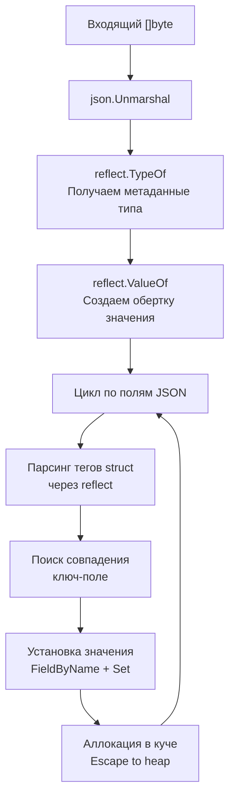

В мире распределенных систем формат JSON (JavaScript Object Notation) стал универсальным эсперанто. На нем общаются микросервисы, веб-браузеры, базы данных NoSQL и мобильные клиенты. В скриптовых языках с динамической типизацией (Python, JavaScript, PHP) парсинг JSON напоминает наливание воды в сосуд произвольной формы: функции вроде `json.loads` или `json_decode` автоматически разворачивают текстовый поток в произвольные вложенные словари и списки.

В языке Go такой фокус не пройдет. Go — язык строгой статической типизации и механического сочувствия к оборудованию. Вместо того чтобы создавать аморфные структуры в памяти, рантайм Go требует заблаговременного и точного описания того, во что именно должны превратиться байты из сети.

Вся работа с форматом в стандартной библиотеке сосредоточена в пакете `encoding/json`. Его архитектура построена вокруг двух принципов: максимальная предсказуемость типов данных и осознанный компромисс между удобством рефлексии и процессорными тактами.

В этой главе мы разберем базовые операции сериализации и десериализации, изучим управление полями через структурные теги, разберем потоковую обработку через `Encoder`/`Decoder`, исследуем причины медлительности стандартного парсера и познакомимся с альтернативами на базе SIMD и кодогенерации.

---

## Базовые операции: Marshal и Unmarshal

В терминологии Go вместо понятий «сериализация» и «десериализация» приняты лаконичные глаголы:
- **`Marshal`** — упаковка структуры Go в срез байтов JSON (`Struct -> []byte`).
- **`Unmarshal`** — распаковка среза байтов JSON в конкретную структуру Go (`[]byte -> Struct`).

### Unmarshal: JSON -> Struct

Чтобы парсер смог наполнить поля структуры данными, должны соблюдаться два ключевых условия:
1. Поля обязаны быть **экспортируемыми** (начинаться с заглавной буквы), иначе рефлексия рантайма их проигнорирует.
2. В функцию `json.Unmarshal` необходимо передать **указатель** на структуру, иначе метод заполнит локальную копию на стеке, которая мгновенно исчезнет.

```go
package main

import (
	"encoding/json"
	"fmt"
	"log"
)

// Поля структуры экспортируемы (с заглавной буквы)
type User struct {
	ID    int    `json:"id"`
	Name  string `json:"name"`
	Email string `json:"email"`
}

func main() {
	jsonData := []byte(`{"id": 1, "name": "Alice", "email": "alice@example.com"}`)

	var user User
	// Передаем указатель (&user), чтобы Unmarshal заполнил поля оригинала
	err := json.Unmarshal(jsonData, &user)
	if err != nil {
		log.Fatalf("Unmarshal error: %v", err)
	}

	fmt.Printf("%+v\n", user) // {ID:1 Name:Alice Email:alice@example.com}
}
```

### Marshal: Struct -> JSON

Упаковка структуры в срез байтов выполняется вызовом `json.Marshal`:

```go
user := User{ID: 2, Name: "Bob", Email: "bob@example.com"}

// Marshal возвращает слайс байт и ошибку
jsonData, err := json.Marshal(user)
if err != nil {
	log.Fatal(err)
}
fmt.Println(string(jsonData)) // {"id":2,"name":"Bob","email":"bob@example.com"}
```

---

## Структурные теги (Struct Tags)

В языке Go имена полей структур пишутся в `CamelCase` с заглавной буквы. В мире JSON доминируют другие соглашения: `snake_case` или `lowerCamelCase`. Для сопоставления ключей JSON с полями структур в Go используются **структурные теги (Struct Tags)** — строковые литералы в обратных кавычках, считываемые рантаймом через механизм рефлексии:

```go
type ServerConfig struct {
	Host      string `json:"host"`             // Маппинг на ключ "host"
	Port      int    `json:"port"`             // Маппинг на ключ "port"
	SecretKey string `json:"-"`                // Ключ "-" означает: ПОЛНОСТЬЮ ИГНОРИРОВАТЬ поле
	Timeout   int    `json:"timeout,omitempty"` // Опускать поле, если оно равно zero-value (0, "", nil, false)
}
```

Директива `omitempty` сообщает сериализатору: если значение поля равно его «нулевому значению» (zero-value: `0` для чисел, `""` для строк, `false` для булевых значений, `nil` для указателей), ключ не должен включаться в результирующий JSON.

> [!warning] Ловушка / Gotcha: omitempty и структуры времени time.Time
> Будьте предельно внимательны при использовании модификатора `omitempty` со структурой `time.Time`! 
> В Go нулевое значение `time.Time` — это не `nil`, а вполне легитимная структура, представляющая дату `0001-01-01 00:00:00 UTC`. Если поле помечено как `json:"created_at,omitempty"`, то при совпадении с этой нулевой датой поле будет неожиданно вырезано из JSON. 
> Для надежной работы с опциональными датами объявляйте поле как указатель: `CreatedAt *time.Time `json:"created_at,omitempty"``. В этом случае отсутствие даты передается через буквальный `nil`, который `omitempty` обрабатывает корректно.

---

## Произвольные данные: any и json.RawMessage

Что делать, если точная схема входящего JSON заранее неизвестна, или полезная нагрузка зависит от типа входящего события?

### 1. `map[string]any` (бывший `map[string]interface{}`)
Это классический путь для полностью динамического разбора. Однако вы платите за него потерей типобезопасности и лавиной аллокаций памяти в куче:

```go
var data map[string]any
json.Unmarshal([]byte(`{"key": "value", "num": 123}`), &data)

// Придется делать type assertion, что неидиоматично и чревато паниками:
num, ok := data["num"].(float64) // Внимание: JSON числа ВСЕГДА парсятся во float64!
```

Обратите внимание: поскольку спецификация JSON не разделяет целые и вещественные числа, стандартный парсер Go при разборе в `any` всегда преобразует любые числовые литералы в тип `float64`!

### 2. `json.RawMessage`: Отложенный парсинг

`json.RawMessage` — один из самых элегантных приемов в арсенале бэкенд-инженера. По своей сути `RawMessage` — это просто псевдоним над срезом байтов `type RawMessage []byte`, который реализует интерфейсы `json.Marshaler` и `json.Unmarshaler`.

При десериализации парсер не пытается разобрать содержимое `json.RawMessage`, а сохраняет исходные байты в нетронутом виде:

```go
type Envelope struct {
	Type string          `json:"type"`
	Data json.RawMessage `json:"data"` // Данные не парсятся, остаются как байты
}

payload := []byte(`{"type": "user_created", "data": {"id": 1, "name": "Alice"}}`)

var env Envelope
json.Unmarshal(payload, &env)

// Парсим Data только когда поняли тип
if env.Type == "user_created" {
	var user User
	json.Unmarshal(env.Data, &user)
}
```

> [!info] Под капотом: Экономия ресурсов с json.RawMessage
> Применение `json.RawMessage` — классический паттерн для обработки полиморфных вебхуков и сообщений из очередей Kafka/RabbitMQ. Вы избегаете холостого расхода тактов CPU на глубокий парсинг тела сообщения, если маршрутизатор сервиса сразу отфильтровывает ненужные типы событий. Это идеальное дополнение к технике встраивания DTO, рассмотренной в [[25. Встраивание. Embedding вместо наследования]].

---

## Потоковая работа: Encoder и Decoder

Функции `json.Marshal` и `json.Unmarshal` оперируют монолитными срезами памяти `[]byte`. Если в ваш сервис по HTTP поступает JSON-документ размером в сотни мегабайт, попытка вычитать его целиком через `os.ReadFile` или `io.ReadAll` приведет к мгновенному взлету потребления памяти и срабатыванию OOM Killer.

Для потоковой работы пакет предоставляет типы `json.Encoder` и `json.Decoder`. Они работают напрямую с фундаментальными абстракциями `io.Reader` и `io.Writer`, детально изученными в главе [[29. Работа с файлами и IO]]:

```go
// Запись (сервер отправляет JSON в http.ResponseWriter)
func handler(w http.ResponseWriter, r *http.Request) {
	user := User{ID: 1, Name: "Alice"}
	
	// Encoder пишет напрямую в w, без промежуточного []byte
	err := json.NewEncoder(w).Encode(user)
	if err != nil {
		http.Error(w, err.Error(), http.StatusInternalServerError)
	}
}

// Чтение (сервер читает JSON из тела запроса)
func handlerPost(w http.ResponseWriter, r *http.Request) {
	var user User
	
	// Decoder читает напрямую из r.Body, без загрузки всего тела в RAM
	err := json.NewDecoder(r.Body).Decode(&user)
	if err != nil {
		http.Error(w, "bad request", http.StatusBadRequest)
		return
	}
}
```

> [!warning] Ловушка / Gotcha: Защита от глубокой вложенности
> По умолчанию `json.Decoder` отклоняет входящие JSON-документы с глубиной вложенности более 10 000 уровней, аппаратно защищая сервер от исчерпания стека при атаках типа Denial of Service (JSON Bomb). Кроме того, метод `decoder.DisallowUnknownFields()` позволяет отклонять запросы, содержащие неизвестные поля, предотвращая скрытые ошибки в API-контрактах.

---

## Mechanical Sympathy: Рефлексия и аллокации

Почему стандартный пакет `encoding/json` регулярно критикуют за невысокую скорость работы по сравнению с аналогами на C++ или Rust?

Взглянем на внутреннюю механику работы `Unmarshal`:



Главные узкие места стандартного парсера:

1. **Тяжелая рефлексия (`reflect`)**: При каждом вызове рантайм Go вынужден исследовать внутреннее строение структуры, парсить строки структурных тегов и искать совпадения имен полей. Такие вызовы не поддаются инлайнингу (Inlining) компилятором и сбивают предсказатель ветвлений CPU.
2. **Утечки в кучу (Escape Analysis)**: Использование универсальных интерфейсов `any` и промежуточных структур `reflect.Value` заставляет аллокатор выносить промежуточные данные в кучу. Каждая аллокация увеличивает объем работы для фонового Garbage Collector (подробнее в [[7. Глубокий Go. Внутреннее устройство]]).
3. **Проверка UTF-8 на лету**: Стандарт JSON строго требует валидности кодировки UTF-8. Парсер принудительно сканирует все строковые литералы байт за байтом, расходуя процессорные такты.

---

## Производительность: Кодогенерация и SIMD

Как высоконагруженные Go-сервисы (обрабатывающие от десятков тысяч запросов в секунду) обходят ограничения стандартного парсера?

Решение заключается в **переносе работы с этапа выполнения на этап компиляции**:

- **`easyjson`**: Генерирует специализированный Go-код парсинга для каждой конкретной структуры заранее. Вместо рефлексии сгенерированный код содержит статические переходы `switch/case` по байтам ключей. Работает в 2–4 раза быстрее стандартного пакета и практически не аллоцирует память в куче.
- **`go-json`**: Прозрачная drop-in замена стандартного пакета от сообщества. Применяет агрессивное кэширование метаданных структур и специализированные ассемблерные вставки для быстрого поиска символов.
- **`sonic` (от инженеров ByteDance)**: Самый производительный JSON-парсер на сегодняшний день. Использует JIT-компиляцию на лету и векторные процессорные инструкции **SIMD** (AVX2/AVX-512 на x86-64 и NEON на ARM64), обрабатывая сразу по 32 или 64 байта за один такт процессора.

> [!tip] Собеседование: Потеря точности при парсинге больших целых чисел
> **Вопрос:** Почему при десериализации JSON в `map[string]any` большие идентификаторы типа `int64` могут искажаться, и как это предотвратить?  
> **Ответ:** Спецификация формата JSON не различает целые и вещественные типы: все числа трактуются одинаково. При отсутствии строгой структуры парсер Go вынужден помещать числа в тип `float64`. Мантисса 64-битного числа с плавающей точкой по стандарту IEEE 754 содержит ровно 53 бита информации. Любое целое число, превышающее по модулю $2^{53}$ (9 007 199 254 740 992), теряет младшие разряды при преобразовании во `float64`.  
> Для предотвращения искажений десериализуйте данные либо строго в конкретное поле структуры с типом `int64`, либо используйте потоковый тип **`json.Number`**, который сохраняет число в виде исходной текстовой строки до явного запроса конвертации.

---

## HTML-экранирование: Сюрприз для REST API

В стандартном пакете `encoding/json` заложена скрытая особенность, нередко ставящая в тупик бэкенд-разработчиков.

По умолчанию метод `json.Marshal` экранирует специальные символы `<`, `>` и `&`, заменяя их на Unicode-последовательности `\u003c`, `\u003e`, `\u0026`. Это было сделано из соображений безопасности: чтобы сформированный JSON можно было без риска внедрять внутрь HTML-страниц без опасности возникновения XSS-уязвимостей.

Однако при создании классических REST API такое поведение искажает строковые данные в ответах. Изменить эту настройку в функции `Marshal` невозможно. Единственный корректный способ отключить экранирование — использовать `Encoder`:

```go
var buf bytes.Buffer
enc := json.NewEncoder(&buf)
enc.SetEscapeHTML(false) // Отключаем принудительное экранирование символов
enc.Encode(data)
```

> [!warning] Ловушка / Gotcha: Опасность кустарного разэкранирования
> Распространенная ошибка начинающих разработчиков — попытка "починить" ответ с помощью `strings.Replace` на готовой JSON-строке. Это не только создает бессмысленные аллокации памяти, но и повреждает легитимные escape-последовательности, которые пользователь действительно передал в полезной нагрузке. Для REST API всегда настраивайте `Encoder` через `SetEscapeHTML(false)`.

---

## Итог

1. **Статическая дисциплина:** В Go сериализация опирается на строгую типизацию структур и явные структурные теги.
2. **Потоковый ввод-вывод:** Используйте `json.NewEncoder` и `json.NewDecoder` для сетевого ввода-вывода, избегая раздувания промежуточных буферов в оперативной памяти.
3. **Отложенная обработка:** Тип `json.RawMessage` позволяет экономить процессорные такты при обработке полиморфных событий и очередей сообщений.
4. **Рефлексия и кодогенерация:** В высоконагруженных системах (`10k+ RPS`) стандартный парсер становится узким местом. Переход на кодогенерацию (`easyjson`) или SIMD-парсинг (`sonic`) — стандартная практика оптимизации.
5. **Безопасность типов:** Для 64-битных целых чисел помните об ограничении мантиссы `float64` в $2^{53}$ и используйте `json.Number` или строгие типы `int64`.

Байты и форматы обмена данными разобраны. Но ни один сетевой сервис не может существовать вне контекста реального физического времени: таймауты запросов, периодические фоновые задачи, замеры задержек (Latency) и интервалы кэширования требуют безупречного понимания временной шкалы.

В следующей лекции мы детально изучим подсистему времени в Go. В главе [[31. Время и даты. time.Time, Duration, Timer, Ticker]] мы исследуем структуру `time.Time`, разберем, как монотонные часы защищают сервис от сбоев синхронизации NTP, и узнаем, как таймеры рантайма связываются с системным шедулером.
