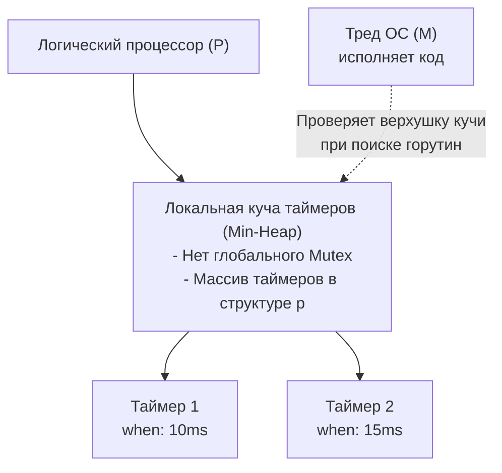

В программировании работа со временем — это классическое минное поле. Высокосные секунды, сезонные переходы на летнее время, дрейф кварцевых резонаторов на серверных материнских платах, скачки синхронизации NTP в распределенном кластере и непредсказуемые указы правительств об изменении часовых поясов. 

Многие поколения языков (ранний C, PHP, ранние версии Java) наивно полагались на простой 32- или 64-битный счетчик **Unix Timestamp** (количество секунд, прошедших с полночи 1 января 1970 года). Но в современных высоконагруженных распределенных системах наивный подход к измерению времени гарантированно приводит к трудноуловимым авариям.

Стандартный пакет `time` в Go создавался опытными системными инженерами. Он инкапсулирует сложнейшую физику взаимодействия с аппаратными часами процессора и ядром операционной системы, предоставляя надежный, типобезопасный и лаконичный API.

В этой главе мы разберем разницу между Wall Clock и Monotonic Clock, изучим структуру `time.Time` в оперативной памяти и магию vDSO, поймем мнемоническую логику эталонной даты `"2006-01-02 15:04:05"`, разберем смертельную ловушку утечки памяти с `time.After` и выясним, как планировщик рантайма Go распределяет миллионы таймеров без глобальных блокировок.

---

## 1. Wall Clock против Monotonic Clock

Это фундаментальная концепция, которую обязан понимать любой бэкенд-инженер, занимающийся профилированием или измерением задержек (Latency).

В любом современном компьютере одновременно функционируют двое принципиально разных часов:

1. **Wall Clock (Настенные часы):** Показывают текущее астрономическое календарное время для людей. Они нестабильны: системный администратор может изменить дату вручную, а фоновый демон **NTP (Network Time Protocol)** периодически синхронизирует часы сервера с атомными эталонами и может «отмотать» их назад, если серверный таймер спешил.
2. **Monotonic Clock (Монотонные часы):** Аппаратный счетчик операционной системы (в Linux это `CLOCK_MONOTONIC`). Он запускается в момент старта ОС и **непрерывно идет только вперед**. На него не способны повлиять ни NTP-синхронизация, ни високосные секунды, ни ручные манипуляции с датой.

> [!warning] Ловушка / Gotcha: Отрицательная длительность
> Если вы измеряете длительность выполнения операции (например, тяжелого запроса к базе данных) с помощью настенных часов (Wall Clock), вы рискуете получить отрицательное время!
> 
> Пример логической катастрофы:  
> `t1 := unix_timestamp(); do_work(); t2 := unix_timestamp(); duration := t2 - t1`.  
> Если ровно посередине выполнения `do_work()` служба NTP скорректировала часы сервера на 50 миллисекунд назад, разность `t2 - t1` окажется **отрицательной**. В распределенной системе это ломает расчет таймаутов и логику вычисления задержек.

В Go структура `time.Time` спроектирована исключительно изящно: она способна хранить **оба показания времени одновременно**!

Когда вы вызываете функцию `time.Now()`, рантайм запрашивает у ядра операционной системы сразу оба значения — и календарное время Wall Clock, и монотонное время Monotonic Clock — упаковывая их в одну компактную структуру:

```go
package main

import (
	"fmt"
	"time"
)

func main() {
	start := time.Now() // Сохраняет и Wall, и Monotonic время
	
	// Эмуляция полезной работы
	time.Sleep(100 * time.Millisecond)
	
	// time.Since использует ТОЛЬКО Monotonic часть из start (если она там есть),
	// гарантируя точное измерение, даже если системное время изменилось!
	elapsed := time.Since(start) 
	
	fmt.Printf("Прошло: %v\n", elapsed)
}
```

Функция `time.Since(start)` специально проверяет наличие монотонной метки: если она присутствует, расчет интервала выполняется строго по Monotonic Clock, исключая любые сюрпризы от NTP.

> [!info] Под капотом: Устройство time.Time и Memory Layout
> Структура `time.Time` занимает ровно **24 байта** памяти (на 64-битных системах) и имеет следующее внутреннее строение:
> ```go
> type Time struct {
>     wall uint64    // Битовая маска: флаг наличия monotonic, 33 бита секунд, 30 бит наносекунд
>     ext  int64     // Если есть monotonic - тут лежат секунды от старта ОС. Иначе - секунды от 1 года н.э.
>     loc  *Location // Указатель на таймзону (8 байт)
> }
> ```
> Обратите внимание на поле `loc *Location`. Структура `time.Time` идиоматично передается **по значению** (`time.Time`, а не указатель `*time.Time`). Копирование 24 байт через регистры процессора исключительно дешево для CPU и не создает лишней работы сборщику мусора, а указатель на `Location` безопасно разделяется между всеми копиями.

### vDSO и Mechanical Sympathy

Получение системного времени в операционной системе — это системный вызов ядра (`clock_gettime` в Linux). Но системный вызов требует дорогостоящего переключения контекста процессора из пространства пользователя в ядро (**Ring 3 -> Ring 0**). Если сервис под нагрузкой измеряет задержки каждого запроса миллионы раз в секунду, постоянные системные вызовы привели бы к ощутимой деградации.

Почему `time.Now()` в Go работает молниеносно?  
Благодаря механизму **vDSO (Virtual Dynamically Shared Object)**. Ядро Linux отображает (мапит) специальную страницу памяти с актуальными показаниями аппаратного таймера процессора напрямую в адресное пространство User Space каждого процесса. Вызов `time.Now()` в Go выполняется как обычное чтение из оперативной памяти без смены привилегий CPU!

---

## 2. time.Duration: Типобезопасные интервалы

Во многих языках программирования таймауты передаются в виде безликих целых чисел: `setTimeout(func, 1000)` — это 1000 секунд, миллисекунд или микросекунд? Разработчик вынужден гадать или вчитываться в документацию.

В Go время — это строгий тип: `time.Duration`. Под капотом это обычный 64-битный целочисленный тип `int64`, хранящий время с точностью до **наносекунд**:

```go
// src/time/time.go
type Duration int64

const (
	Nanosecond  Duration = 1
	Microsecond          = 1000 * Nanosecond
	Millisecond          = 1000 * Microsecond
	Second               = 1000 * Millisecond
	Minute               = 60 * Second
	Hour                 = 60 * Minute
)
```

Благодаря строгой статической типизации вы не можете случайно передать голое число `10` туда, где ожидается интервал. Компилятор заставит вас написать явно: `10 * time.Second`. Ошибки размерностей отсекаются еще на этапе сборки.

---

## 3. Магия форматирования: "2006-01-02 15:04:05"

Форматирование дат в Go поначалу вызывает искреннее недоумение у разработчиков, привыкших к маскам вида `YYYY-MM-DD HH:mm:ss`. Вместо абстрактных буквенных спецификаторов создатели Go выбрали уникальную **эталонную референсную дату**:

> **02 января 2006 года, 15:04:05 по таймзоне MST (GMT-07:00).**

В чем секрет этой странной даты? Взгляните на нее в американском порядке записи компонентов (Месяц / День / Час / Минута / Секунда / Год / Смещение таймзоны): `01/02 03:04:05PM '06 -0700`.

Это последовательность цифр от 1 до 7 по порядку!
- `01` — месяц (Month)
- `02` — день (Day)
- `03` (или `15`) — час (Hour)
- `04` — минута (Minute)
- `05` — секунда (Second)
- `06` (или `2006`) — год (Year)
- `07` — часовой пояс (MST / -0700)

```go
package main

import (
	"fmt"
	"time"
)

func main() {
	now := time.Now()
	
	// Форматирование в стандартный формат ISO 8601 / RFC 3339
	fmt.Println(now.Format(time.RFC3339))
	
	// Пользовательский кастомный формат
	custom := now.Format("02.01.2006 (15:04)")
	fmt.Println(custom)
	
	// Парсинг текстовой даты
	parsed, err := time.Parse("2006-01-02", "2024-10-15")
	if err != nil {
		panic(err)
	}
	fmt.Println(parsed.Year())
}
```

> [!tip] Собеседование: Опечатка в шаблоне даты
> **Вопрос:** Что произойдет, если при формировании шаблона разработчик по ошибке укажет `"2006-02-01"` вместо эталонного `"2006-01-02"`?  
> **Ответ:** Компилятор и рантайм Go не выбросят ошибку! Парсер просто сопоставит цифру `02` (стоящую на месте месяца) с днем, а цифру `01` (стоящую на месте дня) — с месяцем. В базу данных или логи запишется искаженная дата, где месяцы и дни поменялись местами. Всегда строго сверяйте шаблон форматирования с каноном `1 2 3 4 5 6 7`.

---

## 4. Таймзоны и проблема tzdata в Docker

Часовые пояса — это социально-политическая условность. Границы зон и правила перехода на сезонное время устанавливаются правительствами и периодически меняются. Каталог этих правил хранится в базе данных **`tzdata`** операционной системы.

В языке Go за часовые пояса отвечает тип `time.Location`:

```go
loc, err := time.LoadLocation("Europe/Moscow")
if err != nil {
    // Внимание! Эта ошибка возникнет в production, если в контейнере нет tzdata!
    panic(err)
}
timeInMSK := time.Now().In(loc)
```

> [!warning] Ловушка / Gotcha: Минималистичные образы scratch и alpine
> В микросервисной архитектуре принято собирать ультра-легковесные Docker-образы (на базе `alpine` или абсолютно пустого образа `scratch`). В образе `scratch` файловая система пуста — там физически отсутствует база `tzdata`! В результате вызов `time.LoadLocation("Europe/Moscow")` завершится ошибкой и паникой в продакшене.
> 
> **Решение:** Добавляйте зависимость `tzdata` в ваш `Dockerfile` (через менеджер пакетов ОС) или импортируйте пакет `_ "time/tzdata"`, который вошьет базу прямо в бинарник (увеличит его размер на ~400 КБ).

---

## 5. Таймеры и Тикеры: Каналы событий

В асинхронном бэкенде паузы и периодические действия нельзя реализовывать блокировкой потоков. Для этого Go предоставляет типы `time.Timer` и `time.Ticker`, тесно интегрированные с каналами (подробнее в [[36. Каналы. Передача данных между горутинами]]).

### time.Timer (Одноразовое событие)

Таймер создает канал `C`, в который ровно один раз отправляется значение текущего времени по истечении заданного интервала:

```go
timer := time.NewTimer(2 * time.Second)
defer timer.Stop() // Всегда останавливайте таймер, если он больше не нужен!

<-timer.C // Горутина засыпает без блокировки потока ОС
fmt.Println("Таймер сработал")
```

### Утечка памяти с time.After

Функция `time.After` — удобная обертка над `time.NewTimer`, сразу возвращающая канал `<-chan Time`. Однако в циклических конструкциях она превращается в классический источник скрытых утечек памяти.

> [!warning] Ловушка / Gotcha: Утечка памяти в цикле for-select
> Взгляните на типичный код обработки очереди сообщений:
> ```go
> func processMessages(ch <-chan []byte) {
>     for {
>         select {
>         case msg := <-ch:
>             handle(msg)
>         case <-time.After(1 * time.Hour): // УТЕЧКА ПАМЯТИ!
>             fmt.Println("Нет сообщений целый час, завершаю работу")
>             return
>         }
>     }
> }
> ```
> **В чем кроется катастрофа?** Функция `time.After` на **каждой итерации цикла** создает совершенно новый таймер в рантайме. Если сообщения поступают с высокой частотой (например, 1 000 сообщений в секунду), за минуту сервис породит 60 000 таймеров. И каждый из них будет удерживаться внутренними структурами рантайма в памяти **целый час**! Сборщик мусора бессилен удалить эти объекты, пока их интервал не истечет. Память сервиса быстро исчерпается.
> 
> **Корректное решение:** создайте один экземпляр `time.NewTimer` перед циклом и переиспользуйте его через метод `Reset`:
> ```go
> timer := time.NewTimer(1 * time.Hour)
> defer timer.Stop()
> 
> for {
>     select {
>     case msg := <-ch:
>         handle(msg)
>         // Безопасно сбрасываем таймер для следующей итерации
>         if !timer.Stop() {
>             <-timer.C // Очищаем канал, если таймер уже успел сработать
>         }
>         timer.Reset(1 * time.Hour)
>     case <-timer.C:
>         return
>     }
> }
> ```

### time.Ticker (Периодические тики)

`Ticker` циклически посылает тики в канал `C` через равные интервалы времени:

```go
ticker := time.NewTicker(1 * time.Second)
defer ticker.Stop() // Обязательно останавливайте тикер, иначе он останется в памяти навсегда!

done := make(chan bool)
go func() {
	time.Sleep(5 * time.Second)
	done <- true
}()

for {
	select {
	case t := <-ticker.C:
		fmt.Println("Тик в:", t)
	case <-done:
		fmt.Println("Завершение")
		return
	}
}
```

---

## 6. Под капотом: Как рантайм Go управляет таймерами

В ранних версиях Go (до версии 1.14) все таймеры программы складывались в одну глобальную структуру данных — двоичную кучу минимальных значений (**Min-Heap**). За кучей следила единственная системная горутина-планировщик (`timerproc`).

На многоядерных машинах (32–64 ядра) это приводило к колоссальной конкуренции за ресурсы (**Contention**): тысячи независимых горутин пытались одновременно захватить единственный глобальный мьютекс кучи таймеров, что буквально парализовало рантайм.

Начиная с **Go 1.14**, архитектура таймеров была фундаментально переработана и бесшовно интегрирована в планировщик рантайма (подробнее в главе [[35. Scheduler Go. G, M, P и work stealing]]) и сетевой поллер (`netpoll`):

1. У каждого логического процессора **P** (Processor) теперь есть **собственная локальная куча таймеров** (поля `timers` и `timer0When` в структуре `p`).
2. Глобальный мьютекс полностью ликвидирован. Создание таймера (`time.NewTimer` или `time.Sleep`) добавляет запись в локальную очередь текущего процессора `P`.
3. Мониторинг таймеров выполняет **сам планировщик**. Когда поток операционной системы (**M**), привязанный к процессору `P`, ищет горутины для выполнения, он попутно инспектирует верхушку локальной кучи таймеров. Если срок наступил, поток `M` записывает метку в канал и пробуждает ожидающую горутину.



> [!info] Под капотом: Netpoll и спящие потоки
> Что происходит, если все горутины заблокированы в ожидании таймеров и процессор простаивает? Кто разбудит поток `M`?
> Планировщик вычисляет дедлайн самого раннего таймера среди всех процессоров `P` и передает его в системный селектор ввода-вывода `netpoll` (системный вызов `epoll_wait` в Linux или `kqueue` в macOS). Поток операционной системы безопасно засыпает в ядре, но ровно в расчетный момент таймера ОС пробуждает поток, возвращая управление в рантайм Go!

---

## Итог

1. **`time.Time`** одновременно несет в себе Wall clock (для людей и календаря) и Monotonic clock (для математически точных расчетов). Замеряйте интервалы через `time.Since()`, защищаясь от скачков времени при синхронизации NTP.
2. **`time.Duration`** — типобезопасное 64-битное представление наносекунд.
3. **Форматирование "2006-01-02 15:04:05"** строго подчинено мнемонике `1 2 3 4 5 6 7` (американский порядок записи компонентов).
4. **Таймзоны требуют tzdata:** В минималистичных контейнерах `scratch` используйте встроенный импорт `_ "time/tzdata"`.
5. **Остерегайтесь `time.After`** внутри циклов `for-select`: он непрерывно порождает таймеры в куче рантайма. Используйте переинициализацию `time.NewTimer`.
6. **Масштабируемость:** Начиная с Go 1.14, таймеры распределены по локальным кучам процессоров `P`, ликвидируя конкуренцию за блокировки на многоядерных CPU.

Мы освоили работу со временем, данными и системным вводом-выводом. Но до версии Go 1.18 в языке сохранялось заметное ограничение: как написать алгоритм (например, функцию `Min`), одинаково работающий с `int`, `float64` или `time.Duration`, не прибегая к медленной рефлексии `any` и не дублируя код?

В следующей лекции мы детально разберем самую долгожданную революцию в синтаксисе языка. В главе [[32. Дженерики. Type Parameters и Constraints]] мы исследуем параметрический полиморфизм в Go, познакомимся с интерфейсными ограничениями типов (Type Constraints) и выясним, как компилятор сохраняет механическую симпатию к железу без раздувания бинарного файла.