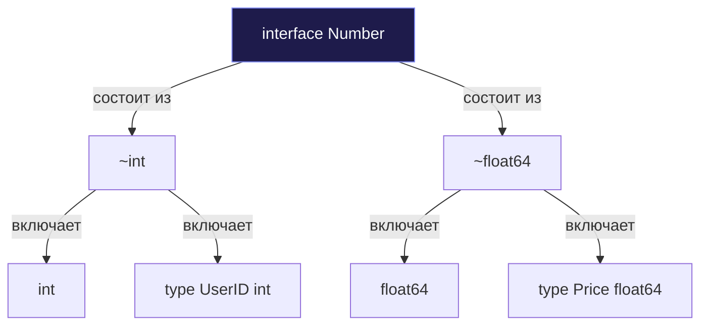

До выхода релиза Go 1.18 весной 2022 года бэкенд-разработчики в сообществе Go жили в состоянии непрерывного инженерного компромисса. Если вам требовалось написать элементарную функцию `Min`, вычисляющую минимум из двух чисел, или реализовать универсальную структуру данных `Stack`, вы неизбежно оказывались перед выбором из трех зол:

1. **Грубое дублирование кода:** Написать десяток одинаковых функций: `MinInt`, `MinInt32`, `MinFloat64` и так далее. Это типобезопасно и быстро исполняется процессором, но превращает поддержку кодовой базы в унылую рутину.
2. **Кодогенерация (go generate):** Использовать внешние утилиты, генерирующие типизированные исходники перед сборкой. Это усложняет CI/CD пайплайны и увеличивает время компиляции.
3. **Использование пустого интерфейса `interface{}`:** Написать одну функцию, принимающую `interface{}` (или `any`).

Третий вариант на первый взгляд кажется самым простым, но с точки зрения архитектуры и производительности он худший. Использование `interface{}` лишает вас проверок типов на этапе компиляции (можно случайно передать строку и число `int` и получить фатальный `panic` в рантайме). Но что еще болезненнее — это **убивает механическую симпатию к железу**.

Передача типов-значений (value types) в пустой интерфейс неизбежно приводит к **упаковке (boxing)**: компилятор проваливает Escape Analysis и вынужден выделять память в куче (heap), создавая колоссальную нагрузку на Garbage Collector.

Go 1.18 принес в язык долгожданное, взвешенное решение — **Дженерики (Обобщения, Generics)**. Они позволяют писать код, работающий с широким спектром типов данных, сохраняя бескомпромиссную статическую типизацию и скорость работы с памятью.

---

## Type Parameters: Синтаксис обобщений

Вместо привязки функции к конкретному типу, мы объявляем **Параметры типов (Type Parameters)** в квадратных скобках `[]` непосредственно перед списком аргументов:

```go
package main

import "fmt"

// T - это параметр типа.
// any - это ограничение (constraint), означающее "любой допустимый тип".
func PrintAnything[T any](value T) {
	fmt.Println(value)
}

func main() {
	// Явное указание типа при вызове
	PrintAnything[int](42)
	PrintAnything[string]("Go")

	// Вывод типов (Type Inference):
	// Компилятор сам понимает, что 3.14 имеет тип float64
	PrintAnything(3.14) 
}
```

В приведенном примере `T` становится типовым заполнителем внутри сигнатуры и тела функции. Компилятор строго гарантирует, что аргумент `value` будет обладать именно тем типом, который подставлен при вызове.

---

## Constraints (Ограничения): От поведения к множествам типов

Если параметром типа выступает `any`, мы практически ничего не можем сделать с переменной `T` внутри функции. Мы не можем даже сложить два значения `a + b`: если под `T` придет сложная структура, операция сложения вызовет ошибку.

Чтобы разрешить операции над обобщенными типами, мы обязаны наложить на них **ограничения (Constraints)**. Создатели Go нашли гениальное решение: вместо введения нового ключевого слова они расширили концепцию уже знакомых нам интерфейсов.

До Go 1.18 интерфейс определял исключительно **поведение** (множество методов).  
Начиная с Go 1.18, интерфейс может определять **множество типов (Type Sets)**.

### 1. Оператор объединения `|` (Union)

Мы можем объявить интерфейс, перечисляющий разрешенные типы через оператор `|`:

```go
// Number - это constraint, разрешающий только int или float64
type Number interface {
	int | float64
}

// Теперь компилятор знает, что T - это число, и разрешает оператор сложения '+'
func Add[T Number](a, b T) T {
	return a + b
}
```

### 2. Оператор аппроксимации `~` (Underlying Type)

Что произойдет, если в коде объявлен пользовательский доменный тип: `type UserID int`?  
Он не пройдет валидацию интерфейсом `Number`, поскольку `UserID` и базовый `int` — это разные типы в системе типов Go.

Для поддержки производных типов был введен оператор **`~` (тильда)**. Он декларирует: *«Любой тип, базовым (underlying) типом которого является указанный примитив»*:

```go
type Number interface {
	~int | ~float64
}

type UserID int
type Price float64

func main() {
	id1, id2 := UserID(10), UserID(20)
	// Теперь это безупречно компилируется и работает!
	sum := Add(id1, id2) 
	_ = sum
}
```



### 3. Встроенные ограничения: any и comparable

Стандартная библиотека предоставляет готовые предопределенные ограничения:

- **`any`**: Полный псевдоним для пустого интерфейса `interface{}`. Разрешает передавать абсолютно любой тип.
- **`comparable`**: Встроенный constraint, включающий все типы, поддерживающие операторы сравнения `==` и `!=` (числа, строки, булевы значения, указатели, каналы, а также структуры и массивы, состоящие исключительно из comparable-полей). Важно: срезы (slices), карты (maps) и функции **не** являются `comparable`.

---

## Обобщенные структуры данных

Наиболее мощное и востребованное применение дженериков в продакшене — создание универсальных коллекций и структур данных с нулевыми накладными расходами.

Реализуем классический универсальный стек (Stack LIFO):

```go
package main

import "fmt"

// Stack может хранить элементы любого типа T
type Stack[T any] struct {
	items []T
}

func (s *Stack[T]) Push(item T) {
	s.items = append(s.items, item)
}

func (s *Stack[T]) Pop() (T, bool) {
	if len(s.items) == 0 {
		var zero T // Идиоматичный способ получить zero-value для обобщенного типа
		return zero, false
	}
	
	lastIndex := len(s.items) - 1
	item := s.items[lastIndex]
	s.items = s.items[:lastIndex] // Избегаем утечки памяти
	
	return item, true
}

func main() {
	// Создаем стек целых чисел
	intStack := &Stack[int]{}
	intStack.Push(10)
	
	// Создаем стек строк
	stringStack := &Stack[string]{}
	stringStack.Push("Hello")
	
	// Извлекаем значения без каких-либо Type Assertion!
	val, _ := stringStack.Pop()
	fmt.Println(val) // Выведет: Hello
}
```

> [!warning] Ловушка / Gotcha: Методы не могут объявлять собственные Type Parameters
> В текущей версии Go методы структур **не могут** объявлять собственные независимые параметры типов, если они не были объявлены на уровне самой структуры:
> 
> ```go
> type MyStruct struct{}
> 
> // ОШИБКА КОМПИЛЯЦИИ: метод не может иметь собственных type parameters
> func (m *MyStruct) DoSomething[T any](val T) {} 
> ```
> 
> Если вам требуется обобщенная операция, не привязанная к параметризации типа самой структуры, оформите ее обычной независимой функцией `func DoSomething[T any](m *MyStruct, val T)`.

---

## Mechanical Sympathy: Как дженерики влияют на железо?

Когда вы использовали классические интерфейсы `interface{}`, компилятор не знал точный размер данных на этапе компиляции. Это вынуждало рантайм использовать косвенные вызовы через таблицы методов и выносить значения в кучу (Heap Allocation). Разбросанные по куче объекты приводили к частым промахам в кэше процессора (**Cache Misses**), разрушая пространственную локальность данных.

С дженериками картина кардинально меняется. 

Когда вы объявляете `Stack[int]`, компилятор Go точно знает размер элемента `int` (8 байт на 64-битных системах). Срез `s.items []int` размещается в памяти как монолитный непрерывный массив целых чисел. 

Аппаратный предсказатель процессора (**Hardware Prefetching**) мгновенно подгружает соседние элементы в **L1/L2** кэши еще до того, как к ним обратится инструкция программы. **Никакой динамической диспетчеризации, никакого боксинга (boxing), никакого мусора для Garbage Collector.**

> [!info] Под капотом: Модели реализации дженериков в языках
> Разные языки решают задачу параметрического полиморфизма по-разному:
> 
> 1. **C++ (Templates / Monomorphization):** Компилятор генерирует отдельную копию машинного кода функции под каждый конкретный тип (Monomorphization). Это обеспечивает максимальную скорость в рантайме, но приводит к катастрофическому раздуванию размера бинарного файла (**Code Bloat**) и замедлению сборки.
> 2. **Java (Type Erasure):** Во время компиляции все дженерики стираются и подменяются базовым классом `Object`. Примитивные типы (`int`, `double`) принудительно упаковываются в объекты-обертки (`Integer`, `Double`), создавая лавину аллокаций в куче и нагружая GC.
> 3. **Go (GCShape Stenciling с Dictionaries):** Расс Кокс и команда Go выбрали гибридный подход. Компилятор группирует типы с идентичным «шаблоном сборщика мусора» (**GC Shape**). Например, все указатели (`*int`, `*string`, `*MyStruct`) имеют одинаковый размер (8 байт) и одинаково сканируются GC. Для них компилятор генерирует **одну** общую версию машинного кода, передавая неявный указатель на словарь метаданных (**Dictionaries**). А для типов с разным представлением памяти (например, `int` и `float64`) создаются независимые оптимизированные копии. Это дает скорость уровня C++ без риска раздувания бинарника.

---

## Правила хорошего тона в Idiomatic Go

Появление дженериков породило у некоторых разработчиков соблазн переписать весь проект на параметризованные функции. В идиоматичном Go это считается антипаттерном.

> [!tip] Собеседование: Интерфейсы или Дженерики?
> **Вопрос:** В каких случаях следует применять интерфейсы, а в каких — дженерики?  
> **Ответ:**  
> - Используйте **интерфейсы**, когда вам важен полиморфизм **поведения** (вызов методов), и не имеет значения, какой конкретно тип скрывается за контрактом (классический пример — `io.Reader` или `fmt.Stringer`).  
> - Используйте **дженерики**, когда вы проектируете **структуры данных** (очереди, деревья, стеки, кэши) или общие алгоритмы (сортировка, срезы, маппинг), где критически важно **сохранить исходный тип данных** на выходе, избегая лишних аллокаций и приведений типов.

Не пишите искусственно усложненный код:

```go
// Плохо: Дженерик здесь избыточен и загромождает сигнатуру
func ReadAll[T io.Reader](r T) ([]byte, error) { ... }
```

Пишите просто и лаконично:

```go
// Хорошо: Интерфейс - это всё, что нам требуется
func ReadAll(r io.Reader) ([]byte, error) { ... }
```

---

## Итог

1. **Type Parameters:** Параметры типов `[T any]` обеспечивают безопасность типов на этапе компиляции без дублирования исходного кода.
2. **Type Sets:** В Go 1.18+ интерфейсы определяют множества допустимых типов с помощью операторов `|` (объединение) и `~` (базовый тип).
3. **comparable:** Встроенное ограничение для типов, поддерживающих проверку на равенство (`==` и `!=`).
4. **Механическая симпатия:** Обобщенные структуры сохраняют плоскую компоновку в памяти, избавляя от boxing'а и ускоряя выборку через L1/L2 кэши.
5. **GCShape Stenciling:** Уникальная гибридная стратегия компилятора Go, совмещающая скорость мономорфизации и компактность разделяемого кода.

Мы изучили базовый синтаксис дженериков и принципы проектирования обобщенных коллекций. Но как именно работает механизм `GCShape Stenciling` на уровне машинных инструкций? Какие ограничения накладывает текущая реализация компилятора на вложенные вызовы, рефлексию и интерфейсы?

В следующей лекции мы заглянем глубже в компилятор. В главе [[33. Дженерики под капотом и ограничения текущей реализации]] мы препарируем устройство словарей типов (Dictionaries), разберем ограничения методов и выясним, где за дженерики все-таки приходится платить микросекундами рантайма.