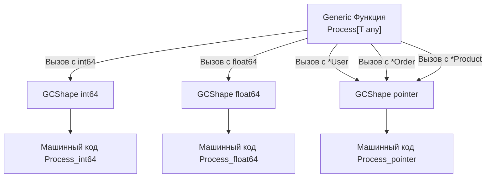

В инженерном деле существует непреложный закон: за любую абстракцию приходится платить. В предыдущей главе мы увидели, как синтаксис параметров типов позволяет писать лаконичный, переиспользуемый код без потери типобезопасности. Но компилятор — не волшебник. Чтобы машинный код исполнялся реальным кремниевым процессором, абстрактные конструкции должны быть переведены в конкретные инструкции ассемблера и регистры CPU.

Реализация дженериков в релизе Go 1.18 потребовала самой масштабной и сложной переработки компилятора (`cmd/compile`) за всю историю языка. Архитекторы Go под руководством Расса Кокса искали ответ на классическую инженерную дилемму: как дать разработчикам параметрический полиморфизм, не пожертвовав молниеносной скоростью сборки и не превратив исполняемый файл в многомегабайтного монстра?

Чтобы оценить изящество решения Go, взглянем на то, как эту задачу исторически решали другие языки.

---

## Проблема реализации обобщений (Generics)

Когда компилятор встречает определение функции `func Min[T Number](a, b T)`, он обязан породить конкретный машинный код. Но процессор x86-64 или ARM64 не оперирует абстрактными «числами вообще». Ему требуются предельно точные параметры:
- Какой размер регистров использовать: 4 байта (`EAX`) или 8 байт (`RAX`)?
- Какую машинную инструкцию исполнять: целочисленное сложение `ADD` или векторную инструкцию сложения чисел с плавающей точкой `ADDSD`?

Исторически индустрия раскололась на два радикальных лагеря:

1. **Monomorphization (C++, Rust):** Компилятор генерирует отдельную копию машинного кода функции под *каждый* конкретный тип, с которым она была вызвана. Вызвали `Min` для `int`, `int32` и `float64` — компилятор скомпилирует три независимые функции в бинарнике.
   - **Достоинство:** Бескомпромиссная производительность в рантайме (Zero-Cost Abstraction).
   - **Недостаток:** Катастрофическое раздувание объема бинарного файла (**Code Bloat**) и затягивание времени компиляции. Если обобщенная библиотека вызывается с сотней типов, сотни одинаковых копий кода загрязняют кэш инструкций процессора (L1i Cache).
2. **Type Erasure (Java):** Компилятор стирает все упоминания дженериков и подменяет их базовым типом `Object` (в терминах Go это эквивалентно подмене на пустой интерфейс `interface{}`).
   - **Достоинство:** Машинный код существует строго в одном экземпляре. Сборка выполняется быстро, размер файла минимален.
   - **Недостаток:** Просадка производительности в рантайме. Примитивные типы (`int`) приходится принудительно упаковывать в объекты на куче (**Boxing**), а каждое чтение требует динамической проверки типов (Type Cast).

Создатели Go отказались идти по обоим крайним путям и спроектировали уникальный гибридный механизм: **GCShape Stenciling with Dictionaries**.

---

## GCShape Stenciling: Золотая середина Go

Компилятор Go группирует все типы программы в специальные категории, именуемые **GCShape** (Garbage Collection Shape — Форма для сборщика мусора).

**GCShape** однозначно определяется двумя физическими характеристиками типа:
1. Физический размер типа в байтах.
2. Карта расположения указателей внутри типа (чтобы сборщик мусора GC точно знал, по каким смещениям лежат ссылки на живые объекты в памяти).

Компилятор генерирует **ровно одну** копию машинного кода функции для каждого уникального GCShape. Этот процесс называется **Stenciling** (штамповка по трафарету).

### Как группируются типы?

- **Базовые типы разного размера:** `int32`, `int64` и `float64` обладают **разными** GCShape. Для них компилятор честно сгенерирует отдельные оптимизированные копии функций (как в C++), чтобы задействовать быстрые целочисленные регистры или регистры плавающей точки.
- **Все типы-указатели:** `*User`, `*Order`, `*Product`, `*string`, `*int` на 64-битной архитектуре имеют абсолютно идентичную физическую природу: каждый из них занимает ровно **8 байт** и представляет собой указатель на память. Для Garbage Collector они неотличимы! Следовательно, все указатели Go объединяются в **один-единственный GCShape (`GCShape pointer`)**!

Если ваша программа вызывает generic-функцию `Process[T]` с пятьюдесятью различными типами структур по указателю, компилятор скомпилирует **всего одну** ассемблерную функцию, обслуживающую их все:



---

## Словари (Dictionaries): Как вызываются методы?

Здесь возникает естественный вопрос: если вызовы `*User` и `*Order` скомпилированы в единую ассемблерную процедуру `Process_pointer`, что произойдет, если тело функции вызывает метод: `item.Save()`?

Ведь адреса машинного кода метода `Save()` для структуры `User` и структуры `Order` находятся в совершенно разных секциях памяти бинарника! Как обобщенная функция понимает, куда совершить переход?

Эту задачу решает **Dictionary (Словарь типов)**.

Когда компилятор объединяет вызовы в один GCShape, он незаметно добавляет к сигнатуре ассемблерной функции **скрытый первый аргумент** — указатель на статический словарь с метаданными конкретного типа (`dict *Dictionary`).

> [!info] Под капотом: Псевдокод работы Dictionary
> Исходный код на Go:
> ```go
> func Process[T Saver](item T) {
>     item.Save()
> }
> ```
> 
> Компилятор Go преобразует в следующий низкоуровневый эквивалент:
> ```go
> // shape - обобщенный указатель GCShape
> // dict - неявный словарь метаданных, содержащий таблицу методов itab
> func Process_pointer(dict *Dictionary, item shape) {
>     // Извлекаем точный адрес метода Save из словаря:
>     methodPtr := dict.GetMethod("Save") 
>     methodPtr(item) // Косвенный вызов через указатель
> }
> ```

Этот подход блестяще защищает проект от Code Bloat (бинарник не распухает), но привносит микроскопическую цену: при вызове методов обобщенного типа процессор вынужден делать дополнительное чтение из памяти через указатель словаря, что в редких случаях может спровоцировать **L1 Cache Miss**.

---

## Ограничения реализации (Gotchas & Ловушки)

Архитектурный выбор `GCShape + Dictionaries` наложил на текущую реализацию дженериков ряд строгих ограничений, которые часто становятся темами технических собеседований.

### 1. Запрет на дженерик-методы структур

Это самое непривычное ограничение для инженеров из мира C++ или C#. В Go **структура может иметь параметры типов, но ее отдельные методы — не могут** (за исключением параметров, уже объявленных на уровне самой структуры):

```go
type Processor struct{}

// ОШИБКА КОМПИЛЯЦИИ: метод не может иметь собственных type parameters!
func (p *Processor) Handle[T any](item T) {
	// ...
}
```

> [!tip] Собеседование: Почему запрещены дженерик-методы?
> **Вопрос:** Почему компилятор Go строго запрещает объявление параметров типов у методов структур?  
> **Ответ:** Причина кроется во внутреннем устройстве интерфейсов Go — таблице методов **`itab`** (разобранной в главе [[24. Интерфейсы под капотом. iface и eface]]). В Go соответствие интерфейсам проверяется неявно (**Duck Typing**). Компилятор строит таблицу `itab` для каждой пары «интерфейс — тип» на этапе сборки.  
> Если бы метод мог быть обобщенным, он мог бы инстанциироваться бесконечным числом типов (`Handle[int]`, `Handle[string]`, `Handle[MyType]`). Компилятор принципиально не может предсказать, с какими типами этот метод будет вызван в других, еще не скомпилированных пакетах. Следовательно, построить конечную таблицу `itab` во время компиляции становится математически невозможно.

**Решение:** Выносите подобные операции в отдельные дженерик-функции, принимающие структуру первым аргументом: `func Handle[T any](p *Processor, item T)`.

### 2. Type Switches и Type Assertions

Вы не можете использовать параметр типа `T` напрямую в операторе `switch type`, если не приведете его к пустому интерфейсу.

```go
func Inspect[T any](val T) {
	// ОШИБКА КОМПИЛЯЦИИ: нельзя использовать type switch на параметре типа T
	/* switch val.(type) {
	case int:
		fmt.Println("int")
	}
	*/

	// ВЕРНО: Нужно сначала скастовать (упаковать) к any (пустому интерфейсу)
	switch any(val).(type) {
	case int:
		fmt.Println("int")
	}
}
```

**Mechanical Sympathy:** Помните, что упаковка `any(val)` формирует структуру пустого интерфейса **`eface`** (указатель на тип + указатель на данные). Если значение `val` не помещается в ячейку или Escape Analysis не может доказать локальность, эта конвертация спровоцирует аллокацию памяти в куче.

### 3. Отсутствие специализации (Template Specialization)

В C++ вы можете написать общую реализацию дженерика, а затем "переопределить" её специально для `int` (чтобы написать более быстрый ассемблерный код). В Go специализации нет.

Если вам нужно разное поведение внутри одной дженерик функции, вам придется использовать рефлексию или тот самый `switch any(v).(type)`, что убивает часть профита от дженериков в высоконагруженных участках (Hot Paths).

---

## Итог и рекомендации по производительности

1. **Дженерики в Go — не бесплатны (не Zero-Cost Abstraction):** Вызовы методов обобщенных типов осуществляются через косвенную адресацию словарей метаданных (`Dictionary`), требуя на 1–2 наносекунды больше, чем прямые вызовы.
2. **Остерегайтесь интерфейсов внутри дженериков:** Создание обобщенной структуры над интерфейсом (например, `Stack[error]`) приводит к двойной косвенности: сначала процессор читает словарь дженерика, а затем переходит по таблице `itab` самого `iface`.
3. **Не заменяйте интерфейсы дженериками без необходимости:** Если метод просто принимает `io.Reader` и вызывает метод `Read()`, обычный интерфейс предпочтительнее. Дженерики незаменимы там, где необходимо строго зафиксировать равенство входящего и исходящего типов.

Дженерики избавили нас от необходимости писать тонны шаблонного кода и устранили опасные приведения пустых интерфейсов. Мы завершили детальное изучение синтаксиса, типов данных и модульной архитектуры Go.

Но подлинная мощь языка Go, сделавшая его безоговорочным лидером в серверном бэкенде, кроется не в структурах и дженериках, а в его революционной модели конкурентности.

В следующей лекции мы вступаем в четвертый блок нашего учебника — конкурентное программирование. В главе [[34. Горутины. Легковесная конкурентность в Go]] мы исследуем микроскопический стек горутин, узнаем, почему переключение между миллионом горутин требует десятков наносекунд, и поймем, как Go победил классическую модель тяжелых системных потоков.