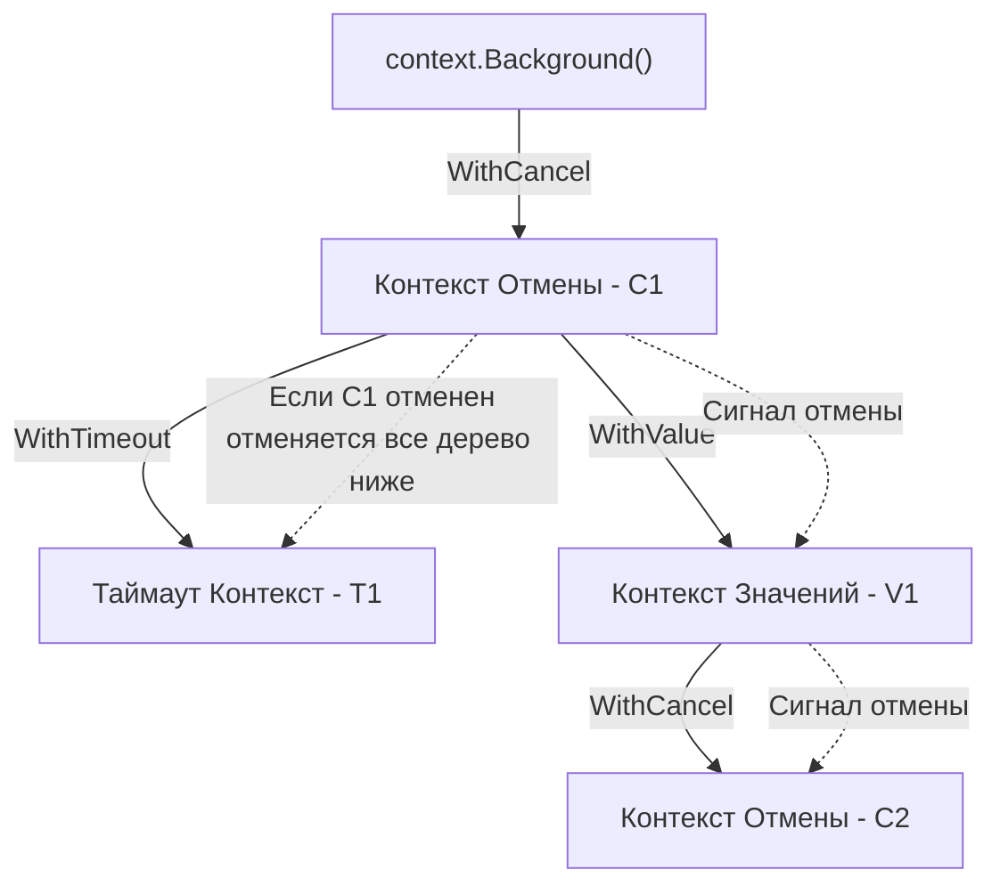
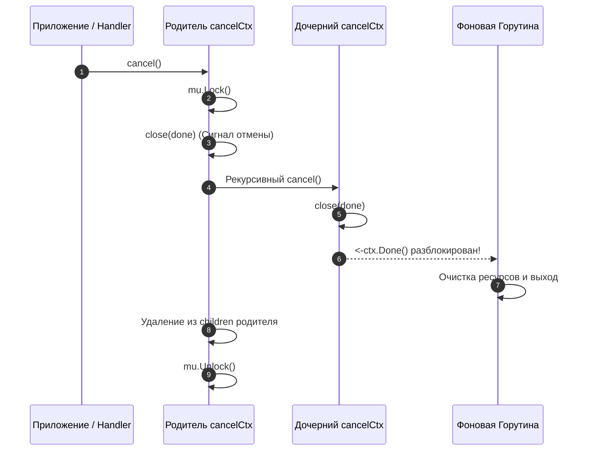
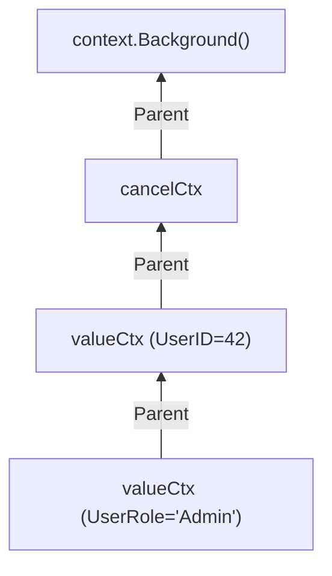

# 39. Context. Управление жизненным циклом операций

> *«Управление сложностью — вот суть программирования».*    
> — Брайан Керниган

До версии Go 1.7 бэкенд-разработчики страдали. Представьте типичную картину: на ваш сервер пришел тяжелый HTTP-запрос. Сервер создал главную горутину, которая породила еще пять дочерних: одна пошла в PostgreSQL, вторая — в Redis, третья — в сторонний платежный шлюз, а две другие занялись фоновыми математическими расчетами.

В этот момент пользователь в браузере нажал кнопку «Отмена» или закрыл вкладку. Сетевое соединение оборвалось. Что должно произойти? Все пять горутин обязаны **немедленно прекратить работу** и освободить память, дескрипторы сокетов и пулы соединений к базе данных.

Но до Go 1.7 для этого приходилось вручную прокидывать канал `done <-chan struct{}` через все слои абстракций. Если программист забывал проверить этот канал на каком-то уровне вложенности, горутины превращались в зомби: они продолжали молотить процессором впустую, выполняя никому не нужный запрос.

В Go 1.7 из недр инфраструктуры Google в стандартную библиотеку был перенесен пакет `context`. Он стал абсолютным стандартом языка (Idiomatic Go) для решения трех важнейших задач распределенных систем:
1. **Каскадная отмена операций (Cancellation)** по всей глубине дерева вызовов.
2. **Таймауты и жесткие дедлайны (Timeouts & Deadlines).**
3. **Передача Request-Scoped метаданных** (данных, живущих строго в рамках одного запроса: TraceID, SpanID, авторизационные токены).

---

## 1. Интерфейс Context

`context` — это не закрытая магия ядра рантайма, а лаконичный и элегантный интерфейс, описанный в стандартной библиотеке:

```go
type Context interface {
    // Возвращает время, когда контекст будет автоматически отменен
    Deadline() (deadline time.Time, ok bool)
    
    // Возвращает канал, который закроется при отмене контекста
    Done() <-chan struct{}
    
    // Возвращает причину отмены (nil, если контекст еще жив)
    Err() error
    
    // Извлекает значение по ключу
    Value(key any) any
}
```

Ключевой метод здесь — `Done()`. Он возвращает канал `<-chan struct{}`. Как мы подробно разбирали в статье [[38. Select. Ожидание нескольких каналов]], чтение из закрытого канала мгновенно возвращает *zero-value* без блокировки. 

Этот простой трюк превращает закрытие канала в идеальный механизм **широковещательного сигнала (broadcast)**: тысячи горутин, одновременно слушающих `<-ctx.Done()` в своих `select`, мгновенно просыпаются и начинают процедуру корректного завершения (Graceful Teardown).

---

## 2. Иерархия: Дерево контекстов

Контексты в Go никогда не существуют изолированно — они всегда образуют направленное дерево (Directed Acyclic Graph). В корне любого дерева лежит пустой «вечный» контекст:
* `context.Background()` — корневой контекст всей программы. Используется на самом верхнем уровне: в функции `main()`, при инициализации серверов или в тестах.
* `context.TODO()` — технический близнец `Background()`. Он сообщает читателю кода и статическим анализаторам: «Здесь должен быть осмысленный контекст, но автор еще не решил, откуда его прокинуть» (маркер для будущего рефакторинга).

От корневого контекста мы отпочковываем дочерние контексты с помощью функций-оберток. **Фундаментальное правило: отмена родительского контекста всегда каскадно отменяет всех его детей. Но отмена дочернего контекста никогда не влияет на родителя или соседей.**



---

## 3. Под капотом: cancelCtx и Mutex

Когда вы вызываете `ctx, cancel := context.WithCancel(parent)`, под капотом создается структура `cancelCtx`.

> [!info] Под капотом: Исходники context.go
> ```go
> type cancelCtx struct {
>     Context           // встроенный родительский контекст
>     mu       sync.Mutex // защищает поля ниже
>     done     atomic.Value // атомарно хранит канал (chan struct{})
>     children map[canceler]struct{} // набор дочерних контекстов
>     err      error    // ошибка отмены (Canceled или DeadlineExceeded)
> }
> ```

**Как работает отмена (Mechanical Sympathy):**
1. При вызове функции `cancel()` захватывается внутренний мьютекс `mu`.
2. Если канал `done` уже был создан, он закрывается системной функцией `close()`. Это мгновенно будит все горутины, которые висели в `select { case <-ctx.Done(): }`.
3. Рантайм итерируется по хэш-таблице `children` и рекурсивно вызывает `cancel()` для каждого ребенка.
4. Контекст удаляет себя из мапы `children` своего родителя. Это критически важно: благодаря этому сборщик мусора (GC) может немедленно освободить память, занятую завершенной подветкой дерева!



> [!warning] Ловушка / Gotcha: Утечка контекста (Context Leak)
> Самая частая ошибка Junior/Middle разработчиков — не вызывать `cancel()` у контекстов с таймаутом, если операция завершилась успешно до таймаута.
> ```go
> // ПЛОХО
> ctx, _ := context.WithTimeout(context.Background(), 5*time.Second)
> doWork(ctx) 
> // Если doWork выполнится за 1 секунду, таймер в рантайме Go 
> // будет "тикать" еще 4 секунды, удерживая ресурсы в памяти!
> 
> // ХОРОШО
> ctx, cancel := context.WithTimeout(context.Background(), 5*time.Second)
> defer cancel() // Таймер будет остановлен мгновенно при выходе из функции
> doWork(ctx)
> ```

---

## 4. Под капотом: valueCtx и промахи кэша

Функция `context.WithValue(parent, key, val)` возвращает структуру `valueCtx`. Это, пожалуй, самая спорная часть пакета `context`.

С точки зрения внутренней архитектуры, `valueCtx` — это не хэш-таблица, а обычный узел в **односвязном списке**, развернутом снизу вверх:

```go
type valueCtx struct {
    Context // Указатель на родителя
    key, val any
}
```

Когда вы вызываете `ctx.Value(myKey)`, рантайм:
1. Проверяет текущий `valueCtx`. Если ключ совпадает — возвращает значение.
2. Если нет, он **идет вверх по дереву** через встроенный интерфейс `Context`, обращаясь к родителю.
3. И так до самого корня (`Background`), пока не найдет ключ или не вернет `nil`.



**Mechanical Sympathy: Цена поиска**  
Связанный список — худшая структура данных для современных процессоров из-за Pointer Chasing (погони за указателями). Обход дерева контекстов вверх приводит к постоянным **L1/L2 Cache Misses** (промахам кэша), так как каждый контекст аллоцирован в случайном месте кучи. Операция `ctx.Value` имеет сложность $O(N)$ (где $N$ — глубина дерева) и работает крайне медленно по меркам высоконагруженных систем.

> [!tip] Собеседование
> **Вопрос:** Почему нельзя передавать опциональные параметры функции (например, лимиты пагинации или настройки сортировки) через `context.WithValue`?  
> **Ответ:** Во-первых, это убивает статическую типизацию. `Value` принимает `any` и возвращает `any`, заставляя вас использовать Type Assertions. Во-вторых, это медленно из-за $O(N)$ поиска по дереву. В-третьих, это скрытые зависимости: сигнатура функции больше не говорит о том, какие данные ей нужны для работы. `WithValue` должен использоваться **только** для данных, не влияющих на бизнес-логику (TraceID для логов, данные о сессии/JWT).

**Защита от коллизий ключей:**  
Так как тип ключа `any`, если вы используете `ctx.WithValue(ctx, "userID", 123)`, другой пакет в вашем проекте может случайно перетереть ваше значение, использовав ту же строку `"userID"`.  
Идиоматичный подход — использовать кастомные неэкспортируемые типы:
```go
type contextKey string
const userIDKey contextKey = "userID"

ctx = context.WithValue(ctx, userIDKey, 123)
// Внешний пакет физически не сможет обратиться к userIDKey
```

---

## 5. Архитектурные правила Idiomatic Go

Создатели Go прописали строгие правила использования контекста, за нарушение которых на код-ревью обычно больно бьют по рукам:

1. **Context всегда первый аргумент.** Функция, которой нужен контекст, должна принимать его первым параметром. Имя переменной всегда должно быть `ctx`.
   ```go
   func FetchUser(ctx context.Context, id int) (*User, error)
   ```
2. **Никогда не храните Context внутри Struct.**
   Контекст описывает жизненный цикл **запроса/операции**, а структура (например, клиент БД) существует **годами**.
   ```go
   // ПЛОХО (Антипаттерн)
   type DBClient struct {
       ctx context.Context // Контекст протухнет, и клиент станет бесполезным
       db  *sql.DB
   }
   
   // ХОРОШО
   func (c *DBClient) DoQuery(ctx context.Context, query string)
   ```
3. **Не передавайте `nil` контекст.** Даже если вам кажется, что контекст сейчас не нужен, передайте `context.TODO()`. Передача `nil` приведет к панике при первой же попытке вызова `ctx.Done()`.

> [!info] Современный Go (1.20+)
> В современных версиях Go возможности пакета расширились:
> - `context.WithCancelCause` (Go 1.20+) позволяет передавать конкретную ошибку, объясняющую, *почему именно* контекст был отменен (читается через `context.Cause(ctx)`).
> - `context.AfterFunc` (Go 1.21+) позволяет зарегистрировать функцию обратного вызова, которая сработает асинхронно сразу после отмены контекста.
> - `context.WithoutCancel` (Go 1.21+) позволяет отпочковать контекст, сохранив все значения `Value`, но отвязав его от сигналов отмены родителя (полезно для фонового асинхронного аудита).

---

## Итог

1. **Context** решает проблему каскадной отмены горутин, отвязывая нас от ручного жонглирования каналами `done`.
2. Контексты образуют иерархическое дерево. Отмена родителя немедленно и рекурсивно отменяет всех детей (через закрытие каналов и защищенный `Mutex`-ом список).
3. **Всегда делайте `defer cancel()`**, иначе таймеры останутся в памяти (Goroutine/Memory Leak).
4. `WithValue` работает как односвязный список, что медленно и недружелюбно к кэшу CPU. Используйте его только для Request-Scoped метаданных (TraceID), а не для передачи параметров бизнес-логики.

Каналы и `Context` — это мощные инструменты парадигмы CSP. Они отлично подходят для передачи данных и сигналов отмены. Но иногда нам не нужно передавать данные, а нужно просто защитить участок памяти от одновременной записи или подождать завершения пачки горутин. В таких ситуациях каналы избыточны и медленны. На помощь приходят классические примитивы синхронизации, которые мы разберем в следующей статье: [[40. sync.WaitGroup, Mutex, RWMutex]].