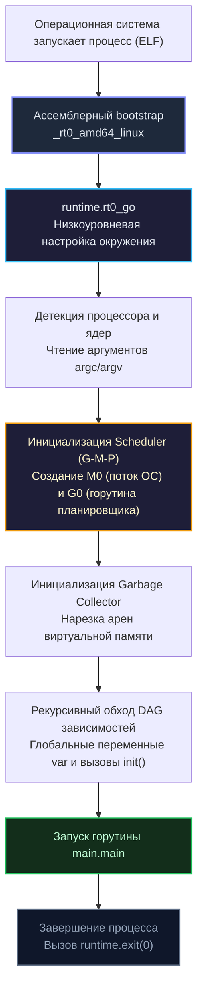

В мире объектно-ориентированного программирования (например, в Java или C#) разработчик привыкает к строгой догме: один файл обязан содержать ровно один класс, а физическая структура каталогов на диске должна досимвольно воспроизводить иерархию пространств имен (`namespaces`). 

В классическом C и C++ картина иная: программист вынужден вручную поддерживать разделение между заголовочными файлами деклараций (`.h`) и файлами реализации (`.cpp`), которые препроцессор сшивает директивами `#include`, раздувая объем транслируемого текста в сотни раз.

Создатели Go отбросили оба подхода ради двух фундаментальных ценностей: максимальной ясности для человека и феноменальной скорости для компилятора. 

В этой лекции мы подробно исследуем анатомию исходного кода Go, разберем граф зависимостей и выясним, с какой именно инструкции процессор *на самом деле* начинает исполнение вашего приложения (спойлер: это происходит задолго до вызова `func main`).

---

## 1. Пакет (package): Атомарная единица компиляции

В Go отсутствуют классы и нет пространств имен в их традиционном понимании. Главным и неделимым структурным кирпичиком языка выступает **пакет (`package`)**.

Базовое правило проектирования файловой структуры в Go кристально просто: **одна физическая директория на диске = ровно один пакет**.

Каждый файл с расширением `.go` обязан начинаться с явного объявления имени пакета, к которому он принадлежит:
```go
package http
```

В процессе сборки компилятор считывает абсолютно все `.go`-файлы из данной директории с одинаковым объявлением пакета и объединяет их в единый логический монолит на уровне абстрактного синтаксического дерева (AST).

Из этого вытекают три важнейших практических следствия:
1. Вы можете свободно декомпозировать прикладную логику одного пакета на произвольное количество небольших файлов (например, `server.go`, `router.go`, `client.go` внутри пакета `http`).
2. Внутри пакета все файлы обладают прямым доступом к функциям, типам, константам и переменным друг друга. Никаких импортов между файлами одной директории не требуется!
3. В языке нет заголовочных файлов (`headers`). Компилятор сканирует файлы директории за один быстрый проход.

> [!tip] Собеседование
> В Go полностью отсутствуют модификаторы видимости `public`, `private` или `protected`. Инкапсуляция на уровне пакета регулируется исключительно **регистром первого символа идентификатора**.  
> Если имя функции, структуры или поля начинается с заглавной буквы (например, `ServeHTTP`) — сущность экспортируется и доступна любому внешнему модулю. Если имя начинается со строчной буквы (например, `parseURL`) — она строго инкапсулирована внутри текущего пакета и доступна во всех его файлах. Подробнее эту элегантную механику мы исследуем в лекции [[27. Видимость имен. export и unexport]].

### Особый пакет: package main

Любой библиотечный пакет в процессе сборки компилируется во временный промежуточный объектный файл архива (`.a`), который затем используется компоновщиком. 

Но если ваша цель — получить готовый исполняемый файл для операционной системы, пакет обязан иметь имя `main`. Директива `package main` служит для компилятора однозначным приказом: *«Сгенерируй для операционной системы точку входа и собери исполняемый бинарник»*.

---

## 2. Импорты (import) и направленный граф

Чтобы задействовать возможности других модулей, используется ключевое слово `import`:

```go
package main

import (
    "fmt"
    "net/http"
    "github.com/google/uuid"
)
```

В блоке `import` вы декларируете **канонический путь** к пакету (относительно корня модуля или стандартной библиотеки). Однако в коде программы обращение к его экспортируемым сущностям происходит по **короткому имени пакета**, объявленному в его исходниках: например, для пути `github.com/google/uuid` вызов выглядит как `uuid.New()`.

### Почему компилятор запрещает неиспользуемые импорты?

Если вы импортировали пакет `"fmt"`, но в тексте файла ни разу не обратились к `fmt.Println`, компилятор немедленно прервет сборку с фатальной ошибкой. Это строгое требование спецификации языка, а не опциональный совет линтера.

Создатели Go пошли на этот бескомпромиссный шаг ради спасения скорости компиляции. В языках вроде C++ неиспользуемые директивы `#include` заставляют препроцессор парсить сотни килобайт мертвого кода, экспоненциально замедляя линковку. Жесткое правило Go гарантирует минимальный размер графа зависимостей и чистоту кодовой базы.

### Запрет на циклические зависимости

Если пакет `A` импортирует пакет `B`, то пакет `B` (прямо или через цепочку транзитивных импортов) ни при каких обстоятельствах не может импортировать `A`. Зависимости в проекте обязаны формировать строгий **Направленный Ациклический Граф (DAG)**.

> [!info] Под капотом
> Математическое свойство DAG позволяет компилятору `go build` собирать независимые пакеты **параллельно на всех ядрах процессора**. Если модули нижнего уровня графа автономны, планировщик компилятора запускает их параллельную компиляцию одновременно. В сочетании с чтением метаданных из предкомпилированных архивов это обеспечивает легендарную скорость сборки проектов на Go.

### Специфичные импорты: blank import и alias

В некоторых архитектурных сценариях стандартный механизм импорта модифицируется:

1. **Алиасы (Псевдонимы пакетов):** Если короткие имена пакетов конфликтуют (например, стандартный `context` и ваш локальный модуль `context`), вы можете задать уникальный alias:
   ```go
   import stdCtx "context"
   ```
2. **Blank import (Слепой импорт):** Использование знака подчеркивания `_`:
   ```go
   import _ "github.com/lib/pq"
   ```
   Слепой импорт декларирует: *«Я не планирую явно вызывать функции этого пакета в коде, но компилятор обязан включить его в бинарник и выполнить его внутренние функции `init`»*. Это канонический способ саморегистрации драйверов баз данных в стандартном пакете `database/sql`.

---

## 3. Точка входа: func main и func init

Пользовательское исполнение программы берет начало в функции `main` пакета `main`:

```go
func main() {
    // Прикладной код сервиса
}
```

Функция `main()` не принимает входящих параметров и не возвращает значений. Для считывания аргументов командной строки используется срез `os.Args`. Если приложению необходимо завершить работу с ненулевым статусом ошибки, вызывается системная процедура `os.Exit(1)`. Естественный выход из тела `main` автоматически завершает программу с кодом 0 (успех).

### Функция init

В любом пакете (включая вспомогательные модули и сам пакет `main`) может быть объявлена специальная функция `init`:

```go
var db *Database

func init() {
    db = Connect() // Выполняется автоматически до передачи управления в main
}
```

Функция `init` не принимает аргументов, не возвращает значений и вызывается автоматически рантаймом Go при инициализации пакета. Вызвать ее вручную из прикладного кода синтаксически невозможно.

> [!warning] Ловушка / Gotcha
> Вы можете объявить несколько функций `init` как в одном файле, так и в разных файлах одного пакета. Компилятор аккуратно соберет и выполнит их все. Однако **порядок их вызова между разными файлами пакета строго зависит от лексикографического порядка имен файлов на диске**!  
> Полагаться на порядок инициализации в `init` — классический антипаттерн, приводящий к трудноуловимым гонкам инициализации. В идиоматичном Go функцию `init` стараются использовать минимально, предпочитая явную передачу зависимостей через конструкторы или функцию `Setup()`.

---

## Mechanical Sympathy: Настоящая точка входа (Bootstraping)

Что происходит между запуском бинарника операционной системой и первой строчкой вашего кода в `func main()`? Функция `main` — это лишь верхушка айсберга.

Настоящая точка входа в бинарный файл определяется линковщиком операционной системы. В Linux x86-64 ядро передает управление ассемблерному загрузчику `_rt0_amd64_linux`, который подготавливает регистры и переходит в платформонезависимую точку `runtime.rt0_go`.

Конвейер начальной загрузки выглядит следующим образом:



### Ключевые фазы рантайм-бутстрапа:

1. **Создание M0 и G0:** В момент старта рантайм связывает первичный системный поток ОС с внутренней структурой `M0`. На этом потоке создается специальная системная горутина `G0`. Ее стек совпадает со стеком потока ОС, и именно `G0` берет на себя тяжелую системную работу: распределение памяти, переключение контекстов и планирование пользовательских горутин.
2. **Аллокатор памяти и GC:** До старта прикладного кода рантайт резервирует арены виртуальной памяти у ядра ОС и инициализирует фоновые потоки сборщика мусора.
3. **Рекурсивная инициализация зависимостей:** Рантайм обходит направленный ациклический граф (DAG) **строго снизу вверх**. Сначала инициализируются глобальные переменные стандартных библиотек, затем выполняются их функции `init()`. Далее управление поднимается выше по дереву зависимостей, пока не будут инициализированы глобальные структуры `var` и функции `init()` вашего пакета `main`.
4. **Рождение main.main:** Лишь после того как рантайм и все пакеты полностью готовы к работе, планировщик создает первую пользовательскую горутину и запускает в ней функцию `main.main()`.

Понимание этой последовательности избавляет от иллюзий: если во время выполнения `init()` в импортированном модуле случится `panic`, ваша функция `main` даже не начнет исполняться.

---

## Итог

1. Модульность в Go строится вокруг **пакетов (директорий)**, а не отдельных файлов или классов. Разделяйте код по файлам внутри директории так, как это удобно для восприятия человеком.
2. Компилятор запрещает циклические и неиспользуемые импорты на уровне языка, гарантируя построение чистого DAG и максимальную скорость параллельной сборки.
3. Инициализация системы строго детерминирована и идет снизу вверх: от глобальных переменных внешних библиотек через цепочки `init()` к вашей функции `main`.
4. Под капотом функции `main` скрывается мощный bootstrap рантайма (`runtime.rt0_go`), который создает главный поток `M0`, системную горутину `G0` и инициализирует менеджер памяти.

Разобравшись с архитектурным каркасом программы, мы готовы перейти к исследованию фундаментальных типов данных. В следующей лекции [[5. Переменные, константы и вывод типа]] мы изучим объявление переменных, нетипизированные константы, работу оператора `:=` и концепцию гарантированного обнуления памяти (`Zero Value`).
