# 44. Итоги раздела. Что нужно знать перед переходом к Deep Go

> *«Управление сложностью — вот сама суть программирования».*    
> — Брайан Керниган

## Переломный момент

Мы завершили огромный и насыщенный путь по основам и внутреннему устройству языка Go. Раздел, который начинался с установки тулчейна и объявления первых переменных, перерос в фундаментальное исследование внутренностей рантайма, механизмов работы компилятора, распределения памяти и аппаратных кэш-линий процессора.

Если вы внимательно изучили предыдущие 43 статьи, ваш инженерный кругозор уже стал на порядок глубже, чем у среднестатистического разработчика, который просто пишет `go run` и надеется на счастливый случай. Вы больше не воспринимаете Go как "упрощенный C" или "странную Java". Вы видите физические структуры данных в памяти, понимаете истинную цену переключения контекста горутин и знаете, по каким законам компилятор принимает решения об аллокациях на стеке или в куче.

Прежде чем мы двинемся дальше — к созданию реальных высоконагруженных бэкенд-сервисов, сетевому программированию и погружению в стандартную библиотеку, — давайте кристаллизуем фундаментальные принципы языка. Это тот самый инженерный майндсет, который отличает Senior Go-инженера от туриста из других экосистем.

---

## 3 Столпа Идиоматичного Go

Вся философия и техническая архитектура Go держится на трех нерушимых китах: Механической симпатии к памяти, Композиции и Конкурентности на основе сообщений.

```mermaid
flowchart TD
    classDef process  fill:#1e293b,stroke:#38bdf8,stroke-width:1px,color:#f8fafc
    classDef success  fill:#064e3b,stroke:#34d399,stroke-width:1px,color:#f8fafc
    classDef error    fill:#7f1d1d,stroke:#f87171,stroke-width:1px,color:#f8fafc
    classDef warning  fill:#78350f,stroke:#fbbf24,stroke-width:1px,color:#f8fafc
    classDef entry    fill:#1e3a5f,stroke:#38bdf8,stroke-width:2px,color:#f8fafc
    classDef aux      fill:#334155,stroke:#64748b,stroke-width:1px,color:#f8fafc
    classDef system   fill:#312e81,stroke:#a78bfa,stroke-width:1px,color:#f8fafc
    classDef data     fill:#132d29,stroke:#2dd4bf,stroke-width:1px,color:#f8fafc
    classDef network  fill:#881337,stroke:#fb7185,stroke-width:1px,color:#f8fafc
    classDef accent   fill:#1e1b4b,stroke:#818cf8,stroke-width:1px,color:#f8fafc
    Go["Идиоматичный Go Бэкенд"]:::process --> Mem["1. Управление памятью<br>(Value Semantics)"]
    Go --> Arch["2. Архитектура типов<br>(Composition)"]
    Go --> Conc["3. Конкурентность<br>(CSP & Channels)"]

    Mem --> M1["Value Semantics & Alignment"]
    Mem --> M2["Escape Analysis (Стек vs Куча)"]
    Mem --> M3["Continuous Stacks (morestack)"]

    Arch --> A1["Неявные интерфейсы (Duck Typing)"]
    Arch --> A2["Composition over Inheritance"]
    Arch --> A3["GCShape - Dictionaries (Generics)"]

    Conc --> C1["G-M-P Scheduler & Work Stealing"]
    Conc --> C2["CSP - Каналы (hchan / sudog)"]
    Conc --> C3["Go Memory Model & Happens-Before"]
```

### Столп 1: Данные и Память (Value Semantics)
Go — это язык с семантикой значений (Value Semantics), который дает разработчику предсказуемый контроль над тем, где живут данные: на быстром стеке горутины или в общей куче.

* **Механическая симпатия:** Непрерывные блоки памяти — лучшие друзья современных кэшей CPU. Вы знаете, что слайсы (в отличие от связанных списков) обеспечивают идеальное попадание в кэш L1/L2 ([[17. Slice под капотом. len, cap, append и realloc]]).
* **Escape Analysis:** Вы понимаете, что возврат указателя из функции заставит компилятор выкинуть объект в кучу (Heap), что создаст работу для сборщика мусора (GC). Передача по значению часто бывает дешевле передачи указателя.
* **Инструменты под капотом:** Вы знаете, что `map` — это сложная хэш-таблица с бакетами и механизмом эвакуации ([[19. Map под капотом. hmap, buckets и рост]]), а строки неизменяемы для безопасного шаринга памяти без лишних копирований.

### Столп 2: Архитектура и Абстракции
Мы забыли про классы, наследование и монструозные иерархии типов. Go требует плоской, практичной и прозрачной архитектуры.

* **Интерфейсы — это контракты постфактум:** Тип не знает, какой интерфейс он реализует (Duck Typing). Это позволяет писать слабосвязанный код. Но вы помните, что пустой интерфейс `any` стоит 16 байт и прячет за собой динамическую диспетчеризацию ([[24. Интерфейсы под капотом. iface и eface]]).
* **Композиция вместо наследования:** Мы не строим пирамиды наследования. Мы собираем поведение системы из маленьких, независимых компонентов с помощью встраивания ([[25. Встраивание. Embedding вместо наследования]]).
* **Дженерики не бесплатны:** Вы знаете про GCShape и скрытые словари (Dictionaries), из-за которых дженерики могут вызывать промахи кэша и замедлять вызов методов ([[33. Дженерики под капотом и ограничения текущей реализации]]).

### Столп 3: Конкурентность (Concurrency is not Parallelism)
Это главная киллер-фича языка, ради которой Go выбирают для высоконагруженных сетевых сервисов и распределенных систем.

* **Модель G-M-P:** Горутины живут в User Space. Планировщик сам раскидывает их по системным тредам ОС, воруя работу у соседей (Work Stealing), чтобы не простаивали ядра ([[35. Scheduler Go. G, M, P и work stealing]]).
* **CSP и Каналы:** «Не общайтесь, разделяя память; вместо этого разделяйте память, общаясь». Каналы передают право владения данными, снижая необходимость в мьютексах ([[36. Каналы. Передача данных между горутинами]]).
* **Оркестрация и Жизненный цикл:** Ни одна горутина не должна быть брошена. Вы умеете глушить целые деревья горутин каскадно через `Context` ([[39. Context. Управление жизненным циклом операций]]) и жонглировать потоками через мультиплексор `select`.

---

## Чек-лист для самопроверки

Перед тем как начать писать реальные сетевые сервисы, пробегитесь по этому чек-листу. Если какой-то пункт вызывает сомнения — лучше вернитесь к соответствующей статье. Дальше этот фундамент будет подразумеваться как нечто само собой разумеющееся.

1. **Понимаю ли я разницу между `len` и `cap` у слайса?** Что произойдет, если я сделаю `append` в слайс, переданный в функцию по значению?
2. **Смогу ли я объяснить, почему пустой интерфейс `interface{}` убивает производительность в Hot Paths?** 
3. **Знаю ли я, чем Data Race отличается от Race Condition?** Почему интерфейс может оказаться "разорванным" (Torn Write) при отсутствии синхронизации? ([[42. Race Condition и Go Memory Model]]).
4. **Понимаю ли я, как закрытие канала будит спящие горутины в `select`?** И почему чтение из закрытого канала не вызывает панику, а запись — вызывает?
5. **Знаю ли я, зачем нужен `context.Context`?** Почему нельзя передавать через него параметры бизнес-логики (`limit`, `offset`), а только Request-Scoped данные (`TraceID`)?
6. **Умею ли я избегать Goroutine Leaks?** Понимаю ли я, что произойдет с горутиной, которая попытается отправить данные в небуферизованный канал, который никто не слушает?

> [!warning] Ловушка / Gotcha: Иллюзия простоты
> Go — язык с очень маленьким словарем (всего 25 ключевых слов). Его синтаксис можно выучить за выходные. Это порождает когнитивное искажение: разработчики начинают писать production-код на второй неделе знакомства с языком, перенося паттерны из Java, C# или Python.
> Итог всегда печален: месиво из `interface{}`, текущие горутины, убитый Garbage Collector (из-за передачи указателей везде, где только можно) и паники в рантайме. Простота синтаксиса Go не означает простоты инженерии. Она лишь означает, что компилятор не будет прятать от вас сложность аппаратуры.

> [!tip] Собеседование: Хардкорный уровень
> Когда вы будете проходить секцию "Платформа/Internals" на позицию Senior, от вас будут ждать не просто знания "как написать код", но и "что сделает рантайм". 
> Вас спросят про `hmap`, про `sudog` внутри очередей каналов, про алгоритм Work Stealing и про то, как работает сборщик мусора с GCShape. Все эти детали мы разобрали в данном разделе. Возвращайтесь к нему перед каждым серьезным техническим интервью.

---

## Что дальше?

Мы изучили инструмент. Мы знаем, как он устроен, из каких деталей состоит и как его правильно держать в руках.  
Но знание устройства молотка не делает вас архитектором.

В следующем разделе **«6. Стандартная библиотека Go»** мы перейдем к прикладной инженерной практике. Язык Go знаменит концепцией «батарейки в комплекте». Мы будем детально разбирать, как без использования сторонних фреймворков и монструозных библиотек поднять мощный production-ready HTTP-сервер, организовать потоковое чтение гигабайтных файлов через интерфейс `io.Reader`, сериализовать сложные структуры в JSON и грамотно взаимодействовать с ядром операционной системы. 

Тренировочные колеса сняты. Добро пожаловать в реальный бэкенд на Go!