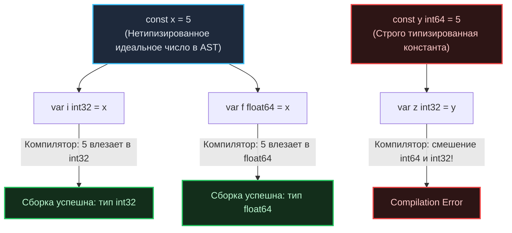

В динамических языках (Python, JavaScript, PHP) переменные — это всего лишь гибкие символические ярлыки для значений в куче, способные в любой момент исполнения изменить свой тип. В классических системных языках вроде C и C++ переменная строго привязана к машинному типу и физическому адресу памяти, однако забота о безопасной инициализации ячейки целиком перекладывается на плечи программиста.

Создатели Go заняли бескомпромиссную позицию прагматичной безопасности:
* Язык строго и статически типизирован;
* Любые неявные преобразования типов (`implicit type casting`) категорически запрещены на уровне синтаксиса;
* Неинициализированной памяти (с «мусором» от работы предыдущих процессов операционной системы) в Go не существует в принципе.

В этой лекции мы детально разберем, как компилятор выводит типы без накладных расходов в рантайме, как процессор аппаратно обнуляет память и почему система констант в Go представляет собой подлинный шедевр инженерного дизайна.

---

## Два стула инициализации: var и :=

В Go предусмотрено два базовых синтаксических способа объявления переменных. Четкое понимание границы между ними отличает зрелый идиоматичный код от неуклюжей кальки с других языков.

### 1. Ключевое слово var

Оператор `var` применяется при явном указании типа, либо когда требуется зарезервировать память под переменную, оставив ее инициализацию на более поздний момент (в этом случае она гарантированно получит безопасное нулевое значение — `Zero Value`).

```go
// Объявление на уровне пакета (глобальные переменные) допустимо ТОЛЬКО через var
var GlobalCounter int64 = 100

func process() {
    // Явное указание типа (полезно, если конкретный тип важен для контракта)
    var timeout time.Duration = 5 * time.Second
    
    // Объявление без явного присвоения: переменная attempt инициализируется нулем (0)
    var attempt int 
}
```

### 2. Краткое объявление (:=)

Синтаксическая конструкция `:=` одновременно объявляет переменную и присваивает ей значение, делегируя вычисление точного типа компилятору (**Type Inference**). Данная форма доступна **исключительно внутри тел функций**.

```go
func process() {
    timeout := 5 * time.Second // Компилятор самостоятельно выведет тип time.Duration
    count := 10                // По умолчанию целочисленный литерал выводится как int
}
```

> [!info] Под капотом: Type Inference
> Автоматический вывод типов в Go не создает **абсолютно никакого оверхеда в рантайме** (в отличие от динамических языков или рефлексии). 
> 
> Оператор `:=` — это чистый инструмент времени компиляции. Когда компилятор строит абстрактное синтаксическое дерево (AST) и выполняет фазу проверки типов (`Type Checking`), он анализирует правую часть выражения и прописывает результирующий тип в узел AST переменной. 
> 
> В сгенерированном машинном коде между инструкциями `var x int = 10` и `x := 10` нет ни единого байта различий: сгенерированный ассемблер абсолютно идентичен.

### Идиоматичный подход

1. Используйте краткую форму `:=` в 95% случаев для локальных переменных внутри функций.
2. Используйте `var`, когда требуется объявить структуру или срез, готовый к работе со своим нулевым значением, без лишних аллокаций.
3. Используйте `var`, если выводимый по умолчанию тип вам не подходит (например, если требуется конкретный размер `int32`, а запись `count := 10` породит системный `int`).

---

## Ловушка: Затенение переменных (Shadowing)

Краткая форма `:=` таит в себе классический подводный камень, на котором регулярно спотыкаются разработчики — особенно при обработке ошибок.

Оператор `:=` создает **новые переменные в текущей локальной области видимости (scope)**. Если переменная с идентичным именем уже была объявлена во внешней области видимости, внешняя переменная не будет перезаписана — она будет молча **затенена** (`shadowed`).

```go
var globalErr error

func doSomething() {
    // ...
    if condition {
        // ЛОВУШКА!
        // Оператор := объявляет НОВУЮ локальную переменную globalErr внутри блока if!
        // Глобальная переменная globalErr в пакете остается равной nil.
        result, globalErr := operation()
        _ = result
        if globalErr != nil {
            return
        }
    }
    
    // Внимание: внешняя globalErr здесь по-прежнему равна nil!
}
```

> [!tip] Собеседование
> **Как защитить архитектуру от Shadowing?**
> 1. Избегайте совпадения имен локальных переменных с сущностями пакетного уровня.
> 2. Если требуется обновить существующую внешнюю переменную, объявляйте новые возвращаемые значения предварительно через `var`, используя простое присваивание `=`:
>    ```go
>    var result string
>    result, globalErr = operation() // Обновляет существующую переменную globalErr
>    ```
> 3. Включите анализатор `shadow` в линтере `golangci-lint` в качестве блокирующей проверки в CI/CD пайплайне.

---

## Zero Values: Безопасность на уровне памяти

В C и C++ объявление переменной без явной инициализации (`int x;`) оставляет в ячейке памяти «мусор» — случайную комбинацию битов, оставшуюся от предыдущих вычислений операционной системы. Это исторический источник сотен уязвимостей безопасности (Buffer Overflows, непредсказуемые переходы, утечки секретов).

В Go **неинициализированной памяти не существует в принципе**. Любая переменная, выделенная в коде, гарантированно инициализируется своим детерминированным «нулевым значением» (**`Zero Value`**):
- Числовые типы (`int`, `int32`, `int64`, `float64`) получают `0`;
- Логический тип (`bool`) получает `false`;
- Строковый тип (`string`) получает пустую строку `""` (срез с длиной 0 и нулевым указателем на байты);
- Указатели, слайсы, мапы, каналы, интерфейсы и функции получают `nil`;
- Структуры рекурсивно зануляются: каждое поле структуры получает соответствующий `Zero Value`.

### Mechanical Sympathy: Как работает зануление

Гарантированное обнуление памяти требует аппаратных инструкций процессора. Разработчики Go не могли позволить, чтобы безопасность превратилась в тормоз производительности.

Когда компилятор аллоцирует блок памяти (будь то фрейм на стеке благодаря `Escape Analysis` или арена в куче), за его очистку отвечают специализированные платформенные ассемблерные процедуры рантайма — например, `runtime.memclrNoHeapPointers`.

На современных процессорах x86-64 и ARM64 функция `runtime.memclrNoHeapPointers` использует векторные **SIMD-инструкции** (расширения `AVX/SSE` или `NEON`), записывая нули широкими аппаратными блоками по 16, 32 или 64 байта за один такт процессора. Таким образом, Go разменивает буквально доли наносекунды на абсолютную безопасность и предсказуемость исполнения.

---

## Магия нетипизированных констант

Константы в Go, объявляемые через ключевое слово `const`, кардинально отличаются от доступных только для чтения переменных (`read-only variables`) в C++ или Java.

Главное отличие: в Go константы могут быть **нетипизированными (untyped)**:

```go
const a = 5         // Нетипизированная числовая константа (untyped int)
const b int32 = 5   // Строго типизированная константа типа int32
```

### В чем разница под капотом?

Типизированная константа подчиняется жестким правилам статической типизации Go. Вы не можете сложить `b` (типа `int32`) с переменной типа `int64` без явного приведения типов.

Нетипизированная константа живет **исключительно в памяти компилятора на этапе сборки**. В бинарном файле под нее не выделяется физический участок памяти до тех пор, пока константа не подставится в конкретное выражение. Компилятор Go представляет нетипизированные константы как абстрактные математические числа произвольной точности (сотни знаков).



Это свойство позволяет писать математические выражения без бесконечных ручных кастов вида `int32()`, `float64()`:

```go
const secondsInHour = 60 * 60 // Вычисляется компилятором на этапе парсинга!
var delay time.Duration = secondsInHour // Бесшовно приводится к time.Duration

// Вычисления гигантских порядков (далеко за пределами int64):
const HugeNumber = 1 << 100 
const SmallNumber = HugeNumber >> 99
var result int = SmallNumber // result = 2, собирается без переполнений!
```

> [!info] Под капотом: Компиляция математики
> Сворачивание константных выражений (**Constant folding**) происходит целиком во время компиляции. Если в коде написано `const x = 2 + 2`, процессор не будет выполнять сложение в рантайме: ассемблерный генератор сразу запишет готовый литерал, например инструкцию `MOV eax, 4`.

### Iota: Элегантные перечисления

В Go сознательно не стали вводить тяжелое ключевое слово `enum`. Вместо этого перечисления реализуются через блоки констант и специальный идентификатор `iota`.

Генератор `iota` начинает отсчет с `0` и автоматически инкрементируется на `1` для каждой новой строки внутри блока `const()`:

```go
const (
    StatePending = iota // 0
    StateRunning        // 1
    StateFailed         // 2
)
```

В сочетании с побитовыми сдвигами `iota` превращается в идеальный инструмент создания битовых масок (bitmasks), повсеместно используемых в сетевых протоколах и системных флагах:

```go
const (
    FlagRead  = 1 << iota // 1 (двоичное 001)
    FlagWrite             // 2 (двоичное 010)
    FlagExec              // 4 (двоичное 100)
)
```

---

## Итог

1. **`var` vs `:=`:** Используйте краткую форму `:=` для локальных вычислений внутри функций. Применяйте ключевое слово `var` для переменных уровня пакета и в тех случаях, когда вам нужно чистое нулевое значение (`Zero Value`).
2. **Опасность затенения (Shadowing):** Будьте предельно внимательны с оператором `:=` во вложенных блоках `if` и `for`. Затенение переменной приводит к тихой потере ошибок и состояний.
3. **Аппаратное зануление памяти:** В Go не бывает случайного «мусора» в памяти. Процедура `runtime.memclrNoHeapPointers` использует векторные инструкции SIMD для мгновенного обнуления регистров и ячеек RAM.
4. **Нетипизированные константы:** Уникальный механизм времени компиляции с неограниченной математической точностью, избавляющий от рутинного приведения числовых типов.

Освоив механику объявления переменных и обнуления памяти, мы готовы подробно изучить саму систему встроенных типов. В следующей статье [[6. Базовые типы данных. int, float, bool, string]] мы разберем машинную разрядность целых чисел, тонкости чисел с плавающей точкой и внутреннее устройство неизменяемых строк.
