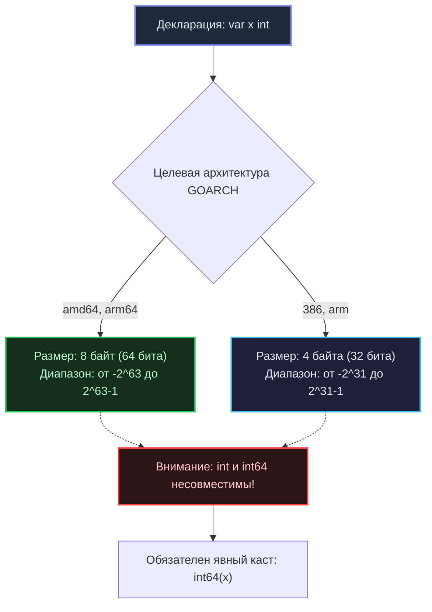

В языке Go тип данных — это не абстрактная концепция из академического учебника. Это строжайший физический контракт с компилятором, который точно определяет, сколько байтов оперативной памяти необходимо выделить на стеке или в куче, и по каким правилам процессор обязан манипулировать этими битами в регистрах (как целым числом со знаком, как мантиссой с плавающей точкой или как парой из указателя и длины).

Как бэкенд-инженеры, мы обязаны воспринимать базовые типы не просто как «числа и строки», а как конкретные блоки памяти, напрямую влияющие на загрузку кэш-линий процессора и расход оперативной памяти высоконагруженного сервера.

---

## Логический тип: bool

Тип `bool` может принимать одно из двух значений: `true` либо `false`. Нулевым значением по умолчанию (`Zero Value`) для него является `false`.

> [!info] Под капотом: Размер bool
> В теории для сохранения булевого флага достаточно ровно одного бита. Однако в Go (как и в C/C++) переменная типа `bool` занимает в памяти **ровно 1 байт** (8 бит).
> 
> Почему не 1 бит? Это фундаментальное проявление **Mechanical Sympathy** и архитектуры современного кремния. Минимальная адресуемая единица оперативной памяти процессора x86-64 или ARM64 — это байт. Процессор физически не способен адресовать, прочитать или записать отдельный бит в RAM напрямую без манипуляции всем байтом. 
> 
> Если бы `bool` сжимался в 1 бит, компилятору приходилось бы генерировать тяжелые ассемблерные цепочки побитовых масок (`read-modify-write`). Это разрушило бы производительность и сделало бы невозможным атомарный доступ к соседним переменным в многопоточной среде.

---

## Целочисленные типы: int, uint и их братья

Go предоставляет две группы целочисленных типов: платформозависимые (`int`, `uint`, `uintptr`) и типы с жестко фиксированной разрядностью (`int8`, `int16`, `int32`, `int64` и их беззнаковые собратья `uint8`, `uint16`, `uint32`, `uint64`).

### Платформозависимый int

Когда вы объявляете переменную через `var x int` или используете краткую запись `x := 10`, компилятор выбирает системный тип `int`. Его физическая разрядность целиком диктуется целевой архитектурой компиляции (`GOARCH`):



> [!tip] Собеседование
> **Вопрос:** Является ли тип `int` псевдонимом (алиасом) для `int64` на 64-битных операционных системах?
> **Ответ:** Категорически нет! В системе типов Go `int` и `int64` — это **два абсолютно разных, несовместимых типа**, даже если на текущей машине оба занимают ровно 8 байт. Вы не можете передать переменную типа `int` в функцию, принимающую `int64`, без явного приведения `int64(x)`. Это жесткое правило гарантирует, что программа скомпилируется и поведет себя предсказуемо при кросс-компиляции под 32-битные архитектуры (ARM или 386).

### Mechanical Sympathy: Размер имеет значение

В повседневной разработке принято использовать системный `int` для индексов циклов или локальных счетчиков. Но когда сервис оперирует массивами и срезами (`slice`) из сотен тысяч и миллионов элементов, выбор разрядности становится критическим фактором производительности.

Физическая **кэш-линия** современных процессоров (кэш L1/L2) имеет размер ровно **64 байта**:
* Если вы используете срез `[]int64`, в одну кэш-линию поместится ровно **8 элементов** ($64 / 8$);
* Если диапазон чисел позволяет обойтись типом `[]int8`, в одну кэш-линию войдет сразу **64 элемента**!

Итерирование по срезу `[]int8` генерирует в восемь раз меньше промахов кэша (`Cache Misses`) и холостых обращений к медленной шине оперативной памяти RAM. Аппаратный предвыборщик процессора (**Hardware Prefetcher**) загружает данные непрерывным потоком, обеспечивая максимальный темп вычислений. Однако при проектировании структур из разнородных полей важно помнить о правилах выравнивания памяти (`Memory Padding`), о которых мы детально поговорим в статье о структурах.

### Переполнение (Integer Overflow)

В Go целочисленное переполнение намеренно **не вызывает паники** (`panic`) в рантайме. Процессор циклически оборачивает значение (`wrap-around`) в соответствии со стандартными правилами арифметики дополнения до двух:

```go
var max int8 = 127
max = max + 1
fmt.Println(max) // Выведет -128
```

Если бизнес-логика требует гарантированного обнаружения переполнения (например, в финансовых расчетах, учете балансов или биллинге), применяйте специализированные функции из стандартного пакета `math/bits` (например, `bits.Add64()`), которые возвращают флаг переноса (`carry out`).

---

## Числа с плавающей точкой: float32, float64

В Go полностью отсутствуют размытые типы `float` или `double`. Вы обязаны декларировать точность явно: `float32` (одинарная точность, 4 байта) либо `float64` (двойная точность, 8 байт). Краткая форма `:=` для дробных чисел всегда выбирает `float64`.

Под капотом операции с плавающей точкой строго следуют международному стандарту **IEEE-754**. На битовом уровне число разделяется на три сегмента:
1. Знак (**Sign**);
2. Экспонента (**Exponent**);
3. Мантисса (**Fraction / Mantissa**).

> [!warning] Ловушка / Gotcha
> Арифметика с плавающей точкой таит в себе классическую ловушку, актуальную для любого языка:
> ```go
> a := 0.1
> b := 0.2
> fmt.Println(a + b == 0.3) // Выведет false! (в реальности 0.30000000000000004)
> ```
> 1. **Никогда не сравнивайте числа с плавающей точкой через оператор `==`.** Вместо этого вычисляйте модуль разницы с допустимой погрешностью (`epsilon`):
>    ```go
>    math.Abs(a - b) < 1e-9
>    ```
> 2. **Категорически запрещено использовать `float` для денежных расчетов!** Накопление погрешности округления неизбежно приведет к финансовым расхождениям. Для денег храните суммы в целых числах (`int64`), ведя учет в минимальных неделимых единицах (копейках или центах), либо применяйте специализированные библиотеки десятичной арифметики произвольной точности, такие как `github.com/shopspring/decimal`.

Типы `float` также поддерживают специальные математические состояния: `NaN` (Not a Number), `+Inf` (положительная бесконечность) и `-Inf` (отрицательная бесконечность). Проверять их наличие следует с помощью функций стандартного пакета `math`: например, `math.IsNaN(f)`.

---

## Строки: string

Строка в Go (`string`) — это неизменяемая (**immutable**) непрерывная последовательность байтов (в 99% случаев представляющая собой валидный UTF-8 текст).

В недрах рантайма строка — это компактная двухсловная структура `StringHeader` (занимающая ровно 16 байт на 64-битных системах):
1. `Data` — адрес в памяти (`uintptr`), указывающий на начало байтового массива;
2. `Len` — точное количество байтов в строке (`int`).

```go
// Так строка представлена в рантайме и пакете reflect
type StringHeader struct {
    Data uintptr
    Len  int
}
```

Благодаря такой архитектуре:
* Вычисление длины строки `len(str)` — это мгновенная операция сложности $O(1)$, считывающая значение счетчика `Len`;
* Передача строки в функцию или операция копирования `a = b` копирует лишь 16 байт структуры заголовка, не затрагивая сами текстовые данные в куче или сегменте констант.

Поскольку строки скрывают множество тонкостей при работе с кириллическими символами и эмодзи, мы посвятим их детальному препарированию отдельную лекцию: [[20. Строки в Go. Immutable string и работа с Unicode]].

---

## Строгость приведения типов

В Go действует принцип бескомпромиссной явности: в языке **полностью отсутствует неявное приведение типов (Implicit Casting)**, привычное разработчикам на C, C++ или C#. Любое преобразование (`Type Conversion`) обязано быть написано программистом в явном виде:

```go
var i int32 = 42
// var f float64 = i        // Ошибка компиляции!
var f float64 = float64(i) // Разрешено только явное преобразование
```

Это правило неукоснительно соблюдается даже для типов с полностью идентичным внутренним представлением. Если вы объявляете доменный тип поверх примитива:

```go
type UserID int64
var id UserID = 100

var x int64 = 50
// x = id        // Ошибка компиляции: Cannot use 'id' (type UserID) as type int64
x = int64(id)   // Только явный каст!
```

Такая строгая дисциплина полностью ликвидирует скрытые ошибки, когда компилятор C++ незаметно от разработчика приводил отрицательное число к `unsigned int`, порождая катастрофические уязвимости переполнения буфера.

---

## Итог

1. **`bool`** занимает ровно 1 байт из-за аппаратных ограничений минимальной байтовой адресации шины памяти процессора.
2. **`int`** и **`uint`** имеют переменную разрядность (4 или 8 байт), зависящую от целевой платформы (`GOARCH`). Для сетевых протоколов и бинарных форматов всегда используйте типы фиксированной ширины (`int32`, `int64`).
3. **Mechanical Sympathy:** Компактные типы данных (`int8`, `int16`) в больших массивах позволяют в разы эффективнее использовать 64-байтные кэш-линии процессора L1/L2.
4. **`float`:** Строгая реализация стандарта IEEE-754. Никаких прямых сравнений через `==` и никаких расчетов денежных балансов.
5. **Строки:** Легковесная структура `StringHeader` из двух полей (указатель `Data` и длина `Len`), обеспечивающая операцию `len(str)` за $O(1)$.
6. **Явная типизация:** Никакого неявного сахара — все преобразования типов декларируются в коде абсолютно прозрачно.

Хотя `string` является базовым типом, работа с текстовыми данными в Go неразрывно связана с кодировкой UTF-8 и понятием рун (`runes`). В следующей лекции [[7. Rune, Byte и Unicode в Go]] мы разберем, почему в языке нет типа `char`, как компилятор разделяет байты и символы, и почему наивная итерация по строке с кириллицей ломает текст на куски.
