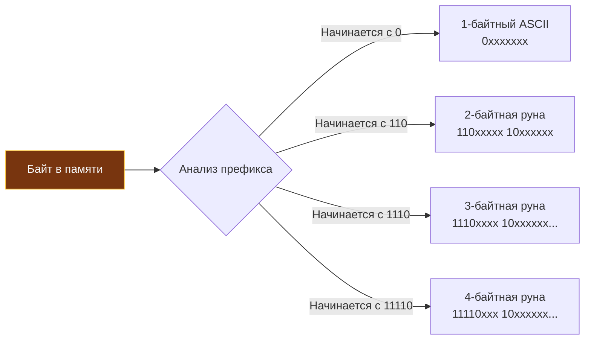

Если вы пришли в Go из мира C или C++, ваша интуиция подсказывает, что любой текстовый символ — это скромный `char`, занимающий ровно 1 байт. Если ваш бэкграунд связан с Java или C#, то `char` для вас — это 2 байта (наследие эпохи кодировки UTF-16 и ранней иллюзии, будто 65 536 значений хватит человечеству на все письменности мира).

В Go типа `char` нет вовсе. И это не прихоть, а следствие инженерного триумфа. Создатели языка — Роб Пайк (Rob Pike) и Кен Томпсон (Ken Thompson) — это те самые инженеры Bell Labs, которые в сентябре 1992 года в обеденном перерыве в нью-джерсийском дайнере на бумажной салфетке спроектировали кодировку **UTF-8**. Они создали стандарт, завоевавший всю глобальную сеть.

Поэтому поддержка UTF-8 вшита в саму ДНК языка Go. Однако чтобы свободно говорить на этом языке и не совершать фатальных ошибок в высоконагруженных сетевых сервисах, бэкенд-разработчик обязан четко разграничивать два фундаментальных понятия: сырое физическое хранение последовательности байт в памяти (`byte`) и логическое восприятие символа человеком (`rune`).

---

## Истинное лицо: byte и rune

В отличие от языков со сложной иерархией типов, в Go `byte` и `rune` не являются скрытыми или тяжелыми структурами данных. Это просто встроенные синтаксические псевдонимы (type aliases) для базовых целочисленных примитивов:

```go
type byte = uint8   // Занимает 1 байт (диапазон значений от 0 до 255)
type rune = int32   // Занимает 4 байта (диапазон значений от -2^31 до 2^31-1)
```

> [!info] Под капотом: Псевдонимы типов
> Знак равенства `=` в определении типа означает создание **псевдонима** (alias). Компилятор считает `byte` и `uint8` **абсолютно идентичными** сущностями. Вы можете без малейших колебаний передать значение типа `byte` в функцию, принимающую `uint8`, не прибегая к явному приведению типов (в отличие от создания отдельного нового типа без знака `=`, как мы разбирали ранее). 
> Псевдонимы существуют ради инженерной ясности и читаемости: когда разработчик видит `byte`, он понимает, что перед ним поток сырых бинарных данных, а когда встречает `rune` — речь идет о символе текста в стандарте Unicode.

### Почему rune — это int32?

Современный стандарт Unicode объединяет все письменности планеты, математические символы, древние иероглифы и пиктограммы — всего свыше 140 000 символов. Каждому графическому элементу присвоен уникальный числовой идентификатор — **Code Point** (кодовая точка):

- Латинская буква `A` — это кодовая точка `U+0041`.
- Кириллистическая буква `П` — это кодовая точка `U+041F`.
- Земной шар `🌍` — это кодовая точка `U+1F30D`.

Максимально возможное значение кодовой точки в стандарте Unicode ограничено `0x10FFFF`, что требует ровно 21 бита памяти. Поскольку процессоры не оперируют 21-битными регистрами, ближайшим стандартным типом, куда гарантированно и без потерь помещается любая кодовая точка человечества, является 32-битное целое число со знаком. Именно поэтому `rune` (руна) объявлена как синоним `int32`.

---

## Строка — это массив байт, а не рун

Главный постулат рантайма Go звучит так: **строка (`string`) — это неизменяемый срез (slice) байт (`byte`), а не рун (`rune`)**. 

Строка не содержит метаданных о кодировке. На физическом уровне строка — это структура из двух машинных слов (указатель на массив байтов и число байтов). Она абсолютно индифферентна к тому, что в ней лежит. Однако компилятор Go и соглашения экосистемы предполагают, что исходный текст программ и строковые литералы представлены в кодировке UTF-8.

В стандарте UTF-8 кодирование является **переменным по длине (variable-length)** — символ занимает от 1 до 4 байт:
- **1 байт:** Набор ASCII (английские буквы, цифры, знаки препинания) — коды `0x00`..`0x7F`.
- **2 байта:** Кириллица, латынь с диакритикой, греческий, арабский, иврит.
- **3 байта:** Большинство азиатских иероглифов (Китай, Япония, Корея).
- **4 байта:** Эмодзи, редкие исторические алфавиты и специальные графические символы.

### Ловушка длины строки: len()

Из-за динамической природы длины символов встроенная функция `len()` в Go работает не так, как привыкли программисты на Python (`len()`) или JavaScript (`length`): она возвращает **количество физических байт в памяти**, а вовсе не количество видимых символов!

```go
package main

import "fmt"

func main() {
    s1 := "Hello"
    fmt.Println(len(s1)) // Выведет: 5 (5 букв * 1 байт)

    s2 := "Привет"
    fmt.Println(len(s2)) // Выведет: 12! (6 букв * 2 байта)

    s3 := "Go🌍"
    fmt.Println(len(s3)) // Выведет: 6 (2 ASCII байта + 4 байта эмодзи)
}
```

> [!tip] Собеседование
> **Вопрос:** Как надежно и эффективно определить реальное число символов в строке (например, для проверки лимита имени пользователя в 20 символов)?
> **Ответ:** Использовать стандартную функцию `utf8.RuneCountInString(s)` из пакета `unicode/utf8`. Она выполняет один проход по массиву байтов за $O(N)$, валидирует префиксы UTF-8 и считает кодовые точки без лишних аллокаций памяти в куче.
> *Дополнительный нюанс сеньора:* Даже кодовые точки Unicode (`rune`) не всегда равны визуальным символам! Например, составные глифы (grapheme clusters), такие как буква «й» (`и` + диакритический знак `̆`) или эмодзи флагов (составленные из двух региональных индикаторов), могут состоять из нескольких рун. Для подсчета именно визуальных кластеров применяют специализированные библиотеки анализа графем.

---

## Итерация по строке: for vs range

Поскольку строка состоит из байтов, способ ее обхода фундаментально определяет результат вычислений.

### Подход 1: Обход по байтам (классический for)

Если применить классический цикл со счетчиком и индексацией `s[i]`, программа будет читать сырые байты из памяти один за другим:

```go
s := "Код"
for i := 0; i < len(s); i++ {
    fmt.Printf("%x ", s[i]) 
}
// Выведет: d0 9a d0 be d0 b4 (6 байт, представляющих 3 кириллические буквы)
```

Каждая кириллическая буква распалась на два независимых байта. Попытка распечатать `s[i]` через спецификатор `%c` выведет бессмысленный мусор из битых байтов.

### Подход 2: Декодирование на лету (for ... range)

Когда вы используете синтаксис `for ... range` для строки, компилятор и рантайм Go генерируют код, который **на лету декодирует** последовательности UTF-8 в полноценные руны (`rune`):

```go
s := "Go🌍"
for i, r := range s {
    fmt.Printf("Индекс: %d, Руна: %c\n", i, r)
}
```

> [!warning] Ловушка / Gotcha
> Взгляните на вывод этого цикла:
> ```text
> Индекс: 0, Руна: G
> Индекс: 1, Руна: o
> Индекс: 2, Руна: 🌍
> ```
> Где индексы 3, 4 и 5? Они пропущены!
> Переменная индекса `i` в цикле `range` по строке — это **не порядковый номер буквы**, это физическое смещение в байтах (byte offset) от начала среза. Так как эмодзи земного шара занимает 4 байта, следующая итерация (если бы строка продолжалась) началась бы с индекса `6`. Забыв об этом, легко совершить ошибку рассинхронизации индексов.

### Mechanical Sympathy: Как работает декодирование UTF-8

Каким образом рантайм Go понимает, сколько байтов нужно поглотить для декодирования текущей руны? Секрет заключается в изяществе битовой структуры стандарта UTF-8, придуманной Кеном Томпсоном:



Процессор с помощью битовых масок проверяет старшие биты первого байта:
1. Если старший бит равен `0` (маска `0b10000000 == 0`), то перед нами классический 7-битный ASCII символ. Длина — 1 байт.
2. Если старшие биты `110`, то это двухбайтовая последовательность. За ней следует ровно один байт продолжения, начинающийся с `10`.
3. Префикс `1110` сигнализирует о трехбайтовой руне.
4. Префикс `11110` задает четырехбайтовую руну.

Если в памяти встречается поврежденная последовательность или недопустимый префикс (например, байт продолжения `10xxxxxx` без начального байта), декодер Go не паникует. Он подставляет специальный символ замены Unicode `\uFFFD` (символ  — Replacement Character, занимающий 3 байта в UTF-8), продвигает счетчик на 1 байт и мужественно продолжает разбор.

---

## Срезы (Slicing) строк ломают UTF-8

Классический подводный камень для новичков — попытка взять подстроку с помощью стандартного оператора среза `s[start:end]`. 

Оператор среза оперирует **исключительно сырыми байтами**, не зная ничего о границах символов UTF-8:

```go
s := "Привет"
fmt.Println(s[0:2]) // Ожидаем "Пр", получаем "П" (т.к. "П" занимает 2 байта)
fmt.Println(s[0:1]) // Ожидаем "П", получаем "" (сломали кодировку)
```

Разрезав двухбайтовый символ кириллицы ровно посередине (`s[0:1]`), мы получили одиночный байт `0xD0`. При попытке распечатать его в терминале вывод исказится, либо терминал отобразит знак вопроса.

### Как безопасно отрезать символы?

**1. Наивный путь (аллокация в куче):**
```go
// Приведение строки к слайсу рун.
// Внимание: выделяет O(N) памяти в куче для создания массива int32!
runes := []rune("Привет") 
res := string(runes[0:3]) // "При"
```
Такой подход прост и безопасен для тривиальных скриптов, но в высоконагруженном бэкенде приводит к массовым аллокациям памяти (`[]rune` создает совершенно новый массив 4-байтовых целых чисел в куче).

**2. Инженерный подход (Zero-Allocation через пакет utf8):**
```go
s := "Привет"
// Руками находим байтовое смещение нужной руны, чтобы отрезать безопасно.
// Пакет utf8 предоставляет инструменты для работы без выделения памяти.
```
С помощью функций пакета `unicode/utf8` (таких как `utf8.DecodeRuneInString`) вы последовательно находите байтовую позицию $K$-го символа и берете байтовый срез строки `s[:offset]`, не выделяя ни единого лишнего байта в куче!

*(Подробные алгоритмы высокопроизводительного парсинга строк и Zero-Allocation манипуляций мы разберем в отдельной главе [[20. Строки в Go. Immutable string и работа с Unicode]]).*

---

## Итог

1. **`byte`** — это синоним `uint8` (1 байт). Служит для манипуляции сырыми бинарными потоками данных (сетевые сокеты, файлы, криптографические хэши).
2. **`rune`** — это синоним `int32` (4 байта). Представляет отдельную кодовую точку (Code Point) в стандарте Unicode.
3. Строка `string` — это неизменяемый срез байт в кодировке UTF-8, а не массив символов.
4. Функция `len(s)` и оператор среза `s[a:b]` работают строго с байтами. Срез посреди многобайтового символа разорвет руну и приведет к невалидному UTF-8.
5. Итерация `for i, r := range s` автоматически декодирует байты в руны на лету, но индекс `i` обозначает байтовое смещение в памяти, перепрыгивая через байты длинных символов.
6. Для точного подсчета количества логических символов в тексте всегда используйте функцию `utf8.RuneCountInString()`.

Освоив анатомию байтов и рун, мы заложили прочный базис для работы со всеми типами данных в Go. В следующей главе — [[8. Операторы и выражения]] — мы изучим операторы языка, логику выражений и познакомимся с тем, как Go на корню исключает старые ловушки неопределенного поведения и неоднозначности приоритетов из C.
