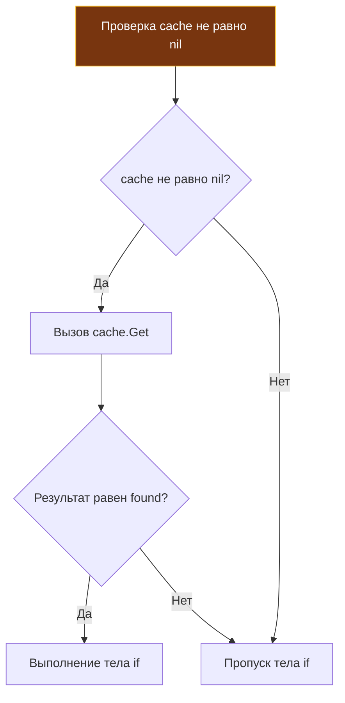

Если вы долгое время программировали на C++ или Java, ваши выражения наверняка напоминали барочные полотна: с перегруженными операторами, постфиксными инкрементами прямо внутри аргументов функций и неявными кастами типов. В таких экосистемах лаконичность часто путают с сообразительностью.

Создатели Go придерживаются прямо противоположного взгляда: виртуозность выражения не должна приносить в жертву понятность кода. В кодовой базе, которую поддерживают десятки инженеров на протяжении десятилетий, «произведение искусства» в коде — это синоним «нечитаемого мусора». 

Язык Go намеренно ограничивает комбинаторику выражений. Здесь нет перегрузки операторов, инкремент выведен из класса выражений, а побитовые операции очищены от исторического мусора Bell Labs сорокалетней давности. В этой статье мы разберем механику операторов в Go, выясним, как компилятор оптимизирует логические цепочки для конвейера процессора, и познакомимся с уникальными битовыми операциями языка.

---

## 1. Инкремент и декремент: Конец неопределенному поведению

В C, C++ и Java операции инкремента (`++`) и декремента (`--`) являются **выражениями (expressions)**. Выражение обязано вычисляться в значение. Из-за этого программисты десятилетиями соревновались в написании загадок вроде:

```c
// Источник ночных кошмаров в C/C++:
a = b++ + ++c;
```

Исторически такие конструкции порождали сложнейшие баги и Неопределенное Поведение (Undefined Behavior): порядок вычисления операндов внутри одного выражения не фиксировался стандартом и зависел от оптимизаций конкретного компилятора и соглашений о вызовах целевой платформы.

> [!warning] Ловушка / Gotcha
> В Go `++` и `--` — это **инструкции (statements)**, а не выражения. Они не возвращают значение.
> 
> ```go
> i := 0
> // j := i++ // Ошибка компиляции! syntax error: unexpected ++
> i++         // Правильно: отдельная инструкция
> ```
> Кроме того, в Go **не существует префиксных форм** `++i` или `--i`. Есть только постфиксная запись, которая применяется к операнду на отдельной строке.

Это лаконичное архитектурное решение Кена Томпсона полностью уничтожило целый класс коварных ошибок, связанных с порядком вычислений (Order of Evaluation). Код стал чуточку длиннее, но абсолютно предсказуемым.

---

## 2. Битовые операции и уникальный &^ (Bit Clear)

Для бэкенд-инженера, проектирующего сетевые бинарные протоколы, работающего с правами доступа (битовыми масками) или криптографией, битовая арифметика — это хлеб насущный. Go предоставляет полный арсенал низкоуровневых операторов: `&` (AND), `|` (OR), `^` (XOR), `<<` (сдвиг влево), `>>` (сдвиг вправо).

Но здесь есть два фундаментальных отличия от традиционных языков C-семейства.

### Унарный XOR вместо побитового NOT (~)

В C и C++ для побитового отрицания (инвертирования всех битов) используется символ тильды `~`. В Go тильды нет. Ее роль берет на себя унарный оператор `^` (XOR с маской из единиц):

```go
var a uint8 = 0b00001111
b := ^a // Результат: 11110000
```

Правило тривиально:
- Если `^` стоит между двумя операндами (`a ^ b`) — это бинарный исключающий ИЛИ (XOR).
- Если `^` стоит перед одним операндом (`^a`) — это унарная побитовая инверсия.

### Уникальный оператор: &^ (Сброс бита / AND NOT)

В Go включен уникальный оператор `&^`, который читается как «AND NOT» (побитовое И-НЕ, или Bit Clear). Он предназначен для прицельной очистки (сброса в ноль) выбранных битов по маске.

Выражение `z = x &^ y` работает по правилу: каждый бит в `z` будет равен `0`, если соответствующий бит в `y` равен `1`. Если же в `y` стоит `0`, то бит берется из `x` без изменений.

```go
const (
    Read    = 1 << iota // 001
    Write               // 010
    Execute             // 100
)

func main() {
    permissions := Read | Write | Execute // 111 (Все права)
    
    // Хотим отобрать право Write
    // В C++ пришлось бы писать: permissions &= ~Write
    // В Go есть элегантный оператор сброса:
    permissions = permissions &^ Write // 101 (Остались Read и Execute)
}
```

> [!info] Под капотом: Mechanical Sympathy
> На аппаратном уровне оператор `&^` во многих микропроцессорных архитектурах транслируется в одну нативную ассемблерную инструкцию. Например, в архитектуре ARM64 есть специализированная инструкция `BIC` (Bit Clear), выполняющая логическое И с предварительно инвертированным вторым операндом за 1 такт CPU. Компилятор Go преобразует конструкцию `a &^ b` напрямую в инструкцию `BIC a, b`, экономя регистры и такты процессора на предварительное создание инвертированной маски.

### Арифметические сдвиги и тип результата

Операторы сдвига `<<` и `>>` сдвигают разряды числа. Однако семантика сдвига вправо (`>>`) строго привязана к **типу левого операнда**:
- **Логический сдвиг (Logical Shift):** Если операнд беззнаковый (`uint`, `uint64`), старшие биты гарантированно заполняются нулями.
- **Арифметический сдвиг (Arithmetic Shift):** Если операнд знаковый (`int`, `int64`), старшие освобождающиеся биты дублируют знаковый (старший) бит, чтобы сохранить знак отрицательного числа при делении на степени двойки.

```go
var x int8 = -128 // 10000000 в дополнительном коде
fmt.Printf("%b\n", uint8(x)) // 10000000

// Арифметический сдвиг знакового типа сохраняет знак (единицы слева)
fmt.Printf("%b\n", x>>1)     // 11000000 (-64)
```

---

## 3. Short-Circuit Evaluation (Ленивые логические вычисления)

Логические операторы `&&` (И) и `||` (ИЛИ) в Go вычисляются строго слева направо по принципу «короткого замыкания» (Short-circuit evaluation). Правый операнд гарантированно не вычисляется, если результат всего составного выражения уже однозначно определен левым операндом:

```go
// Если cache == nil, паники не будет, так как cache.Get() даже не попытается выполниться.
if cache != nil && cache.Get("key") == "found" {
    // ...
}
```

### Mechanical Sympathy: Оптимизация ветвлений

На уровне микроархитектуры ленивые вычисления — это фундаментальный инструмент управления потоком команд (Control Flow), оказывающий прямое влияние на предсказатель переходов (Branch Predictor) и конвейер процессора:



Компилятор превращает оператор `&&` в цепочку машинных условных переходов (`JMP` / `JNE` в x86 ASM). Правое условие может содержать вызов функции с обращением к сети или тяжелые математические расчеты. Грамотное структурирование проверок спасает миллионы тактов CPU.

> [!tip] Собеседование
> **Вопрос:** Вы пишете `if heavyQuery1() || heavyQuery2()`. Какую функцию поставить первой?
> **Ответ:** Ту функцию, которая выполняется быстрее ИЛИ с наибольшей вероятностью вернет `true`. Для оператора `||` (логическое ИЛИ) достаточно истинности первого условия, чтобы пропустить вычисление второго. В инженерии высоконагруженных систем это называется оптимизацией по вероятности (Probability Based Optimization).

---

## 4. Приоритет операторов: Минимализм Go

Одной из причин появления багов в коде на C и C++ является перегруженная таблица приоритетов, насчитывающая свыше 15 уровней. Разработчикам приходится мучительно вспоминать, связывает ли оператор побитового сдвига `<<` сильнее, чем проверка на равенство `==`, и почему побитовые `&` и `|` обладают более низким приоритетом, чем операции сравнения (известная историческая ошибка раннего дизайна C).

Создатели Go безжалостно реорганизовали приоритеты, сократив их до предельно прозрачных **5 уровней** (чем выше уровень, тем выше приоритет вычисления):

1. `*`, `/`, `%`, `<<`, `>>`, `&`, `&^` (Умножения, деления, остатки, сдвиги и побитовые И / сброс)
2. `+`, `-`, `|`, `^` (Сложения, вычитания, побитовые ИЛИ / исключающие ИЛИ)
3. `==`, `!=`, `<`, `<=`, `>`, `>=` (Сравнения)
4. `&&` (Логическое И)
5. `||` (Логическое ИЛИ)

Благодаря тому, что побитовые операции (`&`, `|`, `^`) встали в один уровень с арифметическими (`*` и `+`), выражения вида `if a & mask == 0` в Go работают **без лишних скобок** и абсолютно логично. В C/C++ это же выражение трактуется как `a & (mask == 0)`, что приводило к катастрофическим скрытым дефектам в проверках масок.

---

## 5. Никакой перегрузки операторов

В языке Go принципиально отсутствует возможность перегрузки операторов (Operator Overloading). Вы не можете переопределить `+`, чтобы складывать математические структуры `Matrix` или `Vector`. 

Вместо этого вы объявляете обычный метод:
```go
func (m Matrix) Add(other Matrix) Matrix
```

Почему принято такое радикальное решение? Авторы языка исходили из того, что базовый оператор языка должен нести железную гарантию сложности $O(1)$ и нулевых скрытых побочных эффектов.
- В C++ выражение `a = b + c` может скрывать внутри блокировку системного мьютекса, чтение файла с диска или выделение сотен мегабайт памяти в куче.
- В Go при взгляде на строку `a = b + c` вы на 100% уверены: здесь происходит либо сложение чисел в регистрах процессора, либо конкатенация строк. Это пара инструкций CPU, никаких скрытых сетевых вызовов или тяжелых аллокаций.

> [!warning] Ловушка / Gotcha: Деление и %
> 1. Оператор вычисления остатка `%` (modulo) в Go определен **исключительно для целочисленных типов**. Если вам необходимо вычислить остаток от деления для вещественного `float64`, вы обязаны воспользоваться функцией `math.Mod(a, b)`.
> 2. Деление константы на константный ноль (например, `x := 1 / 0`) пресекается компилятором на этапе сборки. Однако если делитель является переменной (`1 / y`, где `y = 0`), процессор сгенерирует аппаратное исключение (прерывание `SIGFPE`), которое рантайм Go перехватит и превратит в `panic`, аварийно завершив текущую горутину (подробности обработки паник мы разберем в лекции [[13. Panic, Recover и stack trace]]).

---

## Итог

1. Инкремент `++` и декремент `--` являются обособленными инструкциями, а не выражениями. Они не возвращают значений и не могут быть встроены в другие конструкции.
2. Для побитовой инверсии используется унарный `^` вместо символа `~`.
3. Оператор `&^` (AND NOT) — специализированный инструмент для сброса битов, нативно мапящийся во многих архитектурах в инструкцию вроде ARM64 `BIC`.
4. Логические операторы `&&` и `||` вычисляются лениво (short-circuit). Грамотный порядок условий экономит такты процессора.
5. Таблица приоритетов упрощена до 5 уровней, устраняя классические ловушки языка C при работе с битовыми масками.
6. Отсутствие перегрузки операторов гарантирует предсказуемость исполнения и исключает скрытые побочные эффекты.

Операторы в Go предельно честны: они выполняют именно то, что записано в коде, не усложняя ментальную модель инженера. Сформировав представление о данных и операциях над ними, мы логично подходим к механизмам ветвления и повторения. В следующей лекции — [[9. Управляющие конструкции. if, switch, for]] — мы исследуем, как Go обходится единственным циклом `for`, отказавшись от избыточных `while` и `do...while`, и почему конструкция `switch` в Go превосходит аналоги в большинстве языков.
