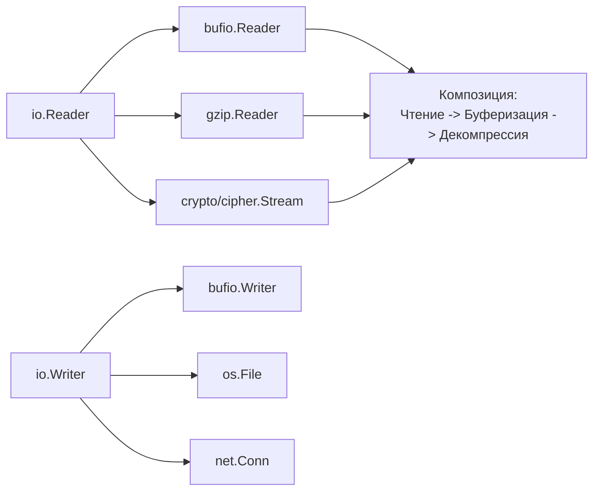
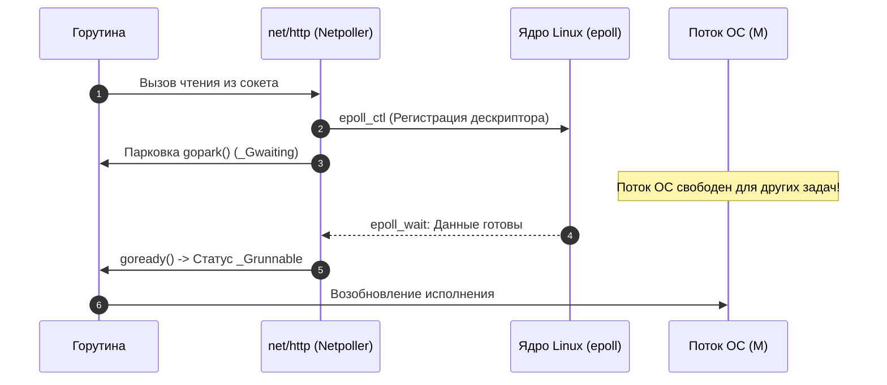

# 1. Обзор раздела. Почему стандартной библиотеки Go часто достаточно

> *"The Unix philosophy is to design each program to do one thing well. To do a new job, build afresh rather than complicate old programs by adding new features."*  
> — Дуглас Макилрой

## Философия «батарейки в комплекте»

Когда вы приходите в экосистему Go из мира PHP (с его Composer), Python (с PyPI) или JavaScript (с печально знаменитым каталогом npm), первое, что бросается в глаза опытному взгляду — это непривычно короткий, спартанский список внешних зависимостей в файле `go.mod` у качественных production-проектов.

В то время как типичный микросервис на Node.js или фронтенд-приложение могут тянуть за собой директорию `node_modules` на сотни мегабайт и тысячи транзитивных зависимостей от неизвестных мейнтейнеров, аналогичный по функционалу высоконагруженный сервис на чистом Go часто обходится одним только стандартным набором пакетов, поставляемых вместе с компилятором.

Это не случайность и не аскетизм ради аскетизма, а прямое следствие осознанной архитектурной философии Bell Labs. Создатели Go — Роб Пайк, Кен Томпсон и Роберт Гризмер — проектировали язык и его стандартную библиотеку так, чтобы профессиональный инженер мог решить 90–95% типовых задач современного бэкенда, не выходя за пределы директории `GOROOT`.

> [!info] Под капотом
> Стандартная библиотека Go — это не просто разрозненный набор утилит. Это **единая, согласованная система фундаментальных абстракций**, где минималистичные интерфейсы `io.Reader` и `io.Writer` позволяют компоновать сложные потоковые конвейеры как кубики конструктора LEGO, а рантайм языка обеспечивает их сверхэффективное исполнение на уровне системных вызовов ядра ОС и планировщика горутин.

---

## Принципы проектирования стандартной библиотеки

Понимание этих принципов поможет вам писать более идиоматичный код и принимать взвешенные архитектурные решения при выборе внешних библиотек.

### 1. Стабильность и обратная совместимость (Go 1 Promise)
Пакеты stdlib проходят экстремально строгий процесс ревью инженерами команды языка. Изменения вносятся только в том случае, если они гарантированно не ломают существующий контракт и семантику. Знаменитое обещание совместимости *Go 1 Compatibility Guarantee* гарантирует, что код, написанный для Go 1.10, с высокой вероятностью безупречно скомпилируется и будет работать на современных Go 1.22, 1.23 и 1.24 без единой правки.

### 2. Композиция через минималистичные интерфейсы
Вместо монолитных классов и жестких объектно-ориентированных иерархий стандартная библиотека предоставляет набор мелких, кристально чистых и ортогональных интерфейсов. 



> [!warning] Ловушка / Gotcha: Преждевременные абстракции
> Не создавайте свои интерфейсы «на будущее». В Go действует незыблемый принцип: **интерфейсы определяются там, где они используются** (consumer), а не там, где реализуются. Создание преждевременных абстракций (`IUserService`, `IDataRepository`) — это антипаттерн, пришедший из строгого ООП, который усложняет код в Go и плодит бессмысленные слои косвенности.

### 3. Zero Dependencies и предсказуемость
Стандартная библиотека принципиально не имеет внешних зависимостей. Она самодостаточна. Это критически важно для надежности энтерпрайз-инфраструктуры:
* **Безопасность (Security):** Меньше внешнего кода — меньше площадь атаки и риск вредоносных закладок в транзитивных зависимостях (supply chain attacks).
* **Скорость сборки:** Отсутствие необходимости скачивать гигабайты пакетов из интернета при `go build` или в CI-пайплайнах.
* **Лицензионная чистота:** Вам не нужно нанимать юристов для аудита совместимости лицензий десятков сторонних open-source библиотек.

---

## Ключевые домены стандартной библиотеки

Давайте кратко систематизируем богатейший арсенал, который предоставляет нам `stdlib` прямо из коробки для решения серьезных производственных задач:

| Домен | Пакеты | Что покрывает |
|---|---|---|
| **Ввод/Вывод** | `io`, `bufio`, `bytes`, `strings` | Потоковая обработка данных, буферизация, работа с памятью без лишних аллокаций. |
| **Сеть** | `net`, `net/http`, `net/url` | Полноценный веб-сервер и клиент, поддержка HTTP/1.1, HTTP/2, TLS, DNS-резолвинг. |
| **Данные** | `encoding/json`, `encoding/xml`, `database/sql` | Сериализация, универсальный интерфейс к реляционным БД (с драйверами). |
| **Конкурентность** | `sync`, `context`, `atomic` | Примитивы синхронизации, отмена операций, атомарные операции на уровне инструкций процессора. |
| **Инфраструктура** | `log/slog`, `testing`, `pprof`, `trace` | Логирование, юнит-тесты, бенчмарки, профилирование продакшена «из коробки». |
| **Безопасность** | `crypto/*`, `tls` | Криптографические примитивы, сертифицированные алгоритмы, безопасный рукопожатие TLS. |

---

## Under the hood: Почему stdlib быстрая?

Многие разработчики ошибочно полагают, что «универсальное» решение из стандартной библиотеки всегда уступает по скорости специализированным сторонним фреймворкам. В случае с Go это заблуждение, потому что стандартная библиотека имеет привилегированный доступ к рантайму и оптимизациям компилятора.

### 1. Сетевой поллер (Netpoller)
Пакет `net` не использует блокирующие системные вызовы в лоб. В основе `net/http` лежит асинхронный сетевой поллер (реализованный через `epoll` в Linux, `kqueue` в macOS/BSD, `IOCP` в Windows).

Когда вы делаете сетевой запрос через стандартный `http.Client`, горутина не блокирует системный поток ядра (OS thread). Вместо этого:
1. Горутина регистрирует файловый дескриптор сокета в поллере.
2. Горутина уходит в состояние ожидания (parked) в планировщике Go.
3. Поток ОС (M) освобождается для выполнения других горутин.
4. Когда данные приходят, поллер будит горутину, и она продолжает выполнение.



Это позволяет сервису на `net/http` удерживать сотни тысяч одновременных TCP-соединений с минимальным потреблением оперативной памяти, чего сложно добиться на сторонних фреймворках без глубокой интеграции с рантаймом.

### 2. Escape Analysis и аллокации
Функции в `fmt` или `strings` оптимизированы компилятором. Например, `strings.Builder` спроектирован так, чтобы минимизировать утечки памяти в кучу (heap).

```go
// Пример: strings.Builder минимизирует аллокации
var b strings.Builder
b.Grow(1024) // Предварительное выделение памяти (pre-allocation)
b.WriteString("header")
// ...
// Компилятор видит, что внутреннее поле []byte не "убегает" за пределы,
// если мы не берем из него строку через .String() слишком рано.
```

> [!tip] Собеседование
> **Вопрос:** В чем разница между `bytes.Buffer` и `strings.Builder`?  
> **Ответ:** `bytes.Buffer` возвращает срез байтов `[]byte` и поддерживает чтение (реализует `io.Reader`), он мутабелен. `strings.Builder` предназначен только для записи строки, он не позволяет читать данные по ходу записи и оптимизирован именно под построение `string`. Начиная с определенного момента, `strings.Builder` паникует при попытке изменить уже записанные данные, что позволяет ему быть чуть более эффективным в определенных сценариях за счет отсутствия аллокаций при получении финальной строки.

---

## Сравнение экосистем: Когда «голой» stdlib достаточно?

| Задача | Подход в других языках | Подход в Go (stdlib) |
|---|---|---|
| **HTTP Router** | Express (JS), Flask (Py) требуют внешние роутеры. | `net/http` + `http.ServeMux` (в 1.22+ с поддержкой методов и паттернов). |
| **Конфигурация** | viper, dotenv, config. | `flag`, `os.Getenv`, `encoding/json` для парсинга файлов. |
| **Логирование** | log4j, winston, structlog. | `log/slog` (структурированное логирование с уровнями) — стандарт с Go 1.21. |
| **Тестирование** | jest, pytest, junit. | `testing`, `httptest`, `iotest` — встроенные и мощные. |
| **ORM** | Hibernate, Entity Framework, Django ORM. | `database/sql` + генерация кода (`sqlc`) или простые репозитории. |

> [!warning] Ловушка / Gotcha: Синдром «Нужен фреймворк»
> **Синдром «Нужен фреймворк»**.  
> Часто разработчики, переходящие с других языков, ищут «аналог Spring» или «аналог Laravel» для Go. Попытка натянуть паттерны жесткого фреймворка на идиоматичный Go приводит к сложной, медленной и негибкой архитектуре.
>
> **Правило:** Начинайте со стандартной библиотеки. Добавляйте внешнюю зависимость только тогда, когда вы четко сформулировали проблему, которую stdlib не решает, и проверили, что альтернатива стоит стоимости поддержки этой зависимости.

---

## Когда всё-таки нужны внешние зависимости?

Быть пуристом — это хорошо, но прагматизм важнее. Есть сценарии, где `stdlib` действительно не хватает:

1. **Сложная работа с базой данных**: Если вам нужна автоматическая маппинг-структур в строки БД (хотя `sqlc` или `ent` часто лучше полноценных ORM).
2. **Специфичные протоколы**: `gRPC` (требует `google.golang.org/grpc`), `WebSocket` (требует `gorilla/websocket` или `nhooyr.io/websocket`, хотя `net/http` в будущем может покрыть часть нужд).
3. **Валидация**: `stdlib` не имеет мощного валидатора тегов (как `go-playground/validator`), хотя для многих случаев достаточно простых проверок `if`.
4. **CLI интерфейсы**: Для сложных утилит командной строки `cobra` или `urfave/cli` экономят время.

---

## Практический совет: Оценка зависимости

Прежде чем добавить `import "github.com/some/library"`, задайте себе вопросы:
1. Могу ли я реализовать это за 30 минут, используя `io`, `strings` и `net/http`?
2. Насколько активен репозиторий? (Когда был последний коммит? Есть ли открытые критические баги?)
3. Не тянет ли эта библиотека за собой еще 50 транзитивных зависимостей? (`go mod graph`)

> [!tip] Собеседование
> **Вопрос:** Почему в проекте на Go может быть плохим знаком наличие 200+ зависимостей?  
> **Ответ:**
> 1. **Время сборки**: Увеличивается время `go build` и `go test`.
> 2. **Безопасность**: Риск уязвимостей (CVE) в цепочке поставок.
> 3. **Сложность обновления**: Конфликты версий (dependency hell), хотя `go mod` и смягчает эту проблему.
> 4. **Понимание кода**: Сложнее онбордить новых разработчиков, если код напичкан магическими библиотеками, скрывающими бизнес-логику.

---

## Итог

Стандартная библиотека Go — это ваш первый и главный инструмент. Она спроектирована так, чтобы быть **достаточной** для создания высоконагруженных, надежных распределенных систем. Использование `stdlib` по умолчанию — это не ограничение, а стратегическое преимущество, которое дает вам стабильность, производительность и контроль над кодовой базой.

В следующей статье мы начнем глубокое погружение в конкретные пакеты, стартуя с одного из самых часто используемых инструментов отладки и вывода: [[2. fmt. Форматированный вывод и форматирование строк]].