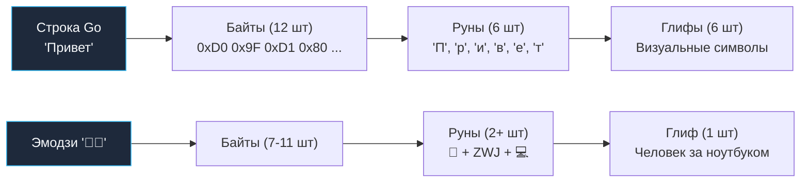

## UTF-8: Почему Go не использует `char`

> *«UTF-8 был создан одним сентябрьским вечером 1992 года Кеном Томпсоном и Робом Пайком прямо на салфетке в кафетерии в Нью-Джерси. Он с подлинной простотой распутал мировой клубок кодировок: обратная совместимость с ASCII и ноль проблем с порядком байтов. В Go UTF-8 — не запоздалая надстройка, а родной воздух, которым дышит язык».*    
> — Брайан Керниган

В большинстве классических языков программирования символ традиционно представляется как неделимый блок памяти фиксированного размера: 1 байт в C (`char` / ASCII), 2 байта в Java и раннем C# (`char` / UTF-16) или 4 байта в UCS-4. Каждый из этих подходов несет груз компромиссов: 1 байт не вмещает мировые алфавиты, 2 байта раздувают англоязычный текст вдвое и ломаются на эмодзи из-за суррогатных пар, а 4 байта приводят к чудовищному перерасходу памяти.

Создатели Go пошли принципиально иным путем. Кен Томпсон и Роб Пайк заложили в фундамент языка кодировку **UTF-8**, которую сами же и изобрели в Bell Labs.

**UTF-8** — это переменная кодировка длиной от 1 до 4 байт на один символ (руну):
*   ASCII символы (`a-z`, `0-9`) занимают ровно **1 байт** (бит `0xxxxxxx`).
*   Латиница с диакритикой, кириллица, греческий — **2 байта** (`110xxxxx 10xxxxxx`).
*   Большинство азиатских иероглифов — **3 байта** (`1110xxxx 10xxxxxx 10xxxxxx`).
*   Эмодзи и редкие исторические символы — **4 байта** (`11110xxx 10xxxxxx 10xxxxxx 10xxxxxx`).

```
Битовая раскладка префиксов UTF-8 (Self-synchronizing stream):
1 байт:  0xxxxxxx
2 байта: 110xxxxx 10xxxxxx
3 байта: 1110xxxx 10xxxxxx 10xxxxxx
4 байта: 11110xxx 10xxxxxx 10xxxxxx 10xxxxxx
                  ▲
                  └── Все байты продолжения начинаются с 10!
```

Это свойство называется *самосинхронизацией*: упав в случайный байт посреди терабайтного сетевого потока, вы можете мгновенно определить, является ли байт началом символа или продолжением, просто проверив старшие биты.

Это делает Go невероятно эффективным для обработки текстовых протоколов (совместимость с ASCII 100%) и компактным для смешанных текстов, но требует от разработчика понимания разницы между **байтом**, **руной** и **глифом**.

> [!info] Под капотом
> **Руна (`rune`)** в Go — это просто псевдоним типа `int32`. Она хранит Unicode Code Point (кодовую точку).
> ```go
> type rune = int32
> ```
> Когда вы видите символ `€`, для компьютера это абстрактное число `8364` (0x20AC). В памяти строки Go оно будет закодировано в UTF-8 как последовательность из 3 байтов: `0xE2 0x82 0xAC`.

---

## Три уровня абстракции текста

Чтобы не совершать досадных ошибок в продакшене, бэкенд-инженер обязан четко разделять три уровня абстракции текста:

1.  **Byte (`byte` / `uint8`)**: Сырой элемент памяти строки. Встроенная функция `len(s)` возвращает именно количество байт.
2.  **Rune (`int32`)**: Юникод-символ. Результат декодирования последовательности байтов UTF-8.
3.  **Grapheme Cluster (Глиф)**: То, что видит пользователь на экране. Может состоять из нескольких рун. Например, эмодзи "семья" 👨‍👩‍👧‍👦 или буква `é` (которая может быть одной руной `U+00E9`, или комбинацией `e` + `combining acute accent`).



> [!warning] Ловушка / Gotcha
> **Индексация строки работает по байтам!**
> ```go
> s := "Привет"
> fmt.Println(s[0]) // Выведет 208 (первый байт буквы 'П'), а не саму букву!
> fmt.Println(string(s[0])) // Выведет кракозябру или пустоту, так как 208 — невалидная UTF-8 последовательность сама по себе.
> ```
> Чтобы получить i-ый символ, нужно использовать цикл `range` или явную конвертацию в слайс рун.

---

## Пакет `unicode/utf8`: Эффективное декодирование без аллокаций

Многие начинающие разработчики совершают ошибку: `runes := []rune(s)`. Это работает, но **крайне неэффективно**. Эта операция проходит по всей строке, декодирует UTF-8 и выделяет новый массив `int32` в куче. Сложность — $O(N)$ по времени и памяти.

Пакет `unicode/utf8` позволяет работать с рунами, оставаясь в рамках исходного байтового представления, без лишних аллокаций.

### Ключевые функции

1.  `utf8.RuneCountInString(s)`: Быстрый подсчет количества рун. Работает быстрее, чем `len([]rune(s))`, так как не создает слайс в памяти, а только последовательно сканирует байты, подсчитывая стартовые байты кодовых точек.
2.  `utf8.DecodeRuneInString(s)`: Декодирует первую руну из строки и возвращает её значение и размер в байтах.
3.  `utf8.ValidString(s)`: Проверяет, является ли строка валидной UTF-8 последовательностью. Критически важно при приеме данных из сети (HTTP body, сокеты), чтобы избежать скрытых ошибок при дальнейшем парсинге.

```go
func processFirstChar(s string) {
    if !utf8.ValidString(s) {
        log.Println("Invalid UTF-8")
        return
    }
    
    r, size := utf8.DecodeRuneInString(s)
    if r == utf8.RuneError && size == 1 {
        // Обработка ошибки декодирования
        return
    }
    
    fmt.Printf("Первый символ: %c, размер в байтах: %d\n", r, size)
}
```

---

## Итерация по строке: магия `range`

Цикл `for range` в Go — это единственный встроенный синтаксический механизм языка, который автоматически и правильно декодирует поток байтов UTF-8 на лету:

```go
s := "Go语言" // "Go" (ASCII) + "语言" (Китайские иероглифы, 3 байта каждый)

// len(s) вернет 8 (2 + 3 + 3)
for i, r := range s {
    // i — индекс начала руны в БАЙТАХ
    // r — значение руны (int32)
    fmt.Printf("Index (byte): %d, Rune: %c\n", i, r)
}
```

**Вывод:**
```text
Index (byte): 0, Rune: G
Index (byte): 1, Rune: o
Index (byte): 2, Rune: 语
Index (byte): 5, Rune: 言
```
Обратите внимание на скачок индекса с 2 на 5. Это абсолютно нормально для UTF-8: иероглиф занял ровно 3 байта.

---

## Пакет `unicode`: Классификация символов

Пакет `unicode` содержит таблицы свойств символов международного стандарта Unicode. Он позволяет мгновенно отвечать на вопросы: «Является ли эта руна буквой?», «Это пробел?», «Это цифра?».

```go
import "unicode"

func isCyrillic(r rune) bool {
    return unicode.Is(unicode.Cyrillic, r)
}

func cleanSpace(s string) string {
    var b strings.Builder
    for _, r := range s {
        if !unicode.IsSpace(r) {
            b.WriteRune(r)
        }
    }
    return b.String()
}
```

> [!info] Под капотом
> Функция `unicode.Is(category, r)` выполняет поиск по битовым маскам или таблицам диапазонов. Для основных категорий (`Letter`, `Digit`, `Space`) это очень быстрые операции, часто сводящиеся к нескольким сравнениям `if r >= min && r <= max`. Однако использование экзотических скриптов может требовать более сложных поисков.

---

## Нормализация и Grapheme Clusters

Стандартные пакеты `unicode` и `utf8` работают с **кодовыми точками** (рунами). Они не знают о визуальном рендеринге глифов.

Пример проблемы:
Символ `é` может быть представлен в тексте двумя абсолютно равноправными способами:
1.  Одна руна: `U+00E9` (LATIN SMALL LETTER E WITH ACUTE).
2.  Две руны: `U+0065` (e) + `U+0301` (COMBINING ACUTE ACCENT).

Для Go это **две разные строки**, хотя визуально они абсолютно идентичны. Функция `len()` вернет разные значения, а оператор равенства `==` вернет `false`!

Для решения таких задач используется пакет `golang.org/x/text/unicode/norm`, который не входит в стандартную библиотеку, но является де-факто стандартом для серьезной работы с текстом. Он приводит строки к нормальной форме (NFC или NFD), обеспечивая каноническую эквивалентность перед сравнением или сохранением в базу данных.

> [!tip] Собеседование
> **Вопрос:** Почему `len("☺")` возвращает 3, а `len("a")` — 1?  
> **Ответ:** Потому что `len` считает байты. Смайлик `☺` (U+263A) в UTF-8 кодируется тремя байтами: `0xE2 0x98 0xBA`. Буква `a` — одним байтом `0x61`.
>
> **Вопрос:** Как эффективно перевернуть строку с поддержкой Unicode?  
> **Ответ:** Нельзя просто менять байты местами! Нужно работать с рунами:
> 1. Конвертировать в `[]rune` (аллокация, но безопасно).
> 2. Поменять элементы слайса местами двумя указателями.
> 3. Конвертировать обратно в `string`.
> Для экстремальной производительности можно использовать `utf8.DecodeLastRuneInString` и собирать результат в `strings.Builder` с конца, избегая создания полного слайса рун, но это сложнее в реализации.

---

## Сравнение с другими языками

| Язык | Единица измерения | Индексация | Проблема |
|------|-------------------|------------|----------|
| **C** | `char` (1 байт) | По байтам | Не поддерживает Unicode из коробки. Нужны внешние библиотеки (ICU). |
| **Java** | `char` (2 байта, UTF-16) | По code units | Эмодзи занимают 2 `char` (суррогатные пары). `length()` может врать для эмодзи. |
| **Python 3** | Unicode Code Point | По рунам | `len("☺")` вернет 1. Удобно, но скрытая конвертация может стоить памяти. |
| **Go** | Byte (UTF-8 encoded) | По байтам | Максимальная прозрачность и эффективность памяти. Требует осознанности при работе с `range`. |

---

## Итог

1.  **Строка в Go — это байты.** `len()` возвращает размер в байтах, а не в символах.
2.  **Используйте `range`** для итерации по символам. Он автоматически декодирует UTF-8.
3.  **Избегайте `[]rune(s)`** в горячих путях. Используйте `unicode/utf8` для подсчета и декодирования без аллокаций.
4.  **Валидируйте ввод.** Всегда проверяйте `utf8.ValidString()` для данных извне.
5.  **Помните про нормализацию.** Визуально одинаковые строки могут иметь разное байтовое представление. Для сравнения таких строк используйте `golang.org/x/text/unicode/norm`.

Понимание того, как текст хранится в памяти, подводит нас к работе с файловой системой и операционной средой. Как Go взаимодействует с файлами, процессами и окружением ОС? В следующей статье: [[11. os. Работа с процессом, окружением и файлами]].