## Разделение ответственности: URL vs Файловая система

> *"In computing, few things have caused more portability headaches than the path separator: Unix chose the forward slash, MS-DOS and Windows chose the backslash, and the World Wide Web standardized on Unix. Go's solution is clean and architectural: separate the two domains into two dedicated packages."*  
> — Брайан Керниган

В большинстве языков программирования общего назначения разработчику предлагается один громоздкий класс вроде `Path` или `File`. В Go проектировщики стандартной библиотеки приняли принципиальное решение разделить работу с путями на два независимых, ортогональных пакета:

1.  **`path`**: Работает исключительно с прямыми слэшами (`/`) **всегда и на любой операционной системе**. Предназначен для путей внутри URL, спецификаторов импортов, ключей объектных хранилищ и виртуальных файловых систем. Он намеренно ничего не знает о специфике хостовой ОС.
2.  **`path/filepath`**: Глубоко учитывает особенности базовой операционной системы. На Linux, macOS и других Unix-системах использует прямой слэш `/`, а на Windows — обратный `\`. Предназначен строго для работы с реальной файловой системой локального или смонтированного диска.

```mermaid
flowchart TD
    subgraph PathDomain["Пакет path (Инвариант: строго POSIX '/')"]
        direction TB
        P1["URL пути: /api/v1/users"]
        P2["Объектные хранилища: S3 / MinIO keys"]
        P3["Виртуальные файловые системы: io/fs"]
        P4["Спецификаторы embed.FS"]
    end

    subgraph FilepathDomain["Пакет path/filepath (Адаптация под ОС)"]
        direction TB
        F1["Linux / macOS: /var/log/app.log"]
        F2["Windows: C:\\data\\config.yaml"]
        F3["os.PathSeparator: '/' или '\\'"]
        F4["Реальные дисковые вызовы ядра (VFS / NTFS)"]
    end

    classDef pStyle fill:#1e3a8a,stroke:#3b82f6,color:#dbeafe;
    classDef fStyle fill:#064e3b,stroke:#10b981,color:#d1fae5;

    class P1,P2,P3,P4 pStyle;
    class F1,F2,F3,F4 fStyle;
```



> [!info] Под капотом
> Почему это разделение жизненно важно? Потому что международные веб-стандарты (RFC 3986) жестко регламентируют использование `/` в URL, независимо от того, на какой операционной системе запущен сервер. Если вы по ошибке используете `filepath.Join` для формирования URL на Windows-машине разработчика или в CI, вы получите путь вида `api\v1\users`, который удаленный браузер или HTTP-клиент воспримет как сломанный. И наоборот: использование `path.Join` для локальных файлов на Windows может привести к созданию файла с именем, содержащим слеши, что недопустимо в NTFS.

---

## 1. Пакет `path`: Чистота и предсказуемость

Используйте этот пакет для:
*   Манипуляций с URL-путями и роутингом HTTP-серверов.
*   Формирования путей к ключам в S3/MinIO и облачных бакетах.
*   Внутренних идентификаторов ресурсов распределенных систем.
*   Работы с абстракцией `io/fs` (виртуальные ФС).

### Ключевые функции
*   `path.Join(elem ...string)`: Соединяет элементы пути через `/`, автоматически очищая их.
    *   `path.Join("a", "b")` → `"a/b"`
    *   `path.Join("a/", "b")` → `"a/b"` (удаляет дублирующиеся слеши)
    *   `path.Join("a", "..", "b")` → `"b"` (разрешает сегменты `..`)
*   `path.Dir(path)`: Возвращает родительскую директорию пути: `path.Dir("a/b/c")` → `"a/b"`.
*   `path.Base(path)`: Возвращает последний элемент пути: `path.Base("a/b/c")` → `"c"`.
*   `path.Ext(path)`: Возвращает расширение файла (включая точку): `path.Ext("file.tar.gz")` → `".gz"`.

> [!warning] Ловушка / Gotcha
> `path.Join` **не добавляет** завершающий слэш для директорий.
> `path.Join("folder", "")` вернет `"folder"`, а не `"folder/"`.
> Также `path.Clean` (который вызывается внутри `Join`) удаляет двойные слеши и разрешает `..`. Это полезно для безопасности (защита от Directory Traversal), но может изменить семантику пути, если вы полагаетесь на сырую строку.

---

## 2. Пакет `path/filepath`: Адаптация к ОС

Используйте этот пакет для:
*   Чтения/записи файлов на локальный диск.
*   Работы с системными переменными окружения вроде `$HOME` или `%APPDATA%`.
*   Рекурсивного обхода дерева каталогов (`WalkDir`).

### Ключевые функции
*   `filepath.Join(elem ...string)`: Аналог `path.Join`, но использует платформенный разделитель `os.PathSeparator` (`/` или `\`).
*   `filepath.Abs(path)`: Преобразует относительный путь в абсолютный, используя текущую рабочую директорию (`os.Getwd()`).
*   `filepath.Rel(basepath, targpath)`: Вычисляет относительный путь от `basepath` до `targpath`.
*   `filepath.Walk` и `filepath.WalkDir`: Рекурсивный обход файловой системы.

### `Walk` vs `WalkDir` (Go 1.16+)
Исторический метод `filepath.Walk` устарел в пользу современного `filepath.WalkDir`:
*   `Walk` передает в колбэк `os.FileInfo`, что требует принудительного вызова системного вызова `stat()` для каждого встреченного файла или каталога (катастрофически дорого на больших дисках!).
*   `WalkDir` передает `fs.DirEntry`, который использует ленивую загрузку метаданных из буфера ядра (как и в `os.ReadDir`). Это значительно быстрее и экономит сотни тысяч системных вызовов.

```go
err := filepath.WalkDir(".", func(path string, d fs.DirEntry, err error) error {
    if err != nil {
        return err
    }
    if !d.IsDir() {
        fmt.Println("Found file:", path)
    }
    return nil
})
```

---

## 3. Безопасность: Защита от Directory Traversal

Одна из самых распространенных уязвимостей в веб-приложениях — Directory Traversal (выход за пределы корневой папки через пейлоад вроде `GET /download?file=../../etc/passwd`).

Никогда не конкатенируйте пути со строками от пользователя вручную! Всегда используйте связку `filepath.Clean` и `filepath.Abs` с последующей проверкой префикса:

```go
func safeFilePath(baseDir, userInput string) (string, error) {
    // 1. Очищаем ввод от ../ и лишних слешей
    cleanInput := filepath.Clean(userInput)
    
    // 2. Join с базовой директорией
    fullPath := filepath.Join(baseDir, cleanInput)
    
    // 3. Приводим к абсолютному пути для надежной проверки
    absPath, err := filepath.Abs(fullPath)
    if err != nil {
        return "", err
    }
    
    // 4. Проверяем, что результат начинается с baseDir
    absBase, _ := filepath.Abs(baseDir)
    if !strings.HasPrefix(absPath, absBase) {
        return "", errors.New("access denied: path traversal detected")
    }
    
    return absPath, nil
}
```

> [!info] Под капотом
> `filepath.Clean` заменяет множественные разделители на один, удаляет `.` и разрешает `..`. Но он **не** делает путь абсолютным. Поэтому шаг с `filepath.Abs` критичен: без него путь `../../etc/passwd` после `Clean` станет `../../etc/passwd`, и проверка `HasPrefix` может пройти, если `baseDir` тоже относительный и короткий. Абсолютизация устраняет эту неоднозначность.

---

## 4. Mechanical Sympathy: Аллокации строк и кэш

Операции с путями — это низкоуровневые манипуляции со строковыми срезами в памяти. Функция `filepath.Join` выделяет новую память под строки при каждом вызове. В горячих циклах (например, пакетная обработка сотен тысяч файлов в логах) это создает заметное давление на сборщик мусора (GC).

**Оптимизация:**
Если вы генерируете пути в цикле, используйте `strings.Builder` или `bytes.Buffer` для предварительной сборки с вызовом `Grow()`, а затем конвертируйте в готовую строку. Однако в вопросах безопасности всегда лучше пожертвовать несколькими микросекундами ради гарантированной защиты `filepath.Join` и `filepath.Clean`, так как ошибки в ручной конкатенации путей открывают бреши в безопасности сервера.

Для `filepath.WalkDir`: помните, что функция-колбэк вызывается строго синхронно для каждого файла. Если внутри колбэка вы выполняете тяжелые операции ввода-вывода (чтение содержимого, вызовы сетевых API), вы блокируете весь обход дерева. Для эффективной параллельной обработки собирайте пути в слайс или передавайте их через канал пулу горутин-воркеров.

---

## 5. Сравнение с другими языками

| Язык | Подход | Особенности |
|------|--------|-------------|
| **Python** | `os.path`, `pathlib` | `pathlib` — ООП подход, очень удобен, но создает объекты. `os.path` — функциональный, как в Go. |
| **Java** | `java.nio.file.Paths` | Возвращает объект `Path`. Ленивое вычисление. Требует JVM. |
| **Node.js** | `path` module | Автоматически определяет разделитель ОС. Похож на `path/filepath`. Есть `path.posix` и `path.win32` для явного выбора. |
| **Go** | `path` + `path/filepath` | Явное разделение. Заставляет разработчика думать: "Это URL или файл?". Снижает количество багов переносимости. |

> [!tip] Собеседование
> **Вопрос:** В чем разница между `path.Join("a", "b")` и `filepath.Join("a", "b")` на Linux?  
> **Ответ:** На Linux результат будет одинаковым (`"a/b"`), так как разделитель путей в Unix — это слэш. Разница проявится на Windows: `path.Join` вернет `"a/b"`, а `filepath.Join` — `"a\b"`.
>
> **Вопрос:** Почему `filepath.Abs` может вернуть ошибку?  
> **Ответ:** Если текущая рабочая директория была удалена или недоступна, `os.Getwd()` (который вызывает `filepath.Abs`) вернет ошибку. Это редкий, но возможный сценарий в долгоживущих процессах, если кто-то снаружи удалил папку, из которой запущен бинарник.

---

## Итог

1.  **URL и виртуальные пути** → строго пакет `path`.
2.  **Реальные файлы на диске** → строго пакет `path/filepath`.
3.  **Безопасность прежде всего:** Всегда используйте `Clean` и проверяйте `HasPrefix` с абсолютными путями для предотвращения атак типа Directory Traversal.
4.  **Используйте `WalkDir`** вместо `Walk` для максимальной производительности (на порядок меньше syscall `stat`).
5.  **Помните про ОС:** `filepath` адаптируется под Windows/Linux, `path` — всегда POSIX-стиль.

Разобравшись с путями, мы переходим к современной абстракции файловых систем в Go (`io/fs`), которая позволяет унифицировать работу с локальным диском, ZIP-архивами и встроенными в бинарник ресурсами. В следующей статье: [[13. io_fs. Абстракция файловых систем]].