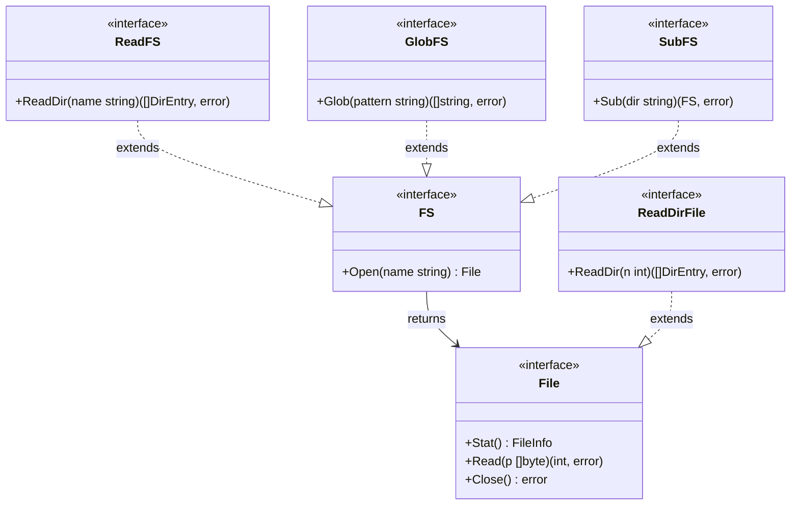

## `io/fs`: Единый интерфейс для всего

> *«В операционной системе Plan 9 из Bell Labs мы взяли принцип Unix „всё есть файл“ и довели его до логического предела: всё есть файловая система. С появлением `io/fs` язык Go перенёс этот чистый и целостный взгляд прямо в стандартную библиотеку».*    
> — Брайан Керниган

До версии Go 1.16 работа с файлами была намертво привязана к физической операционной системе через пакет `os`. Если вам требовалось прочитать конфигурационный файл, вы вызывали `os.ReadFile`. Но если этот же файл находился внутри ZIP-архива, был зашит в бинарный файл или генерировался динамически в памяти для модульных тестов, вам приходилось писать громоздкие самодельные адаптеры или подключать сторонние библиотеки с несовместимыми сигнатурами.

Релиз Go 1.16 кардинально изменил ландшафт системного программирования: появился пакет `io/fs`, который ввел строгие, минималистичные интерфейсы для абстрагирования любой иерархической файловой системы. Теперь компоненты стандартной библиотеки (такие как `text/template`, `embed`, `http.FileServer` и парсеры конфигураций) взаимодействуют не с конкретными дорожками и секторами диска, а с любым объектом, удовлетворяющим базовому интерфейсу `fs.FS`.

> [!info] Под капотом
> Ключевой интерфейс пакета — `fs.FS`:
> ```go
> type FS interface {
>     Open(name string) (File, error)
> }
> ```
> Это концептуально напоминает `io.Reader`, но для иерархических древовидных структур данных. Метод `Open` возвращает интерфейс `fs.File`, который позволяет читать байты потока (`Read`), получать системную информацию (`Stat`) и освобождать ресурсы (`Close`).
>
> Важнейшее архитектурное решение: пути внутри `fs.FS` **всегда** используют прямой слэш `/` как разделитель, независимо от хостовой ОС (даже на Windows!). Это гарантирует 100% переносимость кода между Linux, Windows и macOS, а также естественную совместимость с веб-путями URL.

---

## Иерархия интерфейсов: От простого к сложному

Пакет `io/fs` спроектирован по канонам простоты Go: на базе композиции мелких, ортогональных интерфейсов. Это позволяет реализациям предоставлять только те возможности, которые они физически поддерживают, не загромождая API нереализуемыми методами (например, архивы zip не поддерживают запись, поэтому `fs.FS` спроектирован строго как read-only).



### Ключевые расширения
1.  **`fs.ReadDirFS`**: Добавляет метод `ReadDir(name string)`. Позволяет получить список файлов в директории, не открывая саму директорию как файл. Это критически важно для производительности, так как избегает лишних системных вызовов.
2.  **`fs.GlobFS`**: Поддержка поиска по шаблонам путей (например, `*.go` или `templates/**/*.html`).
3.  **`fs.SubFS`**: Позволяет изолировать «поддерево» файловой системы. Например, если у вас есть архив или дерево каталогов проекта, вы можете вызвать `fs.Sub(fsys, "configs")` (или реализовать метод `Sub("configs")`), и все дальнейшие операции будут безопасны и относительны только этой подпапки.

---

## Реализации в стандартной библиотеке

В стандартной библиотеке Go уже есть мощный арсенал готовых реализаций `fs.FS`:

1.  **`os.DirFS`**: Адаптирует реальную файловую систему локального диска под абстрактный интерфейс `fs.FS`.
    ```go
    // Вместо жестко привязанного os.Open("/etc/config.yaml")
    fsys := os.DirFS("/etc")
    file, err := fsys.Open("config.yaml") // Путь относительный!
    ```
2.  **`embed.FS`**: Встроенная прямо в бинарник компилятором неизменяемая файловая система (подробно см. статью [[14. embed. Встраивание файлов в бинарник]]).
3.  **`zip.Reader`**: Начиная с Go 1.16, пакет `archive/zip` напрямую реализует интерфейс `fs.FS`. Вы можете сканировать содержимое ZIP-архива ровно так же, как обычную папку на SSD.
4.  **`tar.Reader`**: Аналогично для TAR-архивов (через адаптеры или новые методы в Go 1.17+).
5.  **`testing/fstest.MapFS`**: Виртуальная файловая система в оперативной памяти (RAM) для юнит-тестирования без создания временных файлов на диске.

---

## Mechanical Sympathy: Оптимизация обхода директорий

Функция `fs.ReadDir` возвращает слайс легковесных структур `[]fs.DirEntry`. Как мы разбирали в статье про `os.ReadDir` и в лекциях об устройстве ядра ОС, `DirEntry` берет тип файла и его имя напрямую из буфера ядра (`getdents64`), не совершая дорогостоящий вызов `stat()`.

Когда вы вызываете рекурсивный обход `fs.WalkDir` (современная высокоскоростная замена устаревшему `filepath.Walk`), он под капотом использует именно `ReadDir`. Это дает:
*   **Меньше аллокаций**: дескриптор `DirEntry` значительно легче, чем полноценный `FileInfo`.
*   **Меньше syscall'ов**: метаданные (размер файла, права доступа, время изменения) не запрашиваются у дисковой подсистемы до тех пор, пока вы явно не вызовете метод `d.Info()`.
*   **Кэширование**: Специализированные реализации (например, `os.DirFS`) могут кэшировать результаты `readdir`.

```go
// Эффективный рекурсивный поиск всех .go файлов
func findGoFiles(fsys fs.FS) []string {
    var files []string
    fs.WalkDir(fsys, ".", func(path string, d fs.DirEntry, err error) error {
        if err != nil {
            return err
        }
        if !d.IsDir() && strings.HasSuffix(path, ".go") {
            files = append(files, path)
        }
        return nil
    })
    return files
}
```

> [!warning] Ловушка / Gotcha
> **Относительные пути и корень.**
> В `fs.FS` путь `.` обозначает корень файловой системы. Путь не может начинаться с `/` или `..`.
> `fsys.Open("/config.yaml")` вернет ошибку `invalid argument`.
> `fsys.Open("../etc/passwd")` вернет ошибку `invalid argument`.
> Это сделано намеренно для безопасности (предотвращение выхода за пределы sandbox) и унификации. Если вам нужно работать с абсолютными путями, используйте `os.DirFS` с правильным префиксом или `filepath.Rel`.

---

## Интеграция с `net/http`

Один из самых выразительных сценариев применения `io/fs` — раздача статических файлов через веб-сервер. Адаптер `http.FS` прозрачно превращает любой `fs.FS` в интерфейс `http.FileSystem`, который ожидает серверная функция `http.FileServer`:

```go
// Создаем файловую систему из папки "static"
staticFS := os.DirFS("static")

// Оборачиваем в http.FS
fileServer := http.FileServer(http.FS(staticFS))

// Все запросы к /static/* будут обслуживаться из папки "static"
http.Handle("/static/", http.StripPrefix("/static/", fileServer))
```

Это позволяет приложению бесшовно переключаться между раздачей файлов с диска в локальной разработке (`os.DirFS`) и раздачей из встроенных в единый бинарник ассетов (`embed.FS`) в продакшене, не меняя ни единой строчки в коде HTTP-роутинга!

---

## Сравнение с другими подходами

| Подход | Язык/Фреймворк | Особенности |
|------|----------------|-------------|
| **`io/fs`** | Go | Интерфейсный, минималистичный, композируемый. Поддерживает lazy-loading метаданных. |
| **`java.nio.file.FileSystem`** | Java | Тяжеловесный, ООП-ориентированный. Требует фабрик для создания. |
| **`std::filesystem`** | C++ | Value-семантика, прямая работа с ОС. Менее абстрактный, более императивный. |
| **VFS (Virtual File System)** | Python/Ruby | Часто реализуется через сторонние библиотеки (например, `pyfilesystem2`). Не является частью ядра языка в таком же строгом виде. |

> [!tip] Собеседование
> **Вопрос:** Почему `fs.File` не наследуется от `io.Reader` напрямую, а требует приведения типов или отдельного интерфейса?  
> **Ответ:** На самом деле, интерфейс `fs.File` **включает** в себя сигнатуру `Read(p []byte) (n int, err error)`, то есть любой валидный `fs.File` автоматически реализует `io.Reader`. Однако `fs.File` также строго требует методы `Stat()` и `Close()`. Это сделано для того, чтобы вызывающий код мог гарантированно закрыть ресурс и получить его метаданные независимо от физической природы хранилища.
>
> **Вопрос:** Как реализовать кастомную файловую систему (например, для базы данных или S3)?  
> **Ответ:** Достаточно объявить тип, реализующий единственный метод `Open(name string) (fs.File, error)`. Внутри `Open` вы возвращаете структуру, реализующую `fs.File` (методы `Read`, `Close`, `Stat`). Если целевое хранилище поддерживает листинг каталогов, реализуйте также интерфейс `fs.ReadDirFile` (или интерфейс `ReadFS`). Это позволит прозрачно передавать вашу базу данных или облачный бакет в `html/template.ParseFS` или `http.FileServer`.

---

## Итог

1.  **`io/fs` — это стандарт де-факто** для работы с иерархическими данными в Go.
2.  **Пути всегда используют `/`**. Забудьте о `filepath.Join` внутри бизнес-логики `fs.FS`.
3.  **Используйте `fs.WalkDir`** вместо `filepath.Walk` для максимальной эффективности ввода-вывода.
4.  **Композиция интерфейсов** позволяет кастомным файловым системам быть предельно легковесными (реализуйте только то, что поддерживается).
5.  **Встроенная безопасность**: Запрет на символы `..` и абсолютные пути с префиксом `/` в методе `Open` гарантирует защиту от path traversal на уровне самого интерфейса.

Абстракция `io/fs` стала фундаментом для революционной возможности Go: встраивания статических веб-файлов, SQL-миграций и шаблонов прямо в бинарный исполняемый файл без сторонних утилит. В следующей статье: [[14. embed. Встраивание файлов в бинарник]].