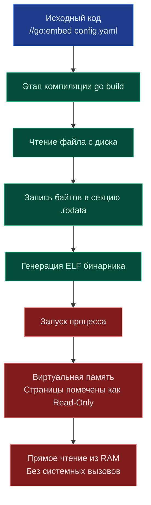

## Философия «всё в одном бинарнике»

> *«Самодостаточный исполняемый файл — чистая радость при развёртывании: никаких внешних зависимостей, никаких версий интерпретаторов и никаких потерянных по дороге шаблонов».*    
> — Брайан Керниган

Одной из главных практических суперсил языка Go с самого его зарождения была концепция статической сборки в единый автономный бинарный файл. Развертывание бэкенд-сервиса не должно превращаться в кошмар с синхронизацией сотен разрозненных HTML-шаблонов, CSS-стилей, иконок и файлов SQL-миграций через Ansible, SCP или многослойные Docker-образы.

Однако вплоть до версии Go 1.16 встраивание статических файлов (шаблонов, конфигураций, миграций SQL, публичных TLS-сертификатов) требовало тяжеловесных сторонних утилит кодогенерации вроде `go-bindata` или `pkger`. Эти утилиты генерировали циклопические Go-файлы, превращавшие бинарные байты в мегабайты строковых литералов в исходном коде, что замедляло компиляцию, засоряло Git и требовало обязательного отдельного этапа в пайплайнах CI/CD.

Директива компилятора `//go:embed`, появившаяся в Go 1.16, перенесла эту фундаментальную задачу на уровень самого тулчейна. Теперь любые файлы упаковываются в исполняемый бинарник прямо на этапе линковки, предоставляя разработчику прозрачный и типобезопасный доступ через стандартные типы `string`, `[]byte` или структуру `embed.FS`. Это сделало деплой по-настоящему атомарным: один скомпилированный бинарник несет в себе абсолютно всё, что ему нужно для старта.



> [!info] Под капотом
> `embed.FS` реализует стандартные интерфейсы `fs.FS`, `fs.ReadFileFS` и `fs.ReadDirFS`. Это означает, что встроенная файловая система полностью совместима с `http.FileServer`, `text/template`, `html/template` и любыми другими компонентами, принимающими интерфейс `io/fs`. Переход от чтения с диска (`os.DirFS`) к встроенным файлам требует замены всего одной строчки кода.

---

## Механика директивы и поддерживаемые типы

Директива компилятора `//go:embed` (обратите внимание: между двойным слэшем и `go:embed` не должно быть пробела!) работает только на уровне пакета и должна стоять непосредственно перед объявлением переменной `var`.

```go
package main

import "embed"

// Встраивание одного файла в неизменяемую строку
//go:embed version.txt
var version string

// Встраивание бинарных данных (изображения, сертификаты)
//go:embed logo.png
var logoData []byte

// Встраивание директории в виртуальную ФС
// Поддерживает шаблоны: *.html, configs/*.yaml
//go:embed templates/* assets/*
var staticFS embed.FS
```

### Правила сопоставления путей
*   Пути указываются строго относительно директории того Go-пакета, в котором находится исходный файл с директивой.
*   Категорически запрещено использовать сегмент `..` для выхода за пределы модуля. Это фундаментальное ограничение безопасности на уровне компилятора.
*   Символ `*` допустим только для выбора файлов в текущей или вложенных директориях, но не для произвольного глоббинга (`*/*.go` запрещено).

---

## Under the hood: Компиляция и секции памяти

Что физически происходит на этапе запуска команды `go build`?

1. **Парсинг**: Компилятор сканирует абстрактное синтаксическое дерево (AST) пакета и находит директивы-комментарии `//go:embed`.
2. **Валидация**: Проверяет физическое существование файлов на диске разработчика, права доступа и ограничения на относительные пути.
3. **Упаковка**: Содержимое файлов последовательно читается и пакуется в единый монолитный блок данных.
4. **Линковка**: Линковщик Go помещает этот блок данных в защищенную секцию `.rodata` (read-only data) бинарника формата ELF/Mach-O/PE.
5. **Инициализация**: На этапе старта программы рантайм инициализирует переменные прямыми указателями на эту область виртуальной памяти.

Физически данные уже лежат в виртуальной памяти процесса сразу после загрузки бинарника ядром ОС через `mmap`. Доступ к ним происходит по прямому указателю без каких-либо накладных расходов на дисковый I/O, системные вызовы, буферизацию или парсинг таблиц размещения файлов.

---

## Mechanical Sympathy: Влияние на производительность и кэш CPU

Встраивание файлов дает колоссальный выигрыш в скорости доступа и латентности, но требует осознания его цены на уровне аппаратного обеспечения.

### Zero-Copy и отсутствие аллокаций
При использовании `embed.FS.Open()` или вызова `staticFS.ReadFile()` рантайм Go не выделяет память в куче для содержимого файла. Он возвращает срез `[]byte`, заголовок которого указывает напрямую на физические страницы секции `.rodata` загруженного бинарника. Это полностью устраняет нагрузку на Garbage Collector: данные статичны и сборщик мусора их даже не сканирует.

Более того, страницы `.rodata` помечены флагом `MAP_SHARED` ядра ОС. Это означает, что если на сервере запущено 10 экземпляров вашего бинарника, операционная система держит встроенную статику в физической памяти RAM ровно **в одном экземпляре**, разделяя страницы между процессами!

### Обратная сторона: Раздувание бинарника и Instruction Cache
1. **Size on Disk**: Каждый встроенный файл напрямую увеличивает размер исполняемого файла на свой байтовый объем. Встраивание 500 МБ датасетов машинного обучения или видеофайлов сделает бинарник неповоротливым, замедлит передачу по сети в реестры контейнеров и развертывание в Kubernetes.
2. **Page Cache & TLB**: При загрузке гигантского бинарника ОС мапит значительно больше виртуальных страниц. Если встроенные данные превышают разумные размеры, они могут приводить к вытеснению полезного кода и вызывать `instruction cache miss` (Instruction Cache в кэше L1i процессора), замедляя исполнение инструкций бизнес-логики.

> [!warning] Ловушка / Gotcha
> **Иммутабельность `.rodata`**.
> Данные в `embed.FS` доступны строго только для чтения. Попытка изменить байт через хаки с пакетом `unsafe` (обход системы типов Go) немедленно приведет к аварийному падению с сигналом `SIGSEGV` (Segmentation Fault) на уровне ядра ОС, так как аппаратные таблицы страниц памяти MMU для секции `.rodata` сконфигурированы с битом `PROT_READ` без флага `PROT_WRITE`. Если вам нужно модифицировать данные в runtime, скопируйте их в кучу при старте:  
> `mutableData := make([]byte, len(embedded)); copy(mutableData, embedded)`.

---

## Безопасность и секреты

Встраивание файлов часто по ошибке используют для доставки сертификатов, секретов или конфигов.  
**Никогда не встраивайте секреты** (пароли от БД, API-токены, приватные RSA/Ed25519 ключи) через `//go:embed`!
*   Скомпилированный бинарник может случайно утечь во внешние артефактории или публичные Docker-реестры.
*   Любой злоумышленник, имеющий доступ к бинарному файлу, может извлечь секретные строки за 1 секунду стандартной утилитой `strings` или через дизассемблер.
*   Смена скомпрометированного секрета потребует обязательной пересборки кода, перетегирования и повторного деплоя всего сервиса.

Для управления секретами в продакшене используйте системные переменные окружения `os.Getenv`, специализированные хранилища секретов (например, HashiCorp Vault) или сущности Kubernetes Secrets, которые монтируются в контейнер в рантайме.

---

## Ловушки и вопросы с собеседований

| Сценарий | Проблема | Решение |
|----------|----------|---------|
| Директива внутри функции | Компилятор выдаст ошибку `invalid go:embed directive` | Директива `//go:embed` работает строго только на уровне пакета (перед объявлением `var`). |
| Изменение файлов после сборки | Бинарник не видит изменений на диске | Бинарник полностью самодостаточен. Чтобы обновить статику, требуется новая сборка. Для динамического контента используйте внешнюю файловую систему. |
| `embed.FS` и права доступа | Метод `Stat()` всегда возвращает права `0644` и фиксированную дату `ModTime` = 0001-01-01 | Это ограничение формата. Встроенные файлы не сохраняют метаданные хостовой ОС ради детерминированности и воспроизводимости сборок (Reproducible Builds). |
| Конфликты имен | Две директивы в разных файлах одного пакета с одинаковыми путями | Компилятор успешно разрешает это объединением, но для читаемости лучше группировать директивы в одном файле `assets.go`. |

> [!tip] Собеседование
> **Вопрос:** В чем разница между `os.DirFS` и `embed.FS` с точки зрения планировщика Go?  
> **Ответ:** `os.DirFS` при каждом обращении дергает системные вызовы ядра `open/read`. Если диск медленный или смонтирован по сети (NFS), горутина паркуется, а поток ОС может блокироваться в ядре. Напротив, `embed.FS` работает исключительно в пространстве пользователя (User Space), обращаясь к виртуальной памяти `.rodata`. Это чистейшая операция с оперативной памятью RAM, которая никогда не блокирует поток ОС и выполняется за константное время $O(1)$.
>
> **Вопрос:** Можно ли встроить файл, если он был изменён уже после запуска скомпилированной программы?  
> **Ответ:** Нет. Встраивание происходит строго на этапе линковки (`go build`). Сгенерированный бинарник абсолютно статичен. Любые изменения файлов на диске сервера не окажут никакого влияния на уже запущенный процесс.

---

## Сравнение с другими языками

| Язык | Механизм | Особенности в сравнении с Go |
|------|----------|------------------------------|
| **C / C++** | `xxd -i`, `#include "file.bin"` | Требует внешних утилит. Нет встроенной поддержки в языке. Сложно управлять типами. |
| **Java** | Resources in JAR, `ClassLoader.getResourceAsStream()` | Файлы лежат в архиве JAR. Доступ через ClassLoader, который добавляет overhead синхронизации и поиска в classpath. |
| **Rust** | `include_bytes!("file")` | Макрос компилятора. Похож на Go `[]byte`, но менее гибок для директорий без крейтов вроде `rust-embed`. |
| **Go** | `//go:embed` | Нативный, типобезопасный, интегрирован с `io/fs`. Поддерживает шаблоны и автоматически создает read-only ФС. |

---

## Итог

1.  **`//go:embed` — часть компилятора**, а не внешняя генерация кода. Работает нативно начиная с Go 1.16+.
2.  **Данные помещаются в `.rodata`**. Доступ к ним осуществляется напрямую из оперативной памяти без единого системного вызова и без аллокаций в куче (zero-copy).
3.  **Размер бинарника растет пропорционально**. Не встраивайте тяжелые датасеты, чтобы не раздувать размер и не вытеснять код из процессорного кэша Instruction Cache.
4.  **Абсолютно read-only**. Изменение встроенных данных в рантайме невозможно и карается падением процесса от сигнала ядра `SIGSEGV`.
5.  **Безопасность**. Никогда не встраивайте секреты и приватные ключи. Для конфигов используйте ENV или внешние хранилища.
6.  **Совместимость с `io/fs`**. `embed.FS` легко заменяет `os.DirFS`, делая приложение переносимым между разработкой (диск) и продакшеном (монолитный бинарник).

Освоив доставку статических ресурсов и шаблонов, мы переходим к управлению поведением процесса при запуске. Как передавать аргументы командной строки в духе утилит Unix, избегая избыточных внешних зависимостей вроде `cobra` или `urfave/cli`? В следующей статье: [[15. flag. Парсинг аргументов командной строки]].