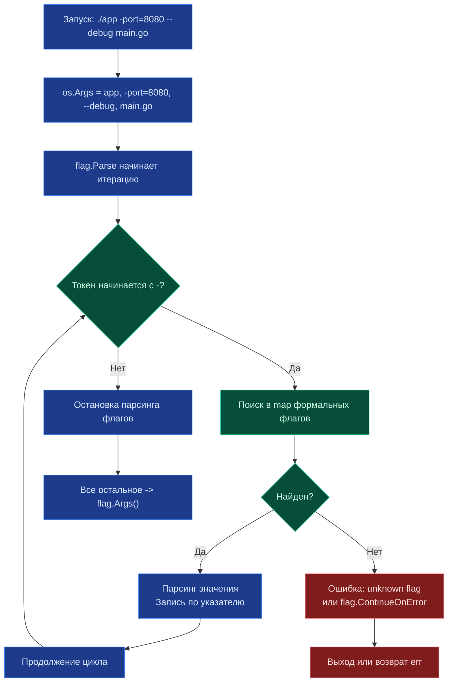

## Философия строгости и минимализма

> *"In the early days of Unix at Bell Labs, we learned that a command-line tool should do one thing well, accepting its options simply and cleanly without guessing what the user 'might' have meant. The Go `flag` package embodies that same unvarnished discipline."*  
> — Брайан Керниган

Пакет `flag` в Go кардинально отличается от тяжеловесных фреймворков разбора командной строки, принятых в других языках программирования. Если `argparse` в Python или `getopt` в C пытаются эвристически угадать намерения пользователя, поддерживают слияние коротких флагов (`-abc`), произвольный порядок параметров и громоздкие иерархии подкоманд, то стандартный `flag` следует строгому классическому контракту: **все флаги конфигурации обязаны идти строго перед позиционными аргументами**.

Это не досадное ограничение, а глубоко продуманный архитектурный выбор создателей Go. Подобная строгость устраняет двусмысленность при автоматизированном разборе в CI/CD, защищает от скрытых ошибок операторов и делает поведение утилит командной строки абсолютно предсказуемым. Для подавляющего большинства бэкенд-сервисов, фоновых демонов и консольных утилит администрирования возможностей стандартного пакета `flag` более чем достаточно.



> [!info] Под капотом
> В основе пакета лежит структура `FlagSet`. По умолчанию используется глобальный экземпляр `flag.CommandLine`. При вызове `flag.Parse()` рантайм не создает новых структур для каждого флага — он мутирует уже зарегистрированные переменные напрямую через переданные разработчиком указатели. Это делает пакет экстремально легким по памяти и практически мгновенным по времени выполнения.

---

## Under the hood: FlagSet и os.Args

Когда вы запускаете бинарник в Linux или macOS, ядро операционной системы при системном вызове `execve` раскладывает аргументы на стеке нового процесса в виде массива указателей на нуль-терминированные строки (`argv`). Рантайм Go упаковывает их в срез строк и экспонирует через `os.Args`.

```go
// Упрощенная структура flag.FlagSet
type FlagSet struct {
    Usage     func()
    name      string
    parsed    bool
    actual    map[string]*Flag  // Распарсенные флаги
    formal    map[string]*Flag  // Зарегистрированные шаблоны
    args      []string          // Оставшиеся позиционные аргументы
    funcs     []func() error    // Хуки валидации
    exitOnError bool           // Поведение при ошибке
}
```

Метод `flag.Parse()` выполняет строго один линейный проход по срезу `os.Args[1:]`. Он проверяет каждый токен:
1. Начинается ли строка с дефиса `-` или двойного дефиса `--`? → Ищет имя флага в хэш-таблице `formal`.
2. Флаг найден? → Парсит значение (для bool оно опционально, для остальных берется после знака `=` или из следующего токена) и записывает значение прямо по зарегистрированному указателю.
3. Токен не начинается с `-`? → Парсер считает это безусловным началом позиционных аргументов. **Все последующие токены (даже если они начинаются с дефиса) игнорируются как флаги** и попадают в `flag.Args()`.

---

## 1. Механика парсинга и Mechanical Sympathy

Парсер `flag` спроектирован с учетом аппаратных особенностей современных процессоров:
* **Отсутствие рефлексии для примитивов**: Конструкторы `flag.Int`, `flag.String`, `flag.Bool` принимают прямой указатель на память. Значение записывается процессором по адресу регистра без накладных вызовов `reflect.Value.Set()`.
* **Локальность данных и кэш-линии**: Карта `formal` инициализируется при старте программы. При вызове `flag.Parse()` процессор читает линейный массив строк `os.Args`, что идеально ложится на аппаратный prefetcher кэша L1/L2.
* **Нулевые аллокации в горячем пути**: Если вы используете встроенные примитивные типы, `flag.Parse()` не совершает аллокаций памяти в куче. Строки уже выделены ядром ОС в памяти аргументов процесса.

> [!warning] Ловушка / Gotcha
> **Флаги после позиционных аргументов игнорируются.**
> Команда `./server start --port 9090` **не установит** порт в 9090. Токен `start` считается первым позиционным аргументом. Всё, что идет после него (`--port 9090`), парсер посчитает аргументами команды и отправит в срез `flag.Args()`.
> **Правильно:** `./server --port 9090 start`
> Это самая частая причина багов и недоумения разработчиков, переходящих на Go с других экосистем.

---

## 2. Кастомные типы и интерфейс flag.Value

Для более сложных сценариев (списки значений, интервалы времени, пользовательские структуры) стандартная библиотека предоставляет интерфейс `flag.Value`. Он позволяет встроить валидацию и парсинг прямо в момент разбора аргументов:

```go
// StringList реализует flag.Value для множественных флагов
type StringList []string

func (l *StringList) String() string {
    return strings.Join(*l, ",")
}

func (l *StringList) Set(value string) error {
    *l = append(*l, value)
    return nil
}

// Регистрация кастомного типа
var hosts StringList
flag.Var(&hosts, "host", "Множественный хост (можно указывать несколько раз)")
```

Начиная с Go 1.21, стандартная библиотека получила удобную вспомогательную функцию `flag.Func`, которая избавляет от необходимости вручную объявлять структуры и методы интерфейса:

```go
var timeout time.Duration
flag.Func("timeout", "Длительность (напр. 5s, 1m30s)", func(s string) error {
    d, err := time.ParseDuration(s)
    if err != nil {
        return err
    }
    timeout = d
    return nil
})
```

> [!info] Под капотом
> Функция `flag.Func` под капотом создает компактную анонимную структуру, реализующую интерфейс `flag.Value`, и передает вашу замыкающую функцию в метод `Set()`. Это добавляет ровно одну крошечную аллокацию при регистрации флага, полностью устраняя лишний boilerplate-код. Для сервисов, стартующих один раз при запуске контейнера, накладные расходы равны нулю.

---

## 3. Подкоманды (Subcommands): паттерн без магии

Пакет `flag` принципиально не содержит встроенных «магических» макросов для многоуровневых CLI. Канонический подход в Go — использование изолированных наборов `FlagSet` для каждой подкоманды. Это дает полный контроль над валидацией, генерацией справки и кодами завершения.

```go
func main() {
    // Глобальные флаги приложения
    verbose := flag.Bool("v", false, "Включить подробный лог")
    flag.Parse()

    // Проверяем наличие подкоманды
    if len(flag.Args()) == 0 {
        fmt.Println("Usage: app <command> [args]")
        os.Exit(1)
    }

    cmd := flag.Arg(0)
    switch cmd {
    case "serve":
        serveCmd(flag.Args()[1:])
    case "migrate":
        migrateCmd(flag.Args()[1:])
    default:
        fmt.Printf("Unknown command: %s\n", cmd)
        os.Exit(1)
    }
}

func serveCmd(args []string) {
    fs := flag.NewFlagSet("serve", flag.ExitOnError)
    port := fs.Int("port", 8080, "Порт HTTP сервера")
    
    // Парсим только аргументы, относящиеся к этой команде
    fs.Parse(args)
    fmt.Printf("Starting server on :%d (verbose: %v)\n", *port, *flag.Lookup("v").Value.(*bool))
}
```

Этот подход гарантирует, что каждая подкоманда имеет свою изолированную область видимости флагов, не засоряет глобальный `CommandLine` и тестируется независимыми юнит-тестами.

---

## Сравнение с экосистемами

| Язык / Библиотека | Подход | Особенности в сравнении с Go |
|-------------------|--------|------------------------------|
| **C (`getopt`)** | POSIX-совместимый | Поддерживает `-abc`, `--long`, произвольный порядок. Сложнее в использовании, требует ручной обработки. |
| **Python (`argparse`)** | Декларативный, ООП | Автоматическая генерация справки, подкоманды, типы, валидация. Тяжелый, использует рефлексию, создает много объектов. |
| **Node.js (`minimist`)** | Минималистичный, гибкий | Возвращает объект с флагами. Игнорирует порядок. Может приводить к неожиданным результатам при смешивании стилей. |
| **Go (`flag`)** | Строгий, императивный | Флаги строго перед аргументами. Нулевая магия, минимум аллокаций, полная предсказуемость. |

> [!tip] Собеседование
> **Вопрос:** Почему `flag` по умолчанию вызывает `os.Exit(2)` при неизвестном флаге, а не возвращает ошибку?  
> **Ответ:** Для утилит командной строки немедленное завершение с кодом ошибки — стандартное поведение POSIX. Это позволяет скриптам-оберткам (`bash`, `Makefile`) корректно обрабатывать ошибки запуска. Однако вы можете изменить это поведение, создав `flag.NewFlagSet("name", flag.ContinueOnError)`, что позволит парсить аргументы без паники и обрабатывать ошибки в коде (полезно для библиотек и тестов).
>
> **Вопрос:** Как безопасно парсить флаги в конкурентном окружении?  
> **Ответ:** Регистрация флагов (`flag.String`, `flag.Int`) и вызов `flag.Parse()` **не потокобезопасны** для глобального `CommandLine`. Их нужно вызывать строго в одной горутине (обычно в `main`) до запуска других горутин. Чтение распарсенных значений после `Parse()` абсолютно безопасно, так как переменные больше никогда не мутируются.

---

## Итог

1.  **Строгий порядок:** Флаги идут строго до позиционных аргументов. После первого не-флага парсинг прекращается.
2.  **Минимум аллокаций:** Встроенные типы парсятся напрямую по указателям без привлечения тяжелой рефлексии.
3.  **Используйте `flag.Value` или `flag.Func`** для кастомных типов, валидации диапазонов и безопасного парсинга.
4.  **Подкоманды через `FlagSet`:** Создавайте изолированные наборы флагов для каждой команды без применения сторонних фреймворков.
5.  **Конфигурация vs CLI:** `flag` предназначен для параметров запуска. Для сложной динамической конфигурации используйте переменные окружения ENV или конфигурационные файлы.

Освоив передачу параметров процессу, мы переходим к фундаментальному аспекту надежности в продакшене: наблюдаемости (Observability). Как правильно логировать события, структурировать сообщения и связать сервис с мониторингом при помощи стандартного пакета `log/slog`? В следующей статье: [[16. log и log_slog. Логирование в стандартной библиотеке]].