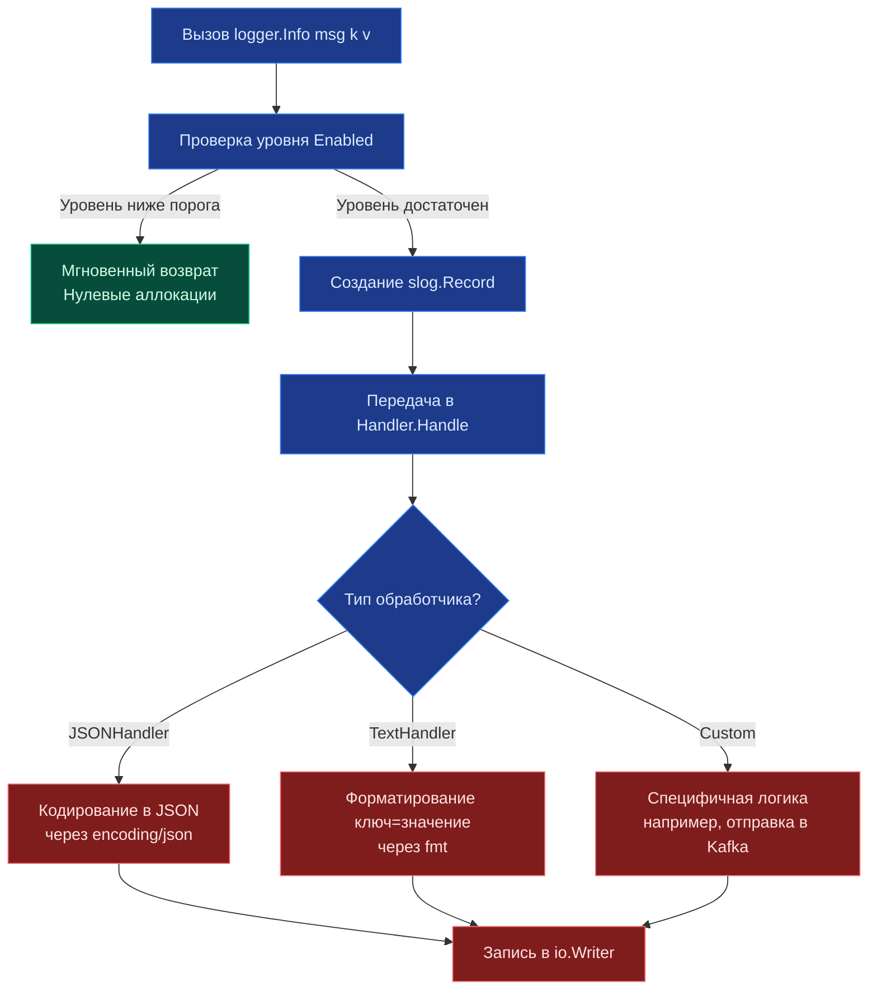

## Философия структурированного логирования

> *"The most effective debugging tool is still careful thought, coupled with judiciously placed print statements. But in a distributed system running across hundreds of machines, print statements must be structured, typed, and mechanically sympathetic to the I/O subsystem."*  
> — Брайан Керниган

Логирование в серверной разработке решает две принципиально противоположные инженерные задачи: быть понятным для человека при чтении в терминале и одновременно легко парсируемым для централизованных систем анализа телеметрии (ELK, Loki, ClickHouse, Datadog). 

Исторический пакет `log`, существовавший с версии Go 1.0, решал лишь первую задачу, выводя монолитную неструктурированную текстовую строку. В результате индустрия на годы раскололась на зоопарк сторонних библиотек (`zap`, `zerolog`, `logrus`). С выходом Go 1.21 стандартная библиотека получила пакет `log/slog` (Structured Logging), ставший официальным, высокоскоростным стандартом для production-систем.

`log/slog` спроектирован вокруг фундаментального принципа **разделения ответственности**: объект `Logger` управляет контекстом и атрибутами, а интерфейс `Handler` отвечает за форматирование, фильтрацию уровней и физический вывод. Это сохраняет клиентский API лаконичным, но под капотом предоставляет бескомпромиссный контроль над аллокациями и производительностью.



> [!info] Под капотом
> В отличие от `fmt`-ориентированного логирования, `log/slog` передает данные как типизированные пары ключ-значение (`slog.Attr`). Это устраняет необходимость парсить строки формата на лету, позволяет обработчикам применять zero-copy оптимизации и делает логи предсказуемыми для индексации в распределенных системах.

---

## 1. Эволюция: от `log` к `log/slog`

Старый пакет `log` прост и надежен для студенческих лабораторных, но фундаментально непригоден для современных высоконагруженных систем:
* **Отсутствие уровней**: только функции `Print`, `Panic`, `Fatal`. Фильтрация по уровням важности `INFO/DEBUG/ERROR` невозможна без самодельных надстроек.
* **Глобальный мьютекс**: каждый вызов `log.Print` блокируется одним общим `sync.Mutex`. При нагрузке в 10 000+ RPS это создает катастрофический contention на ядре CPU и выстраивает горутины в очередь.
* **Строковое форматирование**: функция `log.Printf` вызывает `fmt` внутри себя, генерируя тяжелые аллокации в куче на парсинг каждого формата.

`log/slog` решает эти проблемы на архитектурном уровне:
* Встроенные иерархические уровни (`slog.LevelDebug`, `Info`, `Warn`, `Error`).
* Строго типизированные атрибуты без аллокаций (`slog.Int`, `slog.String`, `slog.Time`).
* Конфигурируемые сменные обработчики (`JSONHandler`, `TextHandler`, кастомные обработчики для OpenTelemetry).

---

## 2. Архитектура `log/slog`: Разделение ответственности

Ключевая абстракция пакета — интерфейс `slog.Handler`. Любой объект, удовлетворяющий этому контракту, может быть подключен к логгеру.

Структура логгера иммутабельна в плане базовых настроек. Методы `WithAttrs` и `WithGroup` возвращают **новый экземпляр** `*slog.Logger`, что делает его абсолютно безопасным для конкурентного использования в тысячах параллельных горутин без взаимных блокировок.

---

## 3. Under the hood: Внутреннее устройство и конкуренция

### Атрибуты и Record
Каждый атрибут — это легковесная структура `slog.Attr`:
```go
type Attr struct {
    Key   string
    Value Value
}
```
Тип `Value` — это изощренное объединение (union-like структура), хранящее скалярные примитивы без указателей. Это гарантирует отсутствие аллокаций в куче для базовых типов (`int`, `string`, `bool`, `time.Time`).

При вызове `logger.Info("request", slog.Int("status", 200))`:
1. На стеке текущей горутины создается структура `slog.Record`.
2. Она заполняется наносекундной временной меткой, уровнем, текстом сообщения и массивом атрибутов.
3. Передается по ссылке в метод `handler.Handle()`.
4. Обработчик сериализует `Record` и отправляет байты в целевой `io.Writer`.

### Потокобезопасность обработчиков
Методы интерфейса `Handler` (`Enabled`, `Handle`, `WithAttrs`, `WithGroup`) должны быть безопасны для конкурентного вызова. Стандартные `JSONHandler` и `TextHandler` внутри используют `sync.Mutex` только на время сериализации и записи в `io.Writer`. Это минимизирует время блокировки, но при экстремальных нагрузках (>50k логов/сек) всё равно может стать узким местом.

> [!warning] Ловушка / Gotcha
> **Медленный `io.Writer` блокирует всё приложение.**
> Если вы передадите в `slog.NewJSONHandler(os.Stdout, opts)` обычный `os.Stdout`, каждый вызов `Handle` будет блокировать мьютекс до завершения системного вызова `write`. Для высоконагруженных систем **обязательно** оборачивайте вывод в `bufio.NewWriter()` или используйте асинхронные каналы-буферы, чтобы развязать логику бизнес-потока и медленный I/O.

---

## 4. Mechanical Sympathy: Аллокации и производительность

### Оценка уровней (Early Filtering)
Метод `handler.Enabled()` вызывается **до** создания тяжелых структур атрибутов. Если текущий уровень логгера установлен в `LevelInfo`, а мы вызываем `Debug`, метод мгновенно возвращает `false`, не совершая ни единой аллокации:

```go
// ✅ Паттерн для дорогих вычислений в логах
if logger.Handler().Enabled(ctx, slog.LevelDebug) {
    logger.Debug("complex data", slog.Any("payload", computeHeavyData()))
}
```

### `slog.Valuer` для ленивых вычислений
Интерфейс `slog.Valuer` позволяет отложить тяжелое вычисление значения ровно до того момента, когда лог гарантированно будет записан в поток. Если лог отфильтрован по уровню, вычисление никогда не произойдет:

```go
type memoryStat struct{}

func (memoryStat) LogValue() slog.Value {
    var m runtime.MemStats
    runtime.ReadMemStats(&m)
    return slog.Int64("alloc_bytes", int64(m.Alloc))
}

logger.Info("memory check", slog.Any("mem", memoryStat{}))
// ReadMemStats вызовется только если уровень DEBUG включен
```

### Сравнение затрат аллокаций
| Операция | Аллокации в куче | Примечание |
|----------|------------------|------------|
| `slog.Int("k", 42)` | 0 | Примитив хранится inline |
| `slog.String("k", "v")` | 0 (если строка литерал) | Ссылка на существующую память |
| `slog.Any("k", struct)` | 1+ | Упаковка в `interface{}` |
| `JSONHandler.Handle` | 1-2 (буфер сериализации) | Зависит от `encoding/json` |

> [!tip] Собеседование
> **Вопрос:** Почему `slog` быстрее `logrus` или старого `log` + `fmt`?  
> **Ответ:**
> 1. `slog` проверяет уровень до формирования сообщения. `logrus` часто форматирует строку до проверки фильтра.
> 2. `slog.Attr` передает примитивы по значению, избегая boxing в `interface{}`.
> 3. `JSONHandler` использует оптимизированный путь `encoding/json` с предварительным буфером, в то время как `fmt.Sprintf` парсит строку формата и выделяет память динамически.
> 4. Отсутствие рефлексии в горячем пути для стандартных типов.

---

## 5. Идиомы и паттерны для Production

### Конфигурация глобального логгера
Не используйте `slog.Default()` напрямую в бизнес-логике. Лучше передавать `*slog.Logger` явно через зависимости или использовать пакетную переменную.

```go
func setupLogger(level slog.Level, output io.Writer) *slog.Logger {
    opts := &slog.HandlerOptions{Level: level}
    handler := slog.NewJSONHandler(output, opts)
    return slog.New(handler)
}

func main() {
    // Оборачиваем stdout в буфер для снижения syscall contention
    buf := bufio.NewWriterSize(os.Stdout, 32*1024)
    logger := setupLogger(slog.LevelInfo, buf)
    
    // Фоновый flush буфера раз в секунду или при выходе
    defer buf.Flush()
    
    // Передаем logger в зависимости явно
    srv := &Server{Logger: logger}
    srv.Start()
}
```

### Группировка контекста
Метод `WithGroup` создает вложенную иерархию в формате JSON, не требуя префиксов в ключах:

```go
ctxLogger := logger.WithGroup("http_request")
ctxLogger.Info("handled", 
    slog.String("method", "GET"),
    slog.Int("status", 200),
)
// Вывод: {"time":"...","level":"INFO","msg":"handled","http_request":{"method":"GET","status":200}}
```

---

## 6. Ловушки и вопросы с собеседований

| Сценарий | Проблема | Решение |
|----------|----------|---------|
| `slog.SetDefault` в runtime | Изменение глобального состояния в конкурентной среде | Настраивайте логгер один раз в `init()` или `main()`. Не меняйте его на лету. |
| `slog.Any` с большими структурами | Рефлексия `encoding/json` съедает CPU | Реализуйте `MarshalJSON` или используйте `slog.String` с пред-сериализацией. |
| Отсутствие `context.Context` в `slog` API | Нет встроенного `slog.FromContext` | Передавайте `*slog.Logger` явно или храните её в `context` через кастомный key. |
| `JSONHandler` vs `TextHandler` в проде | `TextHandler` медленнее и не парсится машинами | Всегда используйте `JSONHandler` в production. `TextHandler` только для локальной разработки. |

> [!info] Под капотом
> `encoding/json` внутри `JSONHandler` не использует кэш рефлективных структур для анонимных `slog.Any` значений. Если вы логируете сложные кастомные структуры, реализуйте `MarshalJSON()` на них или преобразуйте в примитивы через `slog.Valuer`. Это ускорит сериализацию в разы.

---

## 7. Сравнение с экосистемами

| Аспект | Go `log/slog` | Python `logging` | Java `SLF4J/Logback` | Node.js `pino` |
|--------|---------------|------------------|----------------------|----------------|
| **Архитектура** | Handler + Logger | Handler + Filter + Formatter | Logger + Appender + Layout | Serializer + Transport |
| **Производительность** | Высокая (минимум аллокаций) | Низкая (глобальные локи, heavy format) | Средняя/Высокая (асинхронные аппендеры) | Очень высокая (sync/async mode, SIMD JSON) |
| **Конкурентность** | Мьютекс на `io.Writer` | Мьютекс на `emit` | Lock-free асинхронные очереди | Lock-free, batch flush |
| **Структурированность** | Нативная (Attr/Value) | Через `extra=dict` | Через MDC/MDCCopy | Нативная (ключ-значение) |
| **Горячий путь** | `Enabled` check до alloc | Format до filter | Async appender buffers | Sync: fast, Async: fastest |

---

## Итог

1. `log/slog` — официальный стандарт Go 1.21+. Забудьте про устаревший пакет `log` и внешние тяжелые зависимости.
2. Разделяйте `Logger` и `Handler`. Это гарантирует архитектурную чистоту и легкое тестирование.
3. Используйте `slog.Int/String/Bool` вместо `Any` для примитивов, чтобы избежать аллокаций в куче и накладных расходов рефлексии.
4. Всегда оборачивайте целевой `io.Writer` в `bufio` для снижения конкуренции за системные вызовы ядра.
5. Проверяйте уровень через `handler.Enabled()` перед запуском тяжелых вычислений для логов.
6. В production-среде используйте исключительно `JSONHandler`. `TextHandler` оставьте для локальной консольной разработки.

Понимание того, как логировать события без ущерба для производительности, неразрывно связано с управлением временем жизни этих операций. Как корректно отменять долгие запросы, ограничивать таймауты и пробрасывать сигналы отмены через стек вызовов? В следующей статье мы разберем один из важнейших пакетов Go: [[17. context. Управление временем жизни операций]].