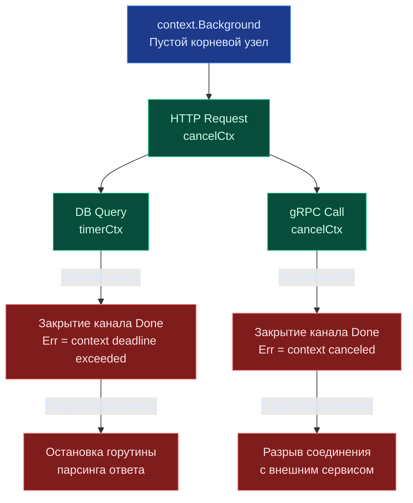

## Философия управления временем жизни горутин

> *"Creating a goroutine is so cheap that programmers spawn them without a second thought. But an orphaned goroutine is a silent vampire: it holds memory, keeps database connections open, and consumes CPU cycles long after the user has closed the browser. The `context` package is our leash on concurrency."*  
> — Брайан Керниган

В среде Go горутины экстремально дешевы: они требуют всего 2 КБ стековой памяти при старте, и их создание не ограничено тяжелыми системными лимитами ядра ОС. В высоконагруженном бэкенд-сервисе одновременно могут выполняться сотни тысяч параллельных горутин. Однако если не управлять их жизненным циклом с абсолютной инженерной строгостью, распределенная система моментально столкнется с утечками памяти (goroutine leaks), зависшими TCP-сокетами и неконтролируемым истощением пулов соединений.

Пакет `context` решает эту фундаментальную проблему, предоставляя стандартный, универсальный механизм для:
* Отмены длительных операций по запросу удаленного клиента или при наступлении тайм-аута.
* Проброса метаданных запроса (Request ID, токен авторизации, Trace ID в OpenTelemetry) через все слои вызовов.
* Синхронизации завершения работы дочерних горутин при штатной остановке сервиса (Graceful Shutdown).

`context.Context` — это не просто вспомогательная структура данных. Это священный архитектурный контракт Go, связывающий прикладную бизнес-логику, сетевой слой, драйверы баз данных и внешние микросервисы в единую, прозрачно управляемую систему ресурсов.



> [!info] Под капотом
> Интерфейс `context.Context` минималистичен и не требует реализации на уровне пользователя. Он предоставляет всего четыре метода:
> ```go
> type Context interface {
>     Deadline() (deadline time.Time, ok bool)
>     Done() <-chan struct{}
>     Err() error
>     Value(key any) any
> }
> ```
> Все реализации (`cancelCtx`, `timerCtx`, `valueCtx`) находятся внутри пакета `context`. Разработчик работает только с интерфейсом, что гарантирует совместимость со всеми стандартными библиотеками (`net/http`, `database/sql`, `os/exec`).

---

## Under the hood: Дерево контекстов и внутреннее устройство

Когда вы вызываете `context.WithCancel(parent)` или `context.WithTimeout(parent, d)`, создается новое звено в связанном дереве. Каждый контекст знает о своих потомках через slice или map, в зависимости от количества дочерних элементов.

Внутренняя структура `cancelCtx` выглядит примерно так:
```go
type cancelCtx struct {
    Context
    mu       sync.Mutex            // Защищает children и err
    done     atomic.Pointer[chan struct{}] // Канал закрытия (ленивая инициализация)
    children map[canceler]struct{} // Дочерние контексты
    err      error                 // Причина отмены
}
```

При вызове функции `cancel()` происходит каскадный рекурсивный обход дерева сверху вниз:
1. Устанавливается `err` и атомарно закрывается канал `done`.
2. Блокируется мьютекс `mu`.
3. Для каждого зарегистрированного потомка в `children` вызывается его персональный метод `cancel()`.
4. Карта `children` очищается для освобождения памяти и разрыва циклических ссылок.
5. Мьютекс разблокируется.

> [!warning] Ловушка / Gotcha
> **`context` не является потокобезопасным для хранения мутабельных данных.**
> Метод `Value()` предназначен только для передачи иммутабельных, request-scoped данных (например, `requestID`). Если вы попытаетесь хранить в контексте изменяемые объекты (кэши, сессии, мьютексы), вы получите гонки данных (data race), так как один контекст может быть передан в несколько горутин одновременно.

---

## Механика отмены и Mechanical Sympathy

Отмена в Go реализована через **закрытие канала** (`close(ch)`). Это фундаментальная, аппаратно оптимизированная операция: когда канал закрывается, абсолютно все горутины, ожидающие чтения из него в селекторах, мгновенно просыпаются без поллинга.

### 1. Zero-аллокация при чтении `Done()`
Метод `Done()` возвращает указатель на канал типа `<-chan struct{}`. Ожидание через конструкцию `select`:

```go
select {
case <-ctx.Done():
    return ctx.Err() // Мгновенный выход при отмене
case result := <-dataCh:
    process(result)
}
```

Этот паттерн не генерирует ни единой аллокации в куче. Центральный процессор проверяет внутреннее состояние канала через быстрые атомарные операции. Если канал не закрыт, горутина переводится рантаймом Go в состояние ожидания `Gwaiting`, освобождая системный тред операционной системы (M) для выполнения других полезных горутин.

### 2. Цена дерева и GC
Каждый вызов `context.WithValue` добавляет новый слой в цепочку. При глубокой вложенности (например, 50+ промежуточных middleware) поиск значения через метод `Value()` превращается в линейный проход по связному списку `valueCtx`. 

**Правило Senior Engineer:** Используйте `Value()` только для критичных метаданных запроса. Если вам нужно передать 10+ параметров, создайте единую структуру `RequestData` и передайте её через один ключ. Это сокращает время поиска с $O(N)$ до $O(1)$.

### 3. Таймеры и `timerCtx`
Функция `context.WithTimeout` создает структуру `timerCtx`, которая внутри использует системный `time.Timer`. Когда дедлайн наступает, таймер рантайма вызывает функцию `cancel()`. 

**Важно:** Всегда вызывайте `cancel()` через `defer cancel()`, даже если таймаут сработал сам. Это немедленно останавливает внутренний таймер и удаляет контекст из структур рантайма, предотвращая утечки памяти.

В Go 1.21 появились две мощные функции:
* `context.AfterFunc(ctx, f)`: регистрирует функцию `f`, которая выполнится в отдельной горутине при отмене контекста.
* `context.WithoutCancel(parent)`: возвращает копию контекста с теми же значениями `Value()`, но отвязанную от дедлайнов и отмены родителя (незаменимо для асинхронного аудита и логирования после ответа клиенту).

---

## Идиоматичное использование в production

### 1. Контекст — первый параметр
По соглашению языка Go, контекст `ctx` всегда передается строго первым аргументом функции:
```go
func GetUser(ctx context.Context, id int64) (*User, error)
```

### 2. Никогда не храните контекст в структурах
```go
// ❌ Антипаттерн: контекст живет дольше функции, вызывающей его
type Service struct {
    ctx context.Context // Ошибка: невозможно контролировать время жизни
    db  *sql.DB
}

// ✅ Идиоматично: контекст передается явно в каждый вызов метода
func (s *Service) GetUser(ctx context.Context, id int64) (*User, error)
```

### 3. Интеграция с HTTP и базами данных
Пакет `net/http` автоматически создает `context` из входящего сетевого соединения `http.Request`. При разрыве TCP-соединения клиентом, контекст немедленно отменяется.

```go
func handler(w http.ResponseWriter, r *http.Request) {
    ctx := r.Context() // Берем контекст запроса
    // Если клиент разорвал соединение, ctx.Done() закроется
    
    result, err := db.QueryContext(ctx, "SELECT ...")
    if err != nil {
        if errors.Is(err, context.Canceled) {
            // Клиент ушел, не логируем как ошибку сервера
            return
        }
        http.Error(w, "DB error", 500)
        return
    }
}
```

> [!tip] Собеседование
> **Вопрос:** В чем разница между `context.Background()` и `context.TODO()`?  
> **Ответ:** Технически они абсолютно идентичны (оба возвращают указатель на один и тот же пустой тип `emptyCtx`). Разница сугубо семантическая: `Background()` используется в `main()`, тестах или на верхнем уровне, где нет родительского контекста. `TODO()` — маркер рефакторинга: «здесь должен быть контекст, но я пока не знаю, откуда его взять». В production-коде `TODO()` оставаться не должно.
>
> **Вопрос:** Почему нельзя передавать `nil` вместо `context.Context`?  
> **Ответ:** Большинство функций стандартной библиотеки (`os/exec`, `http`, `sql`) безусловно вызывают `ctx.Value()` или проверяют `ctx.Done()`. Если `ctx == nil`, это вызовет фатальную панику `runtime: invalid memory address or nil pointer dereference`. Всегда передавайте валидный контекст. Если контекст пока не сформирован, используйте `context.Background()`.

---

## Сравнение с экосистемами других языков

| Язык / Фреймворк | Механизм | Особенности в сравнении с Go |
|------------------|----------|------------------------------|
| **Java** | `CancellationToken`, `CompletableFuture`, `ThreadLocal` | Требует явной подписки на отмену или использования `ExecutorService`. ThreadLocal не пробрасывается автоматически в пулы потоков. |
| **C++** | `std::stop_token`, `std::jthread` | Встроен в STL с C++20. Работает на уровне ОС-тредов. Более сложная система типов, менее интегрирована в экосистему. |
| **Python** | `asyncio.Event`, `concurrent.futures` | Отмена асинхронных задач требует ручной проверки `cancelled()`. Синхронный код игнорирует отмену. GIL мешает параллельной отмене. |
| **Go** | `context.Context` | Единый стандарт для sync и async кода. Автоматический проброс через stdlib. Интеграция с планировщиком горутин. |

---

## 5 Ловушек контекста, которые ломают production

| Ошибка | Последствие | Правильное решение |
|--------|-------------|---------------------|
| Забытый `defer cancel()` | Утечка памяти и горутин, таймеры не очищаются | Всегда `ctx, cancel := context.WithTimeout(...); defer cancel()` |
| Передача `context.Background()` в HTTP handler | Игнорирование отмены клиентом, таймауты не работают | Используйте `r.Context()` |
| `context.WithValue` для бизнес-данных | Усложнение отладки, нарушение инкапсуляции, race conditions | Передавайте данные явно через аргументы функций или структуры |
| Игнорирование `ctx.Err()` после блокирующей операции | Возврат успешного результата при уже отмененном запросе | Проверяйте `if ctx.Err() != nil { return nil, ctx.Err() }` |
| Создание контекста в цикле без отмены | Экспоненциальный рост числа дочерних контекстов | Выносите `WithTimeout` за цикл или используйте один общий `WithCancel` |

---

## Итог

1. `context.Context` — стандартный контракт для управления жизненным циклом операций в Go.
2. Под капотом это дерево структур (`cancelCtx`, `timerCtx`), связанное рекурсивной отменой и закрытием каналов.
3. Закрытие канала `Done()` — дешевая операция, мгновенно будящая все ожидающие горутины.
4. Никогда не храните контекст в структурах, не используйте `Value()` для мутабельных данных, всегда вызывайте `cancel()`.
5. Интеграция с `net/http` и `database/sql` автоматическая, но требует явной проверки `ctx.Err()` после блокирующих вызовов.

Понимание управления временем жизни операций неразрывно связано с работой с временными интервалами, таймерами и календарными вычислениями. В следующей статье мы разберем, как Go обрабатывает время, часовые пояса и почему `time.Time` не является простым числом: [[18. time. Даты, время, Duration, Timer, Ticker]].