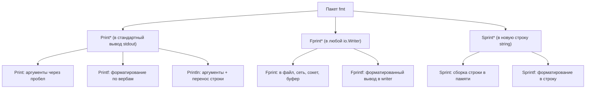
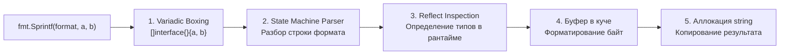

# 2. fmt. Форматированный вывод и форматирование строк

> *«Самым эффективным инструментом отладки по-прежнему остаётся ясное мышление вкупе с метко расставленными операторами печати».*    
> — Брайан Керниган

## Введение: больше, чем просто «печать»

Пакет `fmt` — это первый инструмент, с которым знакомится каждый новичок в Go через сакраментальное `fmt.Println("Hello, World!")`. Однако за внешней обманчивой простотой скрывается мощный, исключительно гибкий и при этом **вычислительно дорогой** механизм форматирования данных. При неумелом использовании в критических узлах бэкенда он способен незаметно стать главным тормозом высоконагруженного сервиса.

Пакет `fmt` реализует функционал, исторически восходящий к функции `printf` из языка C, созданной в стенах Bell Labs Кеном Томпсоном и Деннисом Ритчи. Но в Go эта концепция претерпела фундаментальную трансформацию: вместо небезопасных указателей `void*` и риска переполнения буфера Go опирается на строгую статическую типизацию и интерфейсы. 

Понимание того, как устроен пакет `fmt` «под капотом» и какую цену за него платит процессор, критически важно для написания быстрого и надежного кода уровня Senior Engineer.

> [!info] Под капотом
> Функции семейства `fmt` активно используют **динамическую рефлексию** (пакет `reflect`) и **вариативные аргументы** (`...interface{}` или `...any`). Это означает неминуемые аллокации в куче (heap allocations) при каждом вызове: скалярные аргументы «упаковываются» в срез пустых интерфейсов, порождая упаковку значений (boxing). В горячих путях (hot paths) это генерирует колоссальное давление на сборщик мусора (Garbage Collector).

---

## Словарь форматирования (Verbs): полный справочник

Go предоставляет богатый и строгий набор спецификаторов формата — «глаголов» (verbs). В отличие от C, где ошибка в типе верба приводила к аварийному завершению программы или повреждению стека, в Go вербы защищены строгой проверкой типов.

### 1. Базовые вербы для любого типа

| Верб | Описание | Пример вывода (для `v := 42`) |
|---|---|---|
| `%v` | Значение в формате по умолчанию | `42` |
| `%+v` | Значение с именами полей (для структур) | `{ID:42 Name:"server"}` |
| `%#v` | Значение в синтаксисе Go (для глубокой отладки) | `main.Config{ID:42, Name:"server"}` |
| `%T` | Тип значения в синтаксисе Go | `main.Config` |
| `%%` | Литеральный знак процента | `%` |

### 2. Вербы для чисел и строк

| Верб | Тип | Описание | Пример |
|---|---|---|---|
| `%d` | int | Десятичное целое | `42` |
| `%+d` | int | Со знаком (всегда + или -) | `+42` |
| `%x` | int/string | Шестнадцатеричный (a-f) | `2a` / `48656c6c6f` |
| `%X` | int/string | Шестнадцатеричный (A-F) | `2A` |
| `%b` | int | Двоичное представление | `101010` |
| `%f` | float | Десятичная дробь (по умолчанию 6 знаков) | `3.141593` |
| `%.2f` | float | С точностью до 2 знаков после запятой | `3.14` |
| `%e` | float | Научная нотация (экспонента) | `3.141593e+00` |
| `%s` | string/[]byte | Неформатированная строка или байты UTF-8 | `Hello` |
| `%q` | string | Строка в двойных кавычках с экранированием | `"Hello"` |
| `%x` | string | Hex-дамп строки (без пробелов) | `48656c6c6f` |

> [!warning] Ловушка / Gotcha: Слайсы и мапы в логах
> **Форматирование слайсов и мап через `%v`**.  
> При использовании `%v` для слайса `[]int{1, 2, 3}` вы получите строку `[1 2 3]`. Это удобно для быстрого отладочного чтения глазами, но **категорически не подходит** для сериализации данных (это не валидный JSON). Для передачи данных во внешние системы всегда используйте `encoding/json`.
>
> Также помните: вывод `%v` для хэш-таблицы (`map`) не гарантирует порядок ключей, так как итерация по мапе рандомизирована рантаймом. Начиная с последних версий Go, `%#v` сортирует ключи мапы при выводе для удобства отладки, но полагаться на этот порядок в прикладной бизнес-логике нельзя.

---

## Функциональные семейства: Print, Fprint, Sprint

Пакет `fmt` элегантно разделен на три функциональных семейства по префиксам (определяющим **куда** направляется поток байт) и суффиксам (определяющим **правила форматирования**).



### Ключевые различия в поведении

1. **`Print` vs `Println`**: `Println` всегда добавляет пробелы между аргументами и обязательный символ переноса строки `\n` в конце. А вот поведение функции `Print` содержит историческую тонкость: она добавляет пробел между аргументами **только если ни один из соседних аргументов не является строкой**. Это часто приводит к неожиданным «слипшимся» сообщениям в логах.

    ```go
    // Неочевидное поведение:
    fmt.Print("ID:", 123, "User:", "admin") 
    // Вывод: ID:123User:admin (нет пробелов, т.к. аргументы граничат со строками)
    
    fmt.Print("Error: ", err, " at ", time.Now())
    // Вывод: Error: <err_val> at <time_val> (пробелы есть, т.к. соседние аргументы не строки)
    ```

2. **`Fprint` для `stderr`**: Никогда не пишите ошибки приложения в `os.Stdout`. Используйте специализированный поток ошибок: `fmt.Fprintln(os.Stderr, "critical error")`. Системы контейнеризации и сбора логов (Kubernetes, Docker, systemd) разделяют потоки `stdout` и `stderr`, маркируя сообщения разными уровнями критичности.

---

## Under the hood: Цена абстракции и аллокации

Почему вызов `fmt.Sprintf` считается тяжелой операцией в высоконагруженном бэкенде? Давайте проследим путь данных от исходного кода до физической памяти.

Когда вы пишете:
```go
fmt.Sprintf("User %s has ID %d", name, id)
```

В рантайме разворачивается многоступенчатый процесс:



1. **Variadic packing (Упаковка аргументов):** Параметры `name` и `id` упаковываются в срез интерфейсов `[]interface{}{name, id}`. Если переменная `id` типа `int` лежала на стеке, она обязана быть упакована в кучу (Heap Boxing), потому что интерфейс хранит указатель на данные.
2. **Reflection parsing (Рефлексивный разбор):** Функция парсит строку формата `"User %s..."`. Для каждого верба рантайм использует пакет `reflect`, чтобы распаковать интерфейс, проверить тип лежащего внутри значения и выбрать соответствующую ветку форматирования.
3. **Buffer allocation:** Внутри `fmt` выделяется временный `bytes.Buffer` (или структура `pp` из пула `sync.Pool`), который аккумулирует байты.
4. **String conversion:** Содержимое буфера конвертируется в неизменяемый тип `string`, что влечет за собой выделение памяти в куче и побайтовое копирование.

> [!info] Под капотом
> Внутренний парсер форматов `fmt` — это оптимизированный конечный автомат (state machine), написанный на чистом Go без применения тяжелых регулярных выражений. Однако обход динамической рефлексии и неизбежная аллокация среза интерфейсов на каждый вызов делают `fmt.Sprintf` нежелательным гостем в микросекундных циклах.

### Визуализация аллокаций: Бенчмарки

Сравним стандартный `fmt.Sprintf` с ручной сборкой строки через `strings.Builder` и пакет `strconv`:

```go
func BenchmarkFmtSprintf(b *testing.B) {
    name := "user"
    id := 12345
    for i := 0; i < b.N; i++ {
        // ~2 аллокации на вызов: срез интерфейсов + результирующая строка
        _ = fmt.Sprintf("User %s has ID %d", name, id)
    }
}

func BenchmarkStringBuilder(b *testing.B) {
    name := "user"
    id := 12345
    for i := 0; i < b.N; i++ {
        var sb strings.Builder
        sb.Grow(32) // Предсказуемый размер (Zero reallocations)
        sb.WriteString("User ")
        sb.WriteString(name)
        sb.WriteString(" has ID ")
        // strconv.AppendInt избегает аллокаций, работая с []byte
        sb.Write(strconv.AppendInt(nil, int64(id), 10))
        _ = sb.String() // 1 аллокация на результат
    }
}
```

> [!tip] Собеседование
> **Вопрос:** Почему `fmt.Sprintf` работает значительно медленнее, чем конкатенация строк через `+` или использование `strings.Builder`?  
> **Ответ:** 
> 1. `fmt.Sprintf` использует динамическую рефлексию для обработки вариативных аргументов `...interface{}`, что требует проверки типов в рантайме.
> 2. Упаковка аргументов в срез интерфейсов порождает обязательные аллокации в куче (Escape Analysis).
> 3. Парсинг строки формата (`%s`, `%d`) требует вычислительной работы конечного автомата на каждый вызов.  
> В то время как `+` и `strings.Builder` работают напрямую со слайсами байт без упаковки в интерфейсы, а компилятор Go может оптимизировать конкатенацию на этапе сборки.

---

## Mechanical Sympathy: Оптимизация вывода

Для опытного инженера вопрос звучит не «плох ли `fmt`?», а «где его применение уместно, а где преступно по отношению к ресурсам CPU?».

### Таблица принятия решений

| Сценарий | Рекомендация | Обоснование |
|---|---|---|
| Логирование ошибок / стартап | `fmt.Errorf` / `fmt.Println` | Читаемость и надежность важнее наносекунд. Эти пути холодные (Cold Paths). |
| Обработчик HTTP (нагрузка > 1000 RPS) | Избегать `fmt.Sprintf` в теле ответа | Используйте `strconv` для чисел и `strings.Builder` для сборки тела. |
| Метрики / Прометеус | `strings.Builder` + `WriteString` | Формирование метрик происходит постоянно; аллокации `fmt` перегрузят GC. |
| JSON ответы | `encoding/json` | Никогда не собирайте JSON вручную через `fmt`. Используйте стандартный сериализатор или библиотеки `sonic` / `jsoniter` для экстремальных нагрузок. |
| Отладка (Debug) | `%+v` или `%#v` | Максимальная информативность структуры в памяти для разработчика. |

### Пример: Оптимизация горячего пути

Допустим, мы формируем составной ключ кэша в цикле обработки сетевых запросов:

**❌ Медленно (fmt):**
```go
func makeCacheKey(userID int, action string) string {
    // 2+ аллокации на каждый вызов, рефлексия, разбор строки
    return fmt.Sprintf("cache:user:%d:action:%s", userID, action)
}
```

**✅ Быстро (strconv + strings.Builder):**
```go
func makeCacheKey(userID int, action string) string {
    // Оценим длину: "cache:user:" (11) + digits (~10) + ":action:" (8) + action
    // Grow помогает избежать реаллокаций буфера при росте
    var sb strings.Builder
    sb.Grow(30 + len(action)) 
    
    sb.WriteString("cache:user:")
    // AppendInt пишет сразу в []byte буфера, без лишних аллокаций
    sb.Write(strconv.AppendInt(nil, int64(userID), 10))
    sb.WriteString(":action:")
    sb.WriteString(action)
    return sb.String() // Единственная аллокация финальной строки
}
```

---

## Интернационализация и `fmt`

Важно помнить, что `fmt` **не предназначен** для полноценной локализации (l10n). Он не поддерживает перестановку аргументов в строках формата в зависимости от грамматики языка (как позиционные параметры `{0}` и `{1}` в C# или `MessageFormat` в Java).

Если ваше приложение должно поддерживать мультиязычность, используйте официальный пакет `golang.org/x/text/message`, который расширяет возможности `fmt`, умеет работать с каталогами переводов и корректно форматирует числа и валюты с учетом локали пользователя.

> [!warning] Ловушка / Gotcha: Утечка чувствительных данных
> **Утечка конфиденциальных данных через `%v`**.  
> При выводе структуры через `%v` или `%+v` рантайм напечатает значения **всех** полей структуры, включая приватные пароли, секретные ключи и токены авторизации.
> ```go
> type User struct {
>     Name     string
>     Password string // Секрет!
> }
> // Вывод fmt.Println(user): {Name:"admin" Password:"secret123"}
> ```
> **Решение:** Всегда реализуйте интерфейс `fmt.Stringer` для структур, содержащих конфиденциальную информацию:
> ```go
> func (u User) String() string {
>     return fmt.Sprintf("User{Name:%s, Password:***}", u.Name)
> }
> ```

---

## Сравнение с другими языками

| Язык | Конструкция | Особенности в сравнении с Go |
|---|---|---|
| **C / C++** | `printf` | В Go линтер `go vet` строго проверит соответствие верба типу данных на этапе компиляции. В C ошибка в вербе приводит к UB или чтению чужой памяти со стека. |
| **Python** | `f"{var}"` / `%` | В Go нет синтаксической интерполяции строк (`f-strings`). `fmt` работает целиком в рантайме. Интерполяция сознательно отклоняется авторами языка для сохранения простоты компилятора. |
| **C#** | `$"{var}"` | В Go акцент сделан на явности контрактов и контроле аллокаций, а не на синтаксическом декоре. |

> [!tip] Собеседование
> **Вопрос:** Как утилита `go vet` помогает при работе с пакетом `fmt`?  
> **Ответ:** `go vet` включает специализированный анализатор вызовов `fmt.Printf`, `fmt.Sprintf` и `fmt.Errorf`. Он сопоставляет строку формата с типами переданных аргументов. Если программист передал строку под верб `%d` или перепутал число параметров, `go vet` немедленно выдаст ошибку `printf: fmt.Sprintf format %d has arg of type string`, спасая от сбоев в production.

---

## Итог

1. **`fmt` — мощный, но дорогой инструмент.** Используйте его для логирования, обработки ошибок, форматирования сообщений и холодных путей исполнения.
2. **Избегайте `fmt` в горячих циклах.** Для сборки строк под высокой нагрузкой используйте комбинацию `strings.Builder` и `strconv.Append*`.
3. **Знайте свои вербы.** Вербы `%+v` и `%#v` незаменимы при отладке структур, а `%q` гарантирует безопасный вывод экранированных строк в логах.
4. **Реализуйте `fmt.Stringer`.** Это идиоматичный способ защитить чувствительные данные (пароли, токены) от случайного попадания в логи при выводе структур.

Освоив тонкости форматирования текста, мы переходим к фундаментальному аспекту обработки нештатных ситуаций в Go. В следующей статье мы разберем, как правильно создавать, оборачивать и сравнивать ошибки с помощью пакета `errors`: [[3. errors. Создание, оборачивание и сравнение ошибок]].