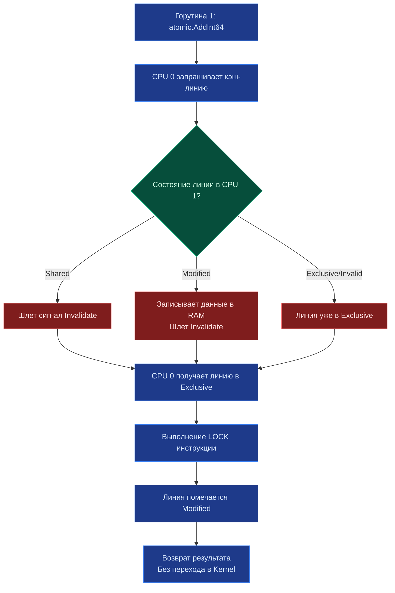

## Философия lock-free программирования и машинных инструкций

> *«Быстрее всего в компьютере работает та операция, которая выполняется целиком в кремнии регистров процессора и кэша L1, ни разу не постучавшись в дверь ядра операционной системы. Пакет `sync/atomic` открывает прямой доступ к этим аппаратным примитивам».*    
> — Брайан Керниган

Пакет `sync/atomic` предоставляет разработчику прямой доступ к аппаратным атомарным инструкциям центрального процессора. В отличие от `sync.Mutex`, который управляет очередями горутин, задействует системные семафоры и при высокой конкуренции паркует потоки в ядре ОС через системный вызов `futex`, атомарные инструкции выполняются полностью в пространстве пользователя (User Space) всего за несколько машинных тактов CPU.

Это кремниевый фундамент для построения сверхбыстрых высоконагруженных счетчиков, атомарных флагов состояния, безопасной смены указателей конфигураций и неблокирующих (lock-free) структур данных.

> [!info] Под капотом
> Атомарность в Go гарантируется не программным рантаймом, а физическим аппаратным обеспечением процессора. Компилятор Go транслирует вызовы `atomic.AddInt64` или `atomic.CompareAndSwapUint32` в специализированные машинные инструкции целевой архитектуры:
> * **x86_64**: `LOCK CMPXCHG`, `LOCK XADD` (с префиксом `LOCK`, заставляющим процессор монопольно захватить кэш-линию).
> * **ARM64**: пара инструкций `LDREX` / `STREX` (Load-Exclusive / Store-Exclusive) или инструкции LSE (`LDADD`, `CAS`).
> * **RISC-V**: связка `LR.W` / `SC.W` (Load-Reserved / Store-Conditional).
> 
> Эти инструкции используют аппаратный протокол когерентности кэшей процессора, гарантируя, что операция модификации 64-битного слова завершится целиком до того, как любое другое ядро CPU сможет прочитать или перезаписать эту ячейку.

---

## Under the hood: Протокол MESI и когерентность кэшей

Когда горутина выполняет атомарную операцию, процессор не «замораживает» всю оперативную память. Он взаимодействует с локальными кэшами соседних процессорных ядер через аппаратный протокол когерентности **MESI** (Modified, Exclusive, Shared, Invalid).



Понимание этой механики критически важно для соблюдения принципа Mechanical Sympathy. Атомарные операции **экстремально дешевы при низкой конкуренции** (буквально 10–15 тактов CPU), но при одновременной попытке десятков ядер обновить одну и ту же ячейку памяти возникает катастрофический шторм на шине процессора — `cache coherence traffic`. Каждое ядро вынуждено непрерывно рассылать широковещательные сигналы инвалидации (Invalidate Messages) другим ядрам, сбрасывая их кэши L1/L2 и сжигая полосу пропускания шины памяти.

---

## 1. Типизированные атомики и паттерн CAS (Go 1.19+)

Исторически в Go атомики работали через небезопасные указатели `atomic.AddInt64(&val, 1)`. Начиная с версии Go 1.19, стандартная библиотека получила типобезопасные структуры-обертки: `atomic.Int32`, `atomic.Int64`, `atomic.Bool`, `atomic.Pointer[T]`. Они исключают ошибки разыменования, защищают от случайных прямых присваиваний и автоматически выравнивают память.

### Основные методы
* `Load()` / `Store()`: Атомарное чтение и запись с полным барьером памяти.
* `Add(delta)`: Атомарное сложение/вычитание (идеально для метрик и счетчиков RPS).
* `Swap(new)`: Безусловная атомарная замена с возвратом старого значения.
* `CompareAndSwap(old, new)`: Фундаментальная операция CAS (Compare-And-Swap). Основа большинства lock-free алгоритмов. Заменяет значение на `new` **только если** текущее значение в памяти в этот микросекундный момент в точности равно `old`.

### Классический CAS-цикл
Когда простой инструкции `Add` недостаточно (например, при вычислении сложного математического выражения или обновлении нескольких полей), применяется идиома CAS-цикла (CAS loop / Optimistic Concurrency Control):

```go
type LockFreeCounter struct {
    val atomic.Int64
}

func (c *LockFreeCounter) Increment() {
    for {
        old := c.val.Load()
        new := old + 1
        
        // Пытаемся атомарно заменить old на new
        if c.val.CompareAndSwap(old, new) {
            return // Успех: никто не успел вклиниться между Load и CAS
        }
        // Если CAS провалился, значит другая горутина изменила значение.
        // Повторяем цикл с новым стартовым значением.
    }
}
```

> [!warning] Ловушка / Gotcha
> **Смешивание атомарного и обычного доступа**.
> Если вы читаете переменную через `atomic.Load()`, но пишете в неё через обычное синтаксическое присваивание `x = 5`, компилятор не выдаст ошибку, но это приведет к тяжелому состоянию гонки данных (data race) и чтению разорванных слов (torn reads) на уровне регистров CPU.  
> **Правило:** Если к переменной применен хотя бы один атомарный метод, **абсолютно все** обращения к ней должны быть строго атомарными!

---

## Mechanical Sympathy: False Sharing и выравнивание

Поскольку процессор обменивается данными между ядрами не отдельными байтами, а целыми 64-байтовыми кэш-линиями (Cache Lines), размещение двух независимых счетчиков рядом в одной структуре порождает эффект **False Sharing** (ложное разделение).

```go
// ❌ ПЛОХО: a и b могут попасть в одну 64-байтовую кэш-линию
type BadMetrics struct {
    a atomic.Int64
    b atomic.Int64
}

// ✅ ХОРОШО: Паддинг гарантирует разделение кэш-линий между ядрами
type GoodMetrics struct {
    a atomic.Int64
    _ [56]byte // 8 + 56 = 64 байта. b начнется со следующей кэш-линии
    b atomic.Int64
}
```

При использовании структуры `GoodMetrics` обновление счетчика `a` ядром CPU 0 никогда не инвалидирует кэш-линию счетчика `b` на ядре CPU 1. В высоконагруженных метрических системах с миллионами инкрементов в секунду это устраняет паразитный трафик шины и ускоряет исполнение в 5–10 раз.

---

## 2. atomic.Pointer[T] и обновление конфигураций без блокировок

Тип `atomic.Pointer[T]` позволяет безопасно и атомарно заменять указатели на сложные иммутабельные структуры данных без использования блокировок `sync.RWMutex`. Это канонический паттерн для горячего обновления конфигураций, списков маршрутизации и справочников в памяти (Zero-Downtime Reload).

```go
var config atomic.Pointer[AppConfig]

// Инициализация при старте
config.Store(&AppConfig{Timeout: time.Second})

// Горутина-обработчик читает конфиг без единой блокировки
func handleRequest() {
    // Load атомарно читает указатель за 1 такт CPU.
    // Даже если другой поток обновит конфиг прямо сейчас,
    // эта горутина получит консистентную версию структуры.
    cfg := config.Load()
    process(cfg.Timeout)
}

// Горутина-релоадер обновляет конфиг
func reloadConfig(newCfg *AppConfig) {
    config.Store(newCfg)
}
```

Сборщик мусора Garbage Collector в Go отслеживает достижимость объектов через граф ссылок. Старый экземпляр `AppConfig` не будет собран до тех пор, пока все горутины, прочитавшие его через `config.Load()`, не завершат свою работу. Это делает паттерн на 100% безопасным и не требующим ручного подсчета ссылок.

---

## Ловушки и хардкорные вопросы с собеседований

| Ловушка | Описание | Решение |
|---------|----------|---------|
| Выравнивание на 32-битных архитектурах | `atomic.Int64` требует строгого 8-байтового выравнивания адреса. На 32-бит ARM/x86 обращение по невыровненному адресу вызовет аппаратную панику. | В Go 1.19+ типизированные атомики встроены, и компилятор автоматически гарантирует 8-байтовое выравнивание. Если вы используете устаревший синтаксис `atomic.AddInt64(&x, n)`, выносите `x` первым полем в структуру или используйте `atomic.Value`. |
| ABA-проблема | Горутина читает значение `A`, засыпает. Другой поток меняет `A` -> `B` -> `A`. Первая горутина просыпается, видит `A` и CAS успешно срабатывает, хотя окружение изменилось. | В Go с автоматическим GC и `atomic.Pointer` проблема ABA практически сведена на нет, так как адреса памяти освобожденных структур не переиспользуются мгновенно. Для примитивных типов используйте версионирование (счетчик эпох) или метод `atomic.Swap`. |
| Блокировка в CAS-цикле | Если конкуренция экстремально высока, цикл `for { if CAS break }` может крутиться миллионы раз, сжигая 100% CPU одного ядра. | Добавляйте вызов `runtime.Gosched()` после N неудачных попыток, чтобы уступить квант времени другим горутинам, либо переходите на классический `sync.Mutex`. Атомики не предназначены для сценариев с запредельной contention. |
| `atomic.Value` для любых типов | Структура `atomic.Value` требует, чтобы все последующие вызовы `Store()` передавали значение ровно того же конкретного типа, что и при первом вызове. Нарушение вызывает фатальную панику. | Используйте современный дженерик `atomic.Pointer[T]`. Он типобезопасен на уровне компилятора и защищен от случайного изменения типа в runtime. |

> [!tip] Собеседование
> **Вопрос:** Почему `sync/atomic` не предоставляет метода `Wait()` или уведомлений об изменении значения?  
> **Ответ:** Атомарные операции спроектированы исключительно для манипуляций с регистрами CPU и кэш-линиями. Ожидание изменения значения требует парковки горутины, занесения её в очередь ожидания и системного вызова ядра — а это уже ответственность планировщика рантайма или примитива `sync.Cond` / каналов. Атомики предназначены для сверхбыстрого опроса (`Load`) и записи, но не для ожидания событий.
>
> **Вопрос:** Когда `atomic` быстрее `sync.Mutex`, а когда медленнее?  
> **Ответ:** При низкой и средней конкуренции `atomic` быстрее в 10–50 раз, так как исполняется за пару инструкций процессора без переключения контекста. При запредельной конкуренции (сотни ядер одновременно бьют в одну переменную) `atomic` начинает проигрывать из-за бесконечных неудач CAS и шторма `cache coherence traffic`. В этих условиях `sync.Mutex` эффективнее: он паркует горутины в сон, освобождая ядра для полезной работы.

---

## Сравнение с экосистемами других языков

| Язык | Механизм | Особенности в сравнении с Go |
|------|----------|------------------------------|
| **C++** | `std::atomic<T>`, `<atomic>` | Дает тонкий контроль над `memory_order` (relaxed, acquire, release, seq_cst). Go использует только `seq_cst` для простоты и безопасности, жертвуя микроскопической оптимизацией. |
| **Java** | `AtomicInteger`, `VarHandle` | Использует `Unsafe` под капотом. `VarHandle` (Java 9+) дает контроль над барьерами памяти, аналогично C++. Go абстрагирует это полностью. |
| **C#** | `Interlocked` класс | Статические методы `Interlocked.Increment`, `CompareExchange`. Аналогично Go, но без типизированных структур. Работает поверх CPU инструкций. |
| **PHP** | Отсутствует | PHP не разделяет память между процессами. Атомарность достигается только через внешние системы (Redis `INCR`, атомарные скрипты Lua). |

---

## Итог

1. `sync/atomic` транслируется напрямую в машинные инструкции процессора (`LOCK CMPXCHG`, `LOCK XADD`).
2. Всегда предпочитайте современные типизированные атомики (`atomic.Int64`, `atomic.Pointer[T]`) устаревшим функциям из Go 1.0.
3. Паттерн CAS-цикла — надежная основа lock-free алгоритмов при умеренной конкуренции.
4. Избегайте `False Sharing` через паддинг критических счетчиков до размера строки кэша CPU (64 байта).
5. Атомики не заменяют мьютексы при высокой конкуренции. Используйте их для счетчиков, флагов и атомарного переключения иммутабельных конфигураций.
6. Никогда не смешивайте атомарный и неатомарный доступ к одной и той же переменной.

Понимание атомарных операций ведет нас к следующей важнейшей задаче оптимизации бэкенда: эффективному управлению оперативной памятью. Создание миллионов короткоживущих буферов нагружает сборщик мусора паузами GC. Как переиспользовать однажды выделенную память без блокировок? В следующей статье мы разберем: [[21. sync_pool. Переиспользование объектов]].