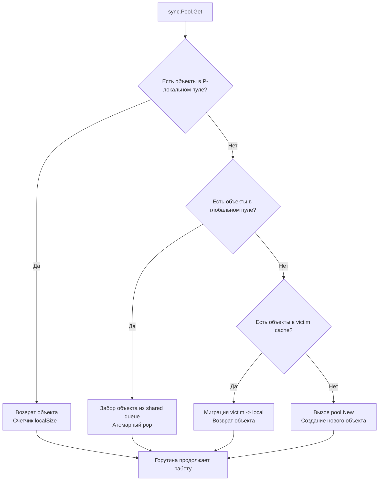

## Философия временных буферов и давления на GC

В высоконагруженных сетевых службах на Go узким местом производительности поразительно редко становятся математические вычисления на CPU. Почти всегда корень задержек — в динамической памяти. Каждый легкомысленный вызов `make([]byte, N)`, создание `bytes.NewBuffer()` или конструирование временной структуры на каждый входящий HTTP-запрос порождает аллокацию в куче (heap).

Когда сервер обрабатывает десятки и сотни тысяч запросов в секунду, сборщик мусора (Garbage Collector) оказывается под колоссальным давлением. Ему приходится непрерывно сканировать гигабайты памяти, помечать живые объекты и устраивать фазы разметки. Если горутины выделяют память быстрее, чем фоновый GC успевает ее очищать, рантайм активирует защитный механизм **GC Assist Time**: горутины принудительно отвлекаются от бизнес-логики и начинают тратить кванты времени CPU на помощь сборщику мусора, а задержки (latency) запросов резко взлетают. Хотя эпоха длинных Stop-The-World пауз ушла в прошлое, регулярные микропаузы STW и воровство процессорного времени на разметку памяти способны парализовать систему.

Здесь на сцену выходит `sync.Pool`. Его назначение элегантно и узкоспециализировано: это механизм повторного использования временных объектов. Представьте себе не склад долгосрочного хранения, а тележку с возвращенными книгами у входа в библиотеку или поднос с чистыми стаканами у кулера. Вы берете стакан, делаете глоток и возвращаете его обратно. `sync.Pool` — это не кэш с гарантированным временем жизни и не хранилище постоянного состояния. Это «корзина возврата» для короткоживущих буферов, которые нужны горутине на доли миллисекунды для обработки запроса и тут же могут послужить следующей задаче.

> [!info] Под капотом
> `sync.Pool` глубоко интегрирован в цикл сборки мусора рантайма Go. Между циклами GC пул удерживает объекты в оперативной памяти без накладных расходов. Во время фазы очистки кучи (`STW`) локальные пулы не уничтожаются мгновенно: их содержимое перемещается в **Victim Cache** (кэш жертв), получая шанс пережить еще один цикл GC. Это сглаживает резкие всплески аллокаций при пиковых нагрузках и предотвращает полное опустошение пула при каждом проходе сборщика.

## Under the hood: Per-P архитектура и Victim Cache

Если бы `sync.Pool` защищался единственным глобальным мьютексом, он мгновенно стал бы бутылочным горлышком для многоядерных систем. Поэтому инженеры рантайма Go спроектировали пул в полном согласии с планировщиком G-M-P, распределив хранилища по логическим процессорам (`P`).



Внутреннее устройство пула базируется на трех эшелонах доступа:

1. **Local Pools (массив `poolLocal`)**: Каждый логический процессор `P` имеет собственную структуру `poolLocal`. Внутри нее выделено приватное поле `private` (для одного объекта) и двусторонняя очередь `shared` (`poolChain`). Текущая горутина, исполняемая на данном `P`, обращается к `private` без каких-либо атомарных инструкций и мьютексов. Доступ не требует блокировок, так как только горутины на этом P могут его читать и модифицировать.
2. **Shared Pool (очередь воровства задач / Work-Stealing)**: Если локальный `private` слот пуст, горутина забирает элемент из головы своей очереди `shared`. Если же и локальная очередь пуста, запускается алгоритм work-stealing: горутина пытается украсть объект из хвоста очереди другого процессора `P`. Это глобальная очередь для случаев, когда локальный пул P пуст, а объекты есть в других пулах. Доступ защищен атомарными операциями и lock-free алгоритмами (структура `poolDequeue`), что сводит межъядерную конкуренцию к минимуму.
3. **Victim Cache**: Начиная с Go 1.13, рантайм избавился от детской болезни `sync.Pool`, когда каждый GC выбрасывал все буферы на помойку. Теперь перед очисткой основного пула во время GC старый кэш жертв очищается, а текущие пулы переводятся в статус victim cache. Дублирующий пул, который заполняется перед очисткой основного во время GC. При следующем вызове `Get` объекты сначала мигрируют из victim в local. Это позволяет объектам жить до 2 циклов GC вместо 1, сглаживая колебания нагрузки.

> [!warning] Ловушка / Gotcha
> **Никаких гарантий сохранности.**
> `sync.Pool` может удалить объект в любой момент после запуска GC. Вы **не можете** использовать его для кэширования подключений к БД, сессий пользователей или данных, которые нужны дольше одного запроса. Для долгосрочного хранения используйте `map` с `sync.RWMutex` или внешнее хранилище (Redis). Попытка хранить в пуле сетевые соединения приведет к утечкам дескрипторов и непредсказуемым паникам при закрытии.

## Mechanical Sympathy: Аллокации, Cache Locality и влияние на STW

Почему грамотное применение `sync.Pool` драматически снижает нагрузку на центральный процессор и сеть?

1. **Устранение накладных расходов `malloc`**: Выделение памяти в куче — это не простая арифметическая операция сдвига указателя. Оно требует обращения к кэшу блоков `mcache`, поиска свободного блока в heap bitmap, обновления `mspan` структур и, при исчерпании страниц, системных вызовов `mmap`. Вызов `pool.Get()` возвращает готовый указатель из массива или структуры. Это молниеносная O(1) операция без поиска свободных блоков в виртуальной памяти.
2. **Cache Locality (Локальность кэшей L1/L2)**: Непрерывное переиспользование компактного набора буферов удерживает их страницы в кэш-линиях процессора. Объекты в `sync.Pool` часто находятся в горячей области памяти. Переиспользование одного и того же буфера улучшает предсказуемость загрузки данных в L1/L2 кэш CPU, так как память не фрагментируется хаотичными аллокациями, а аппаратный предвыборщик (hardware prefetcher) работает с максимальной эффективностью.
3. **Снижение частоты GC и устранение пауз**: Каждая аллокация в куче приближает триггер следующего цикла сборщика, задаваемый коэффициентом `GOGC` и целевым лимитом памяти `GOMEMLIMIT`. Уменьшение количества аллокаций напрямую сдвигает порог запуска сборщика (`GOGC`). Рантайм реже инициирует STW, что снижает задержки (latency) HTTP-запросов и сетевых вызовов, гарантируя стабильные SLA без деградации tail latency (p99/p99.9).

## Идиоматичное использование в production

### Паттерн для bytes.Buffer

Классический сценарий — сборка ответа или сериализация полезной нагрузки в памяти:

```go
var bufPool = sync.Pool{
    New: func() interface{} {
        // Выделяем буфер с достаточной емкостью для типичного запроса
        return bytes.NewBuffer(make([]byte, 0, 1024))
    },
}

func handleRequest(w http.ResponseWriter, r *http.Request) {
    // 1. Получаем буфер из пула
    buf := bufPool.Get().(*bytes.Buffer)
    
    // 2. Обязательно сбрасываем состояние перед использованием
    buf.Reset() 
    
    // ВАЖНО: defer pool.Put(buf) в горячих циклах создает оверхед.
    // Лучше использовать явный Put или defer вне цикла.
    defer bufPool.Put(buf) 
    
    // 3. Работаем с буфером
    buf.WriteString("Hello ")
    buf.WriteString(r.URL.Path)
    w.Write(buf.Bytes())
}
```

> [!info] Под капотом
> Метод `buf.Reset()` не освобождает память и не возвращает ее операционной системе. Он просто сбрасывает внутренний счетчик `off` и `len` в 0. Емкость (`cap`) остается прежней. Это гарантирует, что при следующем `Get` буфер не потребует реаллокаций через `append` при стандартном объеме данных.

### Оптимизация для []byte

Обратите внимание на тонкую деталь: в пул кладется указатель на слайс `*[]byte`, а не сам срез `[]byte`. Если положить в пул структуру слайса напрямую (`pool.Put(b)`), вызов неявно выделит память в куче для упаковки трех машинных слов (указатель, длина, емкость) в интерфейсный бокс `any` (`interface{}`), сведя на нет выигрыш от пулинга!

```go
var bytesPool = sync.Pool{
    New: func() interface{} {
        b := make([]byte, 4096)
        return &b // Возвращаем указатель на слайс, чтобы избежать копирования указателя
    },
}

func readData(r io.Reader) error {
    bufPtr := bytesPool.Get().(*[]byte)
    buf := (*bufPtr)[:0] // Сохраняем емкость, сбрасываем длину
    
    defer bytesPool.Put(bufPtr)
    
    n, err := r.Read(buf[:cap(buf)])
    if err != nil && err != io.EOF {
        return err
    }
    process(buf[:n])
    return nil
}
```

## Ловушки и вопросы с собеседований

При работе с `sync.Pool` разработчики регулярно наступают на четыре классические грабли:

| Ловушка | Описание | Решение |
|---------|----------|---------|
| Забытый `Reset()` | Объект возвращается с мусором от предыдущего запроса | Всегда вызывайте `Reset()` или перезаписывайте данные сразу после `Get()`. |
| `defer pool.Put()` в tight-loop | Overhead `defer` на 10-20% снижает производительность в циклах | Выносите `Put` за цикл или используйте явный вызов в конце итерации. |
| Сохранение состояния в пуле | Горутина сохраняет указатель на объект и кладет его в пул с данными | `sync.Pool` предназначен для безсостоятельных буферов. Любое состояние должно быть явно очищено. |
| Паника в `pool.New` | Если `New` паникует, пул не восстанавливается, последующие `Get` падают | Пишите надежный `New`. Обрабатывайте ошибки внутри, используйте `recover` только если это критично. |

Еще одна коварная производственная ловушка — **раздувание пула аномальными запросами**. Если один запрос из миллиона обработал файл размером 100 МБ, буфер растянулся до 100 МБ. Если бездумно вернуть его в пул, этот гигантский массив останется в памяти, пока GC не очистит Victim Cache. Золотое правило: проверяйте емкость перед возвратом. Если `buf.Cap() > MaxReasonableSize`, просто отпустите объект на волю GC.

> [!tip] Собеседование
> **Вопрос:** Почему `sync.Pool` возвращает `interface{}`, а не дженерик `T`?
> **Ответ:** Исторически пул появился задолго до внедрения дженериков в Go 1.18. Изменение сигнатуры существующих методов нарушило бы строгую гарантию обратной совместимости Go 1. В Go 1.18+ появилась обертка `pool.New()` с типизацией, но базовый `sync.Pool` остался `interface{}`. На практике создают тонкую типобезопасную обертку вокруг пула либо приводят типы явно через type assertion. Дженерики в самом `sync` пакете не планируются к внедрению ради сохранения ABI стабильности рантайма.
>
> **Вопрос:** Когда `sync.Pool` НЕ стоит использовать?
> **Ответ:** 
> 1. Объекты живут дольше одного запроса (кэши, соединения).
> 2. Создание объекта дешевле, чем `Get/Put` (например, маленькие `int`, `struct{}`).
> 3. Объекты содержат указатели на внешние ресурсы (файлы, сокеты), которые нельзя безопасно переиспользовать без закрытия.
> 4. Приложение работает под низкой нагрузкой, где аллокации редки, а overhead пула заметен.

## Сравнение с экосистемами других языков

| Язык | Механизм | Особенности в сравнении с Go |
|------|----------|------------------------------|
| **Java** | `Apache Commons Pool`, `ThreadLocal` | Требует явной настройки `maxSize`, `eviction policy`. Часто использует глобальные локи. В Go пул интегрирован с GC и планировщиком P. |
| **C++** | `Object Pool`, `tcmalloc`/`jemalloc` | Ручное управление памятью. Разработчик сам пишет пулы. Go предлагает встроенное, GC-aware решение с автоматической очисткой. |
| **Python** | `queue.Queue`, `collections.deque` | Нет встроенного пула объектов. GC ссылочного типа + generational collector. Пулинг реализуется вручную, но не дает такого выигрыша, так как аллокация маленьких объектов в Python дешевая. |
| **Go** | `sync.Pool` | Lock-free на уровне P, автоматическая очистка GC, Victim Cache для сглаживания нагрузок. Минимальный boilerplate. |

## Итог

1. `sync.Pool` предназначен **строго для временных, короткоживущих объектов**. Не используйте его как кэш.
2. Архитектура Per-P + Victim Cache минимизирует блокировки и сглаживает влияние сборщика мусора.
3. Всегда вызывайте `Reset()` или очищайте состояние объекта перед возвратом в пул.
4. Избегайте `defer pool.Put()` в горячих циклах. Явный `Put` или вынос за цикл дает прирост производительности.
5. Пул не гарантирует сохранность данных. Объекты могут быть удалены GC в любой момент.
6. Используйте пул для `[]byte`, `bytes.Buffer`, парсинг-буферов и временных структур, создаваемых на каждый запрос.

Разобрав управление памятью на уровне пулов, мы переходим к сердцу языка. Как рантайм отслеживает горутины, управляет памятью и предоставляет отладочную информацию? В следующей статье мы изучим пакет, который дает доступ к внутренностям Go: [[22. runtime. Получение информации о рантайме]].